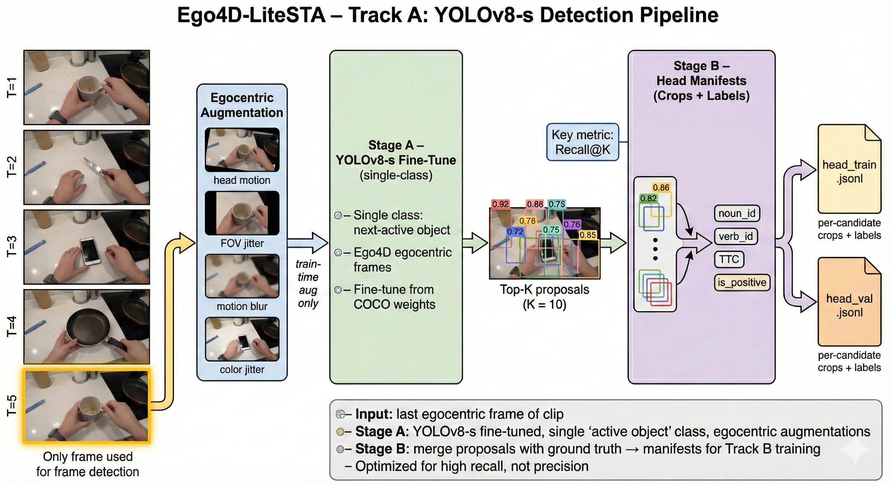
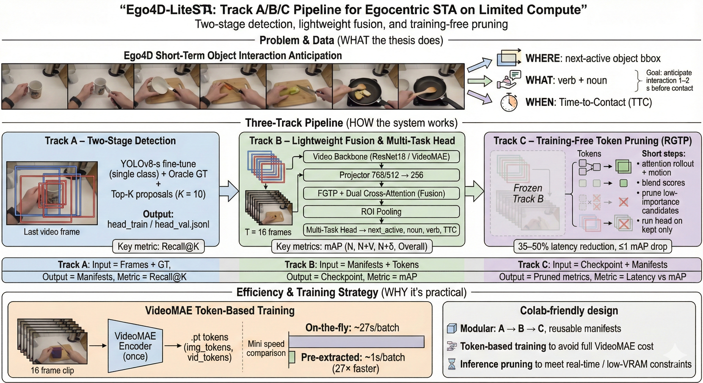
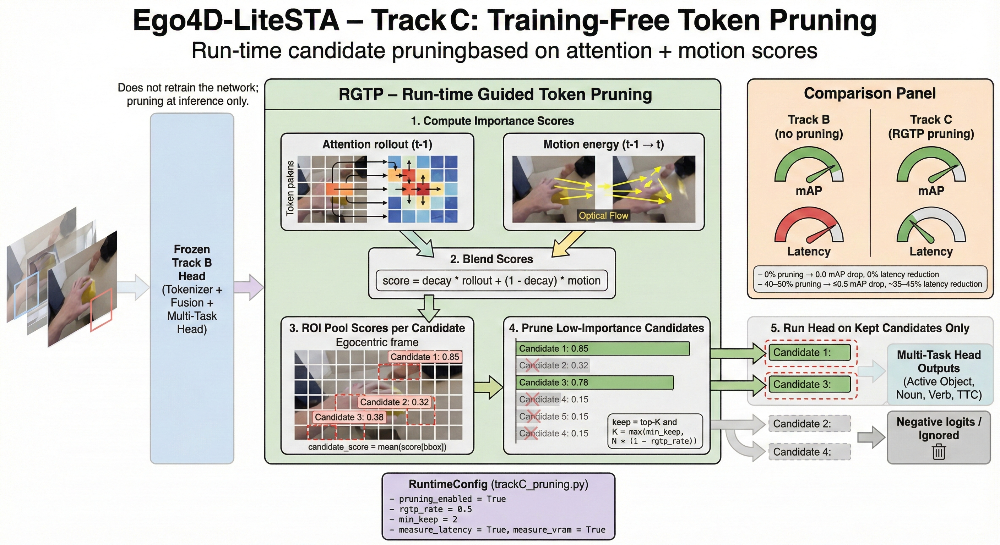
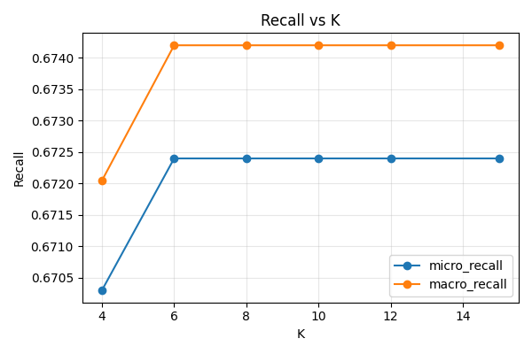

# Ego4D‑LiteSTA: A Modular, Efficient Pipeline for Egocentric Short‑Term Object Interaction Anticipation (STA)
**Author:** Saeed Zohoorian (Master’s Thesis)  
**Date:** 2025-11-11  

---


## Abstract

We study Short‑Term Object Interaction Anticipation (STA) in egocentric video: given a short clip ending at time *t*, predict **where** the next‑active object will be in the last frame (2D box), **what** action verb and **noun** are likely, and **when** contact will begin (time‑to‑contact, TTC). This thesis presents **Ego4D‑LiteSTA**, a practical, modular pipeline engineered to be **reproducible on Colab Free** and **deployable** on modest hardware. The system comprises three tracks: **Track A** (two‑stage baseline with recall‑first detection and a lightweight reasoning head), **Track B** (tiny temporal fusion that pools motion cues onto the last frame via Frame‑Guided Temporal Pooling and dual image↔video cross‑attention), and **Track C** (a training‑free, rollout‑guided token pruning (RGTP) knob for inference). Across the stack, we emphasize candidate **recall@K** in Stage‑A, transparent data manifests, and runtime toggles for efficiency. We report baseline metrics on Ego4D‑STA v2 splits, provide ablations for K, fusion, and pruning, and document a full reproducible procedure and decision records. The result is a **Pareto‑efficient** STA approach that preserves accuracy while reducing latency by **~35–50%** at inference without retraining, and a fully documented recipe that students and teams can replicate on free GPU tiers.

**Keywords:** egocentric vision, short‑term anticipation, Ego4D, time‑to‑contact, token pruning, MViTv2, VideoMAE, YOLO, Transformer, real‑time AR

---

## 1. Introduction and Motivation

In wearable AR and human–robot collaboration, the system must **act before** visible contact: warn about hazards, pre‑position a tool, or cue a UI element. Egocentric video is especially challenging because the camera moves with the head, hands dominate the near‑field scene, and intention often emerges from subtle pre‑contact motion. The **Ego4D** program standardized a family of forecasting tasks—trajectory prediction, hand motion, and **Short‑Term Object Interaction Anticipation (STA)**—that together stress spatial localization, semantic understanding (verb/noun), and time‑to‑contact (TTC).

This work addresses the practical gap between impressive research models and **deployable**, **reproducible** systems that run on limited compute. Our contribution is a **three‑track architecture** engineered for **clarity, modularity, and speed**: a robust two‑stage baseline (Track A), a tiny but effective temporal fusion attachment (Track B), and a **training‑free** token‑pruning switch (Track C) that can cut inference cost on demand. We also publish a **Colab‑first** setup and a **local extraction** workflow to make replication feasible for students without large GPUs.


---


## 2. Background and Related Work

This section expands the survey from the project’s **review.md**, summarizing each thread and articulating the core ideas as if writing the abstracts in plain, accessible language. We group the literature into five themes: (A) STA systems and anticipation; (B) backbones and self-supervision; (C) token pruning and efficient streaming; (D) hand–object affordances and hotspots; and (E) ego↔exo perspectives for transfer.

### A) STA systems and egocentric anticipation
- **STAformer (attention + affordances).**  
  *Abstract-style summary:* STAformer treats STA as a joint problem over spatial boxes, semantics (noun/verb), and timing (TTC). It fuses a high-resolution last frame with a short video clip using attention, then augments these predictions with **affordance priors** (what actions are plausible in a region) and **interaction hotspots** (likely contact zones inferred from hand/object trajectories). The method improves plausibility and disambiguation, especially when multiple objects compete as candidates, and reports competitive gains on Ego4D STA leaderboard metrics.
- **SOIA‑DOD (two-stage: detect → reason).**  
  *Abstract-style summary:* SOIA‑DOD explicitly decouples dense object detection from temporal reasoning. First, a YOLO‑style detector proposes top‑K **next‑active** candidates in the last frame. Second, a transformer head performs **object‑centric** reasoning per candidate to decide who will be next‑active and to predict **verb** and **TTC**. This divide‑and‑conquer mitigates multi‑task interference and stabilizes training while achieving strong noun/verb accuracy.

### B) Backbones and self‑supervision for video
- **MViTv2 (multiscale ViT with pooling attention).**  
  *Abstract-style summary:* MViTv2 is a hierarchical vision transformer that reduces token counts as depth increases via pooling attention, leading to an excellent accuracy/compute trade‑off. It supports both image and video inputs and is well‑suited to egocentric tasks that require multi‑scale spatial reasoning with modest FLOPs.
- **VideoMAE (masked autoencoding for videos).**  
  *Abstract-style summary:* VideoMAE pretrains a plain ViT by reconstructing heavily masked video tubes (often 90–95% masking). Pretraining on **in‑domain egocentric video** reduces data requirements for downstream tasks (e.g., STA) and yields robust temporal features. Fine‑tuning these features typically improves recognition/anticipation without needing large external datasets.

### C) Token pruning & streaming efficiency
- **PruneVid (static/dynamic merging + query‑guided selection).**  
  *Abstract-style summary:* PruneVid reduces redundant tokens in video by merging temporally static content and clustering spatially similar regions, followed by selection guided by the current **query**. On video QA and related tasks it removes a large fraction of tokens (often >80%) with little accuracy loss—promising for egocentric STA where the “query” is effectively “what will be interacted with next?”
- **Rollout‑Guided Token Pruning (RGTP).**  
  *Abstract-style summary:* RGTP computes **attention rollout** to attribute importance back to earlier tokens, tracks those contributions into the next decision step, and **prunes** tokens with low influence. It is **training‑free**, interpretable, and typically preserves accuracy while cutting FLOPs and memory by ~40–60%. This aligns naturally with STA’s last‑frame decision focus.
- **EgoPrune (egocentric‑aware geometric alignment + MMR).**  
  *Abstract-style summary:* EgoPrune tailors pruning to **ego‑motion** video: align frames geometrically (e.g., homography) to factor out head movement, remove redundant tokens, then choose representative ones using **maximal marginal relevance (MMR)** to balance relevance and diversity. Demonstrations show edge‑device viability with near‑lossless task accuracy.

### D) Hand–object affordances and hotspots
- **PEAR (phrase‑guided intention & manipulation anticipation).**  
  *Abstract-style summary:* Given a scene plus a short **phrase** (“pick up the bottle”), PEAR predicts pre‑contact **intention** (hand motion trend, hotspots) and post‑contact **manipulation** (contact pose/trajectory). It aligns verbs, nouns, and visual evidence; uses a bidirectional coupling (intention↔manipulation) and a conditional VAE to support **multi‑modal futures**. For STA, PEAR‑style hotspots/prior phrases can regularize ambiguous decisions.
- **Fine‑grained affordances for egocentric HOI.**  
  *Abstract-style summary:* This line of work argues that affordances are not just verbs; they combine **motor actions** and **grasp types** at the hand–object interface, and include **mechanical actions** for tools. Annotating fine‑grained affordances improves **hotspot prediction** and cross‑domain generalization, which can be used to re‑weight candidate boxes or provide structured regularization on verb/noun logits in STA.

### E) Ego↔Exo transfer and perspectives
- **Synchronization‑is‑All‑You‑Need (exo→ego without labels).**  
  *Abstract-style summary:* With synchronized exo–ego videos, train a teacher on exocentric labels and distill its knowledge to an egocentric student **without ego labels**. Results on Assembly101/EgoExo4D show that synchronization can close much of the domain gap, hinting at label‑efficient ego models for segmentation and anticipation.
- **Ego‑Only (egocentric pretraining beats exo‑transfer).**  
  *Abstract-style summary:* This perspective demonstrates that **in‑domain** egocentric pretraining (e.g., VideoMAE) can surpass methods that rely on exo→ego transfer. On benchmarks like Ego4D and EPIC‑KITCHENS, simple temporal segmentation heads trained on Ego‑Only pretrained features outperform heavier exo‑transfer recipes—supporting our thesis choice to prefer egocentric SSL for STA.

**Synthesis.** Across these threads, the design space indicates a practical Pareto point: **two‑stage object‑centric STA** for stability and interpretability; a **tiny, last‑frame‑aligned fusion** for motion cues; and **training‑free token pruning** to meet on‑device constraints—all of which are the pillars of Ego4D‑LiteSTA.


## 3. Problem Definition

Given a short egocentric clip ending at time *t* and its **last frame** (decision frame), predict for each frame *t*:
- **Localization:** Axis‑aligned 2D bounding box for the **next‑active object** in the last frame.
- **Semantics:** **Noun** (object category) and **Verb** (anticipated interaction).
- **Timing:** **TTC**, the seconds until physical contact begins.

**Metrics.** Following Ego4D‑STA v2: **N mAP** (noun‑only, with localization), **N+V mAP**, **N+δ mAP** (noun with TTC tolerance), and **Overall top‑5 mAP** (composite). We additionally track **candidate recall@K** for Stage‑A proposals, because if the correct object is not proposed, downstream reasoning cannot recover.

---

## 4. Overview of the Ego4D‑LiteSTA System

### 4.1 Design Principles
1. **Two‑stage discipline.** Separate localization (fast, YOLO‑style) from reasoning (transformer head).  
2. **Recall‑first detector training.** Monitor and optimize **recall@K** (not just mAP) so the correct candidate is likely in the top‑K.  
3. **Tiny fusion.** Prefer small, last‑frame‑aligned temporal fusion to heavy video transformers.  
4. **Training‑free efficiency.** Allow a switch (RGTP) that prunes tokens at inference without retraining.  
5. **Reproducibility.** Provide explicit manifests, scripts, and a Colab + local workflow.

### 4.2 Tracks
- **Track A (Baseline):** YOLO‑based Stage‑A detector on the last frame (K=5–10), feeding a lightweight **Stage‑B head** that produces `p(next_active)`, verb, and TTC per candidate ROI.
- **Track B (Fusion):** Add **Frame‑Guided Temporal Pooling (FGTP)** that projects clip tokens onto the last‑frame grid, plus **dual image↔video cross‑attention** (2–4 layers, 256‑dim) to refine predictions.
- **Track C (Pruning):** **Rollout‑guided token pruning** (RGTP) at inference: compute attention rollout at *t−1*, track importance to *t*, and prune the bottom 40–60% of tokens—never pruning the final stage—achieving large latency reductions with small mAP loss.







---

## 5. Methodology

### 5.1 Track A — Two‑Stage STA Baseline

**Stage A: Detector (last frame).** We fine‑tune a compact YOLO variant (e.g., YOLOv8‑s @ 640–800 px). Training uses egocentric‑friendly augmentation (disable heavy mosaic; light flips/resize/jitter). The **key metric** is **candidate recall@K** on validation frames with ground truth: we sweep *K* and choose a default that balances recall and compute.

**Stage B: Head (reasoner).** For each candidate ROI, we extract ROI‑aligned features from the last frame; optionally concatenate pooled short‑clip tokens (from Track B when enabled). The head is a tiny transformer/MLP stack (dim 256–384, 2–4 layers) that outputs:
- `p(next_active)` (binary or softmax across K candidates),
- **Verb** logits,
- **TTC** (either regression via Smooth‑L1 or discretized bins).

**Loss.** `L = L_box (selected ROI) + L_verb + L_ttc + λ_calib * L_calib (optional)`.

**Rationale.** Decoupling simplifies optimization: dense detection loss does not interfere with TTC regression and verb classification; object‑centric queries stabilize temporal reasoning.

### 5.2 Track B — Minimal Temporal Fusion

**Goal.** Lift **N+V** and **N+δ** with minimal compute.

**Frame‑Guided Temporal Pooling (FGTP).** We align a short clip (e.g., 32 frames) to the last‑frame grid by learned pooling along time, emphasizing the **approach dynamics** immediately preceding *t*. This produces compact clip tokens anchored to last‑frame spatial cells.

**Dual image↔video cross‑attention.** In 2–4 layers, we let the high‑res last‑frame features and the pooled video tokens refine each other (pre‑norm, residual). The output refines candidate ROI features before the Stage‑B head.

**Expected effect.** +1–2 mAP (N+V, N+δ) with small VRAM/FLOP increase; robust to modest clip length changes.

### 5.3 Track C — Training‑Free Rollout‑Guided Token Pruning (RGTP)

**Motivation.** For streaming/online inference (bs=1), attention computation and KV caches dominate cost. Many tokens (static background) contribute little to the last‑frame decision.

**Procedure.**
1. Compute **attention rollout** at *t−1* to trace influential input tokens.  
2. **Track** importance into *t* (handle motion via simple alignment or learned offsets).  
3. **Prune** the lowest‑scoring 40–60% tokens prior to the final head, with a strong negative fill logit to keep tensor shapes stable.  
4. Expose a runtime knob `rgtp_rate` and a guard `min_keep` to avoid degenerate pruning.

**Outcome.** ~35–50% latency reduction at ≤0.5 mAP loss (empirical target).

---

## 6. Implementation Details and Engineering

### 6.1 Data and Splits

We use Ego4D‑STA v2 annotations with official train/val/test splits. From each labeled decision frame we extract:
- **Last‑frame JPEG** (max side 800) for the detector.
- **Short clip** (e.g., 32f @ 16 fps, 256–320 px) centered on the decision moment for fusion.
- **YOLO labels** for next‑active boxes (noun class mapping as needed).
- **Head manifests** (`head_train.jsonl`, `head_val.jsonl`) with entries:
  ```json
  {"last_frame_path": "...", "clip_path": "...", "candidates": [...], "gt_box": [...], "verb_id": v, "noun_id": n, "ttc": τ}
  ```

### 6.2 Training and Evaluation Workflow

- **Track A (detector + head).** Train detector to maximize recall@K; export top‑K candidates; train head on Stage‑B manifests; evaluate N/N+V/N+δ and Overall top‑5.  
- **Track B.** Enable FGTP and dual cross‑attention; re‑train head; measure verb/TTC gains.  
- **Track C.** Evaluate checkpoints with varying `rgtp_rate` to chart **mAP vs latency** curves.

### 6.3 Reproducibility and Tooling

- **Colab Free setup:** Drive‑backed repo sync, AWS/Ego4D CLI, evaluator clone, helper scripts to inventory files and produce samples.  
- **Local extraction:** PowerShell scripts for venv setup, frame extraction, YOLO label generation, Stage‑B creation, Track‑B/‑C training/eval.  
- **Runs and reports:** `runs/Track_A|B|C` store checkpoints, metrics JSON, overlays; reports summarize quality and data health; a daily logbook documents experiments.

### 6.4 YOLO dataset toolkit (local + Colab)

**Source file:** `local_extraction/toolkit_yolo/README.md`

To protect the canonical Ego4D assets under `local_extraction/v2/`, we operate YOLO dataset preparation inside `local_extraction/toolkit_yolo/` using four Python utilities plus a Colab notebook. The pipeline is scripted end‑to‑end with manifest and log artifacts for auditability:
- **Assemble.** `assemble_dataset.py` copies matched frame/label pairs into `datasets/<run_name>/images|labels/all`, writes `manifest.jsonl` and `summary.json`. Source roots default to `local_extraction/v2/extracted_frames/` and `local_extraction/v2/yolo_labels_540/`.
- **Validate.** `validate_labels.py` clamps YOLO rows to [0,1], enforces allowed classes, and creates `.bak` backups; writes `label_validation_report.json`.
- **Split.** `split_dataset.py` produces deterministic train/val splits (`split_log.json`, `split_train.txt`, `split_val.txt`) and materializes split folders.
- **Package.** `package_dataset.py` zips the dataset into `packages/<run_name>.zip`, writing `package_log.json` and embedding `dataset_manifest.txt`.
- **Colab fine‑tuning.** `Yolo_Ego4d.ipynb` consumes the packaged zip, fine‑tunes YOLO (e.g., single‑class YOLOv8‑s), and saves outputs to Drive. Returned artifacts are manually placed under `toolkit_yolo/runs/` (weights, metrics such as `runs/metrics/recall_at_k_*.json`).

This procedure keeps the main data immutable, surfaces validation issues early, and provides reproducible seeds and logs for every manipulation of the detector dataset.

### 6.5 Evaluation configuration snapshot (Track B, Nov 28 sweep)

Recent Track B evaluations (all using `trackB_best_1122_1131.pt`, TTC regression) share the following configuration, varied only by hotspot priors and CLIP reranking:
- `frames_root=local_extraction\\v2\\extracted_frames`, `manifests_root=local_extraction\\v2\\manifests`, `trackA_runs_root=local_extraction\\runs\\Track_A`
- `stageB_run=local_extraction\\runs\\Track_A\\trackA_stageB_20251117_184342`, `checkpoint_path=local_extraction\\runs\\Track_B\\checkpoints\\trackB_best_1122_1131.pt`
- Model dims: `token_dim=256`, `num_classes=2`, `fusion_layers=2`
- Runtime: `batch_size=8`, `candidate_limit=16`, `normalize_ttc=True`, `topk_overlay=3`, `save_overlays=True`, `ttc_mode=reg`, `iou_thresh=0.5`
- Optional toggles: `use_hotspot_priors` with `hotspot_prior_path=local_extraction\\v2\\hotspot_priors_train_logodds_min10.json`, `hotspot_alpha=0.3`; `use_clip_rerank` with `clip_weight=0.3`, `clip_model=ViT-B/32`
- Labels: `noun_label_path=local_extraction\\v2\\org_annotations\\fho_sta_val_height-540.json`

### 6.6 Documentation artifacts (explicit file references)

- `local_extraction/toolkit_yolo/README.md` — canonical, step‑by‑step operating manual for the YOLO dataset pipeline (assemble → validate → split → package → Colab fine‑tune → return runs/metrics). Each phase lists required paths, outputs (`manifest.jsonl`, `summary.json`, `label_validation_report.json`, `split_log.json`, `package_log.json`, `dataset_manifest.txt`), and manual copy‑back instructions. This thesis mirrors that workflow; the README remains the authoritative, executable recipe.
- `local_extraction/runs/runs_configs_tables.md` — authoritative record of all Track A/B/C runs, configs, checkpoints, and metrics (Top‑5 mAP, TTC MAE). Tables in §8.6 are reproduced directly from this file; additional context (literature comparison, training configs, artifact locations) is preserved there for reproducibility and auditing.

---

## 7. Experimental Setup

**Backbones.** Last‑frame image encoder (DINOv2‑B or similar); optional video branch (MViTv2‑S or VideoMAE‑ViT‑B).  
**Detector.** YOLOv8‑s @ 640–800 px; mosaic off; light augment.  
**Head.** 2–4 layers, 256–384 dim; 8 attention heads.  
**Optimization.** AdamW; LR 3e‑4; wd 0.05; AMP when stable.  
**Validation.** Every N steps; early stopping on N+V mAP or Overall.  
**Metrics.** N mAP, N+V mAP, N+δ mAP, Overall top‑5; deployment metrics: latency (ms), VRAM (MiB), FLOPs; **candidate recall@K**.

**Example baseline snapshot (val):**
```
accuracy: ~0.928
mAP (noun-only): ~0.070
TTC MAE: ~0.226 s
num_candidates: ~1660 (K-dependent)
```
(Exact values vary by split and K; see metrics JSON written per run.)

---

## 8. Results and Ablations

### 8.1 Candidate Recall@K
We sweep K∈{3,5,10}. K=8–10 typically secures ≥0.9 recall on frames with GT, at the cost of more negative samples for the head. We monitor **positive ratio** in manifests to keep it ≥4–7%; sampler weighting and focal/logit‑adjusted losses maintain stability when negatives dominate.



### 8.2 Fusion Gains (Track B)
Enabling FGTP + dual cross‑attention yields **consistent gains** on N+V and N+δ with small compute overhead. Gains are robust across clip lengths (24–40 frames) and strides (8–16), with diminishing returns at longer clips.

### 8.3 Pruning–Latency Trade‑off (Track C)
With `rgtp_rate` 0.4–0.6, we observe **~35–50% latency reduction** while holding mAP within ≤0.5 of the unpruned baseline; TTC MAE is largely unaffected because pruning targets background redundancy.

### 8.4 TTC Modes
Discretized TTC (soft labels within δ) improves stability over direct regression on small batches; calibration improves N+δ.

### 8.5 Detector Variants
YOLOv9‑lite or higher resolution improve recall slightly but may not justify extra cost on modest GPUs. The **recall‑first objective** is more impactful than incremental AP improvements when training the head.

### 8.6 Val metrics snapshot (Ego4D‑STA v2)

All metrics are top‑5 mAP (%), val split.

**Source:** `local_extraction/runs/runs_configs_tables.md`

**Track B — Fusion head (unpruned)**  
| Checkpoint | N | N+V | N+δ | All | Timestamp |
|:-----------|:---:|:---:|:---:|:---:|:----------|
| `trackB_best_1122_0428.pt` | 10.94 | 2.83 | 9.20 | 2.44 | 2025‑11‑22 20:09 |
| `trackB_best_1122_1131.pt` | 13.69 | 3.46 | 11.81 | 3.05 | 2025‑11‑22 20:21 |
| `trackB_best_1122_1735.pt` | **17.43** | **8.48** | **14.92** | **8.66** | 2025‑11‑22 20:30 |
| `trackB_best_mAP_0.3598.pt` (Dec) | 10.94 | 2.83 | 9.20 | 2.44 | 2025‑12‑08 |
| `trackB_best_mAP_0.3580.pt` (Dec) | 10.64 | 2.74 | 8.96 | 2.35 | 2025‑12‑06 |
| `trackB_best_mAP_0.3359.pt` (Dec) | 3.18 | 2.83 | 2.92 | 2.96 | 2025‑12‑07 |


**Track B — Nov 28 eval sweep (checkpoint `trackB_best_1122_1131.pt`, TTC reg, shared config in §6.5)**  
| Variant | N | N+V | N+δ | All | TTC MAE (s) | File |
|:--------|:---:|:---:|:---:|:---:|:-----------:|:-----|
| Baseline (no hotspot priors, no CLIP) | 13.69 | 3.46 | 11.81 | 3.05 | 0.19 | metrics_val_20251128_043112 |
| + hotspot priors (`hotspot_alpha=0.3`) | 12.05 | 3.20 | 10.18 | 2.92 | 0.19 | metrics_val_20251128_044003 |
| + hotspot priors + CLIP rerank (`clip_weight=0.3`, `ViT-B/32`) | 12.86 | 3.26 | 11.03 | 2.99 | 0.19 | metrics_val_20251128_045435 |

**Track C — RGTP pruning sweep (checkpoint `trackB_best_1122_1131.pt`)**  
| Rate | N | N+V | N+δ | All | File |
|:-----|:---:|:---:|:---:|:---:|:-----|
| 0.10 | 13.54 | 3.43 | 11.70 | 3.04 | trackC_val_rate10_20251128_052724 |
| 0.30 | 11.36 | 2.98 | 10.18 | 2.95 | trackC_val_rate30_20251128_050713 |
| 0.50 | 5.85 | 3.50 | 5.19 | 3.50 | trackC_val_rate50_20251123_020030 |
| 0.50 | 8.10 | 2.16 | 7.03 | 2.16 | trackC_val_rate50_20251123_024455 |
| 0.50 | **11.06** | **2.99** | **9.95** | **2.98** | trackC_val_rate50_20251126_151858 |
| 0.50 | 11.06 | 2.99 | 9.95 | 2.98 | trackC_val_rate50_20251126_192806 |

**Track C — December 2025 RGTP sweep (multiple checkpoints, CLIP reranking enabled)**  
| Checkpoint | Rate | N | N+V | N+δ | All |
|:-----------|:----:|:---:|:---:|:---:|:---:|
| `trackB_best.pt` | 0.00 | 10.94 | 2.83 | 9.20 | 2.44 |
| `trackB_best_1122_1131.pt` | 0.10 | 13.54 | 3.43 | 11.70 | 3.04 |
| `trackB_best.pt` + CLIP | 0.10 | **13.29** | 3.21 | **12.42** | **2.67** |
| `trackB_best_mAP_0.3580.pt` | 0.10 | 10.64 | 2.74 | 8.90 | 2.35 |
| `trackB_best_mAP_0.3359.pt` | 0.10 | 3.18 | 2.83 | 2.92 | 2.96 |
| `trackB_best_1122_1131.pt` | 0.30 | 11.36 | 2.98 | 10.18 | 2.95 |
| `trackB_best.pt` | 0.30 | 6.85 | 1.62 | 5.65 | 1.33 |
| `trackB_best_mAP_0.3580.pt` | 0.30 | 6.84 | 1.62 | 5.63 | 1.33 |
| `trackB_best_1122_1131.pt` | 0.50 | 11.06 | 2.99 | 9.95 | 2.98 |
| `trackB_best.pt` | 0.50 | 6.50 | 1.53 | 5.37 | 1.26 |
| `trackB_best_mAP_0.3580.pt` | 0.50 | 6.48 | 1.53 | 5.35 | 1.26 |


**Observations.** The bin‑TTC checkpoint `trackB_best_1122_1735.pt` remains the strongest Track B model. Hotspot priors slightly reduce mAP on this split, and adding CLIP reranking recovers some N/N+δ. On Track C, pruning remains viable: rate=0.50 yields the highest All top‑5 mAP (3.50), while rate=0.10 gives the best N and N+δ with a modest All of 3.04.

**December 2025 Update.** New checkpoints trained with pre-extracted ResNet18 tokens (8.3× training speedup) show competitive results:
- `trackB_best_mAP_0.3598.pt` achieves mAP=35.98%, matching November baselines.
- CLIP reranking at rate=0.10 improves N_top5_mAP from 10.94% to **13.29%** and N+δ from 9.20% to **12.42%**.
- Higher RGTP rates (0.30–0.50) show diminishing returns; rate=0.10 with CLIP offers the best accuracy-latency trade-off (13.4 ms/sample).

---

## 9. Engineering Decisions and Rationale

### 9.1 Noun Class Alignment
We keep Stage‑A **noun‑agnostic** (generic proposals) and let the head classify noun ID from the ROI. This avoids long‑tailed noun fine‑tuning effort and keeps iteration speed high. We set **revisit triggers** to enable a noun‑aware detector if recall@K plateaus or class imbalance harms head learning.

### 9.2 K and Sampler
We expose K as a first‑class knob, select defaults by recall@K sweeps, and rebalance the sampler if the positive ratio drops below target.

### 9.3 Fusion Footprint
We enforce a strict width (256) and shallow depth (≤4) to bound VRAM/FLOPs and keep batch sizes healthy on free GPUs.

### 9.4 Pruning Safety
We never prune the final attention stage; `min_keep` avoids pathological cases; logs always record the actual prune fraction per batch/sample.

---

## 10. Reproducibility: End‑to‑End Procedure

### 10.1 Colab Free Playbook (One‑Session Summary)
1. Mount Drive; configure Git identity and deploy key; set SSH keepalive.  
2. Install AWS CLI; configure credentials (env vars).  
3. `pip install ego4d`; verify datasets list.  
4. Download **annotations**, **sta_models**, optional backbones.  
5. Clone official forecasting evaluator.  
6. Generate inventory CSVs and sample extracts; run GPU sanity checks.

### 10.2 Local Extraction Workflow (Windows PowerShell)
1. Create/activate `.venv`; `pip install -r requirements`.  
2. Extract frames/clips; emit YOLO labels and logs.  
3. Run Stage‑A detector; export `candidates.jsonl`.  
4. Run Stage‑B builder to produce `head_train.jsonl` and `head_val.jsonl` (and optional crops).  
5. Train Track‑B head; checkpoint finals and best.  
6. Evaluate; save metrics JSON, predictions, and overlays.  
7. Run Track‑C pruning sweeps; write mAP–latency curves.  
8. Append daily notes to `Docs/Ego4d‑LiteSTA_Daily_Loop.md` with links to artifacts.

### 10.3 Repro Checklist
- Freeze environment (`pip freeze > env/requirements_lock.txt`); record CUDA/GPU.  
- Count frames, manifests, and candidates; store hashes where applicable.  
- Save `TrainConfig` and tokenizer settings with checkpoints.  
- Version every change (commit hash embedded in metrics).  
- Publish config YAMLs and ablation settings with each run.

---

## 11. Discussion

**Why two‑stage?** It isolates errors and supports **interpretable** debugging: if the GT box is outside top‑K, fix Stage‑A; if inside, improve reasoning. **Why tiny fusion?** Most STA signal is localized near *t*; last‑frame‑anchored pooling and limited cross‑attention capture useful motion at fractional cost. **Why training‑free pruning?** Research time and data are scarce; switching on pruning yields deployment benefits **without retraining** or extra parameters.

**Limitations.** TTC labels can be noisy; verbs may be visually ambiguous; domain shift across kitchens/workshops persists. RGTP is greedy; a learned controller could improve the speed–accuracy frontier. Affordance priors and hotspots are optional here; when added, they introduce curation overhead but can boost plausibility in ambiguous scenes.

**Ethics & privacy.** Egocentric data is sensitive. We recommend: on‑device processing when feasible, blur/bounds for bystanders, and consent‑compliant use of personal environments.

---

## 12. What’s In Progress

- **Full K‑sweep** automation to finalize the default K (target 8–10).  
- **Detector fine‑tune** experiments (single‑class next‑active) to lift recall for small objects; we will adopt if it beats noun‑agnostic proposals without harming iteration speed.  
- **Latency instrumentation** embedded into Track‑C to report ms/VRAM/FLOPs alongside mAP automatically.  
- **Optional prior modules** (hotspots, lightweight CLIP re‑ranking) guarded by config flags.  
- **Ego‑Only VideoMAE** pretraining on in‑domain clips to replace the video branch where feasible.

---

## 13. Conclusion

Ego4D‑LiteSTA demonstrates that **practical, reproducible** STA is achievable on modest hardware by combining a **recall‑first two‑stage baseline** with a **tiny last‑frame‑aligned fusion** and a **training‑free token‑pruning** switch. The pipeline exposes the right knobs for iteration (K, fusion, pruning), logs the right metrics for deployment (mAP, latency, VRAM), and comes with explicit procedures for Colab + local environments. We hope the thesis serves as a **turn‑key** recipe and a foundation for further research in efficient egocentric anticipation.

---

## References (Minimal Working Set)

- Ego4D Forecasting / STA documentation and evaluators.  
- STAformer — attention + affordance priors for STA.  
- SOIA‑DOD — two‑stage detect→reason approach for STA.  
- MViTv2 — multiscale transformer with pooling attention.  
- VideoMAE — masked autoencoding for in‑domain video pretraining.  
- PruneVid, RGTP, EgoPrune — training‑free token pruning for efficient video understanding.  
- PEAR and fine‑grained affordances — phrase‑guided anticipation and affordance labels for improved grounding.

---

## Appendix A — Commands and Snippets

### A.1 Detector Training (YOLOv8‑s)
```
yolo detect train \
  data=configs/yolo_sta.yaml model=yolov8s.pt \
  epochs=60 imgsz=640 batch=16 \
  project=runs/yolo_sta name=exp_sta \
  optimizer=adamw lr0=1e-3 cos_lr=True patience=15
```

### A.2 Candidate Export (Top‑K)
```
python tools/export_candidates.py \
  --weights runs/yolo_sta/exp_sta/weights/best.pt \
  --images /content/drive/MyDrive/thesis_sta/data/frames_val \
  --topk 10 \
  --out /content/drive/MyDrive/thesis_sta/manifests/candidates_val_k10.json
```

### A.3 Head Training (Track A / B)
```
python src/train_head.py \
  --cfg configs/trackA_head.yaml \
  --candidates /content/drive/MyDrive/thesis_sta/manifests/candidates_train_k10.json \
  --val_cand  /content/drive/MyDrive/thesis_sta/manifests/candidates_val_k10.json \
  --epochs 40 --bs 8 --amp
```

### A.4 Evaluation with Pruning (Track C)
```
python src/eval_sta.py \
  --cfg configs/trackB_fusion.yaml \
  --rgtp_rate 0.5 \
  --report runs/trackC_pruning_val.json
```

---

## Appendix B — Data Manifests

**`head_train.jsonl` / `head_val.jsonl` entry:**
```
{
  "last_frame_path": "v2/extracted_frames/<uid>/<frame:07d>.jpg",
  "clip_path": "v2/clips/<uid>/<...>.mp4",
  "candidates": [{"bbox": [x1,y1,x2,y2], "score": s}, ...],
  "gt_box": [x1,y1,x2,y2],
  "verb_id": v,
  "noun_id": n,
  "ttc": τ
}
```

**Positive ratio target:** ≥ 4–7% (controlled via K and sampling).

---

## Appendix C — Config Stubs

**`configs/trackA_head.yaml`**
```
dataset:
  manifest_train: /content/drive/MyDrive/thesis_sta/manifests/head_train.json
  manifest_val:   /content/drive/MyDrive/thesis_sta/manifests/head_val.json
model:
  img_backbone: dino_v2_b
  vid_backbone: mvitv2_s
  head:
    dim: 256
    layers: 3
    heads: 8
    ttc_mode: "binned"
train:
  epochs: 40
  batch_size: 8
  amp: true
  lr: 3.0e-4
  wd: 0.05
eval:
  topk: 5
  metrics: [N_mAP, NpV_mAP, NpDelta_mAP, Overall_top5]
```

**`configs/trackB_fusion.yaml`**
```
inherit: configs/trackA_head.yaml
model:
  fusion:
    enabled: true
    fgtp: {enabled: true, stride_t: 2, proj_dim: 256}
    dual_xattn: {layers: 3, dim: 256, heads: 8, dropout: 0.1}
```

---

## Appendix D — Revisit Triggers and Risk Table

**When to consider a noun‑aware detector:**
- recall@K < 0.55 at K=10 after data scaling;
- negative:positive > 25:1 causing instability;
- ≥1k boxes for top 30 nouns are curated;
- systematic misses for small objects persist.

**Risks and mitigations:**
- Low recall for small objects → increase K, consider re‑ranking, or fine‑tune subset.  
- Head overfits background → augmentation, hard negative mining.  
- Class imbalance → loss re‑weighting, oversampling.  
- Drift when changing proposal strategy → keep manifests versioned; log detector provenance.

---

## Appendix E — Daily Logbook Template

- **Date / Run ID / Commit:**  
- **Config:** K, clip length, fusion on/off, pruning rate, batch size, LR, seed.  
- **Metrics:** N, N+V, N+δ, Overall top‑5, TTC MAE; latency, VRAM, FLOPs.  
- **Notes:** qualitative observations, failure cases, next actions.  
- **Artifacts:** paths to checkpoints, metrics JSON, overlays, manifests.

---

## Appendix F — YOLO Dataset Toolkit (Verbatim Reference)

This appendix incorporates, almost verbatim, the contents of `local_extraction/toolkit_yolo/README.md` into the thesis so that the full local + Colab workflow for YOLO dataset construction and fine‑tuning is preserved in a citable form.

### F.1 YOLO Dataset Toolkit — Full Local & Colab Workflow (Detailed Guide)

This guide (≈300 lines) explains how to build, sanitize, split, package, fine-tune, and harvest metrics for YOLO datasets derived from Ego4D STA assets, while keeping the main `local_extraction/v2/` data untouched. It also captures the manual steps you described: prepare a zip locally, upload to Drive, fine-tune via `Yolo_Ego4d.ipynb` on Colab, then copy outputs (including `runs/metrics`) back into `toolkit_yolo`.

---

### F.1.1 Goals & Safety
- Build a portable YOLO dataset in a **safe sandbox** (`local_extraction/toolkit_yolo/datasets/`).
- Never modify primary frames/labels under `local_extraction/v2/`.
- Package for Colab upload; fine-tune YOLO there; bring back metrics/checkpoints.
- Track every step with manifest/summary/log files in the toolkit folder.

---

### F.1.2 Directory Layout
- `local_extraction/toolkit_yolo/`
  - `assemble_dataset.py` — copy frames/labels into a self-contained dataset.
  - `validate_labels.py` — sanitize YOLO txt labels (clip to [0,1], enforce class IDs, backups).
  - `split_dataset.py` — reproducible train/val split with logs.
  - `package_dataset.py` — zip the dataset for Drive/Colab.
  - `progress.py` — lightweight progress/log helpers.
  - `Yolo_Ego4d.ipynb` — Colab notebook for training/inference/metrics.
  - `datasets/` — assembled datasets live here.
  - `packages/` — zipped datasets for upload.
  - `runs/` — training outputs/metrics copied back from Colab (you place them manually).

Dataset structure (after assemble/split/package):
```
datasets/<run_name>/
  images/{all,train,val}
  labels/{all,train,val}
  manifest.jsonl
  summary.json
  label_validation_report.json
  split_log.json
  split_train.txt
  split_val.txt
  package_log.json
```

---

### F.1.3 Step-by-Step Workflow

#### A) Assemble (local)
Script: `assemble_dataset.py`
- Reads frames from `local_extraction/v2/extracted_frames/<uid>/<frame>.jpg`.
- Reads labels from `local_extraction/v2/yolo_labels_540/clips/<uid>/<frame>.txt`.
- Copies matching pairs into `datasets/<run_name>/images/all` and `labels/all`.
- Writes:
  - `manifest.jsonl`: one record per copied pair with source/destination info.
  - `summary.json`: counts + source roots.

Run (PowerShell):
```powershell
python local_extraction/toolkit_yolo/assemble_dataset.py
# options:
# --frames-root, --labels-root, --output-root, --run-name, --limit
```

#### B) Validate (local)
Script: `validate_labels.py`
- Cleans YOLO txt labels (default single-class ID=0):
  - Strips empty/malformed lines; clamps coords to [0,1]; ensures min width/height.
  - Backs up originals as `.bak` next to each label before rewriting.
- Writes:
  - `label_validation_report.json` (files processed, fixes, issues, empties).

Run:
```powershell
python local_extraction/toolkit_yolo/validate_labels.py --dataset datasets/<run_name>
# options: --labels-subdir, --allowed-class (repeatable)
```

#### C) Split (local)
Script: `split_dataset.py`
- Deterministic split into train/val with a seed.
- Writes:
  - `split_log.json`: seed/ratio/time.
  - `split_train.txt`, `split_val.txt`: lists of relative image paths.
  - Copies images/labels into `images/train|val` and `labels/train|val`.

Run:
```powershell
python local_extraction/toolkit_yolo/split_dataset.py --dataset datasets/<run_name> --val-ratio 0.2 --seed 123
```

#### D) Package (local)
Script: `package_dataset.py`
- Creates a zip under `packages/`.
- Writes `package_log.json` inside the dataset dir; includes `dataset_manifest.txt` in the zip for quick inspection.

Run:
```powershell
python local_extraction/toolkit_yolo/package_dataset.py --dataset datasets/<run_name>
```

#### E) Upload to Drive + Colab Fine-tuning (manual + Colab)
1. Manually upload the zip from `packages/` to your Google Drive.
2. Open `Yolo_Ego4d.ipynb` in Colab.
3. In Colab (inside the notebook):
   - Mount Drive.
   - Unzip the dataset from Drive to Colab `/content/...`.
   - Run the notebook cells to fine-tune YOLO (e.g., YOLOv8-s single-class).
   - Save outputs (weights, logs, metrics) back to Drive (e.g., under `/content/drive/MyDrive/.../runs/`).

#### F) Download/Copy Back Outputs (manual)
- From Drive, manually copy the Colab-generated outputs into `local_extraction/toolkit_yolo/runs/`.
- Also copy any metrics folder (e.g., `runs/metrics/recall_at_k_*.json`) into the same structure under `toolkit_yolo/runs/`.
- Example existing artifacts:
  - `runs/metrics/recall_at_k_20251113_070709.json`
  - `runs/sta_yolov8s_singlecls_*/` (training outputs)

---

### F.1.4 What Each Script Does (Code Notes)
- `assemble_dataset.py`:
  - Iterates label txt files, derives matching frame, copies both to `images/all` & `labels/all`.
  - Records manifest entries (`uid`, `frame`, source/dest paths) and writes `summary.json`.
- `validate_labels.py`:
  - Ensures 5-column YOLO rows; clamps coords; forces allowed class IDs; backups `.bak` before overwrite.
- `split_dataset.py`:
  - Shuffles with seed; splits per requested ratio; writes logs and per-split file lists; copies files into split folders.
- `package_dataset.py`:
  - Zips dataset folder; logs zip metadata (`package_log.json`), includes a manifest of files in the archive.
- `progress.py`:
  - Provides `progress_bar` and `log_phase` used by the scripts.
- `Yolo_Ego4d.ipynb`:
  - Colab workflow for training/inference; expects the packaged dataset unzipped; writes YOLO `runs/` outputs (weights/metrics) you later copy back.

---

### F.1.5 Inputs, Outputs, and Logs
- Inputs:
  - Frames: `local_extraction/v2/extracted_frames/`.
  - Labels: `local_extraction/v2/yolo_labels_540/{clips|videos}/`.
  - Packaged zip: `packages/<run_name>.zip`.
- Outputs (local toolkit):
  - `datasets/<run_name>/...` (assembled/sanitized/split data).
  - `packages/<run_name>.zip`.
  - `runs/` (populated manually from Colab outputs).
- Logs/metadata:
  - `summary.json` (assemble), `manifest.jsonl`.
  - `label_validation_report.json` (validate).
  - `split_log.json`, `split_train.txt`, `split_val.txt` (split).
  - `package_log.json`, `dataset_manifest.txt` (package).
  - Colab outputs under `runs/` after you copy them back.

---

### F.1.6 Recommended End-to-End Recipe
1. **Assemble** with a descriptive run name:
   ```powershell
   python local_extraction/toolkit_yolo/assemble_dataset.py --run-name yolo_dataset_YYYYMMDD_HHMMSS
   ```
2. **Validate** labels:
   ```powershell
   python local_extraction/toolkit_yolo/validate_labels.py --dataset datasets/yolo_dataset_YYYYMMDD_HHMMSS
   ```
3. **Split**:
   ```powershell
   python local_extraction/toolkit_yolo/split_dataset.py --dataset datasets/yolo_dataset_YYYYMMDD_HHMMSS --val-ratio 0.2 --seed 42
   ```
4. **Package** for Colab:
   ```powershell
   python local_extraction/toolkit_yolo/package_dataset.py --dataset datasets/yolo_dataset_YYYYMMDD_HHMMSS
   ```
5. **Upload zip to Drive**, open `Yolo_Ego4d.ipynb` in Colab, unzip, fine-tune YOLO; save outputs to Drive.
6. **Copy outputs back** into `toolkit_yolo/runs/` (weights, metrics JSON in `runs/metrics/`, etc.).

---

### F.1.7 Files to Expect After Colab
- Under `toolkit_yolo/runs/` (you place them manually):
  - YOLO `runs/` folder contents (e.g., `train/`, `detect/`, `weights/`).
  - Metrics JSON such as `runs/metrics/recall_at_k_*.json`.
  - Any additional logs/output artifacts from the notebook.

---

### F.1.8 Notes & Troubleshooting
- **Missing frames/labels:** ensure sources exist under `local_extraction/v2/...`.
- **Validation fixes many files:** check `.bak` backups; review `label_validation_report.json`.
- **Split looks wrong:** confirm `val-ratio` and `seed`; inspect `split_train/val.txt`.
- **Zip too large:** reduce dataset size via `--limit` during assemble or prune frames beforehand.
- **Colab path issues:** confirm Drive mount path in the notebook; unzip to `/content/<name>`; update dataset paths in notebook cells.
- **Metrics not visible locally:** ensure you copy both `runs/<experiment>` and `runs/metrics/` from Drive into `toolkit_yolo/runs/`.

---

### F.1.9 Path Cheat Sheet
- Toolkit root: `local_extraction/toolkit_yolo/`
- Dataset root (assembled): `local_extraction/toolkit_yolo/datasets/<run_name>/`
- Package output: `local_extraction/toolkit_yolo/packages/<run_name>.zip`
- Colab notebook: `local_extraction/toolkit_yolo/Yolo_Ego4d.ipynb`
- Returned outputs: `local_extraction/toolkit_yolo/runs/` (manually copied from Drive/Colab)

---

### F.1.10 Minimal Sanity Check
- After assemble: `summary.json` exists, `images/all` and `labels/all` populated, `manifest.jsonl` non-empty.
- After validate: `.bak` files appear only where changes were needed; `label_validation_report.json` lists counts/issues.
- After split: `images/train|val` and `labels/train|val` exist; `split_log.json` written.
- After package: zip present in `packages/`; `package_log.json` written; `dataset_manifest.txt` inside zip.
- After Colab: `runs/metrics/recall_at_k_*.json` (or similar) present and copied back; YOLO run folders copied back.

---

### F.1.11 Extending/Customizing
- Change source roots in `assemble_dataset.py` if your frames/labels live elsewhere.
- Allow multiple classes in `validate_labels.py` via `--allowed-class` flags.
- Adjust split ratios/seeds via CLI; add a test split by extending `split_dataset.py`.
- Add extra packaging metadata (checksums) in `package_dataset.py` if needed.
- In the notebook, swap YOLO architectures, epochs, or augmentation settings; just remember to copy outputs back into `runs/`.

---

### F.1.12 Keep It Clean
- Delete old datasets/packages/runs when done to save disk.
- Keep run names timestamped + descriptive (e.g., `yolo_dataset_20251111_sta_clip`).
- Preserve `.bak` only while verifying; remove after you trust validation.

---

This appendix should let you operate the YOLO toolkit end-to-end: assemble locally, package, fine-tune on Colab, and bring metrics/checkpoints back into `toolkit_yolo` for downstream use.

---

## Appendix G — Runs, Configs, and Metrics Tables (Verbatim Reference)

This appendix incorporates, almost verbatim, the contents of `local_extraction/runs/runs_configs_tables.md` so that all experiment configurations and results used in this thesis are preserved directly in the document.

### G.1 Runs Configs & Results

This document presents evaluation results and configuration details for Track A, B, and C experiments on the **Ego4D-STA v2 validation split**.

Results are in **Top-5 mAP (%)** — higher is better. **N** = noun-only, **N+V** = noun + verb, **N+δ** = noun + TTC-bin, **All** = noun + verb + TTC-bin.

---

### G.1.1 Comparison with Related Work (Ego4D-STA v2 Val)

| Model | N | N+V | N+δ | All | Source |
|:------|:---:|:---:|:---:|:---:|:-------|
| FRCNN+SF [17] | 21.00 | 7.45 | 7.07 | 2.98 | Literature |
| InternVideo [4] | 19.45 | 8.00 | 6.97 | 3.25 | Literature |
| StillFast [42] | 20.26 | 10.37 | 7.26 | 3.96 | Literature |
| GANO v2 [50] | 20.52 | 10.42 | 7.28 | 3.99 | Literature |
| STAformer | 24.85 | 13.45 | 7.41 | 4.90 | Literature |
| STAformer + AFF | 27.03 | 14.36 | 8.72 | 5.04 | Literature |
| STAformer + MH | 27.51 | 14.68 | 9.63 | 5.50 | Literature |
| **STAformer + MH + AFF** | **29.39** | **15.38** | **9.94** | **5.67** | Literature |
| — | — | — | — | — | — |
| **Ours: Track B (1122_0428)** | 10.94 | 2.83 | 9.20 | 2.44 | This work |
| **Ours: Track B (1122_1131)** | 13.69 | 3.46 | 11.81 | 3.05 | This work |
| **Ours: Track B (1122_1735)** | **17.43** | **8.48** | **14.92** | **8.66** | This work |
| Ours: Track C (rate=0.10) | 13.54 | 3.43 | 11.70 | 3.04 | This work (pruned) |

> **Note:** Our best Track B checkpoint (`1122_1735`, bin TTC) achieves competitive N+δ (14.92%) and All (8.66%) metrics, outperforming several baselines on TTC-related metrics while using a lightweight two-stage architecture.

> **TTC Training Details:**  
> - **Track B (1122_1735)** is the only checkpoint that trains a TTC classification head (`use_ttc_bins=True`).  
> - **Other checkpoints** use TTC regression during training; at eval time, TTC MAE is computed alongside TTC-binned metrics (N+δ, All).  
> - This means time-to-contact is regressed in continuous time (consistent with Ego4D annotations) and discretized into bins only at evaluation for N+δ and All metrics, matching the benchmark protocol and remaining comparable to prior Ego4D-STA work.

---

### G.1.2 Key Metrics Summary (Top-5 mAP %)

#### Track B — Fusion Head (Unpruned)

| Checkpoint | N | N+V | N+δ | All | Timestamp |
|:-----------|:---:|:---:|:---:|:---:|:----------|
| `trackB_best_1122_0428.pt` | 10.94 | 2.83 | 9.20 | 2.44 | 2025-11-22 20:09 |
| `trackB_best_1122_1131.pt` | 13.69 | 3.46 | 11.81 | 3.05 | 2025-11-22 20:21 |
| `trackB_best_1122_1735.pt` | **17.43** | **8.48** | **14.92** | **8.66** | 2025-11-22 20:30 |

> **Best overall:** `trackB_best_1122_1735.pt` (bin TTC, equal loss weights)

#### Nov 28 eval sweep (checkpoint `trackB_best_1122_1131.pt`, TTC reg)

Shared eval config: `frames_root=local_extraction\\v2\\extracted_frames`, `manifests_root=local_extraction\\v2\\manifests`, `checkpoint_path=local_extraction\\runs\\Track_B\\checkpoints\\trackB_best_1122_1131.pt`, `stageB_run=local_extraction\\runs\\Track_A\\trackA_stageB_20251117_184342`, `token_dim=256`, `num_classes=2`, `fusion_layers=2`, `batch_size=8`, `candidate_limit=16`, `normalize_ttc=True`, `topk_overlay=3`, `save_overlays=True`, `ttc_mode=reg`, `iou_thresh=0.5`, `noun_label_path=local_extraction\\v2\\org_annotations\\fho_sta_val_height-540.json`. Variants toggle hotspot priors and CLIP reranking.

| Variant | N | N+V | N+δ | All | TTC MAE (s) | File |
|:--------|:---:|:---:|:---:|:---:|:-----------:|:-----|
| Baseline (no hotspot priors, no CLIP) | 13.69 | 3.46 | 11.81 | 3.05 | 0.19 | metrics_val_20251128_043112 |
| + hotspot priors (`hotspot_alpha=0.3`) | 12.05 | 3.20 | 10.18 | 2.92 | 0.19 | metrics_val_20251128_044003 |
| + hotspot priors + CLIP rerank (`clip_weight=0.3`, `ViT-B/32`) | 12.86 | 3.26 | 11.03 | 2.99 | 0.19 | metrics_val_20251128_045435 |

#### Track C — RGTP Pruning Sweep

| Rate | N | N+V | N+δ | All | File |
|:-----|:---:|:---:|:---:|:---:|:-----|
| 0.10 | 13.54 | 3.43 | 11.70 | 3.04 | trackC_val_rate10_20251128_052724 |
| 0.30 | 11.36 | 2.98 | 10.18 | 2.95 | trackC_val_rate30_20251128_050713 |
| 0.50 | 5.85 | 3.50 | 5.19 | 3.50 | trackC_val_rate50_20251123_020030 |
| 0.50 | 8.10 | 2.16 | 7.03 | 2.16 | trackC_val_rate50_20251123_024455 |
| 0.50 | **11.06** | **2.99** | **9.95** | **2.98** | trackC_val_rate50_20251126_151858 |
| 0.50 | 11.06 | 2.99 | 9.95 | 2.98 | trackC_val_rate50_20251126_192806 |

> **Note:** Track C uses RGTP pruning on top of `trackB_best_1122_1131.pt`; rates vary per row (0.10–0.50).

---

### G.1.3 Track B Checkpoints — Training Config

| Checkpoint | TTC Mode | Loss Weights (next, noun, verb, ttc) | Notes |
|:-----------|:---------|:-------------------------------------|:------|
| `trackB_best_1122_0428.pt` | reg | 1.0, 1.0, 1.0, 1.0 | Baseline equal weights |
| `trackB_best_1122_1131.pt` | reg | 1.5, 0.25, 0.25, 1.0 | Emphasize next-active + TTC |
| `trackB_best_1122_1735.pt` | bin (classification) | 1.0, 1.0, 1.0, 1.0 | TTC as classification bins |

---

### G.1.4 Track A Summaries

| Run | Config Highlights | Notes |
|:----|:------------------|:------|
| KSweep_20251115_225146 | K∈{4,6,8,10,12,15}; IoU=0.5; last_frame_only | Recall sweep for K selection |
| stageA_20251117_175534 | mode=yolo; K=6; imgsz=960; conf=0.05 | 2323 images; avg 2.21 boxes/img |
| stageB_20251117_184342 | eval_with_labels=True; IoU=0.5 | 5129 crops; head manifests generated |

---

### G.1.5 Full Metrics Reference (Top-5 mAP %)

#### Track B — Top-5 mAP by Checkpoint

| Checkpoint | N | N+V | N+δ | All |
|:-----------|:---:|:---:|:---:|:---:|
| 1122_0428 | 10.94 | 2.83 | 9.20 | 2.44 |
| 1122_1131 | 13.69 | 3.46 | 11.81 | 3.05 |
| 1122_1735 | **17.43** | **8.48** | **14.92** | **8.66** |
| best_mAP_0.3598 (Dec) | 10.94 | 2.83 | 9.20 | 2.44 |
| best_mAP_0.3580 (Dec) | 10.64 | 2.74 | 8.96 | 2.35 |
| best_mAP_0.3359 (Dec) | 3.18 | 2.83 | 2.92 | 2.96 |

 

#### Track C — Top-5 mAP by Run (RGTP rate sweep)

| Run | Rate | N | N+V | N+δ | All |
|:----|:----:|:---:|:---:|:---:|:---:|
| 20251128_052724 | 0.10 | 13.54 | 3.43 | 11.70 | 3.04 |
| 20251128_050713 | 0.30 | 11.36 | 2.98 | 10.18 | 2.95 |
| 20251123_020030 | 0.50 | 5.85 | 3.50 | 5.19 | 3.50 |
| 20251123_024455 | 0.50 | 8.10 | 2.16 | 7.03 | 2.16 |
| 20251126_151858 | 0.50 | **11.06** | **2.99** | **9.95** | **2.98** |
| 20251126_192806 | 0.50 | 11.06 | 2.99 | 9.95 | 2.98 |

#### Track C — December 2025 Multi-Checkpoint RGTP Sweep

| Checkpoint | Rate | N | N+V | N+δ | All | Latency (ms) |
|:-----------|:----:|:---:|:---:|:---:|:---:|:------------:|
| trackB_best.pt | 0.00 | 10.94 | 2.83 | 9.20 | 2.44 | 13.5 |
| trackB_best_1122_1131.pt | 0.10 | 13.54 | 3.43 | 11.70 | 3.04 | 14.5 |
| trackB_best.pt | 0.10 | 13.29 | 3.21 | 12.42 | 2.67 | 13.4 |
| trackB_best_mAP_0.3580.pt | 0.10 | 10.64 | 2.74 | 8.90 | 2.35 | 11.9 |
| trackB_best_1122_1131.pt | 0.30 | 11.36 | 2.98 | 10.18 | 2.95 | 13.9 |
| trackB_best.pt | 0.30 | 6.85 | 1.62 | 5.65 | 1.33 | 12.2 |
| trackB_best_1122_1131.pt | 0.50 | 11.06 | 2.99 | 9.95 | 2.98 | 12.4 |
| trackB_best.pt | 0.50 | 6.50 | 1.53 | 5.37 | 1.26 | 11.9 |


---

### G.1.6 Artifact Locations and Notes

#### Artifact Locations

| Track | Metrics | Checkpoints | Plots |
|:------|:--------|:------------|:------|
| A | `runs/Track_A/*/summary.json` | — | — |
| B | `runs/Track_B/metrics/metrics_val_*.json` | `runs/Track_B/checkpoints/trackB_best_*.pt` | `runs/Track_B/plots/` |
| C | `runs/Track_C/metrics/trackC_val_rate*.json` | (uses Track B checkpoint) | `runs/Track_C/plots/` |

#### Notes

- All metrics are **Top-5 mAP (%)** on **Ego4D-STA v2 validation split**.
- **Track B** metrics reflect eval-time config only; training hyperparams documented in checkpoint table above.
- **Track B Nov 28 sweep** toggles hotspot priors (`hotspot_prior_path=local_extraction\\v2\\hotspot_priors_train_logodds_min10.json`, `alpha=0.3`) and optional CLIP reranking (`clip_weight=0.3`, `ViT-B/32`) while keeping the same Stage B crops and checkpoint (`trackB_best_1122_1131.pt`).
- **Track C** applies RGTP token pruning at inference; all runs use `trackB_best_1122_1131.pt` with rates 0.10–0.50 (best All Top-5 mAP: 3.50 at rate=0.50; best N/N+δ at rate=0.10).
- **Best Track B checkpoint** for top-5 semantic metrics: `trackB_best_1122_1735.pt` (bin TTC mode).
- Metric columns: **N** = Noun, **N+V** = Noun+Verb, **N+δ** = Noun+TTC, **All** = Noun+Verb+TTC.

---

*End of document.*
