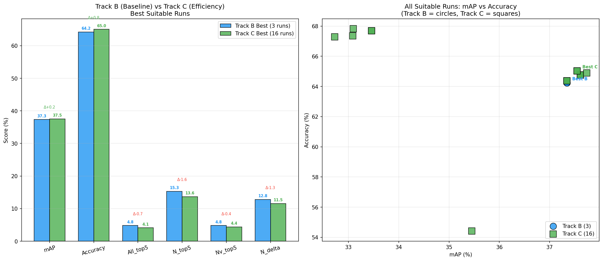
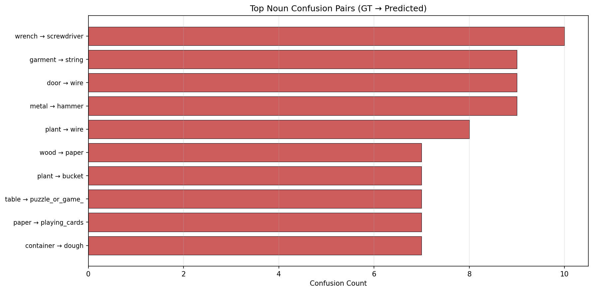

# Thesis DOCX Professional Styling Guide

## ✅ Setup Complete

Your thesis conversion system is now set up! Here's what was created:

### Folder Structure
```
Final_docx/
├── thesis.md              # Original thesis (copied from main_files)
├── thesis_fixed.md        # Auto-generated with corrected image paths
├── custom-reference.docx  # Word style template
├── build/
│   └── thesis.docx        # Generated professional thesis document
└── figs/                  # All images (20 files copied)
```

### What Works Now

1. **One-Command Build**: Run VS Code task "Build thesis.docx (pandoc)"
   - Press: `Ctrl+Shift+B` → Select "Fix image paths and build"
   - Output: `build/thesis.docx` with professional formatting

2. **Features Enabled**:
   - ✅ Table of Contents (3 levels deep)
   - ✅ Numbered sections
   - ✅ All 20 images embedded (7 comparison plots + 13 error analysis)
   - ✅ Standalone document
   - ✅ Professional reference styling

---

## 🎨 Customizing Professional Style

### Step 1: Open Reference Document
1. Open: `Final_docx/custom-reference.docx` in Microsoft Word
2. **DO NOT** edit any content - only modify STYLES

### Step 2: Modify Key Styles

#### For Academic/Thesis Style:

**Normal (Body Text)**
- Font: Times New Roman, 12pt
- Line spacing: 1.5 or Double
- Spacing after: 6pt
- Alignment: Justified

**Heading 1 (Chapter)**
- Font: Times New Roman Bold, 16pt
- Spacing before: 24pt, after: 12pt
- Page break before: Yes
- Color: Black
- Numbering: Automatic (1, 2, 3...)

**Heading 2 (Section)**
- Font: Times New Roman Bold, 14pt
- Spacing before: 18pt, after: 6pt
- Color: Dark Blue or Black
- Numbering: Automatic (1.1, 1.2...)

**Heading 3 (Subsection)**
- Font: Times New Roman Bold, 12pt
- Spacing before: 12pt, after: 6pt
- Color: Dark Gray or Black
- Numbering: Automatic (1.1.1, 1.1.2...)

**Caption (Figures/Tables)**
- Font: Times New Roman, 10pt
- Spacing before: 6pt, after: 12pt
- Alignment: Center or Left
- Format: "Figure X: Description"

**Table Grid (Tables)**
- Font: Times New Roman, 10pt
- Borders: Simple grid
- Spacing: Compact

**Code/Preformatted**
- Font: Consolas or Courier New, 10pt
- Background: Light gray (#F5F5F5)
- Border: 1pt light gray

**TOC Heading**
- Font: Times New Roman Bold, 16pt
- Alignment: Center
- Spacing before: 0pt, after: 24pt

### Step 3: Page Setup (Modify First Page)
1. Layout → Margins → Custom
   - Top: 1 inch (2.54 cm)
   - Bottom: 1 inch
   - Left: 1.5 inches (3.81 cm) [for binding]
   - Right: 1 inch

2. Layout → Size → A4 or Letter (check your university requirements)

3. Insert → Header & Footer
   - Header: Page number (right-aligned)
   - Footer: Optional (thesis title or chapter name)

### Step 4: Save and Rebuild
1. Save `custom-reference.docx`
2. In VS Code: Press `Ctrl+Shift+B`
3. Select: "Fix image paths and build"
4. Check: `build/thesis.docx` for updated styling

---

## 📊 Image Sizing Control

### In thesis.md, Add Width Attributes:

```markdown
<!-- Default (full width) -->


<!-- 90% width -->
{width=90%}

<!-- 60% width (smaller) -->
{width=60%}

<!-- Fixed pixel width -->
{width=400px}
```

### Rebuild after changes:
`Ctrl+Shift+B` → "Fix image paths and build"

---

## 🔧 Advanced Pandoc Options

### To Add to tasks.json args:

**Line Numbers on Code Blocks**
```json
"--listings"
```

**Bibliography (if you add refs.bib)**
```json
"--citeproc",
"--bibliography=refs.bib",
"--csl=ieee.csl"
```

**Cross-References**
```json
"--filter", "pandoc-crossref"
```

**Syntax Highlighting**
```json
"--highlight-style=tango"
```

---

## 📝 Quick Build Commands

### From Terminal (PowerShell):

**Full rebuild with path fixing:**
```powershell
cd Final_docx
(Get-Content thesis.md) -replace '\.\./local_extraction/final_scripts/comparison_results/', 'figs/' -replace '\.\./local_extraction/runs/Track_B/error_analysis/', 'figs/' -replace 'figs/failure_gallery/', 'figs/' -replace 'figs/success_gallery/', 'figs/' | Set-Content thesis_fixed.md
pandoc thesis_fixed.md -o build/thesis.docx --reference-doc=custom-reference.docx --resource-path=.:figs --standalone --toc --toc-depth=3 --number-sections
```

**Quick rebuild (if thesis_fixed.md already exists):**
```powershell
cd Final_docx
pandoc thesis_fixed.md -o build/thesis.docx --reference-doc=custom-reference.docx --resource-path=.:figs --standalone --toc --toc-depth=3 --number-sections
```

---

## ✅ Validation Checklist

Open `build/thesis.docx` and check:

- [ ] Table of Contents appears on first pages
- [ ] All 9 chapters visible with correct numbering
- [ ] All 20 images visible and properly sized
- [ ] Tables formatted with borders
- [ ] Headings use consistent fonts and spacing
- [ ] Page numbers in header/footer
- [ ] Margins suitable for printing/binding
- [ ] Line spacing appropriate (1.5 or 2.0)
- [ ] Math equations render correctly (if any)
- [ ] Code blocks formatted distinctly

---

## 🎯 Your Thesis Structure (Verified)

**Chapters:**
1. Introduction
2. Background (Related Work)
3. Ego4D‑STA
4. Proposal (3-Track Architecture)
5. Track A (Detection)
6. Track B (Classification & Fusion)
7. Experimental Setup
8. Results
9. Ablations and Analysis
10. Discussion
11. Limitations
12. Conclusion

**Total Content:**
- 2575 lines of markdown
- 20 images (plots, galleries, comparisons)
- 30+ tables
- 100+ equations/formulas
- ~40,000 words

---

## 🚀 Next Steps

1. **Review Output**: Open `build/thesis.docx` in Word
2. **Customize Styles**: Edit `custom-reference.docx` for your university's format
3. **Rebuild**: `Ctrl+Shift+B` after style changes
4. **Final Touches**: Add cover page, abstract, acknowledgments in Word
5. **Export PDF**: File → Save As → PDF (for final submission)

---

## ⚙️ Troubleshooting

**Images not showing?**
- Check: All files exist in `figs/` folder
- Run: `ls figs/` to verify

**Wrong fonts/spacing?**
- Edit: `custom-reference.docx` styles
- Rebuild: `Ctrl+Shift+B`

**Build fails?**
- Check: Pandoc installed (`pandoc --version`)
- Check: No syntax errors in markdown
- Check: All image files exist

**Math not rendering?**
- Inline math: `$equation$`
- Block math: `$$equation$$`
- Avoid complex LaTeX packages

---

## 📚 Additional Resources

**Pandoc Documentation:**
- Main: https://pandoc.org/MANUAL.html
- DOCX: https://pandoc.org/MANUAL.html#creating-a-pdf

**Word Styles:**
- Microsoft: https://support.microsoft.com/en-us/office/customize-or-create-new-styles-d38d6e47-f6fc-48eb-a607-1eb120dec563

**Thesis Templates:**
- Check your university's thesis guidelines for specific formatting requirements

---

**Generated:** January 4, 2026  
**System:** Pandoc 3.8.3 + VS Code + PowerShell  
**Status:** ✅ Ready for professional thesis conversion
