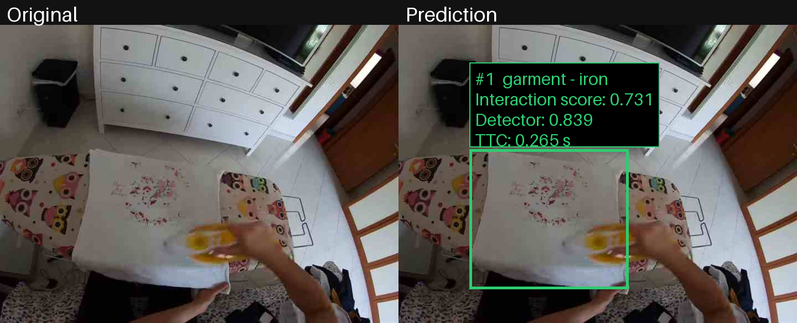
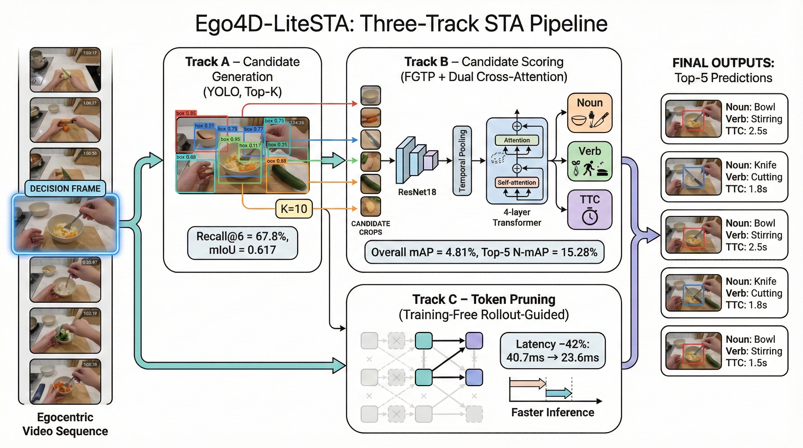
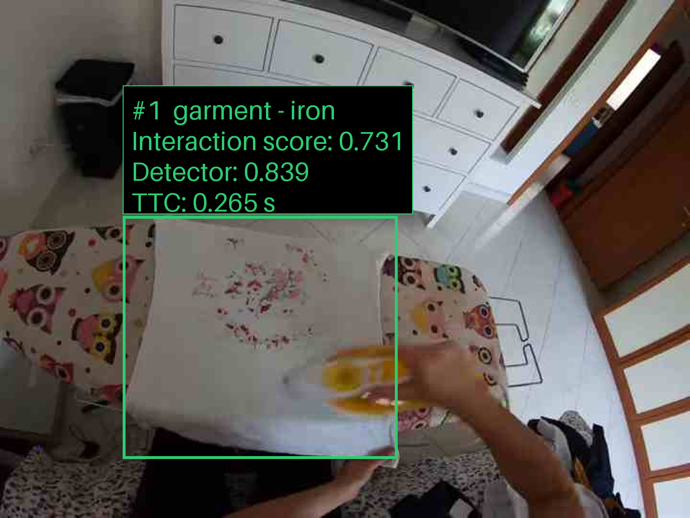
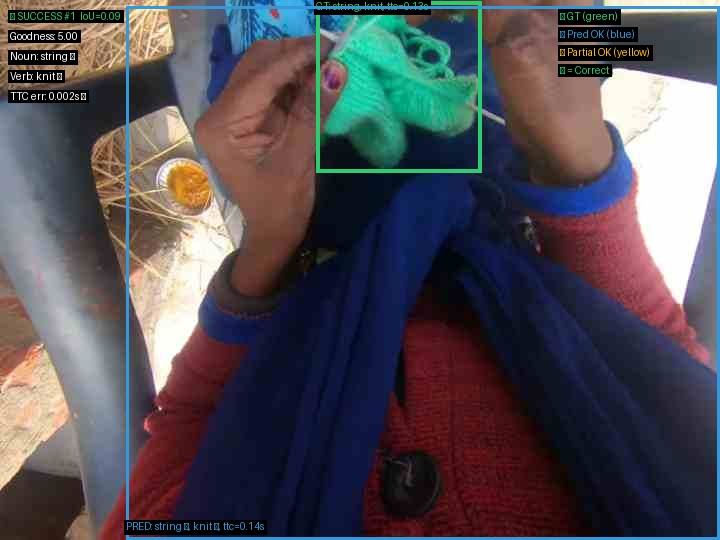
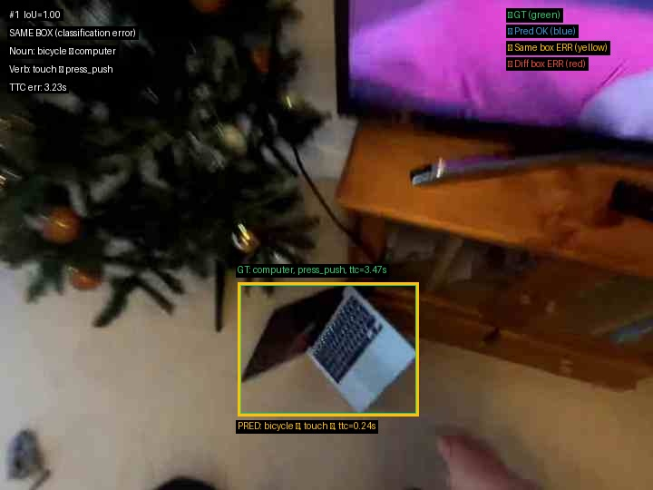

# Ego4D-LiteSTA

[](https://github.com/saeedzns/Ego4d-LiteSTA/actions/workflows/ci.yml)

Ego4D-LiteSTA is a lightweight pipeline for short-term object interaction anticipation in egocentric video. Given a target Ego4D frame and its temporal context, it predicts **which object** will become active, **what action** will occur, and **when** contact is expected.

The project began as an MSc Data Science thesis and was subsequently productionized as a tested local inference system with a CLI, HTTP API, container deployment, artifact validation, and qualitative visualization.

## Production Inference Demo



This is a verified qualitative example from the current production pipeline, compared with the corresponding ground-truth annotation. It is one selected case, not a dataset-wide performance claim.

| | Value |
|---|---|
| Frame | `53808b1d-36e6-44f7-bf84-dbffe702187b / 0009052.jpg` |
| Production top-1 | `garment - iron` |
| Ground truth | `garment - iron` |
| Localization IoU | **0.9949** |
| Ground-truth TTC | **0.2667 s** |
| Predicted TTC | **0.2647 s** |
| Absolute TTC error | **0.0020 s** |
| Interaction score | **0.7308** |
| Detector confidence | **0.8392** |

*Verified production inference example: the current pipeline predicts `garment - iron` with IoU 0.9949 and TTC 0.2647 s versus ground truth 0.2667 s.*

## What the System Does

**Input:** one target Ego4D frame plus a resolved sequence of preceding context frames.

**Output:** ranked interaction candidates containing:

- an object bounding box;
- detector confidence and next-active interaction score;
- taxonomy-resolved noun and verb predictions;
- predicted time-to-contact (TTC).

The CLI and HTTP API emit the same JSON prediction schema.

## Production Architecture

```text
Target frame
  -> temporal context resolution
  -> Track A YOLO candidate detection
  -> ResNet18 spatial and temporal token extraction
  -> Track B feature projection and fusion
  -> ROI pooling and prediction heads
  -> noun / verb / TTC decoding and candidate ranking
  -> CLI or local HTTP API
  -> debug or presentation visualization
```

The production path validates checkpoint metadata, taxonomy data, persisted TTC normalization statistics, and the checkpoint-specific ResNet18 feature contract before inference. Artifact paths resolve against the repository rather than the caller's working directory.

The original research architecture is summarized below:



## Key Results

These are research/evaluation results documented by the project; they are separate from the single production example above.

| Stage | Documented result |
|---|---|
| Track A | **67.8% Recall@6** for candidate proposal generation |
| Track B, class-weighted | **15.28% N top-5 mAP**, **4.81% Overall top-5 mAP** |
| Track C | **42% latency reduction**, from **40.7 ms to 23.6 ms**, with approximately **99.9% accuracy retention** |

### Track B checkpoint selection

The production pipeline uses `trackB_best_mAP_0.3708_20251225_224220.pt`, the class-weighted checkpoint selected to address class imbalance and improve noun coverage. It was **not** the checkpoint with the best raw Overall-mAP.

The repository's comparison data records:

| Checkpoint family | N top-5 mAP | Overall top-5 mAP |
|---|---:|---:|
| Class-weighted (`0.3708`) | 15.275% | 4.809% |
| Unweighted (`0.3904`) | 16.970% | 10.534% |

The class-weighted result must therefore not be reported as achieving the unweighted checkpoint's 10.53% Overall-mAP. The weighted checkpoint is retained for the class-imbalance methodology and noun-coverage behavior rather than maximum raw aggregate score.

The recorded backbone comparison also shows ResNet18 at 38.38% candidate mAP versus 31.19% for the evaluated VideoMAE configuration, a difference of 7.19 percentage points in this project setup.

## Quick Start — Production Inference

Run the following commands from the repository root using an environment with the project dependencies installed. Production inference requires the Track A and Track B checkpoints, Ego4D taxonomy, pretrained ResNet18 weights, and a directory of extracted Ego4D frames.

For local CLI/API execution, checkpoint and taxonomy locations use the repository-relative defaults in [`local_extraction/inference/config.py`](local_extraction/inference/config.py); the ResNet18 weight file is supplied explicitly.

### CLI

The CLI accepts a target `.jpg` frame, resolves its temporal context from the same directory, and writes JSON when `--output` is provided:

```powershell
python -m local_extraction.inference.cli `
  "<path-to-ego4d-frames>/<uid>/<frame>.jpg" `
  --tokenizer-weights "<path-to-resnet18-weights>" `
  --device cpu `
  --output prediction.json
```

Without `--output`, the JSON result is printed to standard output. See [the inference interface guide](local_extraction/inference/README.md) for additional local usage details.

### HTTP API

The local API is implemented with Python's standard-library `http.server`; it is not a FastAPI service.

```powershell
python -m local_extraction.inference.api `
  --host 127.0.0.1 `
  --port 8000 `
  --device cpu `
  --tokenizer-weights "<path-to-resnet18-weights>"
```

Endpoints:

- `GET /health` returns `{"status":"ok"}` without initializing the predictor.
- `POST /predict` accepts a JSON object containing a server-local target frame path:

```json
{
  "target_frame": "<path-to-ego4d-frames>/<uid>/<frame>.jpg"
}
```

The predictor is initialized lazily on the first prediction and reused. Prediction requests are serialized for the stateful, single-device local model stack.

### Docker Compose

The container uses read-only host mounts for frames, model checkpoints, taxonomy data, and ResNet18 weights; these large artifacts are not copied into the image.

```powershell
Copy-Item deploy/.env.example deploy/.env
# Edit deploy/.env with valid host artifact paths.
docker compose --env-file deploy/.env -f deploy/compose.yaml build
docker compose --env-file deploy/.env -f deploy/compose.yaml up -d
docker compose --env-file deploy/.env -f deploy/compose.yaml ps
```

The service publishes port 8000 on `127.0.0.1`. See [deploy/README.md](deploy/README.md) for mount configuration, health checks, prediction requests, logs, and shutdown commands.

## Visualization

The production visualizer converts an existing inference JSON result into a deterministic PNG or JPEG:

```powershell
python -m local_extraction.inference.visualize `
  --prediction-json prediction.json `
  --taxonomy "<path-to-taxonomy>" `
  --target-frame "<path-to-ego4d-frames>/<uid>/<frame>.jpg" `
  --style presentation `
  --layout zoom `
  --top-k 1 `
  --output prediction_zoom.png
```

Supported options include:

- `--style debug|presentation`: detailed engineering labels or larger presentation labels;
- `--layout overlay|side-by-side|zoom`: annotated frame, comparison panels, or a top-prediction crop;
- `--top-k`: limit displayed predictions while preserving production rank order;
- `--target-frame`: override a frame path stored in JSON, useful when container and host paths differ.

Presentation mode defaults to top-1; debug mode displays all serialized predictions unless `--top-k` is supplied.



## Research Pipeline

The thesis pipeline is organized into three stages:

- **[Track A](local_extraction/trackA/):** YOLO-based candidate proposal generation and Stage B manifest construction.
- **[Track B](local_extraction/trackB/):** ResNet18/VideoMAE feature experiments, feature fusion, next-active classification, noun/verb prediction, TTC prediction, evaluation, and error analysis. See the [Track B guide](local_extraction/trackB/README.md).
- **[Track C](local_extraction/trackC/):** training-free rollout-guided token pruning and accuracy/latency analysis. See the [Track C guide](local_extraction/trackC/README.md).

Reusable configuration and run-logging utilities live under `local_extraction/configs/` and `local_extraction/core/`. Thesis comparison and reporting utilities are retained under `local_extraction/final_scripts/`.

## Repository Structure

```text
Ego4D-LiteSTA/
├── local_extraction/
│   ├── inference/       # Production pipeline, CLI, API, and visualizer
│   ├── trackA/          # Candidate detection and manifest generation
│   ├── trackB/          # Fusion/head training and evaluation
│   ├── trackC/          # Efficiency and pruning analysis
│   ├── core/            # Shared research utilities
│   ├── configs/         # Research configuration files
│   └── final_scripts/   # Thesis reporting and comparison scripts
├── deploy/              # Dockerfile, Compose service, and deployment guide
├── tests/               # Focused production-inference tests
├── docs/assets/         # Portfolio-ready inference images
└── thesis/              # Tracked qualitative images and pipeline diagram
```

Large experiment runs, checkpoints, extracted frames, and the thesis PDF are not part of the tracked public repository.

## Validation and Testing

The production inference and visualization suite was locally validated with:

```powershell
python -m pytest tests -q
```

Result: **173 tests passed**.

Local end-to-end deployment validation also covered:

- a healthy Docker container;
- a successful `GET /health` request;
- a successful `POST /predict` request on a real Ego4D frame.

These checks describe local validation, not a hosted public service. No GitHub Actions workflow is currently configured.

## Qualitative Research Results

The following images are legacy research/evaluation examples generated by the Track B error-analysis workflow. They are distinct from the current production output shown above.

### Legacy success example



### Legacy failure example



These assets illustrate individual evaluation cases and should not be interpreted as aggregate accuracy estimates.

## Reproducibility and External Artifacts

Large binary and dataset artifacts are intentionally excluded from version control. A full inference run requires:

- a Track A YOLO checkpoint (`<path-to-track-a-checkpoint>`);
- the selected Track B checkpoint (`<path-to-track-b-checkpoint>`);
- the Ego4D noun/verb taxonomy (`<path-to-taxonomy>`);
- pretrained ResNet18 weights (`<path-to-resnet18-weights>`);
- extracted temporal frames (`<path-to-ego4d-frames>`).

The repository does track the small TTC statistics and feature-contract metadata used to validate and decode the selected Track B model. For container deployment, copy and configure [`deploy/.env.example`](deploy/.env.example); its bind mounts keep external artifacts read-only.

## Thesis

This repository contains the tracked pipeline diagram and selected qualitative thesis figures. The full MSc thesis PDF is intentionally excluded from the public repository.

## Citation

```bibtex
@mastersthesis{zohoorian2026ego4dlitesta,
  title={Ego4D-LiteSTA: A Lightweight, Modular Pipeline for Reproducible Short-Term Object Interaction Anticipation},
  author={Saeed Zohoorian},
  school={Sapienza University of Rome},
  year={2026}
}
```
