# Tesi

*Document Type: DOCX*

## Table of Contents

- [Chapter 1: Introduction](#chapter-1-introduction)
  - [1.1 Background](#11-background)
  - [1.2 Problem Statement](#12-problem-statement)
  - [1.3 Objectives of the Study](#13-objectives-of-the-study)
  - [1.4 Scope and Limitations](#14-scope-and-limitations)
  - [1.5 Research Methodology](#15-research-methodology)
  - [1.6 Structure of the Thesis](#16-structure-of-the-thesis)
- [Chapter 2: Literature Review](#chapter-2-literature-review)
  - [2.1 Categorization of EV Charging Stations](#21-categorization-of-ev-charging-stations)
    - [2.1.1 DC Bus Configuration](#211-dc-bus-configuration)
    - [2.1.2 AC Bus Configuration](#212-ac-bus-configuration)
    - [2.1.3 Comparison of AC and DC Bus Configurations](#213-comparison-of-ac-and-dc-bus-configurations)
  - [**Comparison of AC and DC Bus Architectures**](#comparison-of-ac-and-dc-bus-architectures)
  - [**Category**](#category)
  - [**AC Bus Architecture**](#ac-bus-architecture)
  - [**DC Bus Architecture**](#dc-bus-architecture)
  - [**Integration of Energy Sources**](#integration-of-energy-sources)
  - [**Number of Conversion Stages**](#number-of-conversion-stages)
  - [**Efficiency**](#efficiency)
  - [**Impacts from Utility Side**](#impacts-from-utility-side)
  - [**Rating of AC-DC Rectifier**](#rating-of-ac-dc-rectifier)
  - [**Protection Devices**](#protection-devices)
  - [**Control**](#control)
  - [**Cost**](#cost)
  - [2.2 AC-DC Conversion stage](#22-ac-dc-conversion-stage)
    - [2.2.1 Three-Phase Buck-Type Rectifier](#221-three-phase-buck-type-rectifier)
    - [2.2.2 Swiss Rectifier (SR)](#222-swiss-rectifier-sr)
    - [2.2.3 Vienna Rectifier (VR)](#223-vienna-rectifier-vr)
    - [Three-Phase Boost-Type Rectifier (TPSSBR)](#three-phase-boost-type-rectifier-tpssbr)
    - [Multilevel AC-DC Converters](#multilevel-ac-dc-converters)
  - [**Cascaded H-Bridge (CHB)**](#cascaded-h-bridge-chb)
  - [**Flying Capacitor (FC)**](#flying-capacitor-fc)
  - [**Neutral Point Clamped (NPC)**](#neutral-point-clamped-npc)
      - [2.2.5.1 Cascaded H-Bridge Multilevel Converter (CHB)](#2251-cascaded-h-bridge-multilevel-converter-chb)
      - [2.2.5.2 Flying Capacitor Multilevel Converter (FCMLC)](#2252-flying-capacitor-multilevel-converter-fcmlc)
      - [Neutral Point Clamped (NPC) Topology](#neutral-point-clamped-npc-topology)
    - [2.2.6 Comparison of AC-DC Converters for EV Charging Applications](#226-comparison-of-ac-dc-converters-for-ev-charging-applications)
  - [**Comparison Table**](#comparison-table)
  - [**Parameter**](#parameter)
  - [**TPBR**](#tpbr)
  - [**SR**](#sr)
  - [**VR**](#vr)
  - [**TPSSBR**](#tpssbr)
  - [**CHB**](#chb)
  - [**FCMLC**](#fcmlc)
  - [**NPC**](#npc)
  - [**Topology Complexity**](#topology-complexity)
  - [**Efficiency**](#efficiency)
  - [**Harmonic Distortion**](#harmonic-distortion)
  - [**Power Density**](#power-density)
  - [**Scalability**](#scalability)
  - [**Cost and Complexity**](#cost-and-complexity)
  - [**Suitability for EVs**](#suitability-for-evs)
  - [2.3 DC to DC Conversion stage](#23-dc-to-dc-conversion-stage)
    - [2.3.1 LLC RESONANT CONVERTER](#231-llc-resonant-converter)
    - [****](#image_020_spd2m_image25pngimagesimage_020_spd2m_image25png)
    - [2.3.2 DUAL ACTIVE BRIDGE CONVERTER](#232-dual-active-bridge-converter)
    - [****](#image_021_spd2m_image26pngimagesimage_021_spd2m_image26png)
    - [2.3.3 DUAL ACTIVE BRIDGE RESONANT CONVERTER](#233-dual-active-bridge-resonant-converter)
      - [2.3.3.1 Series LC Network](#2331-series-lc-network)
      - [2.3.3.2 LCL and CLC Resonant Tanks](#2332-lcl-and-clc-resonant-tanks)
    - [2.3.4 PHASE-SHIFTED FULL-BRIDGE (PSFB) CONVERTER](#234-phase-shifted-full-bridge-psfb-converter)
    - [****](#image_025_spd2m_image30pngimagesimage_025_spd2m_image30png)
    - [2.3.5 Non-Isolated DC-DC Converter](#235-non-isolated-dc-dc-converter)
      - [2.3.5.1 interleaved buck converters](#2351-interleaved-buck-converters)
      - [2.3.5.2 Parallel Three-Level Converters](#2352-parallel-three-level-converters)
- [Chapter 3: Current Industry Practices and Technology Landscape](#chapter-3-current-industry-practices-and-technology-landscape)
  - [3.1 Introduction](#31-introduction)
  - [3.2 Charging Standards and Communication Protocols](#32-charging-standards-and-communication-protocols)
    - [3.2.1 Global Overview of Charging Standards](#321-global-overview-of-charging-standards)
    - [3.2.2 Smart Charging and ISO 15118](#322-smart-charging-and-iso-15118)
    - [3.2.3 Regional Adoption of Charging Standards](#323-regional-adoption-of-charging-standards)
  - [3.3 Connector Types and Power Levels](#33-connector-types-and-power-levels)
    - [3.3.1 Types of Connectors by Region and Standard](#331-types-of-connectors-by-region-and-standard)
    - [****](#image_038_spd2m_image43pngimagesimage_038_spd2m_image43png)
    - [3.3.2 Connector Capabilities and Practical Use](#332-connector-capabilities-and-practical-use)
    - [3.3.3 Power Level Classification](#333-power-level-classification)
    - [3.3.4 Cable Design and Safety](#334-cable-design-and-safety)
    - [3.3.5 Future Developments](#335-future-developments)
  - [3.5 Commercial Implementations and Key Players](#35-commercial-implementations-and-key-players)
    - [3.5.1 Tesla Supercharger Network](#351-tesla-supercharger-network)
    - [3.5.2 Electrify America](#352-electrify-america)
    - [3.5.3 Ionity (Europe)](#353-ionity-europe)
    - [3.5.4 ABB and Siemens: Hardware Leaders](#354-abb-and-siemens-hardware-leaders)
    - [3.5.5 Asian Leaders: BYD, StarCharge, and TGOOD](#355-asian-leaders-byd-starcharge-and-tgood)
    - [3.5.6 Comparative Insights](#356-comparative-insights)
  - [**Company/Network**](#companynetwork)
  - [**Max Power**](#max-power)
  - [**Standards Supported**](#standards-supported)
  - [**Network Model**](#network-model)
  - [**Notable Features**](#notable-features)
  - [3.6 Integration with Renewable Energy and Storage](#36-integration-with-renewable-energy-and-storage)
    - [3.6.1 Integration with Renewable Energy](#361-integration-with-renewable-energy)
    - [3.6.2 Energy Storage Systems (ESS)](#362-energy-storage-systems-ess)
  - [3.7 Deployment Trends and Policy Drivers](#37-deployment-trends-and-policy-drivers)
    - [3.7.1 Global Deployment Trends](#371-global-deployment-trends)
  - [**Regional Highlights:**](#regional-highlights)
  - [**Global Projections:**](#global-projections)
    - [3.7.2 Policy and Regulatory Frameworks](#372-policy-and-regulatory-frameworks)
    - [3.7.3 Data-Driven Planning and Optimization](#373-data-driven-planning-and-optimization)
  - [3.8 Conclusion](#38-conclusion)
- [Chapter 4 – Theoretical Background](#chapter-4--theoretical-background)
  - [4.1 Introduction](#41-introduction)
  - [4.2 AC-DC Stage: Vienna Rectifier](#42-ac-dc-stage-vienna-rectifier)
    - [4.2.1 Introduction and Topology](#421-introduction-and-topology)
    - [Three Boost Inductors (L1​, L2​, L3​)](#three-boost-inductors-l1-l2-l3)
    - [Three Active Switches (Sa​, Sb​, Sc​)](#three-active-switches-sa-sb-sc)
    - [Six Diodes](#six-diodes)
    - [Two DC-Link Capacitors (Cp​, Cn​)](#two-dc-link-capacitors-cp-cn)
    - [4.2.2 Operating Principle](#422-operating-principle)
  - [**Three-Level Switching Concept and its Benefits**](#three-level-switching-concept-and-its-benefits)
    - [**Role as a Three-Phase Boost Converter and Power Factor Correction Mechanism**](#role-as-a-three-phase-boost-converter-and-power-factor-correction-mechanism)
    - [Pulse-Width Modulation (PWM)](#pulse-width-modulation-pwm)
    - [Inductor Magnetization Control](#inductor-magnetization-control)
    - [Phase Synchronization](#phase-synchronization)
  - [**Inductor Current Shaping and Energy Transfer**](#inductor-current-shaping-and-energy-transfer)
    - [Energy Storage (Active Switch ON)](#energy-storage-active-switch-on)
    - [Energy Release (Active Switch OFF)](#energy-release-active-switch-off)
    - [**Role of Diodes in Unidirectional Current Flow and Freewheeling**](#role-of-diodes-in-unidirectional-current-flow-and-freewheeling)
    - [First-Line Rectification](#first-line-rectification)
    - [Freewheeling Paths](#freewheeling-paths)
    - [Ensuring Unidirectional Power Flow](#ensuring-unidirectional-power-flow)
    - [4.2.3 Component Sizing](#423-component-sizing)
    - [Boost Inductors (*****L*****)](#boost-inductors-l)
    - [DC-Link Capacitors (*****Cp​, Cn*****​****)](#dc-link-capacitors-cp-cn)
    - [4.2.4 Control Strategy](#424-control-strategy)
    - [Outer Voltage Loop](#outer-voltage-loop)
    - [Inner Current Loop](#inner-current-loop)
    - [4.2.5 Modulation Technique](#425-modulation-technique)
    - [Better DC-Link Voltage Utilization](#better-dc-link-voltage-utilization)
    - [Reduced Harmonic Distortion](#reduced-harmonic-distortion)
    - [Flexibility in Control](#flexibility-in-control)
  - [4.3 DC-DC Stage: Dual Active Bridge (DAB) Converter](#43-dc-dc-stage-dual-active-bridge-dab-converter)
    - [4.3.1 Introduction and Topology](#431-introduction-and-topology)
  - [**Key Features:**](#key-features)
    - [Bidirectional Power Flow](#bidirectional-power-flow)
    - [Galvanic Isolation](#galvanic-isolation)
    - [High Efficiency](#high-efficiency)
    - [Compact Design](#compact-design)
  - [**Circuit Description:**](#circuit-description)
    - [Two Full-Bridge Converters (Primary and Secondary)](#two-full-bridge-converters-primary-and-secondary)
    - [High-Frequency Transformer](#high-frequency-transformer)
    - [Leakage Inductance (L)](#leakage-inductance-l)
    - [4.3.2 Operating Principle](#432-operating-principle)
    - [Power Transfer Equation](#power-transfer-equation)
    - [4.3.3 Component Sizing](#433-component-sizing)
    - [Leakage Inductance (L)](#leakage-inductance-l)
    - [Transformer Turns Ratio (n)](#transformer-turns-ratio-n)
    - [DC-Link Capacitors](#dc-link-capacitors)
    - [4.3.4 Control Strategy](#434-control-strategy)
    - [Outer Voltage Regulation Loop](#outer-voltage-regulation-loop)
  - [**Bidirectional Operation:**](#bidirectional-operation)
    - [Positive phase shifts (ϕ>0)](#positive-phase-shifts-ϕ0)
    - [Negative phase shifts (ϕ<0)](#negative-phase-shifts-ϕ0)
    - [Current Limiting](#current-limiting)
    - [4.3.5 Modulation Techniques](#435-modulation-techniques)
    - [Single Phase Shift (SPS) Modulation](#single-phase-shift-sps-modulation)
    - [Dual Phase Shift (DPS) Modulation](#dual-phase-shift-dps-modulation)
    - [Extended Phase Shift (EPS) / Triple Phase Shift (TPS) Modulation](#extended-phase-shift-eps--triple-phase-shift-tps-modulation)
  - [4.4 Battery Model and Characteristics](#44-battery-model-and-characteristics)
    - [4.4.1 Introduction](#441-introduction)
    - [4.4.2 Battery Chemistry Selection](#442-battery-chemistry-selection)
    - [4.4.3 Battery Pack Configuration](#443-battery-pack-configuration)
    - [4.4.4 Battery Sizing Considerations](#444-battery-sizing-considerations)
    - [Energy Capacity (*****E******bp*****​)](#energy-capacity-ebp)
    - [Power Capacity (*****P******bp*****​)](#power-capacity-pbp)
    - [Voltage Level (*****V******bp******​*****)](#voltage-level-vbp)
    - [Current Rating](#current-rating)
    - [4.4.5 Battery Management System (BMS)](#445-battery-management-system-bms)
    - [State of Charge (SoC) Estimation](#state-of-charge-soc-estimation)
    - [State of Health (****SoH****) Assessment](#state-of-health-soh-assessment)
    - [Cell Balancing](#cell-balancing)
    - [Protection Mechanisms](#protection-mechanisms)
    - [Data Logging and Communication](#data-logging-and-communication)
- [Chapter 5 – System Architecture and Modelling Approach](#chapter-5--system-architecture-and-modelling-approach)
    - [5.1.1 Functional Block Diagram and Power Flow](#511-functional-block-diagram-and-power-flow)
      - [1. Grid Interface](#1-grid-interface)
  - [**Structure of the Grid Interface**](#structure-of-the-grid-interface)
  - [**Step-Down Transformer**](#step-down-transformer)
  - [**Measurement and Signal Extraction**](#measurement-and-signal-extraction)
  - [**Modeling Considerations**](#modeling-considerations)
      - [2. Sation interface](#2-sation-interface)
        - [2.1 AC–DC Conversion Stage (Vienna Rectifier)](#21-acdc-conversion-stage-vienna-rectifier)
          - [2.1.1 Circuit Topology Description](#211-circuit-topology-description)
          - [Input Filter Inductors (La, Lb, Lc)](#input-filter-inductors-la-lb-lc)
  - [**L****in**** value will be 2mH**](#lin-value-will-be-2mh)
          - [Six Power Diodes and Three Active Switches (Sa, Sb, Sc)](#six-power-diodes-and-three-active-switches-sa-sb-sc)
          - [DC-Link Capacitors (C+, C-)](#dc-link-capacitors-c-c-)
    - [**Capacitors value becomes C=0.00398F or 3.98mF. we choose he value 5mF**](#capacitors-value-becomes-c000398f-or-398mf-we-choose-he-value-5mf)
    - [****](#image_055_spd2m_image60pngimagesimage_055_spd2m_image60png)
          - [2.1.2 Measurement Subsystem](#212-measurement-subsystem)
          - [2.1.3 Vienna Control Subsystem](#213-vienna-control-subsystem)
  - [**Control Structure Overview**](#control-structure-overview)
  - [**1. Voltage Regulation Loop**](#1-voltage-regulation-loop)
  - [**2. ****dq**** Current Controllers**](#2-dq-current-controllers)
  - [**3. Neutral Point Balancing**](#3-neutral-point-balancing)
    - [**4. Inverse Park Transformation and PWM Signal Generation**](#4-inverse-park-transformation-and-pwm-signal-generation)
  - [**Assumptions**](#assumptions)
        - [2.2. Intermediate DC Link](#22-intermediate-dc-link)
        - [2.3. DC–DC Conversion Stage (Dual Active Bridge – DAB)](#23-dcdc-conversion-stage-dual-active-bridge--dab)
      - [Converter Architecture](#converter-architecture)
        - [1. Primary Full Bridge (Input Side)](#1-primary-full-bridge-input-side)
        - [2. High-Frequency Transformer](#2-high-frequency-transformer)
        - [3. Leakage Inductance (L1)](#3-leakage-inductance-l1)
        - [4. Secondary Full Bridge (Output Side)](#4-secondary-full-bridge-output-side)
        - [5. Output Filter Capacitor](#5-output-filter-capacitor)
      - [Principles of DAB Power Transfer and Control](#principles-of-dab-power-transfer-and-control)
    - [5.5.2 DAB Control Strategy](#552-dab-control-strategy)
  - [**Control Architecture**](#control-architecture)
  - [**1. Output Voltage PI Controller**](#1-output-voltage-pi-controller)
  - [**2****. PWM Generation**](#2-pwm-generation)
  - [**Primary Side Control **](#primary-side-control-)
      - [3. EV Battery Load](#3-ev-battery-load)
      - [4. Control and Measurement Signals](#4-control-and-measurement-signals)
  - [**Power Flow Summary**](#power-flow-summary)
    - [5.2.1 Selection of Simulation Software](#521-selection-of-simulation-software)
    - [5.2.2 General Modeling Approach and Assumptions](#522-general-modeling-approach-and-assumptions)
  - [**Modeling Approach**](#modeling-approach)
  - [**Component-Level Assumptions**](#component-level-assumptions)
  - [**Switches (IGBTs, MOSFETs)**](#switches-igbts-mosfets)
  - [**Diodes**](#diodes)
  - [**Passive Elements**](#passive-elements)
  - [**Transformer**](#transformer)
  - [**Control and Signal Processing**](#control-and-signal-processing)
  - [**Battery and Load Assumptions**](#battery-and-load-assumptions)
  - [**Simulation Settings**](#simulation-settings)
  - [5.7 Controller Tuning and Parameters](#57-controller-tuning-and-parameters)
  - [**Vienna Rectifier Control Loops (AC-DC Stage):**](#vienna-rectifier-control-loops-ac-dc-stage)
    - [DC-Link Voltage Controller](#dc-link-voltage-controller)
    - [d-axis Current Controller](#d-axis-current-controller)
    - [q-axis Current Controller](#q-axis-current-controller)
    - [Neutral Point Voltage Balancer](#neutral-point-voltage-balancer)
    - [Tuning Methodology](#tuning-methodology)
  - [**DAB Converter Controller Tunings:**](#dab-converter-controller-tunings)
- [ Chapter 6: Simulation and Results and Discussion](#image_072_spd2m_image78pngimagesimage_072_spd2m_image78png-chapter-6-simulation-and-results-and-discussion)
  - [6.1 Objectives of Simulation](#61-objectives-of-simulation)
  - [6.2 Simulation Environment and Parameters](#62-simulation-environment-and-parameters)
    - [6.2.1 Simulation Settings](#621-simulation-settings)
  - [6.3 Simulation Scenarios and Results](#63-simulation-scenarios-and-results)
  - [**6.X.1 Active Power Drawn from the Grid**](#6x1-active-power-drawn-from-the-grid)
  - [**6.X.2 Reactive Power Drawn from the Grid**](#6x2-reactive-power-drawn-from-the-grid)
    - [**Figure 6.****3****.2 – Reactive power drawn from the grid over time for Vienna voltage reference = ****700 V and DAB voltage reference = 450 V**](#figure-632--reactive-power-drawn-from-the-grid-over-time-for-vienna-voltage-reference--700-v-and-dab-voltage-reference--450-v)
    - [**6.****3****.3 Vienna Voltage Reference and Output Voltage**](#633-vienna-voltage-reference-and-output-voltage)
  - [**6.X.4 DC-Link Capacitor Voltages: Vdc+​ and Vdc−​**](#6x4-dc-link-capacitor-voltages-vdc-and-vdc)
    - [**Figure 6.****3****.4 – DC-link capacitor voltages Vdc+​ and Vdc−​**](#figure-634--dc-link-capacitor-voltages-vdc-and-vdc)
  - [**6.****3****.5 DAB Input Voltage**](#635-dab-input-voltage)
  - [**6.X.7 DAB Phase Shift Command**](#6x7-dab-phase-shift-command)
  - [**6.X.8 Primary-Side PWM Waveform**](#6x8-primary-side-pwm-waveform)
  - [**6.X.9 Battery State of Charge (SoC)**](#6x9-battery-state-of-charge-soc)
  - [**6.X.10 Load Current**](#6x10-load-current)
  - [**6.X.11 Load Voltage**](#6x11-load-voltage)
  - [Discussion](#discussion)
  - [Summary](#summary)
- [Chapter 7: Assessment of Real-World Applicability](#chapter-7-assessment-of-real-world-applicability)
  - [7.1 Practical Implementation Challenges](#71-practical-implementation-challenges)
    - [7.1.1 Component Selection and Availability](#711-component-selection-and-availability)
    - [Power Semiconductors (IGBTs/MOSFETs/SiC/GaN)](#power-semiconductors-igbtsmosfetssicgan)
    - [Challenge](#challenge)
    - [Commercial Availability](#commercial-availability)
    - [Design Implication](#design-implication)
    - [High-Frequency Inductors and Transformers](#high-frequency-inductors-and-transformers)
    - [Vienna Rectifier Input Inductor (2 mH)](#vienna-rectifier-input-inductor-2-mh)
    - [Challenge](#challenge)
    - [Commercial Availability](#commercial-availability)
    - [Design Implication](#design-implication)
    - [DAB Converter Leakage Inductance (5 **μ**H)](#dab-converter-leakage-inductance-5-μh)
    - [Challenge](#challenge)
    - [Commercial Availability](#commercial-availability)
    - [Design Implication](#design-implication)
    - [DC-Link and Output Capacitors](#dc-link-and-output-capacitors)
  - [**800V DC-Link Capacitor (5 mF):**](#800v-dc-link-capacitor-5-mf)
    - [Challenge](#challenge)
    - [Commercial Availability](#commercial-availability)
  - [**400V DAB Output Capacitor (1.2 mF):**](#400v-dab-output-capacitor-12-mf)
    - [Challenge](#challenge)
    - [Commercial Availability](#commercial-availability)
    - [Design Implication](#design-implication)
    - [7.1.2 Thermal Management](#712-thermal-management)
    - [Heat Dissipation](#heat-dissipation)
    - [Challenge](#challenge)
    - [Design Implication](#design-implication)
    - [7.1.3 Electromagnetic Compatibility (EMC)](#713-electromagnetic-compatibility-emc)
  - [**EMI Mitigation:**](#emi-mitigation)
    - [Challenge](#challenge)
    - [Design Implication](#design-implication)
  - [7.2 Comparison with Existing Solutions and Industry Benchmarks](#72-comparison-with-existing-solutions-and-industry-benchmarks)
    - [Key Performance Indicators (KPIs)](#key-performance-indicators-kpis)
    - [Efficiency](#efficiency)
    - [Power Factor (PF)](#power-factor-pf)
    - [Total Harmonic Distortion (THD) of Input Current](#total-harmonic-distortion-thd-of-input-current)
    - [Power Density](#power-density)
    - [Dynamic Response](#dynamic-response)
    - [Voltage Ripple](#voltage-ripple)
    - [Operating Temperature Range](#operating-temperature-range)
    - [Advantages of Proposed Design](#advantages-of-proposed-design)
    - [High Simulated Efficiency](#high-simulated-efficiency)
    - [Superior Grid Power Quality](#superior-grid-power-quality)
    - [Robust Control and Dynamic Performance](#robust-control-and-dynamic-performance)
    - [Galvanic Isolation](#galvanic-isolation)
    - [Potential Disadvantages/Areas for Improvement Compared to Existing Solutions](#potential-disadvantagesareas-for-improvement-compared-to-existing-solutions)
    - [Component Size and Cost (Large Passive Components)](#component-size-and-cost-large-passive-components)
    - [Cooling System Complexity](#cooling-system-complexity)
    - [Control Complexity](#control-complexity)
    - [**Commercially Available Charger Examples (****NEEDS IMAGES****):**](#commercially-available-charger-examples-needs-images)
    - [ABB Terra HP](#abb-terra-hp)
    - [ChargePoint Express Plus](#chargepoint-express-plus)
    - [EVBox**** ****Troniq**** High Power](#evbox-troniq-high-power)
    - [Delta ****UltraFast**** Charger](#delta-ultrafast-charger)
  - [7.3 Safety Standards and Regulatory Compliance](#73-safety-standards-and-regulatory-compliance)
    - [Relevant Standards](#relevant-standards)
    - [IEC 61851 (Electric vehicle conductive charging system)](#iec-61851-electric-vehicle-conductive-charging-system)
    - [UL 2202 (EV Charging System Equipment)](#ul-2202-ev-charging-system-equipment)
    - [IEEE 519 (Recommended Practice and Requirements for Harmonic Control in Electric Power Systems)](#ieee-519-recommended-practice-and-requirements-for-harmonic-control-in-electric-power-systems)
    - [Protection Mechanisms](#protection-mechanisms)
    - [Isolation Requirements](#isolation-requirements)
    - [Environmental Ratings](#environmental-ratings)
  - [7.4 Economic Viability and Cost Considerations](#74-economic-viability-and-cost-considerations)
    - [Power Semiconductors (SiC/GaN Devices)](#power-semiconductors-sicgan-devices)
    - [Custom High-Frequency Magnetics](#custom-high-frequency-magnetics)
    - [DC-Link and Output Capacitor Banks](#dc-link-and-output-capacitor-banks)
    - [Cooling System](#cooling-system)
    - [Manufacturing and Assembly Complexity](#manufacturing-and-assembly-complexity)
    - [PCB Layout](#pcb-layout)
    - [Assembly](#assembly)
    - [Control Hardware](#control-hardware)
  - [**Cost vs. Performance Trade-offs:**](#cost-vs-performance-trade-offs)
    - [Electrolytic capacitors](#electrolytic-capacitors)
    - [Film capacitors](#film-capacitors)
  - [**Operational Expenditure (****OpEx****)**](#operational-expenditure-opex)
  - [**Market Dynamics**](#market-dynamics)
    - [Per kWh pricing](#per-kwh-pricing)
    - [Per minute pricing](#per-minute-pricing)
    - [Subscription or flat fees](#subscription-or-flat-fees)
    - [For CPOs](#for-cpos)
    - [For EV Drivers](#for-ev-drivers)
  - [7.5 Scalability and Future Enhancements](#75-scalability-and-future-enhancements)
  - [**Power Scalability**](#power-scalability)
    - [Benefits of Modularity](#benefits-of-modularity)
    - [Challenges of Modularity](#challenges-of-modularity)
  - [**Integration with Energy Storage and Renewables**](#integration-with-energy-storage-and-renewables)
  - [**Advanced Control Algorithms**](#advanced-control-algorithms)
  - [**Grid Integration and Smart Charging**](#grid-integration-and-smart-charging)
- [Chapter 9. Conclusion](#chapter-9-conclusion)
- [References](#references)

Design and Simulation of a High-Efficiency DC Fast Charging Station for Electric Vehicles Using Vienna Rectifier and Dual Active Bridge Converter

LaureandoRelatore

Milad Reihanpour Professor Alessandro Ruvio

# Chapter 1: Introduction

## 1.1 Background

The transportation sector is a cornerstone of modern society, fundamentally shaping economic growth, facilitating international trade, enabling personal mobility, and granting access to essential services and goods. Historically, this sector has relied almost exclusively on fossil fuels such as gasoline, diesel, and aviation fuel, making transportation a major contributor to greenhouse gas emissions, environmental pollution, and climate change. According to the International Energy Agency (IEA), transportation alone accounted for approximately 24% of direct global CO2 emissions from fuel combustion in recent years, highlighting its significant environmental impact.

In response to increasing concerns about climate change and global warming, governments, industry leaders, and consumers worldwide have been actively pursuing alternatives to reduce the environmental footprint of transportation. Electric vehicles (EVs) have emerged as a transformative solution due to their ability to significantly reduce greenhouse gas emissions, particularly when powered by renewable energy sources such as solar, wind, or hydroelectric power. EVs eliminate tailpipe emissions entirely, drastically reducing local air pollutants and significantly improving urban air quality. Additionally, they operate more quietly and smoothly compared to traditional internal combustion engine vehicles, thereby reducing noise pollution.

The global adoption of electric vehicles has accelerated dramatically in recent years, driven by several converging factors. Technological advancements have led to substantial improvements in battery technologies, resulting in increased driving range, reduced charging times, and lower battery costs. Lithium-ion batteries, which are predominantly used in modern electric vehicles, have experienced a remarkable 89% decrease in cost over the past decade. This decrease has made electric vehicles increasingly economically viable for both consumers and fleet operators.

Supportive government policies and initiatives have further spurred EV adoption. Many governments worldwide have implemented stringent emission regulations, provided generous financial incentives such as subsidies and tax breaks, and set ambitious targets for EV sales and infrastructure development. For instance, the European Union plans to phase out the sale of new internal combustion engine vehicles entirely by 2035, while several countries, including Norway and the Netherlands, have established even earlier targets.

Consequently, global electric vehicle sales have grown exponentially. According to recent data from the International Energy Agency, electric car sales surpassed 3 million units in the first quarter of 2024 alone, marking a remarkable 25% increase from the same period in the previous year. This rapid growth demonstrates strong consumer demand, which is expected to continue as vehicle costs decrease further and infrastructure improves.

The widespread adoption of electric vehicles, however, critically depends on the availability, efficiency, and convenience of charging infrastructure. While home-based Level 1 and Level 2 chargers provide convenient overnight charging for local commuting, public Direct Current (DC) fast-charging stations are essential for enabling long-distance travel, overcoming "range anxiety," and providing practical solutions for users without access to private charging facilities.

DC fast charging infrastructure offers significantly higher charging power outputs compared to standard residential or workplace charging solutions. Typical DC fast chargers operate at power levels between 50 kW and 350 kW, allowing EV batteries to recharge from nearly empty to about 80% in just 20 to 30 minutes. This capability closely replicates the convenience of refueling gasoline-powered vehicles, making fast-charging infrastructure a critical enabler for mainstream EV adoption.

In recent years, investment and development in public DC fast-charging infrastructure have intensified significantly. Globally, the number of public fast chargers increased by more than 55% in 2023 alone, reaching hundreds of thousands of units worldwide. China, the United States, and Europe have led this expansion, investing billions of dollars into charging networks and supporting infrastructure. For example, Europe's rapid deployment of fast chargers under initiatives like the Alternative Fuels Infrastructure Regulation (AFIR) exemplifies proactive measures to ensure adequate infrastructure keeps pace with rapidly growing EV sales.

The continued growth of DC fast-charging infrastructure requires ongoing innovation and strategic planning. As charging networks expand, they must become increasingly efficient, cost-effective, and seamlessly integrated into existing electrical grids and renewable energy sources. Addressing these needs involves overcoming complex technical challenges related to power electronics, grid integration, thermal management, interoperability standards, and scalability, thereby ensuring infrastructure growth is sustainable and effective in the long term.

## 1.2 Problem Statement

Despite significant advancements and investments in electric vehicle technology and DC fast-charging infrastructure, numerous critical challenges persist, significantly limiting widespread deployment and optimal utilization. One major challenge lies in the efficiency and effectiveness of power electronic components within DC fast chargers. Traditional charging systems commonly employ diode-based rectifiers and basic DC/DC converters, which are typically characterized by substantial energy losses. These conversion inefficiencies translate directly into increased electricity consumption, higher operational costs, and reduced overall system performance, undermining both economic feasibility and environmental benefits.

Another key challenge is the integration of high-power fast-charging stations into existing electrical grids. DC fast chargers, especially those capable of delivering power levels above 150 kW, exert significant demand on the local power infrastructure. These large power draws can lead to grid instability, manifesting as voltage fluctuations, harmonic distortions, and potentially increased downtime or outages. Such grid disturbances not only incur additional costs due to necessary infrastructure upgrades but also require sophisticated energy management strategies and power quality mitigation techniques to maintain grid reliability and stability. This complexity substantially increases the implementation costs and operational overheads for infrastructure providers.

Moreover, the current expansion of diverse charging standards poses significant interoperability challenges. The existence of multiple competing standards, including the Combined Charging System (CCS), CHAdeMO, GB/T in China, and proprietary solutions such as Tesla’s Supercharger network, results in fragmented charging infrastructure networks. This fragmentation creates barriers for consumers, manufacturers, and charging station operators alike, as it demands redundant investments and complicates widespread infrastructure deployment. Without standardized interoperability protocols, infrastructure providers face increased complexity and cost, while consumers suffer reduced convenience and flexibility, potentially slowing the broader acceptance and adoption of electric vehicles.

Collectively, these challenges underscore a critical need for innovative and integrated technological solutions that can comprehensively address efficiency, reliability, grid compatibility, and interoperability. Developing such solutions demands a systematic approach that incorporates advanced power electronic architectures, robust and adaptive control strategies, and infrastructure designs that are inherently scalable and capable of accommodating evolving technological advancements and market requirements.

## 1.3 Objectives of the Study

Given the critical challenges identified in the problem statement, this thesis aims to comprehensively address these through a focused study on advanced DC fast charging station technologies. Specifically, the study seeks to achieve the following objectives:

**Comprehensive Review and Analysis**: To conduct an extensive and critical examination of existing DC fast-charging technologies, industry standards, and best practices. This objective will identify current gaps, technological limitations, and opportunities for improvement that inform the development of innovative charging solutions.
**Development of Advanced System Architecture**: To design a state-of-the-art DC fast charging station integrating advanced power electronic technologies, particularly Vienna rectifiers and Dual Active Bridge (DAB) converters, complemented by sophisticated Pulse Width Modulation (PWM) control strategies. The goal is to significantly enhance charging efficiency, reliability, and overall system performance.
**Detailed Simulation and Performance Evaluation**: To develop and rigorously validate a detailed simulation model of the proposed charging architecture using MATLAB/Simulink with Simscape. This model will facilitate thorough analysis under various operational conditions, measuring performance metrics such as energy efficiency, power quality, system stability, and scalability.
**Feasibility and Market Readiness Assessment**: To critically assess the practical feasibility and potential commercial viability of the proposed charging station architecture. This includes comparative benchmarking against existing commercial solutions, evaluating cost-effectiveness, scalability, and ease of integration into current grid infrastructure, thus ensuring the solution's market readiness and relevance.
Through these objectives, this research will contribute valuable insights and practical solutions that advance the state-of-the-art in DC fast charging infrastructure, addressing critical industry challenges and facilitating broader adoption and integration of electric vehicles.

## 1.4 Scope and Limitations

The scope of this research is focused on the theoretical and simulation-based exploration of advanced DC fast-charging station technologies. Specifically, it will encompass the design, modeling, and performance analysis of an innovative charging architecture using state-of-the-art power electronic components such as Vienna rectifiers, Dual Active Bridge (DAB) converters, and advanced Pulse Width Modulation (PWM) control systems. This work will primarily utilize simulation tools, specifically MATLAB/Simulink with Simscape, to create a robust, high-fidelity model of the proposed system.

The research will explicitly address several critical aspects, including efficiency improvement in power conversion, grid compatibility, operational reliability, and infrastructure scalability. Each of these components will be analyzed within various simulated scenarios to validate performance and demonstrate potential enhancements over existing solutions.

However, certain limitations must be acknowledged within this research:

**Experimental Validation**: The study is limited to theoretical modeling and simulation; thus, practical validation through physical prototyping or empirical testing will not be performed.
**Grid Integration Analysis**: Detailed technical evaluations regarding grid infrastructure upgrades, power quality impacts, and demand-response mechanisms are beyond the scope of this study. Instead, the research will qualitatively discuss general grid compatibility considerations.
**Economic Analysis**: The research will primarily focus on technical feasibility and performance evaluations. In-depth economic analysis, including detailed cost assessments, financial modeling, and comprehensive market feasibility studies, is not included within the scope but is recommended for future research.
**Standardization and Policy Frameworks**: While the research will acknowledge and discuss interoperability and standardization issues qualitatively, detailed policy analyses and regulatory impact assessments will not be extensively covered.

## 1.5 Research Methodology

The research methodology employed in this study is structured around several systematic phases designed to comprehensively address the outlined research objectives. These phases ensure methodological rigor, clarity of approach, and replicability of results:

**Literature Review**: A thorough and critical examination of existing academic literature, industry reports, and international standards will be conducted. This phase aims to establish a solid theoretical foundation and to identify current technological gaps, operational challenges, and opportunities for advancement in DC fast-charging technologies.
**System Architecture Development**: Based on insights from the literature review, an innovative DC fast charging station architecture will be developed, incorporating advanced power electronics such as Vienna rectifiers, Dual Active Bridge (DAB) converters, and sophisticated Pulse Width Modulation (PWM) control systems. This architecture will be specifically tailored to address previously identified issues related to efficiency, reliability, grid integration, and scalability.
**Simulation Modeling**: Utilizing MATLAB/Simulink with Simscape, a comprehensive and high-fidelity simulation model of the proposed charging station will be constructed. This simulation environment will replicate realistic operational scenarios and conditions, enabling detailed analysis and validation of the system's technical performance.
**Performance Analysis**: Extensive simulation testing will be conducted across various predefined scenarios to rigorously evaluate system performance. Key performance metrics, including energy efficiency, voltage stability, power quality, reliability, and adaptability to grid conditions, will be systematically assessed. Results will be critically analyzed to determine system strengths and identify potential areas for further optimization.
**Feasibility and Comparative Assessment**: The proposed charging architecture's technical feasibility and market potential will be evaluated by comparing the simulation results with existing commercial technologies and industry benchmarks. This comparative analysis will highlight the competitive advantages, practical viability, and potential limitations of the proposed design, offering clear guidance for future practical implementation and further research.
This structured and systematic methodology ensures that each stage of the research clearly contributes to the overall objective, facilitating a comprehensive investigation into advanced DC fast-charging solutions.

## 1.6 Structure of the Thesis

The thesis is structured into several clearly defined chapters, each systematically contributing to the comprehensive exploration and resolution of the research problem:

**Chapter 2: Literature Review**: This chapter offers an extensive survey and critical analysis of the existing literature relevant to DC fast-charging technology. It explores historical developments, identifies critical gaps in current knowledge, examines prevalent charging standards, and evaluates previous research efforts addressing charger efficiency, grid integration, and interoperability issues. The chapter sets the stage for identifying specific areas of innovation and improvement addressed by this research.
**Chapter 3: Current Industry Practices and Technology Landscape**: In this chapter, an in-depth review of commercial DC fast-charging infrastructure and technologies currently available in the market is provided. It examines major global players, technological trends, dominant charging standards (such as CCS, CHAdeMO, GB/T), and evaluates their strengths and limitations. The discussion will also cover the latest market trends and policy initiatives impacting the adoption and expansion of fast-charging infrastructure.
**Chapter 4: Theoretical Background**: This chapter presents foundational knowledge and theoretical concepts essential for understanding advanced power electronic components and control strategies used in DC fast chargers. Detailed descriptions of Vienna rectifiers, Dual Active Bridge (DAB) converters, Pulse Width Modulation (PWM) methods, and relevant grid-integration concepts are included. Theoretical insights into the operational principles and expected performance advantages of these technologies are thoroughly explored.
**Chapter 5: System Architecture and Modeling Approach**** and Simulation Framework**: This chapter outlines the detailed design and architecture of the proposed advanced DC fast-charging station. It describes each component and subsystem, provides rationales for their selection, and illustrates how these components integrate into a cohesive system. The chapter also details the modeling strategies, assumptions, parameters, and configurations employed to accurately represent the proposed system in the simulation environment. In this chapter, the simulation environment and methodology using MATLAB/Simulink with Simscape are comprehensively explained. Specific details regarding simulation setups, test scenarios, parameters, assumptions, and configurations are provided to ensure replicability and clarity of the analytical approach. Emphasis is placed on describing how realistic operating conditions and scenarios were simulated to validate the system performance.
**Chapter ****6****: Performance Analysis and Results**: This chapter presents and analyzes simulation results in detail, evaluating critical performance metrics such as system efficiency, voltage stability, power quality, reliability, and scalability. Comparative analyses against existing commercial technologies and established benchmarks are also conducted. The outcomes highlight the strengths, innovations, and potential areas for further optimization of the proposed design.
**Chapter ****7****: Assessment of Real-World Applicability**: Here, the practical feasibility and commercial viability of the proposed architecture are critically assessed. This chapter evaluates scalability potential, economic implications, regulatory compliance, market acceptance, and integration capability within existing infrastructure. The discussion addresses real-world constraints and opportunities for implementing the proposed design, clearly articulating its market readiness.
**Chapter ****8****: Conclusion and Recommendations**: This concluding chapter summarizes key findings, outlines the contributions made by this research, and provides recommendations for future research directions. It emphasizes areas requiring further exploration, including experimental validation, comprehensive economic evaluations, detailed grid integration studies, and advanced interoperability solutions. This final chapter succinctly encapsulates the research's significance and potential impact on advancing DC fast-charging technology.

# Chapter 2: Literature Review

The classification of electric vehicle (EV) charging stations is a critical foundation for the design and deployment of effective charging infrastructure. This section presents a systematic overview of EV charging station types based on power levels, charging speeds, installation environments, and user applications. By delineating these categories, the chapter establishes a framework for analyzing technical requirements, operational considerations, and deployment strategies in real-world contexts.

## 2.1 Categorization of EV Charging Stations

EV charging stations can be classified according to several technical and functional criteria, which provide a structured basis for analyzing their configurations and applications. The primary classification parameters include:

**Charging modes** – distinguishing between AC and DC charging based on current type and communication protocols.
**Connector types** – defining physical interface standards such as Type 1, Type 2, CCS, CHAdeMO, and GB/T.
**Charging levels** – typically categorized as Level 1, Level 2, and DC fast charging, based on voltage and power delivery.
**Installation location** – including residential, commercial, public, highway, and fleet-based deployments.
**Power supply configuration** – covering single-phase vs. three-phase systems, and on-grid vs. off-grid setups.
**Accessibility** – differentiating between private, semi-public, and fully public access stations.
**Renewable energy integration** – identifying stations equipped with photovoltaic panels, battery storage, or smart grid connectivity.
**Mobility** – encompassing fixed stations and mobile charging units for flexible deployment.
These classification criteria form the basis for a comprehensive evaluation of EV charging infrastructure from both technological and operational perspectives.

This study focuses on power supply configurations which includes two key structures of EV fast-charging stations: the AC bus and DC bus structures. These architectures are critical to understanding the energy flow and design principles of charging infrastructure, as they define the mechanisms for power conversion and distribution within the system.

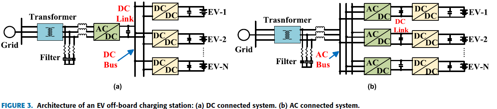
*Figure ********1**** Architecture of an EV off-board charging station: (a) DC connected system. (b) AC connected system.*

### 2.1.1 DC Bus Configuration

The DC bus architecture has emerged as a foundational design in modern electric vehicle (EV) charging infrastructure, celebrated for its exceptional efficiency, adaptability, and seamless integration with advanced energy systems. This design is built around two key power conversion stages:

**AC-DC Rectification**: Alternating current (AC) from the utility grid is converted into direct current (DC). This step prepares the energy for the DC-driven components of the system.
**DC-DC Conversion**: The DC voltage is regulated and adapted to meet the specific needs of individual charging points, ensuring optimized and stable power delivery to EV batteries.
One of the most significant advantages of the DC bus architecture lies in its ability to integrate directly with distributed energy resources (DERs), such as solar panels and wind turbines. These energy sources naturally produce DC power, which can be seamlessly connected to the system. By eliminating multiple AC-DC conversion stages, the architecture minimizes energy losses and enhances overall efficiency. The streamlined nature of the DC bus also simplifies infrastructure design by reducing the number of power conversion stages compared to AC bus systems, which leads to greater reliability and easier maintenance.

Moreover, the DC bus configuration excels in incorporating **energy storage systems (ESS)**, such as advanced batteries and supercapacitors. These systems provide critical functionality, including:

**Energy Buffering**: Maintaining power availability during grid fluctuations or outages.
**Peak Shaving**: Alleviating stress on the grid by balancing energy loads during peak demand periods.
**Grid Stabilization**: Mitigating issues like voltage sags and frequency deviations, ensuring stable operation.
These attributes make the DC bus particularly suitable for **regions with unstable grid conditions**. Its inherent scalability is another defining strength, allowing for the addition of more charging points or the expansion of power capacity as demand grows. This scalability is especially vital for ultra-fast charging applications, where high-power delivery is essential for modern EVs. Additionally, the centralized nature of the DC bus supports cost-effective backup systems, reduces redundancy, and streamlines maintenance, ultimately lowering overall operational costs.

However, the DC bus architecture is not without its challenges. A critical obstacle is the **high power**** rating required for the central converter**, which increases both system complexity and cost. Additionally, compliance with grid codes—particularly those governing **Total Harmonic Distortion (THD)**—requires sophisticated converter designs. Another significant challenge is the absence of a natural zero-crossing point in DC systems, complicating fault detection and isolation. Advanced protection mechanisms, such as fast-acting circuit breakers and fault current limiters, are essential to ensure safe and reliable operation. Finally, selecting the optimal DC voltage level is a delicate balance: while higher voltage levels minimize transmission losses, they demand robust insulation and protection systems, adding to design complexity.

Looking to the future, the DC bus architecture remains a pivotal component in the evolution of EV charging infrastructure, especially in ultra-fast charging hubs and systems integrated with renewable energy sources. Advances in power electronics, including silicon carbide (SiC) and gallium nitride (GaN) devices, are further improving the efficiency and cost-effectiveness of these systems. The rise of **bidirectional charging technologies**, which enable EVs to discharge energy back into the grid or support home systems, perfectly aligns with the capabilities of the DC bus. Together, these innovations are shaping a more sustainable and intelligent future for EV infrastructure.

### 2.1.2 AC Bus Configuration

The AC bus architecture represents an alternative and widely utilized approach in EV charging infrastructure, characterized by its reliance on alternating current (AC) for power distribution. Unlike the centralized design of DC bus systems, the AC bus employs a **decentralized power conversion strategy**, where each charging point contains its own:

**AC-DC Conversion Stage**: Converts AC from the utility grid into DC.
**DC-DC Conversion Stage**: Regulates the voltage for compatibility with EV batteries.
A defining feature of the AC bus system is its decentralized design. Each charging point operates independently, granting the system flexibility and ensuring uninterrupted operation. A **three-phase AC bus** is typically used for power distribution, enabling efficient load balancing across multiple charging points. Each charger functions autonomously, drawing the necessary power from the AC bus.

This decentralized nature offers several advantages:

**Reliability**: A fault at one charging point does not disrupt the rest of the system.
**Simplified Installation**: Direct connection to the utility grid reduces infrastructure complexity and initial costs.These benefits make the AC bus a practical choice for **smaller-scale or simpler charging stations**.
However, the decentralized approach introduces notable challenges. Each charging point requires its own AC-DC and DC-DC conversion units, along with the necessary control, firing, and filtering systems. This increases overall cost and complexity. Additionally, the presence of multiple AC-DC conversion stages can generate unwanted **harmonics**, negatively affecting power quality on the utility grid. Addressing these harmonics often requires **active or passive filters**, further escalating costs.

In terms of energy efficiency, the AC bus is less optimal than the DC bus. The cumulative losses from decentralized conversions become significant, particularly in high-power or large-scale installations. While the system is scalable in adding more charging points, this scalability often results in diminishing efficiency and rising operational costs.

Designing an efficient AC bus system requires attention to several key factors:

**Harmonic Mitigation**: Essential for maintaining grid compliance and power quality.
**Load Balancing**: Ensures stable operation across the three-phase bus.
**Scalability**: Thoughtful planning is needed to minimize inefficiencies in larger installations.
Although the AC bus remains relevant for specific applications, such as smaller charging stations or regions where DC systems are impractical, its use is increasingly supplemented by **hybrid configurations**. These hybrids combine the flexibility of the AC bus with the efficiency of centralized DC systems.

### 2.1.3 Comparison of AC and DC Bus Configurations

The **AC bus architecture** is a mature and reliable solution, supported by well-established standards and straightforward control techniques. Its decentralized nature makes it particularly suited for **stable, smaller-scale environments**, where independence is a priority. However, its complexity, higher costs, and challenges in integrating renewable energy sources limit its scalability and efficiency.

In contrast, the **DC bus architecture** excels in **efficiency and power density**, with its streamlined design enabling seamless integration of energy storage systems and renewable energy sources. Its centralized approach supports high scalability and reliability, making it ideal for **large-scale and ultra-fast charging applications**. Despite these strengths, it demands sophisticated converters and protection mechanisms, increasing technical complexity.

Understanding the trade-offs between these architectures is crucial for designing systems that align with operational goals, cost constraints, and sustainability objectives. The following table summarizes the key differences between AC and DC bus architectures:

## **Comparison of AC and DC Bus Architectures**

### ## **Category**

**## **AC Bus Architecture****: ## **DC Bus Architecture**

### ## **Integration of Energy Sources**

**Complex**: Easier

### ## **Number of Conversion Stages**

**Higher**: Lower

### ## **Efficiency**

**Lower**: Higher

### ## **Impacts from Utility Side**

**High**: Less

### ## **Rating of AC-DC Rectifier**

**Medium**: High

### ## **Protection Devices**

**Unsophisticated**: Sophisticated

### ## **Control**

**Complex**: Simple

### ## **Cost**

**More expensive**: Less expensive

*Table ********1**** Comparison of AC and DC bus Architecture*

Another critical consideration is the **power quality challenges** associated with EV charging infrastructure, which directly impact the stability and reliability of the electric grid.

Electric vehicles (EVs) pose significant challenges to power quality due to their dynamic charging rates and reliance on semiconductor-based devices. These effects include harmonic distortion, voltage unbalance, voltage drop, equipment overloading, phase imbalances, and disruptions to overall power system stability. The use of converters in EV charging systems exacerbates these issues, generating harmonics that can interfere with the operation of critical electrical components, such as distribution transformers, circuit breakers, fuses, and cables. Additionally, unbalanced load currents introduce negative sequence components, compromising the performance of converters and inducing second-order harmonic ripples in the DC link voltage. These ripples, in turn, create distortions in the grid’s input currents, further deteriorating power quality and posing substantial challenges for utility providers.

Power quality standards set up by different organizations should be followed to examine the electric vehicles’ fast charging stations. SAE, IEEE, IEC, American National Standard Institute (ANSI), British Standards (BS), Information Technology Industry Council (ITIC), Computer Business Equipment Manufacturing Association (CBEMA), and many other global societies frame the set standards to determine the power quality impacts. Essential standards to govern power quality are IEEE 519-1992, IEC 61000-3-12/2-4, and EN 50160:2000. IEEE 519-1992 (revised edition 2014) standard is a system guideline for setting limits on voltage and current distortion. There are certain prescribed limits for voltage and current Harmonics set by IEEE 514e1992 (revised 2014), which are followed by utilities, users, manufacturers. Substantial voltage and current limits are listed in Tables 3 and 4.

**Table 2**IEEE Standard 519-1992: Current distortion limits for general distribution systems (129-69000 V).

| Maximum harmonic current distortion (In percent if IL) |  |  |  |  |  |  |
| --- | --- | --- | --- | --- | --- | --- |
| Individual harmonic order (odd harmonics) |  |  |  |  |  |  |
| Isc/IL | h < 11 | 11≤h<17 | 17≤h<23 | 23≤h<35 | 35≤h | TDD (%) |
| < 20* | 4.0 | 2.0 | 1.5 | 0.6 | 0.3 | 5.0 |
| 20 to <50 | 7.0 | 3.5 | 2.5 | 1.0 | 0.5 | 8.0 |
| 50 to <100 | 10.0 | 4.5 | 4.0 | 1.5 | 0.7 | 12.0 |
| 100 to <1000 | 12.0 | 5.5 | 5.0 | 2.0 | 1.0 | 15.0 |
| > 1000 | 15.0 | 7.0 | 6.0 | 2.5 | 1.4 | 20.0 |

*Table ********2**** IEEE Standard 519-1992: Current distortion limits for general distribution systems*

*Even harmonics are limited to 25% of the odd harmonics above.**Current distortions that result in a DC offset, such as half-wave converters, are not allowed.*Isc= maximum short-circuit current at PCC and IL= maximum demand load current (fundamental frequency component) at PCC.

**Table 3**IEEE Standard 519-1992: Voltage distortion limits.

### Bus Voltage at PCC

**Individual voltage distortion (%)**: Total Voltage distortion (%)

### 69 kV and below

**3.0**: 
5.0

### 69.001 - 161 kV

**1.5**: 
2.5

### 161.001 kV and above

**1.0**: 
1.5

*Table ********3**** IEEE Standard 519-1992: Voltage distortion limits*

A comparative analysis between AC and DC bus architectures for EV charging stations is presented in the study by Sharma et al. [2], which serves as a foundational reference for this section. Their proposed configurations—each supporting 10 charging bays—are illustrated in Figures 2 and 3.

*Figure ********2**** DC Architecture with 10 bays*

*Figure ********3**** AC Architecture with 10 bays*

The key structural distinction between the two systems lies in the location and distribution of power conversion stages. In the AC bus architecture, each charging bay is equipped with an individual AC-DC converter. This design allows for decentralized power conversion, granting each bay operational independence and flexibility. The system uses a three-phase AC bus to ensure consistent and efficient power delivery across all bays.

To assess the performance of both configurations, Sharma et al. conducted simulations using MATLAB/Simulink®. Their analysis focused on evaluating the influence of each architecture on grid stability and power quality, providing insights into how different topologies affect the dynamic behavior of EV charging networks.

The performance of both architectures is analyzed using various key parameters, including:

**State of Charge (SOC)** of the battery during charging.
**DC bus link voltage** in the DC bus architecture.
**Voltage supplied to a single EV** in the case of the AC bus configuration.
**Sensor readings at the Point of Common Coupling (PCC)**.
In **Figure 4(a)**, the **State of Charge (SOC)** of the battery during charging with the **DC bus architecture** is illustrated. Starting from an initial SOC of 30%, the battery reaches 31.6% within 20 seconds, reflecting an increase of 1.6% during this period. If this charging rate were to remain constant, the battery could theoretically be fully charged from 0% to 100% in approximately **21 minutes**. However, for practical fast-charging scenarios, increasing the charging current is often employed to further reduce this time. In real-world applications, charging typically begins when the SOC is around 30% and continues until it reaches 90%. Under these conditions, the **Common DC Bus Architecture** achieves the required charge in approximately **13 minutes**, making it an efficient solution for fast charging.

The simulation outcome for the AC bus architecture, illustrated in Figure 4(b), shows that the battery's state of charge (SOC) remains nearly constant during the 20-second interval, increasing by only 0.01%. This extremely limited SOC progression suggests that the charging system is unable to deliver sufficient current to the battery within this timeframe. Rather than viewing this as a mere performance limitation, it reflects a fundamental mismatch between the system’s power delivery capability and the requirements of fast-charging. Without significant upgrades—such as increasing the power capacity of individual converters or optimizing the control strategy—the AC bus architecture proves inadequate for high-performance charging scenarios, particularly when rapid energy transfer is a design priority.

*Figure ********4**** (a) SOC of EV battery (DC arch.). (b) SOC of EV battery (AC arch.).*

**Figure 5(a)** illustrates the **DC bus link voltage** for a **Common DC Bus Fast Charging Station**. The DC bus voltage acts as a stable connection point between the grid and multiple EV batteries, playing a pivotal role in maintaining the efficiency of the charging station. The **Common DC Bus Architecture** simplifies power conversion by requiring only a single conversion stage, ensuring a consistent DC bus voltage across all connected EVs.

In contrast, **Figure 5(b)** shows the voltage supplied to a single EV in the **AC bus architecture**. This system operates with **separate Voltage Source Converters (VSCs)** for each EV, which supply power to their respective DC-DC converters. While both the DC and AC bus architectures use control strategies to manage voltages, the DC bus architecture exhibits significantly fewer fluctuations and maintains a voltage level closer to the reference value. This comparative stability underscores the **superior efficiency and reliability** of the DC system compared to its AC counterpart.

*Figure ********5**** (a) Common DC Bus Voltage (DC). (b) Voltage supplied to single EV (AC)*

**Figure 6(a)** illustrates the **phase-to-phase input voltage** at the Point of Common Coupling (PCC) for the DC architecture, while **Figure 6(b)** displays the corresponding voltage for the AC architecture. A comparative analysis of these waveforms reveals that **voltage distortions** are significantly more pronounced in the Common AC Bus (CACB) configuration, approximately **9–10% higher** than in the Common DC Bus (CDCB) setup. These distortions are influenced by factors such as the transformer configuration, the decentralized nature of the AC bus, and the cumulative effects of multiple conversion stages.

*Figure ********6**** (a) Input voltage (phase-to-phase) CDCB. (b) Input voltage (phase-to-phase) CACB*

Figures 7(a) and 7(b) compare the input current at the point of common coupling (PCC) for the DC and AC bus architectures. The AC configuration shows a significantly higher current draw—approximately 40–50% greater than the DC system—when supplying 10 EVs simultaneously. Additionally, the AC current waveform exhibits more distortion, while the DC system maintains a cleaner profile with lower harmonic content.

*Figure ********7**** Input Current (DC Arch.)  (b) Input Current (AC Arch.)*

These findings have important implications for system design. The increased current demand and waveform distortion in the AC architecture suggest higher losses, greater thermal stress on components, and a more complex impact on grid stability. In contrast, the DC configuration offers improved efficiency and better power quality, making it more suitable for high-capacity fast-charging stations. This comparison reinforces the rationale for adopting centralized DC bus architectures in future sections of this thesis, where scalability, efficiency, and grid compatibility are examined in greater depth

The analysis of AC and DC bus architectures highlights their unique strengths and challenges in the context of EV fast charging infrastructure. The AC bus architecture, with its decentralized design, is particularly suited for smaller-scale applications or regions where simplicity, flexibility, and operational independence are prioritized. However, its drawbacks, including higher harmonic distortion and energy losses, demand careful consideration. Effective mitigation strategies, such as advanced filtering and harmonic reduction techniques, are necessary to enhance its viability and maintain power quality.

In contrast, the DC bus architecture provides a centralized and efficient solution, making it well-suited for high-demand applications. Its ability to seamlessly integrate renewable energy sources and energy storage systems (ESS), along with its superior power quality and operational efficiency, positions it as a critical enabler for next-generation EV charging networks. Nonetheless, the DC bus system faces challenges, including higher protection requirements and the need for robust converter designs. These challenges can be addressed through ongoing advancements in power electronics and control methodologies.

## 2.2 AC-DC Conversion stage

Efficient and reliable **AC-DC rectifiers** are a main part of **electric vehicle (EV) fast-charging systems**, functioning as the crucial front-end power conversion stage. These rectifiers are tasked with meeting stringent operational requirements, including:

**Power Factor Correction (PFC)**: Ensuring minimal reactive power and maximum utilization of the grid.
**Low Total Harmonic Distortion (THD)**: Reducing distortions in current and voltage to maintain power quality.
**High Efficiency**: Minimizing energy losses to improve overall system performance.
**Compact Designs**: Enabling integration into fast-charging stations with high power density demands.
This section presents a detailed analysis of several **advanced rectifier topologies**, exploring their key features, challenges, and innovations. The discussion is supplemented with a **comparative summary** (Table 5) of experimentally validated AC-DC rectifiers, providing insights into their practical performance and suitability for deployment in modern EV charging stations.

### 2.2.1 Three-Phase Buck-Type Rectifier

The **three-phase buck-type rectifier (TPBR)** is a highly efficient and reliable choice for **AC-DC power conversion** in EV charging systems. It excels in delivering **power factor correction (PFC)**, **low total harmonic distortion (THD)**, **high efficiency**, and **high power density**, making it particularly well-suited for fast-charging applications. The design of the TPBR includes several inherent advantages:

**Inrush Current-Free Startup** – This feature arises from the use of controlled switching devices (e.g., IGBTs or MOSFETs) and pre-charging strategies that gradually energize the DC link capacitor, thereby avoiding sudden current surges at startup.
**Wide Output Voltage Control Range** – The buck-type topology allows for step-down voltage conversion with precise modulation of the duty cycle, enabling the output voltage to be dynamically adjusted over a broad range, depending on battery requirements.
**Phase-Leg Shoot-Through Protection** – The unidirectional current path and interlocking gate control in each phase leg prevent simultaneous conduction of both upper and lower switches, inherently avoiding shoot-through conditions common in bridge-based designs.
**Overcurrent Protection** – The TPBR’s control scheme typically includes current sensors and fast-switching control loops that monitor and limit the inductor current in real time, enabling rapid response to overcurrent conditions and enhancing system safety.
The conventional **six-switch TPBR** topology consists of three phase legs, each made up of two controllable switches, along with a single diode, as shown in Figure 8. This setup helps convert AC to DC efficiently using fewer components. The diode in this design is called a freewheeling diode because it gives the current a safe path to flow when the switches turn off. This is important because in systems with inductors, like this one, current doesn't stop immediately—it keeps moving for a short time due to the stored energy. Without a way to release this energy, voltage spikes could occur and damage the circuit. The freewheeling diode solves this by letting the current “coast” smoothly until it naturally dies down. This makes the system more stable and efficient, reduces stress on components, and contributes to the overall reliability of the charging station.

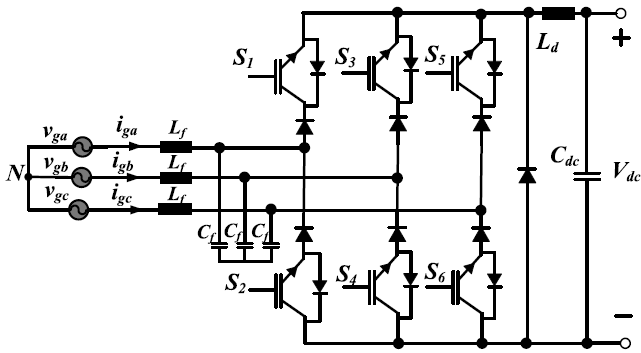
*Figure ********8**** Three-phase six switch buck type rectifier.*

Innovations in three-phase buck-type rectifiers (TPBRs) continue to enhance their performance, making them highly efficient and reliable for EV charging applications.

The eight-switch interleaved TPBR, is studied in **[4]**, significantly minimizes semiconductor losses during the freewheeling state. This design depicted in **Figure 1****0** achieves higher efficiency compared to traditional TPBR configurations, making it a better solution for high-performance applications.

*Figure ********9**** eight-switch interleaved TPBR*

Voltage stress on switches in high-power applications is a significant challenge. To address this issue, the configuration shown in **Figure 1****1** (as proposed in [5]) modifies the standard freewheeling path by introducing two diodes, DF1​ and DF2​, connected in series. This change reduces the voltage that appears across each switch during the off-state. Instead of withstanding the full DC output voltage, the switches are exposed only to the input phase voltage, which is significantly lower. This is possible because the freewheeling current is now guided through a split path, effectively limiting the peak voltage each switch must block. As a result, low-voltage, high-speed MOSFETs can be used in place of high-voltage devices, improving overall system efficiency and enabling a more compact design.

A similar approach is adopted in **Figure 1****2**, based on the method introduced in [6], where additional diodes DFP​ and DFN​ are combined with capacitors CP​ and CN​ to create a soft-clamping network. In this case, the capacitors absorb transient voltage spikes that occur during switching events, while the diodes steer the current through safer, predefined paths. This effectively suppresses voltage overshoot and protects the switches from stress-related damage. A balancing capacitor CMN​ is also added to maintain symmetry between the positive and negative voltage rails. Together, these elements reduce the electrical strain on the switches, enabling the use of low-resistance semiconductors and improving the rectifier’s power density and thermal performance—key advantages for fast-charging infrastructure.

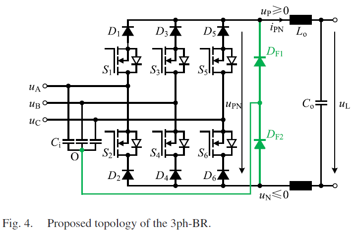
*Figure ********10***

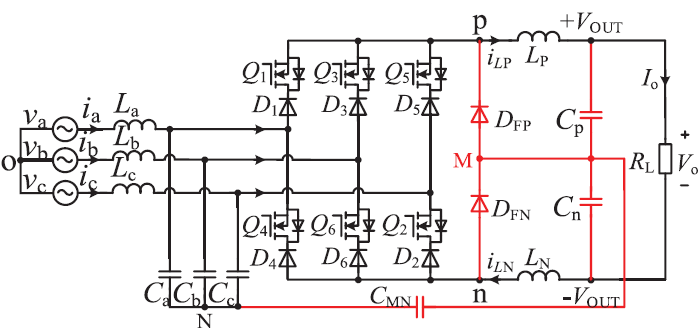
*Figure ********11***

### 2.2.2 Swiss Rectifier (SR)

The **Swiss Rectifier (SR) **Figure 13, a variation of the **Three-Phase Buck-Type Rectifier (TPBR)**, offers significant advancements in efficiency and power quality. By employing **eight switches**, the SR achieves:

**Higher Efficiency**: Reduced conduction and switching losses compared to six-switch TPBRs.
**Lower Common-Mode Noise**: Enhances power quality and minimizes electromagnetic interference.
**Simplified Control**: Its circuit structure supports simple control methods typical of DC-DC converters.

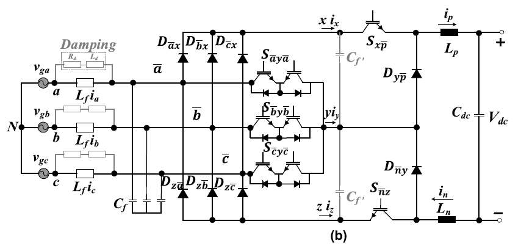
*Figure ********12**** Swiss Rectifier*

Furthermore, Interleaving Swiss Rectifiers (SRs) offers several functional advantages, particularly in reducing current and voltage ripple. This results smaller passive components, improved thermal performance, and enhanced reliability—features that align well with the demanding requirements of EV fast-charging systems. The topology examined in [7], illustrated in Figure 14, demonstrates these benefits by reaching 99.3% efficiency at 8 kW rated power. While this figure is specific to their implementation, it serves as a performance benchmark, showing what can be realistically achieved when advanced design features are incorporated. In this context, the high efficiency is not just an impressive number—it validates the potential of the interleaved SR approach as a competitive option in scenarios where minimizing energy loss and improving power density are primary design goals.

Key contributing factors to this performance include:

**Silicon Carbide (SiC) MOSFETs**: Chosen for their fast switching speed and low losses, making them well-suited for high-frequency, high-efficiency operation.
**Common-Mode Coupled Inductors**: These improve current balancing between interleaved phases and suppress noise, reducing EMI concerns and simplifying filtering.
Including this example highlights how specific design choices can unlock very high levels of efficiency—providing not just academic interest, but practical guidance for selecting suitable topologies in real-world fast-charging infrastructure.

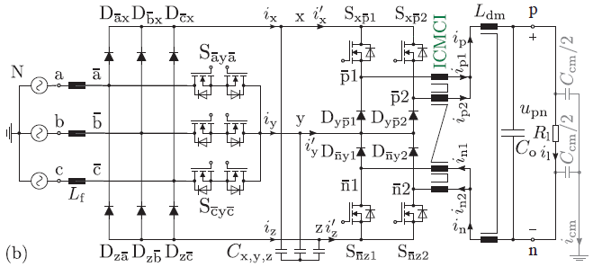
*Figure ********13**** Interleaved SWISS Rectifier using a novel four winding current compensated Integrated Common Mode Coupled Inductor*

For higher power operations, multilevel three-phase Swiss Rectifiers offer additional capabilities. According to [8], multilevel SR designs—denoted as SRI, SRII, and SRIII, figures 15(a-c)—utilize harmonic current injection circuits to achieve Power Factor Correction (PFC) and Controlled Output Voltage.

These designs share voltage ranges and stresses with conventional Current Source Rectifiers while modulating current injection at low frequencies to reduce conduction losses.

A **PWM control strategy** with feedback and feedforward loops ensures efficient operation across these designs. Simulation results highlight reduced injection current amplitudes and significantly lower conduction losses, particularly in five-level rectifiers compared to conventional systems.

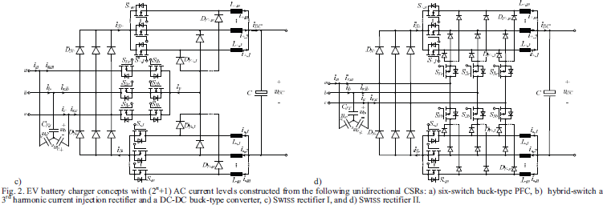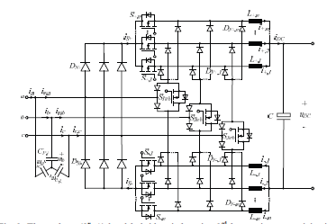
*Figure ********14**** : (a) SRI                                                         ** ** ** (**b) SRII                                                                **   (**c)SRIII*

Although the Swiss Rectifier is traditionally designed as a unidirectional converter, recent advancements have enabled bidirectional operation to support emerging Vehicle-to-Grid (V2G) applications. One such configuration, shown in Figure 16 and described in [9], demonstrates how this topology can be adapted for power flow in both directions without compromising efficiency. This is achieved through the integration of Active Third-Harmonic Current Injection, which effectively reduces harmonic distortion in the input current, contributing to improved grid compatibility. In addition, Dual DC-DC Converters facilitate controlled bidirectional energy transfer, enabling both charging and discharging functions in V2G scenarios.

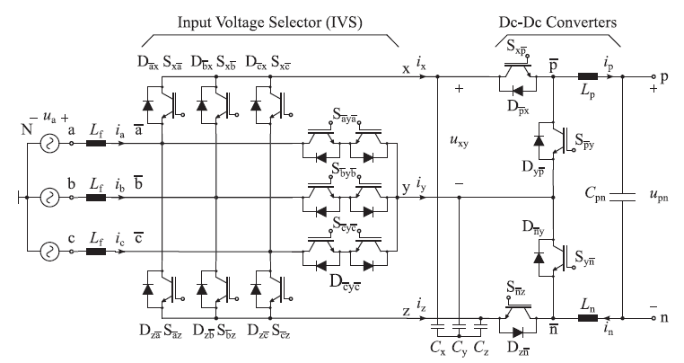
*Figure ********15**** Bidirectional Swiss Rectifier*

### 2.2.3 Vienna Rectifier (VR)

The Vienna Rectifier (VR), introduced by Johann W. Kolar in 1993 at TU Wien, is a prominent three-phase AC pulse-width modulation (PWM) rectifier topology. Renowned for its robust performance and unique operational characteristics, it is fundamentally a unidirectional, three-phase, three-level, three-switch PWM rectifier. This design is particularly well-suited for applications demanding high power quality and efficient AC-DC conversion, such as fast electric vehicle (EV) charging. The topology was illustrated in Figure 17.

A core advantage of the Vienna Rectifier lies in its three-level switching structure. This enables it to synthesize the output voltage from three distinct levels—positive, zero, and negative—relative to the DC-link midpoint. This is achieved by splitting the DC-link capacitor into two equal halves and referencing their midpoint to the AC source’s neutral point. As a result, each active switch experiences only half of the total DC-link voltage (Vdc/2), significantly reducing voltage stress on the power devices. This allows for the use of lower-rated, potentially faster, or more cost-effective power devices, such as silicon or silicon carbide (SiC) MOSFETs, and inherently leads to lower switching losses, improved overall efficiency, and enhanced thermal performance. The three-level operation also implies smaller voltage steps applied across the inductors, which inherently diminishes the rate of change of voltage (dV/dt) and minimizes electromagnetic interference (EMI). Compared to conventional active front-end rectifiers that typically use six active switches, the Vienna rectifier achieves comparable performance with a reduced number of active switches—specifically three —contributing to a simpler design and lower complexity.

The VR supports unidirectional power flow from the AC side to the DC side , aligning perfectly with applications like EV charging where power is consistently drawn from the grid to charge a vehicle. Its topology incorporates diodes that inherently block reverse current, ensuring energy cannot flow back into the grid. This unidirectional nature simplifies the control strategy, eliminating the need for complex bidirectional control algorithms and additional hardware. Furthermore, the Vienna rectifier excels in power quality. By employing advanced Pulse-Width Modulation (PWM) control and operating in Continuous Conduction Mode (CCM) , it draws nearly sinusoidal input currents, yielding low Total Harmonic Distortion (THD) and enabling near-unity power factor operation. The integrated power factor correction (PFC) actively aligns the input current phase with the input voltage, reducing reactive power and enhancing grid compliance.

A particularly notable feature of the Vienna Rectifier is its ability to operate without requiring dead-time between complementary switching events. This is made possible by its topology, which eliminates direct shoot-through paths. Unlike conventional two-level converters—where upper and lower switches on the same leg can inadvertently conduct simultaneously and create a short circuit—the VR uses unipolar switching, meaning such overlapping conduction is structurally impossible. Consequently, no artificial delays are needed between switching transitions, simplifying gate control and further reducing switching losses. This design also enables higher switching frequencies, which contribute to improved power density and smaller passive components. The rectifier also exhibits ohmic mains behavior and reliable performance even under heavily unbalanced mains voltages or during mains failures.

Due to these compelling advantages, Vienna rectifiers are widely utilized in a diverse range of high-power applications, including electric vehicle (EV) DC fast chargers, telecom rectifiers, uninterruptible power supplies (UPS), input stages of AC-drive converter systems, industrial power supplies, active power filters, battery energy storage systems (BESS), and data centers. Their ability to provide clean, stable DC power makes them an indispensable component in modern power electronics.

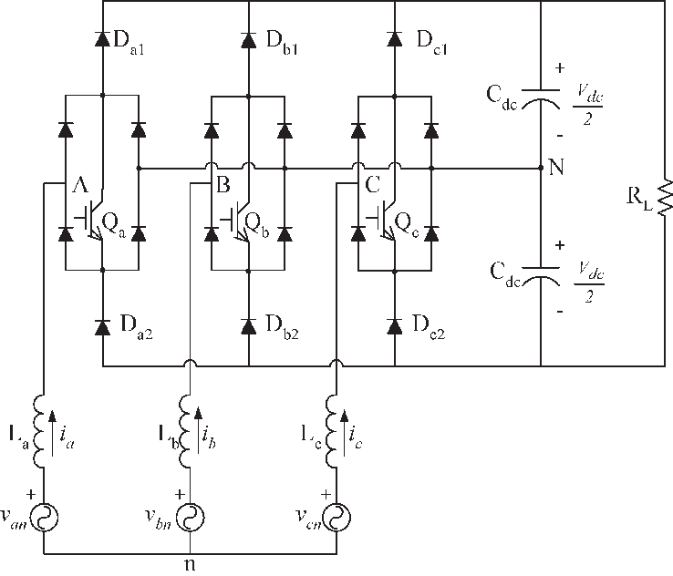
*Figure ********16**** Vienna Rectifier*

For applications requiring **Vehicle-to-Grid (V2G) operation**, a **bidirectional Vienna Rectifier topology** replaces the rectifier diodes with switches, enabling power flow in both directions, as shown in **Figure ****18**.

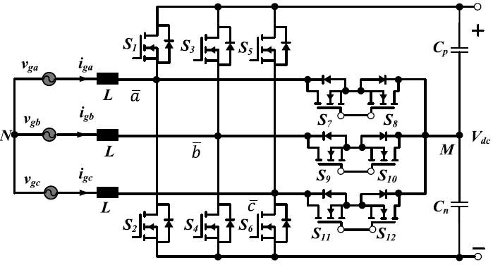
*Figure ********17**** Bidirectional Vienna Rectifier*

### Three-Phase Boost-Type Rectifier (TPSSBR)

The **three-phase boost rectifier (TPSSBR)** is a highly efficient AC-DC converter designed for EV charging systems. It offers several key advantages, including: Continuous Input Current, Bidirectional Operation and Low Total Harmonic Distortion

The TPSSBR’s circuit design includes **Three Inductors** Connected in series with the AC input for power conditioning. And **Six Switches**: Arranged in three legs to facilitate controlled power conversion, as depicted in **Figure ****19**.

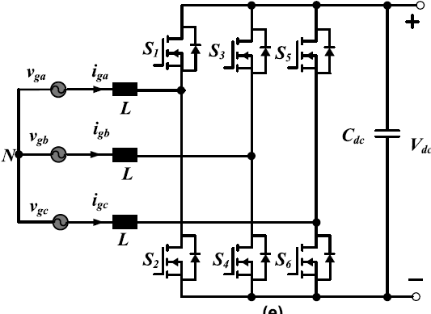
*Figure ********18**** three-phase boost rectifier (TPSSBR)*

### Multilevel AC-DC Converters

Multilevel Converters (MLCs) have gained increasing attention in high-power AC-DC conversion, particularly in the context of fast and ultra-fast EV charging systems. Compared to conventional two-level converters, MLCs offer several performance advantages that make them well-suited for high-efficiency, high-density charging infrastructure.

MLCs improve power conversion by generating output waveforms from multiple voltage levels, typically using a combination of lower-voltage DC sources. This multilevel approach reduces the total harmonic distortion of the output waveform, which improves grid compliance and minimizes the need for bulky filters. Moreover, the distributed voltage handling across switches results in significantly lower voltage stress per device, thereby enhancing the lifespan, thermal performance, and reliability of the power semiconductors. Additionally, smoother voltage transitions inherent in multilevel modulation schemes reduce electromagnetic interference (EMI), which is particularly valuable in densely packed, high-power environments. Finally, the staircase-like output waveform produced by multilevel pulse width modulation (PWM) decreases the required size and complexity of magnetic components, contributing to a more compact and efficient system design.

This section focuses on three representative multilevel converter topologies commonly used in EV charging infrastructure:

## **Cascaded H-Bridge (CHB)**

## **Flying Capacitor (FC)**

## **Neutral Point Clamped (NPC)**

Each topology presents unique design features and trade-offs, allowing system designers to select the most appropriate architecture based on specific application requirements such as voltage level, power rating, and control complexity.

#### 2.2.5.1 Cascaded H-Bridge Multilevel Converter (CHB)

The **Cascaded H-Bridge (CHB)** topology is a modular and scalable architecture. Its design offers exceptional **fault tolerance**, making it a preferred choice for demanding energy conversion tasks.

Each module (or submodule) in a CHB converter consists of a **full H-bridge** and **Associated capacitors** for energy storage and regulation. As shown in **Figure 25**, multiple modules can be connected in series or parallel. This configuration first of all enables **Voltage Balancing** which Ensures stable operation across all modules. While **Redundancy** Allows continued operation by isolating faulty cells which also Enhances system reliability by preventing single-point failures.

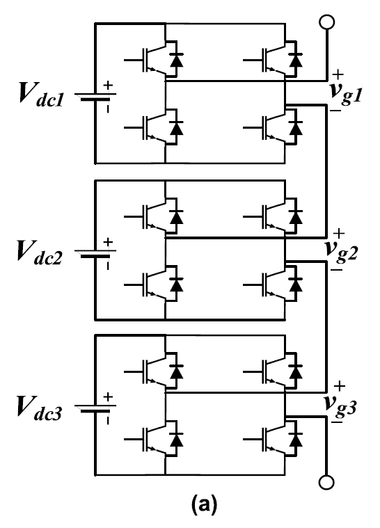
*Figure ********19**** Cascaded H-bridge (CHB) rectifier.*

Reliability is a critical concern for CHB converters. Component failures in **MLCs** can disrupt operation, requiring effective fault management strategies. To address these challenges, **Fault Detection and Bypass Mechanisms** Ensure the system can isolate faulty cells and continue operating without interruption. Also adding a **Pre-Charging Floating Capacitors** prevents **inrush current** during startup although it requires careful design of protection and control systems.

The CHB topology’s adaptability, combined with its robust fault tolerance and scalability, makes it an indispensable solution for **modern EV fast-charging applications**. However, its complexity in modulation and protection design necessitates advanced engineering to optimize performance and reliability.

#### 2.2.5.2 Flying Capacitor Multilevel Converter (FCMLC)

The Flying Capacitor Multilevel Converter (FCMLC) addresses a key limitation observed in many MLC designs: the presence of voltage ripple at the fundamental frequency on the AC side. This ripple arises due to uneven energy exchange between submodules and the grid during each AC cycle, particularly when operating at lower switching frequencies. To maintain voltage stability under these conditions, conventional MLCs require large energy storage in their submodule capacitors, which increases the overall volume, cost, and complexity of the system.

The FCMLC mitigates this issue by employing a higher switching frequency. Increased switching frequency allows the converter to regulate and balance voltages more frequently within each grid cycle, thereby smoothing out fluctuations and reducing the amplitude of voltage ripple. As a result, the required energy storage in each capacitor can be significantly reduced, leading to smaller capacitors and, consequently, a more compact converter design. This architectural advantage makes FCMLC a more efficient and space-saving alternative, particularly in fast-charging applications where volume constraints and thermal performance are critical.

The seven-level FCMLC, detailed in [12],is combined with unfolder stages, and it is highly effective for rectification applications in EV charging infrastructure.

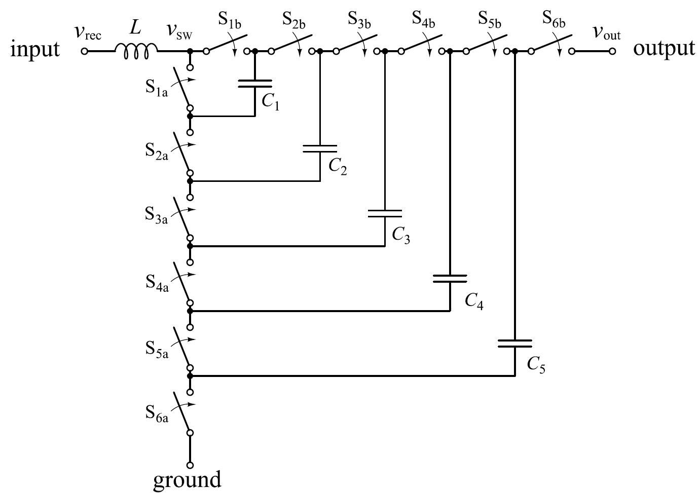
*Figure ********20**** Seven- level FCMLC*

Studies have demonstrated advanced configurations of FCMLCs, showcasing their adaptability and performance improvements. Seven-Level FCMLC Presented in [12], highlights the FCMLC's potential to deliver high efficiency while minimizing the need for bulky capacitors. Additionally, Three-Phase FCMLC As shown in Figure 27 and discussed in [13], connects each input phase to a six-level FCMLC.

One notable advantage of FCMLCs is their moderate PWM modulator requirements. Operating at high switching node frequencies increases PWM resolution without requiring proportionally higher switching frequencies, which can reduce losses and improve overall system reliability.

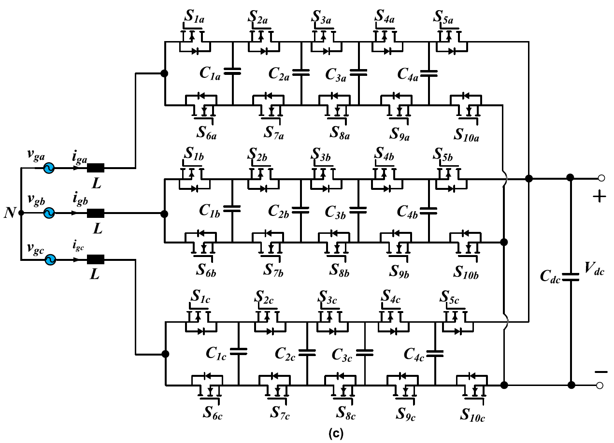
*Figure ********21**** Three Phase FCMLC*

#### Neutral Point Clamped (NPC) Topology

The **Neutral Point Clamped (NPC) topology** is a widely adopted configuration for **medium-voltage applications**, known for its ability to **Reduce Output Voltage Distortion**, **Minim****um**** Voltage Stress on Switches** and the fact that can **Achieve Low Total Harmonic Distortion****.**

A **three-phase three-level NPC converter**, as illustrated in **Figure**** 23,** divides the **DC-link voltage** evenly across switches, effectively blocking half of the total voltage. This design reduces switching losses while improving efficiency, particularly with **faster switching**.

NPC converters are particularly advantageous in **EV fast-charging stations** with **bipolar DC bus configurations**.

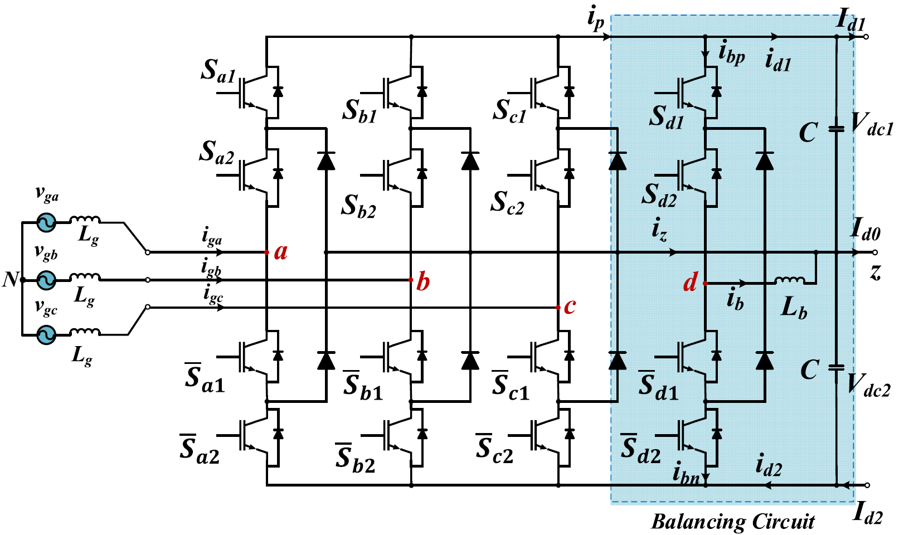
*Figure ********22**** Three-phase neutral point clamped (NPC) rectifier with voltage balancing circuit in bipolar dc bus structure.*

### 2.2.6 Comparison of AC-DC Converters for EV Charging Applications

AC-DC converters play a vital role in the performance and reliability of EV fast-charging systems. Their ability to handle high power efficiently, maintain grid compliance, and provide scalability is crucial for meeting the demands of modern charging infrastructure. Among the four prominent unidirectional topologies—Three-Phase Buck-Type Rectifier (TPBR), Swiss Rectifier (SR), Vienna Rectifier (VR), and Three-Phase Boost-Type Rectifier (TPSSBR)—the Vienna Rectifier emerges as the most practical choice for unidirectional EV fast-charging applications. Below is a detailed comparison of these converters across critical parameters, providing a rationale for the selection of the Vienna Rectifier.

## **Comparison Table**

| ## **Parameter** | ## **TPBR** | ## **SR** | ## **VR** | ## **TPSSBR** | ## **CHB** | ## **FCMLC** | ## **NPC** |
| --- | --- | --- | --- | --- | --- | --- | --- |
| ## **Topology Complexity** | Simple | High | Moderate | Moderate | High | Moderate | Moderate |
| ## **Efficiency** | ~97-98% | 99%+ | 99%+ | ~97% | High | High | High |
| ## **Harmonic Distortion** | Moderate | Low | Low | High | Low | Low | Low |
| ## **Power Density** | Moderate | High | High | Moderate | High | High | Moderate-High |
| ## **Scalability** | Limited | High | Good | Moderate | High | High | Moderate |
| ## **Cost and Complexity** | Low | High | Moderate | Higher | High | Moderate-High | Moderate |
| ## **Suitability for EVs** | Limited | Overkill | Optimal | Moderate | Excellent | Suitable | Suitable |

## 2.3 DC to DC Conversion stage

In the field of **EV technology**, **DC-DC converters** play a critical role in enabling efficient power transfer and effective energy management within charging systems. These converters serve as the crucial link between the varying voltage levels of energy sources, such as the grid or renewable energy systems, and the specific requirements of EV batteries. By providing precise voltage and current adjustments, DC-DC converters ensure **optimal charging performance**, enhancing system reliability and battery longevity.

The diverse range of **DC-DC converter topologies** is designed to address specific demands in EV charging, including high efficiency, compact power density, bidirectional operation, and adaptability to a wide range of voltage levels. Each topology comes with its own set of advantages and challenges, making their selection critical to meeting the specific needs of modern EV charging infrastructure.

This section explores some of the most widely used and advanced DC-DC converter topologies in EV charging systems, focusing on their operational principles, design complexities, and applications. Notable topologies include the **LLC resonant converter**, **Dual Active Bridge (DAB) converter**, and **non-isolated configurations**. By examining these designs in detail, the discussion highlights how they address key challenges such as **minimizing energy losses**, achieving precise **voltage regulation**, and ensuring scalability for high-power charging stations.

### 2.3.1 LLC RESONANT CONVERTER

The **LLC resonant converter**, as shown in **Figure 31**, has gained widespread adoption as a **DC-DC power stage** in EV charging systems due to its numerous advantages over other resonant topologies. Key benefits of the LLC converter include its **output voltage regulation capability at light loads**, **zero-voltage switching (ZVS)** over a wide voltage range, and **zero-current switching (ZCS)** for rectifier diodes, which significantly reduces diode recovery losses. Additionally, the design requires only a single capacitor as an output filter, further simplifying implementation. Voltage regulation in the LLC converter is achieved by varying the switching frequency, with the converter gain determined by the **resonant tank gain**, **switching bridge gain**, and **transformer turns ratio**.

### ****

*Figure ********23**** LLC resonant converter.*

### 2.3.2 DUAL ACTIVE BRIDGE CONVERTER

The **Dual Active Bridge (DAB)** topology is a versatile and efficient DC-DC converter widely used in EV charging systems. Its structure consists of **active switches** on both the primary and secondary sides of a **high-frequency transformer**, as shown in **Figure 6(b)**. The DAB converter is valued for its **high efficiency**, **power density**, **bidirectional power flow**, **soft switching**, and **galvanic isolation**, making it well-suited for high-performance applications. Its modular design allows for seamless scalability to meet higher power requirements.

### ****

*Figure ********24**** Dual Active Bridge (DAB) Converter*

### 2.3.3 DUAL ACTIVE BRIDGE RESONANT CONVERTER

Incorporating a **resonant tank** between the two bridges of the Dual Active Bridge (DAB) converter extends the **Zero-Voltage Switching (ZVS)** range during battery charging, enhancing overall efficiency and reducing losses. Various resonant tank configurations, such as **CLC**, **LLL**, **CLLC**, **LC**, and **LCL**, have been explored in the literature for this purpose.

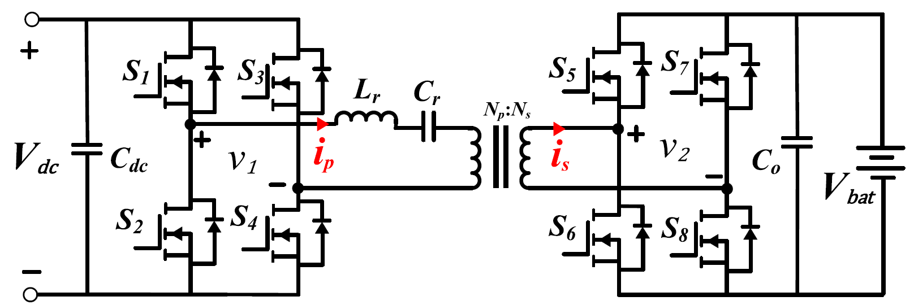
*Figure ********25**** Dual active bridge series resonant (LC) converter*

#### 2.3.3.1 Series LC Network

The DAB converter with a **series LC network**, as shown in **Figure ****26**, is a widely preferred design due to its low resonant component count. In this topology, the leakage inductance of the transformer is utilized as a series inductor, while an additional capacitor provides **DC blocking capability**.

#### 2.3.3.2 LCL and CLC Resonant Tanks

Schematics of DAB converters with **LCL** and **CLC resonant tanks** are illustrated in **Figures ****27** and **28**, respectively. These designs produce nearly sinusoidal bridge currents that are either in phase (or anti-phase for reverse operation) with their respective voltages, reducing **reactive power** and significantly improving efficiency.

The **CLC resonant tank** offers higher **power density** by utilizing the magnetizing inductance of the transformer as part of the resonant circuit. Its **series capacitor** prevents transformer core saturation during abnormal operating conditions. Although both LCL and CLC structures extend the soft-switching range and reduce conduction losses compared to conventional DAB converters, achieving **complete soft switching** across a wide range of battery voltages remains a challenge.

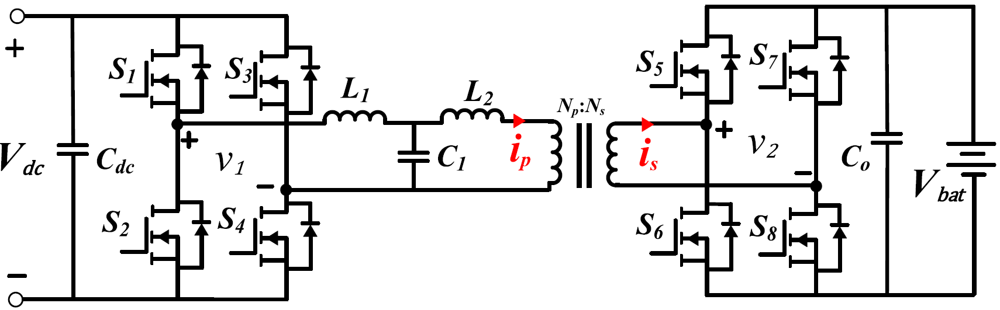
*Figure ********26**** Dual active bridge converter with LCL resonant tank.*

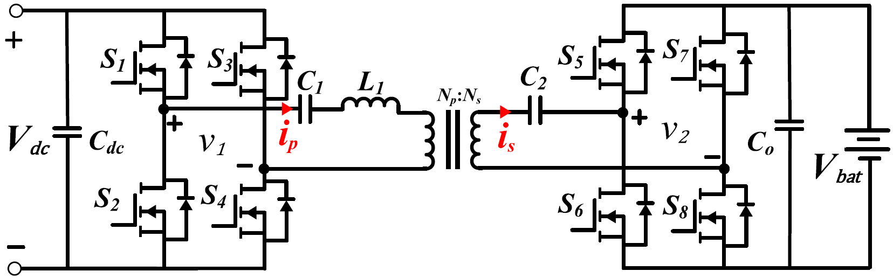
*Figure ********27**** Dual active bridge converter with CLC resonant tank.*

### 2.3.4 PHASE-SHIFTED FULL-BRIDGE (PSFB) CONVERTER

The **Phase-Shifted Full-Bridge (PSFB) converter**, illustrated in **Figure 46**, is a member of the DAB converter family, with its primary distinction being the use of **diodes on the secondary side** instead of active switches. This configuration allows **unidirectional power flow**, making it a suitable choice for specific EV charging applications. The PSFB converter is valued for its **soft-switching capability** for primary active switches, **simple PWM control** with fixed frequency, **modular design**, **reduced current stress** on devices, and **low electromagnetic interference (EMI)**.

### ****

*Figure ********28**** Phase-Shifted Full-Bridge (PSFB) converter.*

In the PSFB topology, power flow is governed by the **phase variation** between the switches on the primary side. This enables **Zero-Voltage Switching (ZVS)** turn-on for one leg of the primary bridge and **low-voltage turn-on** for the other leg. However, the diodes on the secondary side undergo **hard switching**, which can lead to losses under certain conditions. The absence of ZVS on the primary side becomes a challenge when operating under **low battery current**, as observed in **light load conditions** in EV charging applications.

Despite its advantages, the PSFB converter faces several other challenges like **Circulating Current Losses**, **Large Output Inductor**, **Voltage Overshoot** and **Reverse Recovery Losses**

### 2.3.5 Non-Isolated DC-DC Converter

**Non-isolated DC-DC converters** are well-suited for EV charging stations where a **line-frequency transformer** is used before the AC-DC power stage. In fast-charging applications, the input voltage to the DC-DC converter is typically higher than the EV battery voltage, requiring efficient step-down conversion. While a **single-phase buck converter** could theoretically fulfil this role, it faces two significant challenges. First, maintaining low current ripple in the DC-DC power stage is essential to minimize charging/discharging losses and prevent battery aging. Achieving this requires a sufficiently large inductor, which reduces **power density**. Second, the power rating of a conventional buck converter is limited, as a single switch must carry the total current.

Below we study some of the commonly used non isolated dc to dc converters:

#### 2.3.5.1 interleaved buck converters

**interleaved buck converters (IBCs)** with multiple inductors reduce current ripple, enable smaller inductor volumes, provide modularity, and improve thermal and power management. However, in conventional IBC designs, all switches experience voltage stress equal to the input voltage, resulting in high **switching losses** and **diode recovery losses** in high-voltage fast-charging applications.

A **non-isolated interleaved two-phase buck converter**, as shown in **Figure ****30**, addresses these issues by reducing switching losses and voltage stress on the switches while minimizing current ripple and improving the step-down conversion ratio.

Additionally, a **three-phase interleaved DC-DC buck converter**, depicted in **Figure ****3****1**, has been implemented in systems like the **ABB Terra HP150 ultra-fast chargers**. This modular design supports high power levels (up to **150 kW**) while offering low-cost construction and balanced power sharing across phases. It’s extremely low output current ripple surpasses that of other IBC designs. However, as the number of interleaved phases increases, maintaining consistent phase characteristics becomes challenging due to variations in component tolerances and duty cycle fluctuations.

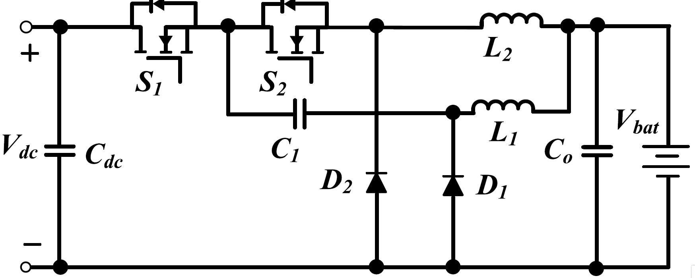
*Figure ********29**** Interleaved two-phase buck converter.*

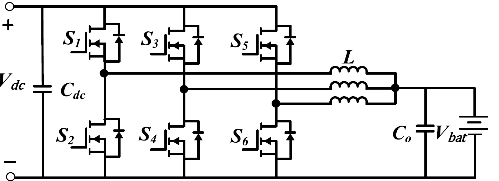
*Figure ********30**** Interleaved three-phase buck converter used in ABB terra HP150 ultra-fast charger.*

For applications requiring higher power density, **discontinuous conduction mode (DCM)** can be used in buck converters. This mode allows for smaller inductors, enhancing power density, but introduces drawbacks such as **high ripple currents** and increased **switching losses**.

Another approach involves the use of a **non-isolated three-level ****buck**** converter**, which enables the use of lower-rated switches and higher-frequency operation. This topology, depicted in **Figure ****3****2**, reduces costs and component volume while significantly lowering output and inductor current ripples compared to conventional IBCs and buck/boost converters. The **bidirectional three-level asymmetrical voltage converter** operates similarly to IBCs but employs an advanced control method. A single controller operating at one frequency produces a coupling filter frequency that is double the switching frequency, effectively minimizing current ripple compared to half-bridge structures.

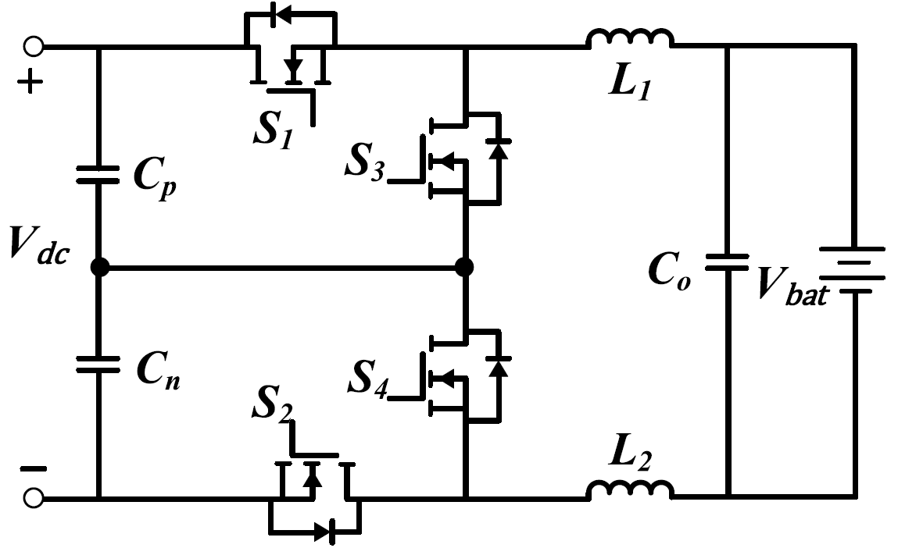
*Figure ********31**** Three-level buck converter.*

#### 2.3.5.2 Parallel Three-Level Converters

For further enhancements, a new circuit structure comprising **two parallel three-level converters**, shown in **Figure**** ****3****3**, has been developed. This topology is compatible with **bipolar DC bus structures** and eliminates the need for balancing circuits in NPC AC-DC converters through an **active DC power management algorithm**. However, challenges such as **high DC-link voltage ripple** and circulating currents arise, particularly when multiple fast chargers operate simultaneously, necessitating advanced control strategies for stable operation.

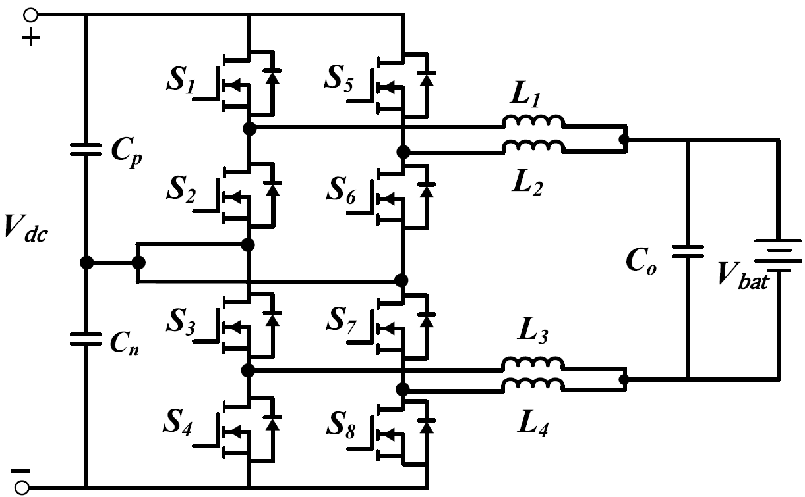
*Figure ********32**** Parallel three-level buck converter.*

Below is the comparative table to summarize the DC-DC converters:

| Specification | LLC Resonant Converter | Dual Active Bridge (DAB) | Resonant DAB (e.g., CLLC-DAB) | Phase-Shifted Full-Bridge (PSFB) | Interleaved Buck Converter | Three-Level Buck Converter | Parallel Three-Level Converter |
| --- | --- | --- | --- | --- | --- | --- | --- |
| Efficiency (%) | 94–97% | 96–98% | >98% | 92–95% | 95–97% | 96–98% | 96–98.5% |
| Typical Power Range (kW) | 3.3–22 | 10–350+ | 60–500+ | 5–50 | Up to 150 | 100–350 | 300–800+ |
| Voltage Conversion Ratio | Fixed | Variable | Wide | Moderate | Buck | Buck | Buck |
| Output Ripple | Very Low | Moderate | Very Low | Moderate | Very Low | Very Low | Very Low |
| Galvanic Isolation | Yes | Yes | Yes | Yes | No | No | No |
| Control Complexity | Moderate | High | Very High | Moderate | Moderate | High | Very High |
| Semiconductor Stress | Low | High | Moderate | Moderate | Moderate | Low | Low |
| Cost (Relative) | Low | Moderate-High | High | Low-Moderate | Low-Moderate | Moderate | High |
| Suitability for EV DCFCS | Limited | Excellent | Optimal | Moderate | Good | Very Good | Excellent |

# Chapter 3: Current Industry Practices and Technology Landscape

## 3.1 Introduction

This chapter examines the current technological and industrial landscape of EV charging infrastructure, focusing on the systems, standards, and strategies driving real-world implementation. Key topics include global charging protocols, connector types, power levels, and the design of station architectures across various deployment contexts.

It also reviews the role of power electronics in enabling efficient energy transfer, with emphasis on converter topologies, control strategies, and integration with energy storage and renewable sources. The chapter further explores how commercial charging networks are deployed in practice, shaped by public-private partnerships, policy incentives, and regional regulations.

A comparative overview of leading markets—North America, Europe, China, and selected emerging economies—is provided to highlight differences in deployment models, technological adoption, and regulatory approaches. This sets the foundation for the analytical and design-oriented work presented in subsequent chapters.

## 3.2 Charging Standards and Communication Protocols

Charging infrastructure worldwide adheres to a range of standards that define not only the physical and electrical interfaces of connectors but also the communication protocols that enable secure and reliable interaction between the electric vehicle (EV) and the charging equipment. These standards are essential for ensuring interoperability between EVs and chargers from different manufacturers, providing consistent user experiences, and enabling seamless operation across borders.

Charging standards are established and maintained by a combination of international bodies (such as the IEC and ISO), regional regulatory agencies, and industry consortia. They cover various technical layers, including plug geometry, electrical characteristics (voltage, current, frequency), safety features, and software-based communication. As EV adoption becomes more global and diverse, harmonization of these standards is increasingly important.

### 3.2.1 Global Overview of Charging Standards

The most widely adopted charging standards include:

**Combined Charging System (CCS)**: Developed as a joint effort between European and North American automotive industries, CCS integrates AC and DC charging into a single connector. CCS1 is used in North America (paired with the Type 1 plug), while CCS2 is dominant in Europe (with the Type 2 plug). It supports charging powers up to 350 kW and is designed to accommodate future scalability.
**CHAdeMO**: Originating in Japan, CHAdeMO is one of the earliest DC fast-charging standards. It allows for bidirectional power flow, making it compatible with vehicle-to-grid (V2G) applications. While it has been widely used in Japan and among Japanese automakers, its global influence is declining due to the rising adoption of CCS.
**GB/T**: China’s national standard for EV charging. It features separate connector designs for AC and DC charging. The DC variant supports up to 250 kW and is being replaced gradually by the ChaoJi protocol, which aims to unify charging across Asian and Western markets.
These standards not only define the hardware interface but also establish communication protocols necessary for authentication, billing, safety monitoring, and charge negotiation between the EV and the station.

### 3.2.2 Smart Charging and ISO 15118

The evolution of EV charging is increasingly tied to smart charging capabilities—features that allow dynamic communication between the vehicle, charging station, and grid. At the heart of these capabilities lies the ISO 15118 standard, which provides a digital communication interface between EVs and charging equipment.

ISO 15118 enables a range of functionalities including:

**Plug & Charge**: This feature allows automatic authentication and billing without the need for RFID cards, mobile apps, or credit cards. When a compatible vehicle is plugged into a certified charging station, a secure digital handshake occurs that identifies the vehicle and initiates the session.
**Load Management**: Vehicles and chargers can negotiate charging parameters in real-time, taking into account grid conditions, electricity pricing, and user preferences.
**Vehicle-to-Grid (V2G)** Readiness: The protocol supports bidirectional power flow, enabling the EV to discharge stored energy back into the grid when needed, thereby contributing to grid stability and energy balancing.
Major automakers such as Volkswagen, Hyundai, and Ford have begun integrating ISO 15118 into their EV platforms. Likewise, networks such as Ionity and Electrify America are actively deploying chargers capable of Plug & Charge operations.

Despite its potential, ISO 15118 adoption still faces hurdles, including cybersecurity concerns, inconsistent implementation across networks, and legacy system compatibility. However, its role in enabling fully autonomous, user-friendly, and grid-responsive EV charging ecosystems is expected to grow significantly in the coming years. enable smart charging features and support for future technologies like Plug & Charge and V2G.

### 3.2.3 Regional Adoption of Charging Standards

The implementation of charging standards varies significantly across regions due to differences in policy mandates, vehicle imports, energy infrastructure, and market maturity. Understanding how different markets have adopted and localized global standards provides insight into both current industry practices and barriers to interoperability.

**Europe**: The European Union has adopted CCS Type 2 as the mandatory standard for all new DC fast-charging installations since 2017. This regulation ensures a high level of interoperability and encourages automakers and charging station providers to conform to a unified platform. European directives such as the Alternative Fuels Infrastructure Regulation (AFIR) further enforce minimum charger availability along the Trans-European Transport Network (TEN-T).
**North America**: The United States and Canada primarily use CCS Type 1 and Tesla’s proprietary connector, though the North American Charging Standard (NACS), developed by Tesla, is increasingly being adopted by other automakers. While CHAdeMO remains available in many charging stations, its relevance is declining.
**China**: China has deployed more public chargers than any other country, supported by strong national policies and subsidies. The GB/T standard is mandatory for all chargers in the country. However, China is collaborating with Japan on the ChaoJi protocol, which aims to merge CHAdeMO and GB/T into a universal DC charging solution with higher power capability.
**Japan**: Japan continues to promote CHAdeMO as a national standard, although some automakers are beginning to include CCS support for global export vehicles. Domestic infrastructure still relies heavily on CHAdeMO-compatible hardware.
These regional variations highlight the complexity of deploying globally compatible infrastructure. They also reflect the influence of regulatory frameworks and industrial policy in shaping the evolution of EV charging standards.

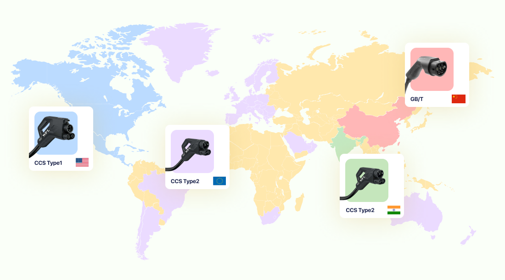
## 3.3 Connector Types and Power Levels

The physical connector is a critical component in electric vehicle (EV) charging systems, serving as the interface between the charging station and the vehicle. The connector determines not only mechanical compatibility but also the electrical parameters and communication protocols involved in the charging process. Moreover, connector design plays a crucial role in ensuring safety, reliability, user convenience, and compliance with regional standards.

### 3.3.1 Types of Connectors by Region and Standard

EV connectors vary by region due to differences in vehicle design, national standards, and electrical infrastructure. Key connector types include:

**Type 1 (SAE J1772)**: Predominantly used in North America and Japan for single-phase AC charging. It supports up to 19.2 kW and is common in residential and workplace settings.
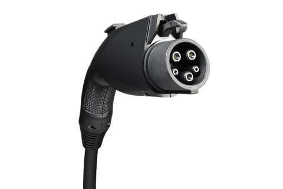
**Type 2 (****Mennekes****)**: Standardized in Europe and used for both AC and DC charging when combined with CCS2. It supports three-phase AC and can deliver up to 43 kW in AC mode. Type 2’s compatibility with CCS2 makes it the default connector for most new vehicles and charging stations in the EU.
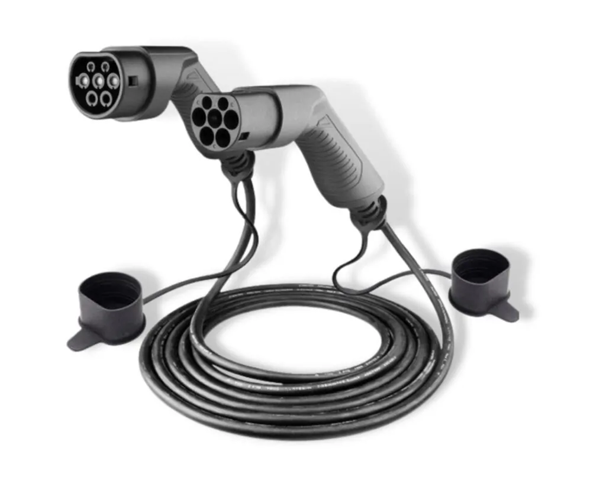
**CHAdeMO**: Developed in Japan for DC fast charging, capable of delivering up to 62.5 kW (and theoretically up to 400 kW in later versions). Known for supporting bidirectional power flow (V2G), but its global relevance is diminishing due to CCS dominance.
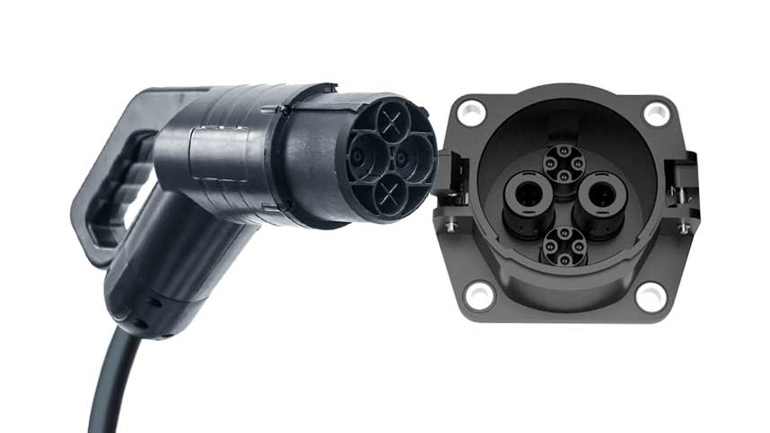
**CCS (Combined Charging System)**: Combines AC and DC charging in a single port. CCS1 is used in North America (based on Type 1), and CCS2 in Europe (based on Type 2). It supports DC fast charging up to 350 kW, and is now considered the global standard for new public fast-charging infrastructure.
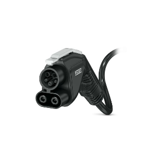
**GB/T**: China’s standard for both AC and DC charging. Unlike CCS, AC and DC interfaces are separated. DC GB/T supports up to 250 kW, and a future upgrade (ChaoJi) is expected to unify it with global standards.

**Tesla Connector (North America)**: A proprietary connector used for both AC and DC charging, recently rebranded as the North American Charging Standard (NACS). It is compact and widely used in Tesla’s Supercharger network. Major automakers are beginning to adopt NACS via adapters or dual-port solutions.
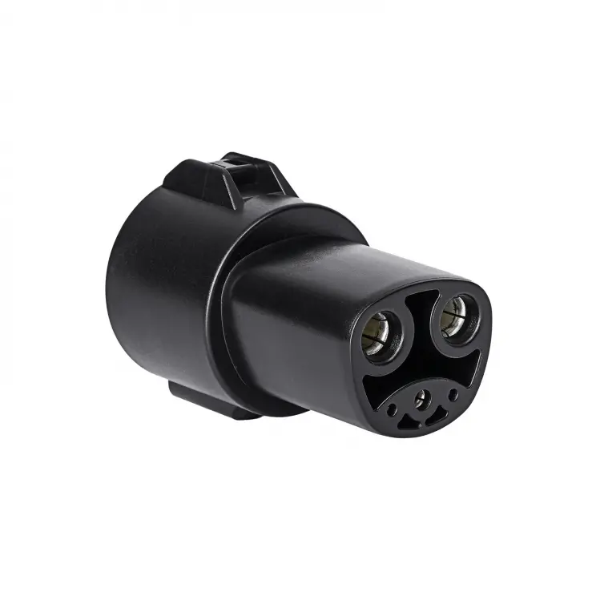

### ****

### 3.3.2 Connector Capabilities and Practical Use

Different connectors are associated with varying capabilities, both in terms of power delivery and intended use cases:

**Residential charging**: Type 1 and Type 2 AC connectors are standard due to lower power needs and widespread household grid compatibility.
**Public AC charging**: Type 2 dominates in Europe for AC stations, offering three-phase capabilities ideal for urban and workplace installations.
**Fast and ultra-fast charging**: CCS (both Type 1 and 2) and CHAdeMO are deployed for highway corridors and commercial stations. CCS’s higher power ratings (up to 350 kW) and EU mandates have made it the default for new installations.
**Fleet and commercial applications**: GB/T is widely used in China, including for electric buses and fleet depots. Tesla's proprietary system is favored in North American private networks.
In many locations, stations offer dual or triple connectors to accommodate diverse vehicle populations, especially during transitional periods where older and newer EVs coexist.

### 3.3.3 Power Level Classification

Charging systems are often categorized by their power output and associated voltage/current levels. These classifications affect charging speed and infrastructure requirements:

**Level 1 Charging**: Up to 2 kW (120V, 10–16A), suitable for overnight residential use. Extremely slow and mostly used where no higher-level infrastructure is available.
**Level 2 Charging**: 3.3 to 22 kW (208–240V, 16–80A), used in homes, workplaces, and public locations. Offers 10–60 km of range per hour depending on vehicle and charger.
**DC Fast Charging**: Ranges from 50 to 150 kW (400–800V systems). Enables 80% charge in 20–40 minutes. Common along highways and in fleet depots.
**High Power Charging (HPC)**: 150–350 kW and beyond, supporting ultra-fast sessions of 10–15 minutes. Requires liquid-cooled cables and advanced thermal management to handle high currents.
### 3.3.4 Cable Design and Safety

As power levels increase, cable design becomes a key safety and usability concern. High-power charging requires:

**Thicker conductors** to manage higher currents
**Liquid cooling** to prevent overheating (used in cables over 200 A)
**Ergonomic designs** to aid user handling
**Locking mechanisms** for secure connection
Standards like IEC 62196 and UL 2251 govern connector construction, materials, and user protections.

### 3.3.5 Future Developments

Emerging connector technologies include:

**ChaoJi**: A collaborative development by China and Japan designed to replace both CHAdeMO and GB/T. Capable of supporting up to 900 kW, ChaoJi aims to create a unified global connector.
**Megawatt Charging System (MCS)**: Under development for heavy-duty applications such as electric trucks and buses. MCS aims to support over 1 MW of power and features larger connectors with active cooling and high-current capacity.
**Wireless (Inductive) Charging**: Still in pilot phases, wireless charging removes the need for physical connectors and is being tested in public transit and luxury passenger vehicles.
The rapid evolution of connector technologies and power levels reflects the growing demand for faster, more convenient, and widely compatible EV charging. Designing infrastructure with flexible, future-proof connector options will be key to long-term viability in the electric mobility ecosystem.

## 3.5 Commercial Implementations and Key Players

The rapid evolution of electric vehicle (EV) charging has led to the emergence of a competitive and diverse market of hardware manufacturers, network operators, and energy service providers. These players offer an array of commercial solutions designed to meet varying power levels, regional standards, and business models. This section highlights key players and technologies in the EV charging industry and examines their role in shaping real-world infrastructure.

### 3.5.1 Tesla Supercharger Network

Tesla’s Supercharger network is one of the most recognized and integrated EV charging solutions globally. Operating over 50,000 Superchargers worldwide as of 2024, Tesla delivers up to 250 kW per stall using its proprietary connector in North America and CCS2 in Europe.

Key characteristics:

Exclusive integration with Tesla vehicles (with growing CCS compatibility).
Seamless user experience with vehicle-based navigation and billing.
Smart power sharing between adjacent stalls.
Increasing adoption of renewable energy at charging sites.
Tesla is also transitioning its North American connector design into an open standard (NACS), with growing interest from other automakers.

### 3.5.2 Electrify America

Electrify America, a Volkswagen subsidiary, operates one of the largest public fast-charging networks in the United States. Stations support both CCS1 and CHAdeMO connectors, offering charging power up to 350 kW.

Technological highlights:

Modular power cabinets delivering scalable power.
Integration of Plug & Charge capabilities via ISO 15118.
Remote monitoring, diagnostics, and predictive maintenance tools.
Renewable energy credits to offset operational emissions.
Electrify America has partnered with retail chains, municipalities, and highway authorities to strategically locate high-traffic charging corridors.

### 3.5.3 Ionity (Europe)

Ionity is a joint venture between major automakers (BMW, Ford, Mercedes-Benz, VW Group, and Hyundai) to build a pan-European high-power charging (HPC) network. Ionity stations use CCS2 connectors and deliver up to 350 kW per charger.

Features:

Use of liquid-cooled cables to handle high current.
Unified pricing and authentication through the Ionity app or roaming platforms.
Commitment to renewable electricity across the network.
Strategic deployment along major motorways.
Ionity’s collaborative model supports interoperability and long-distance travel across EU member states.

### 3.5.4 ABB and Siemens: Hardware Leaders

Both ABB and Siemens are global manufacturers of charging infrastructure, supplying hardware for private, commercial, and municipal networks.

**ABB Terra Series**: Offers chargers from 24 kW to 600 kW, with modular cabinet architecture, SiC power electronics, and built-in energy storage support.
**Siemens ****Sicharge**** D**: A flexible HPC platform providing up to 300 kW per vehicle with dynamic power sharing and advanced grid support.
Both companies emphasize:

High system efficiency (above 95%).
Compliance with IEC, ISO, and cybersecurity standards.
Scalability for site-specific deployments.
### 3.5.5 Asian Leaders: BYD, StarCharge, and TGOOD

In China, several manufacturers and operators dominate EV infrastructure:

**BYD** supplies fast chargers for both passenger vehicles and buses, integrated with fleet management tools.
**StarCharge** supports AC and DC solutions with support for V2G and smart energy management.
**TGOOD** focuses on urban deployments and grid-coordinated charging stations with integrated transformers.
These firms support the GB/T standard and are transitioning toward the ChaoJi protocol for broader interoperability.

### 3.5.6 Comparative Insights

| ## **Company/Network** | ## **Max Power** | ## **Standards Supported** | ## **Network Model** | ## **Notable Features** |
| --- | --- | --- | --- | --- |
| Tesla Supercharger | 250 kW | Tesla, CCS (via adapter) | Proprietary | Seamless UX, vehicle integration |
| Ionity | 350 kW | CCS Type 2 | Consortium-based | EU focus, Plug & Charge, ultra-fast DC |
| Electrify America | 350 kW | CCS, CHAdeMO | Open Network | Modular power blocks, green energy offsets |
| ABB Terra | 600 kW | CCS, CHAdeMO, GB/T | Hardware Provider | Energy storage, smart grid integration |
| Siemens Sicharge D | 300 kW | CCS | Hardware Provider | Scalable cabinets, V2G readiness |
| BYD/StarCharge | 250–400 kW | GB/T, ChaoJi (future) | Public/Private Mix | Urban integration, public transit support |

## 3.6 Integration with Renewable Energy and Storage

Integrating renewable energy sources and energy storage systems (ESS) into electric vehicle (EV) charging infrastructure is a strategic step toward decarbonizing the transport and power sectors simultaneously. This approach not only reduces greenhouse gas emissions but also enhances grid resilience, lowers operational costs, and facilitates energy independence.

### 3.6.1 Integration with Renewable Energy

Modern EV charging stations are increasingly paired with renewable energy sources such as solar photovoltaic (PV) systems and wind turbines. The direct use of renewables offers the advantage of localized clean energy generation, especially during peak sunlight hours, which often coincide with daytime charging demand.

There are several key models for integrating renewable energy into EV charging infrastructure. One common approach is the grid-tied photovoltaic (PV) system, where solar panels either feed electricity directly into the local grid or support charger operation during peak sunlight hours. Another method involves behind-the-meter installations, where the PV system is directly connected to the charging station, operating independently from the grid. Hybrid models are also increasingly used, combining both renewable generation and grid power to ensure continuous availability and reliability. Integrating renewables into charging stations offers multiple benefits, including reduced dependence on fossil fuels, lower electricity costs through mechanisms like net metering or direct self-consumption, and alignment with broader sustainability targets set by local or national authorities. Real-world examples include Tesla’s Supercharger V3 sites, some of which feature rooftop solar panels and on-site battery storage, and Fastned stations in the Netherlands, which use solar-powered transparent canopies and draw energy from a mix of on-site and remote solar farms.

### 3.6.2 Energy Storage Systems (ESS)

Energy storage systems (ESS), typically using lithium-ion battery packs, play an important role in enhancing the flexibility and reliability of EV charging networks. These systems store energy either from renewable sources or from the grid during off-peak hours when electricity is cheaper. One key use is load shifting, where the ESS charges during low-demand periods and discharges when demand and electricity prices are higher. ESS also provide backup power, helping maintain charging operations during grid outages. Another important function is peak shaving, which helps reduce costly peak demand charges by supplying additional power during times of high load. In some cases, ESS are used to support the grid itself by offering services such as frequency regulation and reactive power compensation. These systems are often installed alongside ultra-fast chargers to buffer sudden spikes in demand, which is especially valuable in locations with limited grid capacity.

## 3.7 Deployment Trends and Policy Drivers

The global deployment of EV charging infrastructure is influenced by a range of factors including government policy, urban planning strategies, grid capacity, and the growth of the electric vehicle market itself. Understanding these drivers and current deployment trends is key to projecting the future evolution of charging ecosystems.

### 3.7.1 Global Deployment Trends

The global expansion of public electric vehicle (EV) charging infrastructure has accelerated markedly over the past five years. According to the International Energy Agency (IEA), the number of public charging points worldwide reached approximately 3.9 million by the end of 2023, reflecting a 40% increase compared to 2022. This growth trajectory continued into 2024, with the total number surpassing 5 million, effectively doubling since 2022. [34][35]

## **Regional Highlights:**

**China**: China remains the global leader in public EV charging infrastructure, accounting for about 70% of the world's public chargers as of 2023. In 2024, China's public charging stock grew by over 30%, reaching approximately 3.25 million units. The country also hosts more than 85% of the world's fast chargers. [34][36]
**Europe**: Europe's public charging infrastructure expanded to over 1 million points in 2024, marking a 35% increase from the previous year. The European Union's Alternative Fuels Infrastructure Regulation (AFIR) mandates the installation of fast chargers (at least 150 kW) every 60 km along the Trans-European Transport Network (TEN-T) by 2025. [35][37][38]
**United States**: The U.S. public charging network grew to 1.7 million chargers by 2035, up from approximately 28,000 fast chargers at the end of 2022. The National Electric Vehicle Infrastructure (NEVI) program aims to build a national network of 500,000 public EV charging ports by 2030. [38][39]
**India**: Under the Faster Adoption and Manufacturing of Hybrid and Electric Vehicles (FAME II) scheme, India plans to install nearly 2 million public charging points by 2035 to support approximately 25 million electric light-duty vehicles. [38][39][40][41][42]
## **Global Projections:**

Looking ahead, the IEA projects that the number of public charging points worldwide will exceed 15 million by 2030, a nearly fourfold increase from 2023 levels. By 2035, this figure is expected to reach almost 25 million, underscoring the critical role of charging infrastructure in supporting the global transition to electric mobility.

### 3.7.2 Policy and Regulatory Frameworks

Governments play a key role in supporting the development of electric vehicle (EV) charging infrastructure. They offer financial support through grants, subsidies, and tax incentives to encourage the installation of charging stations. Urban planning policies also help, with building codes and zoning regulations that require new residential and commercial developments to include EV-ready spaces. To make sure different systems work well together, governments often set standards for hardware and software compatibility. Environmental regulations, such as emission limits, also push the shift toward electric mobility. In addition, public authorities work with utility companies to help manage the extra demand EVs place on the electrical grid. For example, the European Union’s AFIR regulation requires fast chargers to be installed every 60 kilometers along major roads, while California’s CALGreen code makes it mandatory for new buildings to include EV charging facilities.

### 3.7.3 Data-Driven Planning and Optimization

Governments and charging network operators are increasingly leveraging data analytics to enhance the strategic development of EV infrastructure. By analysing user behaviour, traffic patterns, and vehicle charging habits, these tools help **predict future charging demand**, ensuring that stations are neither underutilized nor overloaded. Furthermore, **charger placement** can be optimized using geospatial and demographic data, enabling more equitable and efficient coverage in both urban and rural settings. Another critical application is **grid impact forecasting**, where analytics help model the effect of aggregated charging on local substations and transmission lines, allowing utilities to plan upgrades proactively.

In parallel, **smart city initiatives** are beginning to incorporate EV infrastructure into broader urban planning strategies. These initiatives often utilize **AI** (Artificial Intelligence) for adaptive control systems and **IoT** (Internet of Things) devices for real-time monitoring of station usage, maintenance needs, and energy flow. This integration ensures that charging infrastructure not only supports mobility but also aligns with goals in renewable energy adoption, congestion management, and urban sustainability.

In summary, the continued expansion of global EV charging infrastructure is increasingly supported by a combination of **data-driven planning**, **public policy**, **regional coordination**, and **private-sector innovation**. As these intelligent systems evolve, they will play a vital role in determining how seamlessly electric mobility can scale and integrate within the larger energy and transport ecosystems.

## 3.8 Conclusion

The EV charging industry is undergoing a rapid transformation, shaped by innovation in power electronics, energy management, policy support, and commercial competition. The convergence of these forces is accelerating the deployment of advanced, intelligent, and sustainable charging networks. Future-ready infrastructure must balance technical robustness with flexibility, enabling it to adapt to evolving vehicle demands, grid dynamics, and user expectations.

This chapter provides a holistic view of current industry practices and technological trends, laying a foundation for deeper exploration and system-level design in subsequent chapters of this thesis.

# Chapter 4 – Theoretical Background

## 4.1 Introduction

This chapter delves into the technical intricacies of the power conversion stages employed in the proposed DC fast charging station, emphasizing the rationale behind component selection, sizing methodologies, and control strategies.

Section 4.2: Explores the AC-DC conversion stage, focusing on the Vienna Rectifier topology. This section discusses the operational principles, component functions, sizing calculations, and the specific control mechanisms implemented to achieve desired performance metrics.

Section 4.3: Examines the DC-DC conversion stage, detailing the Dual Active Bridge (DAB) converter. It encompasses an in-depth look at the converter's architecture, switching strategies, soft-switching techniques, and the modulation methods employed to facilitate efficient power transfer.

Section 4.4: Provides a detailed overview of the battery model integrated into the charging station. This includes discussions on battery chemistry selection, configuration, sizing considerations, thermal management, and the role of the Battery Management System (BMS) in ensuring optimal operation.

Each section is meticulously crafted to align with the design objectives, ensuring that every component and control strategy is justified through technical analysis and relevant calculations. The subsequent sections aim to equip the reader with a thorough understanding of the system's design, laying the groundwork for the practical implementation and performance evaluation discussed in the following chapters.

## 4.2 AC-DC Stage: Vienna Rectifier

### 4.2.1 Introduction and Topology

Based on the study conducted in chapter two the optimal choice for this conversion stage was Vienna Rectifier. As for the circuit description, the Vienna Rectifier comprises the following key components:

### Three Boost Inductors (L1​, L2​, L3​)

** **There are three boost inductors, one for each AC input phase. These inductors are critical for energy storage and for shaping the input currents to be sinusoidal. These inductors limit the rate of current change and store energy during the switching cycle.

### Three Active Switches (Sa​, Sb​, Sc​)

Typically implemented using IGBTs or MOSFETs, these switches, in conjunction with the diodes, control the current flow and enable precise PWM operation.

### Six Diodes

Six rectifying diodes are arranged in a bridge configuration, with a pair for each phase (e.g., Da+ and Da- for phase A). These diodes perform the initial rectification, converting negative half-cycles of the AC input to positive, ensuring a unidirectional current flow.

### Two DC-Link Capacitors (Cp​, Cn​)

Two DC-link capacitors are connected in series across the output, forming a capacitive divider with a defined neutral point. These capacitors are crucial for smoothing out voltage fluctuations, absorbing high-frequency current ripples generated by the switching action, and providing a stable DC output voltage to the load. They act as a reservoir, storing energy during voltage peaks and releasing it during dips, thereby leveling out variations and providing a stable DC voltage. Furthermore, they stiffen the supply for any subsequent DC-DC converter stages by providing a stable, low-impedance voltage source that can source high-frequency currents without significant voltage drops.

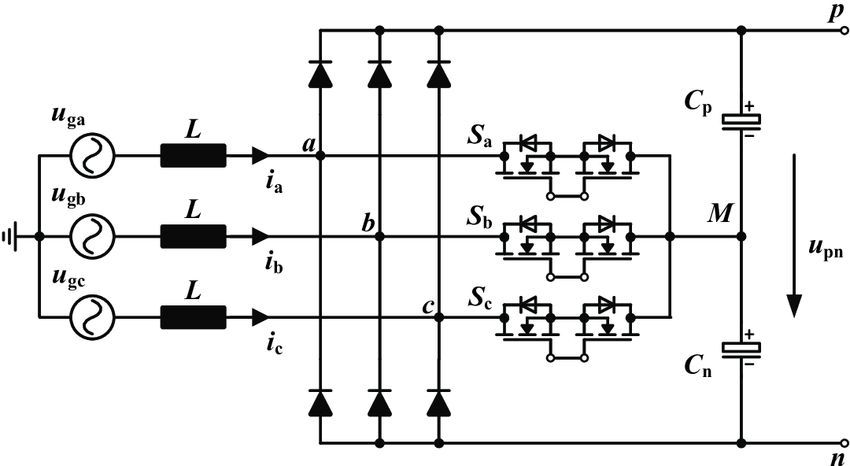
### 4.2.2 Operating Principle

Here a comprehensive and in-depth analysis of the operating principle of the three-phase Vienna rectifier will be delivered. Moving beyond a general overview, this part details the circuit topology, the intricate interaction of its boost inductors, active switches, and diodes during various switching cycles, and the precise current flow paths that shape the input current into a sinusoidal waveform. Furthermore, it elaborates on the sophisticated closed-loop control strategies—including outer voltage regulation, inner current shaping, and critical neutral point balancing—that collectively ensure the delivery of a stable and desired DC output voltage, while maintaining high power quality at the AC mains. The discussion is supported by detailed explanations of instantaneous events within each switching state, directly addressing the complexities required for advanced understanding.

## **Three-Level Switching Concept and its Benefits**

The Vienna rectifier distinguishes itself from conventional two-level rectifiers by employing a three-level switching structure. This means that each phase leg of the rectifier can connect its input inductor to three distinct voltage levels relative to the AC source neutral point: +Vdc/2, 0, and -Vdc/2 (where Vdc is the total DC link voltage across the two series-connected capacitors). This capability to switch between three voltage levels per phase, rather than just two, is one the main features of the Vienna rectifier's superior performance.

This multilevel operation gives several advantages that together enhance the rectifier's efficiency, power quality, and component longevity. By allowing smaller voltage steps, the rate of change of voltage (dV/dt) across the active switches is significantly reduced, which directly leads to lower switching losses. The finer voltage modulation inherent in a three-level system results in a smoother DC output voltage with considerably less ripple. This reduced ripple, in turn, causes a more stable and continuous flow of power to the load. A significant benefit is the reduction in voltage stress on the power components. The active switches in a Vienna rectifier only need to block half of the total DC bus voltage (Vdc/2), which substantially reduces the electrical stress on these devices. This enables the use of lower-rated, potentially more efficient, or faster switching devices, optimizing the overall system's performance and cost. The three-level characteristic is not merely a descriptive feature but a direct cause of this cascade of performance improvements. By generating more discrete voltage levels, the voltage steps applied to the input inductors are inherently smaller compared to a two-level converter. This reduction in voltage step size directly leads to lower ripple in both the input current and the output voltage, which in turn results in significantly lower harmonic distortion and reduced electromagnetic interference (EMI). This illustrates how a seemingly architectural choice profoundly impacts the electrical characteristics and component requirements of the rectifier. The higher number of available voltage levels allows for more precise shaping of the input current, significantly reducing its harmonic content and leading to a more sinusoidal waveform. This, in turn, contributes to lower conducted EMI, further improving grid compatibility.

### **Role as a Three-Phase Boost Converter and Power Factor Correction Mechanism**

The Vienna rectifier is fundamentally classified as a three-phase boost converter. Its primary function is to convert three-phase AC mains inputs into a single, high-voltage DC output. It operates as a boost-type Power Factor Correction (PFC) circuit, meaning the output DC voltage is typically regulated to be higher than the peak of the input AC line-to-line voltage. This boost capability is essential for many high-power applications requiring a stable and elevated DC bus.

A critical objective of the Vienna rectifier is to achieve a near-unity power factor, which is paramount for grid compatibility and energy efficiency. This is accomplished by actively shaping the input current on each phase to be sinusoidal and precisely in phase with its corresponding AC voltage. By drawing current that is in phase with the voltage, the rectifier presents a resistive load behavior to the AC mains, minimizing the reactive power drawn from the grid and improving overall power quality.

The core functionality of Power Factor Correction (PFC) in the Vienna rectifier is a direct consequence of its active control over the input inductor currents. The precise application of Pulse-Width Modulation (PWM) to the active switches allows for the instantaneous control of the inductor's charging and discharging phases. This dynamic control enables the rectifier to draw current from the AC source that is not only sinusoidal but also perfectly synchronized (in phase) with the input voltage. This active shaping, unlike passive rectification, eliminates the harmonic distortion typically associated with non-linear loads and ensures that the rectifier behaves as a purely resistive load to the grid. The "boost" nature of the converter is integral to this process, as it facilitates the continuous energy transfer from the AC input to the DC output, allowing for the regulated DC voltage to be higher than the peak AC input.

The mechanism of current shaping involves several key elements:

### Pulse-Width Modulation (PWM)

The active switches (MOSFETs or IGBTs) are controlled by PWM signals. By precisely adjusting the on/off times (duty cycle) of these switches, the rectifier can remove the instantaneous current pulses that would otherwise result from passive diode rectification alone. This active modulation results in near-sinusoidal current waveforms at the input.

### Inductor Magnetization Control

For each phase, a bidirectional switch (e.g., Ta for phase A) controls the magnetization of the input inductor. When the switch is turned ON, the input voltage is applied across the inductor, causing the current in the inductor to rise linearly, storing energy within its magnetic field. Conversely, when the switch is turned OFF, the voltage across the inductor reverses, and the stored energy is released as the current flows through the freewheeling diodes (e.g., Da+ and Da-), causing the current to decrease linearly.

### Phase Synchronization

By continuously controlling the on-time of these switches based on current feedback, the rectifier's topology precisely controls the current to remain in phase with the mains voltage, thereby achieving the desired power factor correction.

The Vienna rectifier is particularly popular for its operation in Continuous Conduction Mode (CCM). In CCM, the inductor current never drops to zero during a switching cycle. This continuous current flow is crucial for reducing current peaks and the associated harmonic distortion, contributing significantly to the sinusoidal input current waveforms and high-power factor.

## **Inductor Current Shaping and Energy Transfer**

The boost inductors (L_a, L_b, L_c) are central to shaping the input currents and facilitating energy transfer from the AC source to the DC link. The input current for each phase is directly defined by the voltage applied across its corresponding inductor. This voltage, in turn, is determined by the switching state of the active switch in that phase leg and the instantaneous current polarity.

The "boost" functionality of the Vienna rectifier is intrinsically linked to the dynamic behavior of the input inductors under the control of the active switches. The process where the inductor *stores* energy when the active switch is ON (current rising linearly) and *releases* that energy to the DC-link capacitors when the switch is OFF (current decreasing linearly through diodes) is the fundamental mechanism of boost conversion. This controlled energy transfer, coupled with the rectification provided by the diodes, is precisely how the rectifier steps up the voltage and delivers a desired DC output that is higher than the peak AC input voltage. This highlights that the "boost" characteristic is not merely a voltage transformation but a continuous, active energy management process.

Let's examine the energy storage and release phases:

### Energy Storage (Active Switch ON)

When an active switch (e.g., Sa) for a particular phase is turned ON by the PWM signal, the input AC voltage for that phase is applied across its boost inductor. During this period, the current in the inductor rises linearly, and energy is stored within the inductor's magnetic field. The phase is effectively connected to the center point between the output capacitors through the active switch. This state is exemplified by the (111) switching state in the provided image, where all active switches are ON, shorting the input inductors to the neutral point, causing current to build up.

### Energy Release (Active Switch OFF)

When the active switch is turned OFF, the voltage across the inductor reverses its polarity due to the collapsing magnetic field. The stored energy is then released as the inductor current flows through the appropriate freewheeling diodes (e.g., Da+ or Da-, depending on the current direction) to the DC-link capacitors. During this phase, the inductor current decreases linearly, transferring energy to the DC link. This is seen in the (000) state in the image, where all switches are OFF, forcing current through the diodes to the DC link.

The precise adjustment of the ON and OFF times (duty cycle) of the active switches via PWM signals is what enables the removal of instantaneous current pulses, which are characteristic of simple diode rectification. By continuously modulating these switching times, the rectifier forces the input currents to be near-sinusoidal waveforms, synchronized with the AC input voltages. This controlled energy transfer and current shaping are fundamental to achieving high power factor and low harmonic distortion.

### **Role of Diodes in Unidirectional Current Flow and Freewheeling**

The role of the diodes in the Vienna rectifier is a prime example of effective passive-active synergy within a power electronic circuit. While the active switches perform the sophisticated PWM modulation and current shaping, the passive diodes are indispensable. They not only provide the foundational rectification (converting AC to pulsating DC) but also act as essential freewheeling paths when the active switches are turned off. This cooperative action ensures that the inductor current has a continuous path, allowing for efficient energy transfer to the DC link and preventing overvoltage conditions across the switches. Without the diodes providing these crucial current paths, the active boost operation and precise current shaping would be impossible, highlighting that the diodes are not just auxiliary components but integral to the active control strategy.

Their functions include:

### First-Line Rectification

The diodes provide the initial rectification, converting the negative half-cycles of the AC input voltage to positive. This ensures that current generally flows in a unidirectional manner towards the DC link, laying the groundwork for the boost operation.

### Freewheeling Paths

When an active switch is turned OFF, the diodes provide the necessary freewheeling path for the inductor current. This allows the energy stored in the inductor to be transferred to the DC-link capacitors, preventing damaging voltage spikes across the switches. The specific diode (positive or negative) that conducts depends on the instantaneous direction of the phase current. For instance, if phase A current is positive and switch Sa is OFF, current flows through Da+ to the positive DC bus. If phase A current is negative and Sa is OFF, current flows through Da- to the negative DC bus.

### Ensuring Unidirectional Power Flow

The diodes inherently enforce unidirectional power flow from the AC source to the DC load. This is a defining characteristic of the Vienna rectifier, distinguishing it from fully bidirectional active front-end converters. It cannot operate in inverter mode to feed power back to the grid.

The provided images illustrate various switching states and the resulting current paths. To elaborate on "what happens at every instant," a detailed breakdown of representative switching states is presented in Table 1.

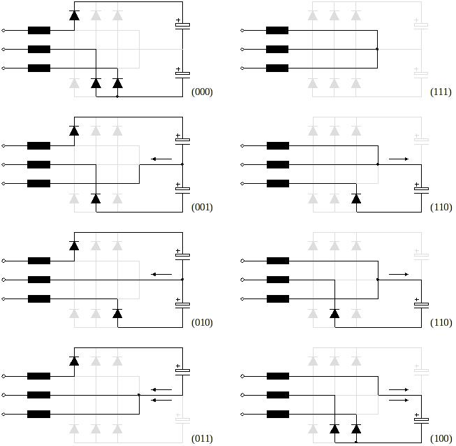
Figure 33 Conduction states of the Vienna Rectifier

Let's delve into the specifics of each of the eight fundamental switching states, observing how the Vienna rectifier orchestrates current flow and energy transfer at every instant.

First, consider **State (000)**. In this scenario, all active switches (Sa, Sb, Sc) are turned OFF. With no active switches conducting, the AC side current is compelled to flow exclusively through the rectifying diodes. Depending on the instantaneous polarity of the AC phase voltages and currents, this current will find its path through either the lower or upper diode branches (for instance, Da+ or Da-) to charge the corresponding DC-link capacitor, whether it's the +Vdc/2 or –Vdc/2 section. During this passive state, all three boost inductors (La, Lb, Lc) are actively discharging their stored energy into the DC-link capacitors via these conducting diodes. Consequently, the DC-link capacitors are being charged through this diode conduction, marking this as a passive state where energy is efficiently transferred from the inductors to the capacitors.

Next, we move to **State (001)**. Here, only active switch Sc is turned ON, while Sa and Sb remain OFF. In phase C, the current is drawn directly through the active switch Sc and into its corresponding inductor, Lc, effectively energizing it by shorting the inductor to the neutral point of the DC link. As current rises linearly, energy is stored within inductor C. Meanwhile, for phases A and B, since their switches are OFF, their currents flow through their respective diodes to the DC link, causing inductors A and B to discharge their energy into the DC-link capacitors. Thus, while phases A and B are in a passive discharge state, actively charging the capacitors, phase C is undergoing active PWM modulation, storing energy in its inductor rather than directly charging the capacitors at this instant.

Similarly, in **State (010)**, only switch Sb is ON, with Sa and Sc remaining OFF. Current from phase B flows through switch Sb into inductor Lb, energizing it and causing energy to be stored. Concurrently, phases A and C are in a passive discharge mode, with their currents flowing through their respective diodes to the DC link, thereby discharging their inductors into the DC-link capacitors. This state represents active PWM for phase B, while phases A and C contribute to capacitor charging through passive discharge.

When we observe **State (011)**, both switches Sb and Sc are ON, while Sa is OFF. In this configuration, the inductors for phases B and C (Lb, Lc) are both actively being energized as current is drawn from their respective AC phases through switches Sb and Sc. This means energy is being stored in inductors B and C. For phase A, however, its current flows through its diodes to the DC link, causing inductor A to discharge its energy. Therefore, while phase A contributes to capacitor charging, phases B and C are engaged in energy intake.

In **State (100)**, only switch Sa is ON, with Sb and Sc turned OFF. Phase A actively draws current through switch Sa, which charges inductor La, storing energy within it. For phases B and C, their currents are directed through their respective diodes to the DC link, leading to the discharge of inductors B and C into the DC-link capacitors. This state is characterized by active modulation of phase A, while phases B and C are in a passive discharge mode, contributing to the DC link charge.

Now, let's consider **State (101)**, where switches Sa and Sc are ON, and Sb is OFF. In this configuration, inductors La and Lc are actively being energized as current is drawn from phases A and C through their respective switches, Sa and Sc. These current paths effectively short the inductors to the neutral point of the DC link, causing energy to be stored in both La and Lc. Meanwhile, for phase B, since its switch Sb is OFF, current flows through its diodes (Db+ or Db-) to the DC link, causing inductor Lb to discharge its stored energy into the DC-link capacitors. Thus, while phase B contributes to capacitor charging, phases A and C are engaged in a two-phase energy intake, actively storing energy in their inductors.

for **State (110)**, switches Sa and Sb are ON, and Sc is OFF. Here, inductors La and Lb are actively being energized by drawing current from phases A and B through their respective switches. These current paths directly charge the inductors, storing energy. For phase C, with its switch OFF, current flows through its diodes to the DC link, causing inductor C to discharge its energy. This represents a two-phase PWM modulation for energy intake, with phase C in a passive discharge state.

Finally, in **State (111)**, all three active switches (Sa, Sb, Sc) are turned ON. In this configuration, all three inductors (La, Lb, Lc) are simultaneously being energized. Their respective active switches being ON effectively shorts the input inductors to the neutral point of the DC link. As current rises linearly, energy is stored in all three inductors. Crucially, during this state, no current flows directly into the DC-link capacitors from the input, as all active switches are ON, and no diode path to the DC bus is active for energy transfer from the inductors. This state typically corresponds to a zero voltage vector in space vector modulation and is particularly useful for balancing capacitor voltages and controlling the neutral point current.

Here is the table summarizing the Vienna Rectifier's switching states:

| Switching State (Sa Sb Sc) | Switches ON | Inductor(s) Storing Energy | Inductor(s) Releasing Energy | Capacitor Action | Role / Notes |
| --- | --- | --- | --- | --- | --- |
| (000) | None | None | A, B, C | Charging (via diodes) | Passive state; energy delivered from inductors to capacitors. |
| (001) | Sc | C | A, B | A, B charging (via diodes); C not directly charging | Active PWM for phase C; A and B in passive discharge. |
| (010) | Sb | B | A, C | A, C charging (via diodes); B not directly charging | Active PWM for phase B; A and C in passive discharge. |
| (011) | Sb, Sc | B, C | A | A charging (via diodes); B, C not directly charging | Double-phase energy intake; A in passive discharge. |
| (100) | Sa | A | B, C | B, C charging (via diodes); A not directly charging | Active modulation of phase A; B and C in passive discharge. |
| (101) | Sa, Sc | A, C | B | B charging (via diodes); A, C not directly charging | Two-phase energy intake; B in passive discharge. |
| (110) | Sa, Sb | A, B | C | C charging (via diodes); A, B not directly charging | Two-phase PWM modulation for energy intake; C in passive discharge. |
| (111) | Sa, Sb, Sc | A, B, C | None | No direct charging from input | Zero voltage vector; used for neutral point control and modulation transitions. |

### 4.2.3 Component Sizing

Accurate sizing of the boost inductors and DC-link capacitors is crucial for the optimal performance of the Vienna Rectifier, ensuring low current ripple, stable DC output voltage, and efficient operation.

### Boost Inductors (*****L*****)

The inductors are sized to limit the input current ripple (*ΔI**L*​) to an acceptable level and ensure **Continuous Conduction Mode (CCM)** across the operating range. For a three-phase active rectifier like the Vienna, the inductance calculation is more complex than a simple single-phase boost converter, as it depends on the input voltage, output voltage, switching frequency, and the specific modulation strategy. A common approach involves calculating the maximum ripple current based on the peak input voltage and minimum duty cycle, or a specific modulation index.

A simplified estimation for the required inductance can be considered based on the maximum voltage across the inductor and the desired current ripple:

Where:

Lin​: Input Inductance
VDC​: DC-Link Output Voltage
​: Peak Line-to-Line Input Voltage
fsw​: Switching Frequency
ΔIL,max​: Maximum Peak-to-Peak Current Ripple
### DC-Link Capacitors (*****Cp​, Cn*****​****)

The DC-link capacitors are sized to maintain voltage stability and limit voltage ripple (ΔVDC​) across the DC output. In a three-phase rectifier, the dominant voltage ripple on the DC link is typically at twice the line frequency (*2**⋅**f**line*​), due to the rectified three-phase power ripple. There's also a smaller, high-frequency ripple component at the switching frequency. The bulk capacitance is primarily determined by the low-frequency ripple.

The capacitance value for each DC-link capacitor can be estimated based on the desired voltage ripple and the stored energy requirements:

​​

Where:

*P**out**​*: Output power.
*ω**line**​: *Line angular frequency (*2π**f**line**​, e.g., 2π**⋅**50 Hz*).
*V**DC*​: Nominal DC-link voltage across the two series capacitors (*V**out*​).
*Δ**V**DC,max*​: Maximum allowable peak-to-peak voltage ripple across the total DC link at twice the line frequency.

### 4.2.4 Control Strategy

The Vienna Rectifier employs a sophisticated **dual-loop control strategy** to ensure stable operation, high power quality, and efficient power conversion.

### Outer Voltage Loop

This loop is responsible for regulating the overall DC-link voltage. It generates a reference current magnitude for the inner loop based on the difference between the desired and measured DC-link voltages. A Proportional-Integral (PI) controller is typically used:

Where:

*V**dc_ref*​: Reference DC voltage (desired output voltage).
*V**dc*​: Measured total DC-link voltage.
*K**p**​,** **K**i*​: Proportional and integral gains of the voltage controller.
### Inner Current Loop

This loop ensures that the input phase currents precisely follow their sinusoidal references, which are derived from the outer voltage loop and synchronized with the grid voltage. This action directly shapes the input current, ensuring a sinusoidal waveform in phase with the input voltage, thereby achieving unity power factor. Another PI controller is commonly used for each phase:

Where:

*I**ref**​*: Reference phase currents (derived from the outer loop's output and typically modulated by a sinusoidal waveform synchronized with the grid voltage).
*I**abc**​*: Measured input phase currents.
*V**abc**​*: Control voltages (voltage references) for the PWM generation.
*K**p**′**​,K**i**′​*: Proportional and integral gains of the current controller.

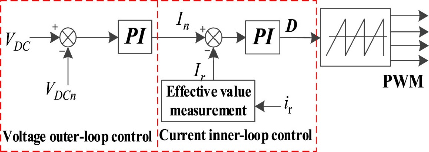

### 4.2.5 Modulation Technique

The Vienna Rectifier utilizes **Space Vector Pulse Width Modulation (SVPWM)** to generate the precise gating signals for its active switches. SVPWM is a highly effective modulation technique that offers several advantages over traditional PWM methods:

### Better DC-Link Voltage Utilization

SVPWM allows for a higher fundamental output voltage for a given DC-link voltage, maximizing the converter's efficiency.

### Reduced Harmonic Distortion

By carefully selecting and sequencing the switching states, SVPWM inherently reduces the Total Harmonic Distortion (THD) in the input currents, contributing to excellent power quality.

### Flexibility in Control

SVPWM provides a clear geometric interpretation of the control voltages, simplifying the implementation of complex control objectives, such as balancing the voltages across the split DC-link capacitors.

## 4.3 DC-DC Stage: Dual Active Bridge (DAB) Converter

### 4.3.1 Introduction and Topology

The **Dual Active Bridge (DAB) converter** is a bidirectional isolated DC-DC converter topology that offers galvanic isolation and highly efficient power transfer between two DC buses. It is particularly suitable for applications such as electric vehicle (EV) charging stations, where bidirectional power flow and high efficiency are essential.

## **Key Features:**

### Bidirectional Power Flow

Allows for both charging and discharging operations, enabling advanced functionalities like Vehicle-to-Grid (V2G) capabilities.

### Galvanic Isolation

Achieved through a high-frequency transformer, ensuring safety for users and compliance with electrical isolation standards.

### High Efficiency

Capable of achieving efficiencies exceeding 97% over a wide operating range, largely due to the implementation of soft-switching techniques like Zero Voltage Switching (ZVS).

### Compact Design

Its high-frequency operation significantly reduces the physical size of magnetic components (transformer and inductor), leading to a more compact and lightweight overall design.

## **Circuit Description:**

The DAB converter primarily comprises:

### Two Full-Bridge Converters (Primary and Secondary)

Each consists of four power switches (typically MOSFETs or IGBTs) arranged in an H-bridge configuration. These bridges generate the high-frequency square-wave voltages.

### High-Frequency Transformer

This component provides galvanic isolation between the primary and secondary sides and facilitates voltage transformation between the two DC buses.

### Leakage Inductance (L)

This crucial element represents the combined leakage inductance of the transformer and any additional series inductance explicitly added. It serves as the primary energy transfer element, linking the primary and secondary sides.

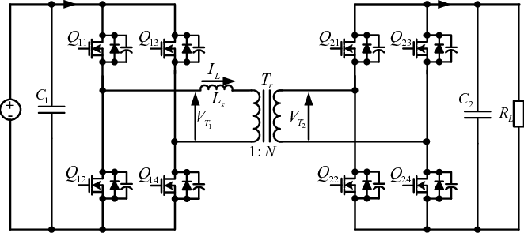
### 4.3.2 Operating Principle

The DAB converter operates by generating high-frequency square-wave voltages on both the primary and secondary sides of the transformer using their respective full-bridge converters. Energy transfer is achieved by introducing a controlled phase shift (ϕ) between these two square-wave voltages. This phase shift creates a voltage difference across the leakage inductance, compelling energy to flow between the primary and secondary sides.

### Power Transfer Equation

The power transferred (P) through the DAB converter, using **Single Phase Shift (SPS) modulation**, can be expressed as:

Where:

*V1*​: Primary side DC input voltage.
*V2*​: Secondary side DC output voltage.
*n*: Transformer turns ratio (*N**secondary**​/**Nprimary*​).
*fs​*: Switching frequency.
*L*: Leakage inductance (including any external series inductance).
*ϕ*: Phase shift between the primary and secondary bridge voltages, in radians (−π≤ϕ≤π). A positive ϕ indicates power flow from V1​ to V2​, and a negative ϕ indicates power flow from *V2​* to *V1*​.
This equation shows that power transfer is directly proportional to the magnitude of the phase shift, allowing for precise and efficient control of power flow by adjusting ϕ. The proper design of L is crucial not only for controlling power transfer but also for ensuring **soft-switching (Zero Voltage Switching, ZVS)** of the power devices over a wide operating range, which is critical for high efficiency.

As mentioned earlier, In the DAB converter topology, power transfer occurs through appropriate phase shifting of the high-frequency square wave between two H-bridges. In its simplest form, these square waves are generated with a D = 1/2 duty cycle, and this method is referred to as the single-phase shift (SPS) technique. Power transfer occurs from the leading H-bridge to the lagging H-bridge, and the magnitude and direction of the transferred power can be easily controlled by changing the phase shift parameter.

The power transfer fundamentally occurs through the leakage inductance of the high-frequency transformer or an inductor externally added to the circuit. Due to the phase-shifted nature of the DAB converter topology, the inductor current and voltage follow each other with a certain delay, resulting in unwanted reactive currents circulating within the circuit or between the H-bridges. These currents increase both the current stress on the semiconductor switches and the copper losses in the high-frequency transformer.

The basic operating phases of the DAB converter are presented in [**Figure 14**](https://www.mdpi.com/1996-1073/17/17/4258). For clarity, the switching sequence is examined in six distinct intervals (four active). In the first interval, the current through the energy transfer inductor changes from a negative to a positive value. During this interval, the primary side switches S1 and S4, and the secondary side switches S6 and S7 are conducting.

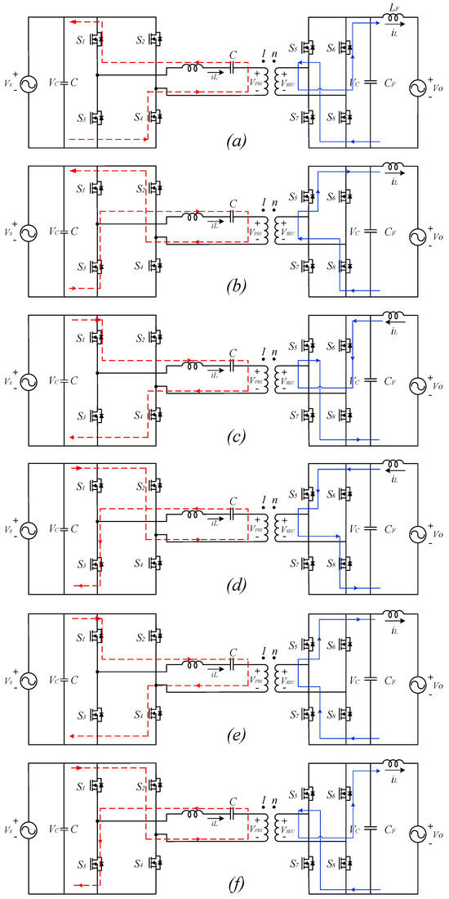

### 4.3.3 Component Sizing

### Leakage Inductance (L)

The leakage inductance is a critical design parameter. Its value significantly influences the power transfer capability, current ripple, and the range over which soft-switching can be achieved. It is often determined by rearranging the power transfer equation based on the maximum desired power transfer (Pmax​) and the maximum allowable phase shift (ϕmax​):

The value of L is often chosen to optimize the Zero Voltage Switching (ZVS) range and minimize circulating currents, in addition to meeting the maximum power transfer requirements. In practical designs, an external inductor is frequently added in series with the transformer to achieve the desired total inductance.

### Transformer Turns Ratio (n)

The transformer turns ratio (​) is selected to appropriately match the voltage levels between the primary and secondary DC buses for optimal operation. An ideal turns ratio aims to set the reflected secondary voltage (V2​/n) close to the primary voltage (V1​), which minimizes circulating currents and optimizes the soft-switching conditions.

This ratio is chosen to ensure efficient power transfer and minimize reactive power circulating within the converter.

### DC-Link Capacitors

Input and output DC-link capacitors are required to filter high-frequency current ripples, maintain stable DC voltages, and provide instantaneous energy buffering. Their sizing is determined by the allowable voltage ripple and the converter's dynamic response requirements.

Where:

Pout: Output power.
ωline: Line angular frequency (2πfline, e.g., 2π⋅50 Hz).
VDC: Nominal DC-link voltage across the two series capacitors (Vout).
ΔVDC,max: Maximum allowable peak-to-peak voltage ripple across the total DC link at twice the line frequency.
This formula ensures that the capacitor can adequately absorb the power fluctuations at twice the line frequency while maintaining the voltage ripple within specified limits. Similarly, appropriate capacitance values are selected for the input and output stages of the DC-DC converter to manage ripple and transient demands, although their specific sizing formulas might differ based on the topology and control strategy.

### 4.3.4 Control Strategy

The DAB converter employs a **phase-shift modulation control strategy** to precisely regulate power flow, enabling both its bidirectional capability and voltage regulation. This is often implemented as a **cascaded dual-loop control system**.

### Outer Voltage Regulation Loop

This loop monitors the output DC voltage and adjusts the phase shift command to maintain it at a desired setpoint. A PI controller is typically used:

(Note: In some implementations, an inner current loop might be present, where the voltage loop outputs a current reference, and the current loop then outputs the phase shift command.)

## **Bidirectional Operation:**

### Positive phase shifts (ϕ>0)

Facilitate power flow from the primary side (e.g., grid side) to the secondary side (e.g., battery side), typically used for charging an EV.

### Negative phase shifts (ϕ<0)

Enable power flow from the secondary side to the primary side, allowing for vehicle-to-grid (V2G) capabilities (discharging).

### Current Limiting

Essential for robust operation, the control strategy also incorporates mechanisms to protect the converter from overcurrent conditions. This is achieved by monitoring the current through the leakage inductance and actively limiting the phase shift command to prevent excessive currents.

### 4.3.5 Modulation Techniques

Several modulation techniques can be employed in DAB converters to optimize performance across different operating conditions.

### Single Phase Shift (SPS) Modulation

This is the simplest and most common method, where power flow is controlled solely by adjusting the phase shift (ϕ) between the primary and secondary bridge voltages. It is effective and achieves ZVS over a wide range but can lose ZVS at light loads or extreme voltage ratios.

### Dual Phase Shift (DPS) Modulation

This technique introduces additional degrees of freedom by controlling not only the phase shift between the bridges but also the internal duty cycles (or phase shifts) of the square waves generated by each full-bridge. This allows for an extended ZVS range, reduced circulating currents, and improved efficiency, especially at light loads or when voltage ratios vary significantly.

### Extended Phase Shift (EPS) / Triple Phase Shift (TPS) Modulation

These are more advanced variations that offer even finer control by varying additional phase angles within the switching period. They can further optimize efficiency and ZVS range under challenging conditions.

For this design, **Single Phase Shift (SPS) Modulation** is selected due to its simplicity in implementation and its effectiveness in achieving high efficiency for the intended operating range.

## 4.4 Battery Model and Characteristics

### 4.4.1 Introduction

In the context of DC fast charging stations, the battery serves as the primary energy storage component, directly influencing the system's performance, efficiency, reliability, and safety. A comprehensive understanding of the battery's characteristics, including its chemistry, configuration, thermal behaviour, and management, is essential for effective integration and optimal operation within the charging infrastructure.

### 4.4.2 Battery Chemistry Selection

For this design, **lithium-ion battery chemistry** is selected due to its superior energy density, power density, long cycle life, and favourable performance characteristics compared to other battery technologies.

### 4.4.3 Battery Pack Configuration

The battery pack is configured by connecting individual cells in series and parallel arrangements to achieve the desired voltage and capacity required by the charging station.

The total number of cells (*N**cb*​) in the battery pack can be calculated as:

*N**cb**​=N**cs**​×N**sb**​*

Where:

*N**cs*​: Number of cells connected in series to achieve the desired pack voltage.
*N**sb*​: Number of parallel strings (or groups) of series-connected cells, which increases the total capacity and current capability.
The total energy capacity (*E**bp*​) of the battery pack is given by:

*E**bp**​=N**cb**​×E**bc**​*

Where:

*E**bc**​*: Energy capacity of a single cell (e.g., in *Wh*).
The nominal voltage (*V**bp*​) of the battery pack is:

*V**bp**​=N**cs**​×V**bc*​

Where:

*V**bc**​*: Nominal voltage of a single cell (e.g., typically 3.2V for LFP, 3.6-3.7V for NMC).
The maximum continuous current capability of the battery pack (Ibp, max​) is derived from the parallel arrangement:

*I**bp, max​**=N**sb**​×**I**bc, max​*

Where:

*I**bc, max​*: Maximum continuous current rating of a single cell.
Figure 4.15: Schematic diagram of a battery pack configuration, illustrating cells connected in series to form modules, and multiple modules connected in parallel to form the final pack.

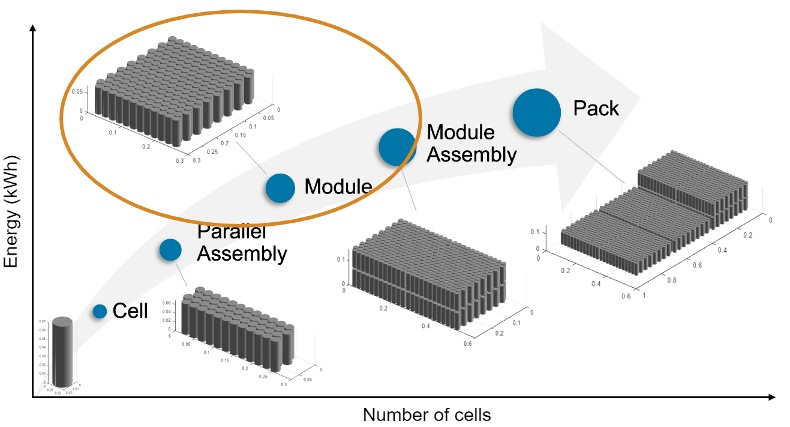
### 4.4.4 Battery Sizing Considerations

The sizing of the battery pack is critical to meet the specific power and energy requirements of the fast-charging station, ensuring optimal performance and longevity. Key parameters to consider include:

### Energy Capacity (*****E******bp*****​)

Determined by the total energy required to support the charging operations and the desired runtime or throughput for the station. It's crucial to consider the usable State of Charge (SoC) window (e.g., 20% to 80% SoC) to maximize battery cycle life.

### Power Capacity (*****P******bp*****​)

Must be sufficient to handle the peak power demands during fast charging sessions. This directly relates to the battery's **C-rate** capability. For example, a 100 Ah battery charged at 2C can deliver 200A.

### Voltage Level (*****V******bp******​*****)

Should be selected to match the nominal voltage range requirements of the DC-DC converter stage, ensuring efficient power transfer.

### Current Rating

The battery pack must be capable of delivering or accepting the required charging current without exceeding its maximum continuous or peak charge/discharge rates, which are crucial for maintaining battery health and safety.

An example calculation for a battery pack designed to deliver 80 kW at a nominal voltage of 400 V is as follows:

The selected battery cells and their parallel configuration must collectively support this required continuous current rating.

### 4.4.5 Battery Management System (BMS)

A **Battery Management System (BMS)** is an indispensable electronic control unit integrated with the battery pack. It acts as the "brain" of the battery, continuously monitoring, managing, and protecting the pack to ensure its safe, reliable, and efficient operation throughout its lifespan.

Key functions of the BMS include:

### State of Charge (SoC) Estimation

The BMS accurately estimates the remaining energy capacity of the battery (like a fuel gauge) using sophisticated algorithms that integrate current flow (coulomb counting) and voltage measurements, often compensated for temperature and aging.

### State of Health (****SoH****) Assessment

The BMS assesses the overall degradation and remaining useful life of the battery. This involves tracking parameters like internal resistance, capacity fade, and cycle count to provide an indication of the battery's health.

### Cell Balancing

To prevent overcharging or deep discharging of individual cells within a series string (which can lead to premature degradation or safety hazards), the BMS employs cell balancing techniques. This can be passive (dissipating excess energy from high-voltage cells) or active (redistributing energy from high-voltage to low-voltage cells).

### Protection Mechanisms

This is a critical safety function. The BMS continuously monitors crucial parameters (individual cell voltages, total pack voltage, charge/discharge currents, and multiple temperature points) and activates protection mechanisms (e.g., opening contactors, signaling to the charger) to prevent damage from:

Overvoltage and Undervoltage
Overcurrent (charge and discharge)
Overtemperature and Undertemperature
Short Circuits
### Data Logging and Communication

The BMS records operational data for diagnostics and performance analysis. It communicates vital battery information (e.g., SoC, SoH, voltage, current, temperature) to the charging station's master control system and the EV's on-board computer via standard communication protocols (e.g., CAN bus), ensuring coordinated and safe charging operations.

The BMS plays a central role in optimizing the charging process, extending battery life, and guaranteeing the safety of the entire EV charging system.

# Chapter 5 – System Architecture and Modelling Approach

This chapter provides a comprehensive account of the structural and modelling methodology adopted in the simulation of a DC fast charging station. It covers the system's physical architecture, the selection of simulation tools, detailed modelling of subsystems, and integration into a complete simulation environment. The purpose is to ensure model fidelity and clarity before proceeding to simulation and results.

### 5.1.1 Functional Block Diagram and Power Flow

The proposed electric vehicle (EV) fast charging station is architected as a multi-stage power conversion system, designed to interface efficiently with a medium-voltage AC grid and deliver a stable, regulated DC output suitable for high-current EV battery charging. The system is implemented in MATLAB/Simulink using component-level modeling with detailed switching behavior, enabling high-fidelity dynamic analysis of both power electronics and control loops.Figure 5.1 presents the high-level functional block diagram of the system, capturing the complete energy pathway and signal flow from the utility grid to the EV battery interface.

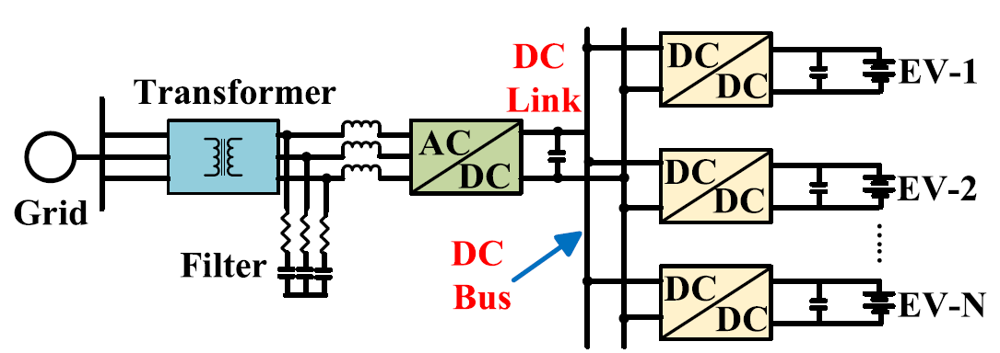
The system is composed of the following core functional blocks:

#### 1. Grid Interface

The grid interface represents the entry point of electrical power into the simulated fast charging system. Its purpose is to replicate the conditions under which a real-world EV charging station connects to the medium-voltage distribution grid. In this model, the grid interface ensures stable and realistic conditions at the input of the AC–DC conversion stage, while intentionally abstracting away complex upstream network dynamics.

This stage connects the charging station to the utility grid. A **three-phase 20 kV AC source** represents the medium-voltage distribution network, which is stepped down to **400 V line-to-line AC** using a **20 kV/400 V transformer**. In simulation, this transformer is modeled as an ideal unit to isolate grid dynamics from charger behavior. The output of this block serves as the input to the AC-DC conversion stage.

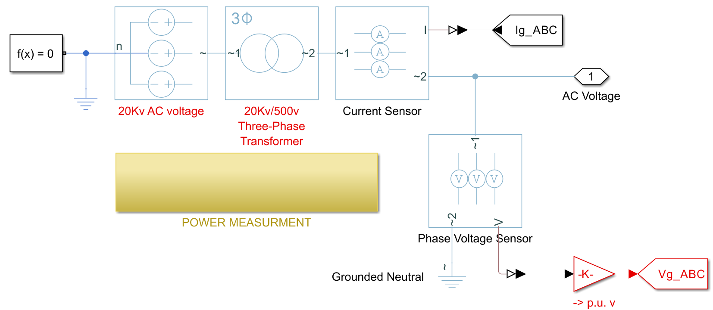
## **Structure of the Grid Interface**

The subsystem consists of the following key elements:

**Three-Phase AC Voltage Source**The utility grid is modeled using a **balanced three-phase ideal voltage source**, operating at:
**Line-to-line RMS voltage**: 20 kV
**Frequency**: 50 Hz
**Impedance**: Zero (ideal source)This abstraction allows the downstream converter dynamics to be analyzed in isolation from grid-side disturbances such as harmonics, voltage sags, or flicker.
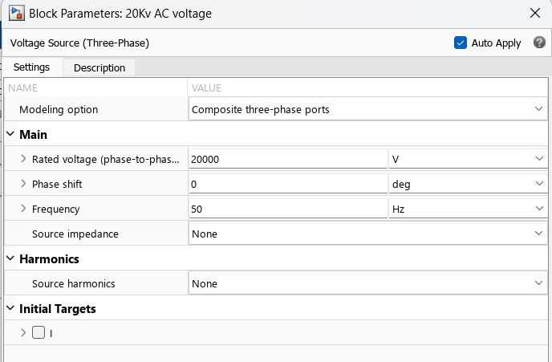
## **Step-Down Transformer**

The source is connected to the power electronics stage through a **20 kV / ****500**** V transformer**, which reduces the grid voltage to a usable level for the Vienna rectifier. In the model, the transformer is:

**Ideal and lossless**, with no leakage inductance or winding resistance
**Fixed ratio** of 40:1

Configured in a **Y-Y connection**

**Transformer Power Rating (Apparent Power)**The transformer must be sized to handle the **maximum expected active power** transfer to the EV battery plus a margin.

Assuming:

Maximum charging power Pmax​=70kW
Power factor cosϕ≈0.99
Then:

We round up and choose a transformer rated for: Srated=80 kVA

This provides thermal and operational margin, supporting transient overcurrents during startup and switching dynamics.

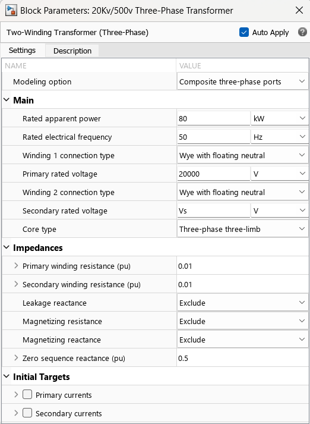

**Secondary Side Line Current Calculation**To verify transformer suitability and for designing Vienna input filter inductors:

This indicates the secondary side must support at least **~1****20**** A per phase**, guiding conductor sizing and input inductor thermal limits.

**Output Ports to AC–DC Conversion Subsystem**The transformer's low-voltage side directly feeds the input of the Vienna rectifier subsystem via three output terminals: **Va, Vb, Vc**. These signals serve as:
Voltage input to the rectifier power stage
Reference signals for PLL synchronization and dq transformation in the control block

## **Measurement and Signal Extraction**

Although this subsystem is functionally simple, it plays a critical role in providing clean and accurate signals for downstream control operations. **Voltage and current sensors** are placed at the transformer's secondary output to measure:

Phase voltages and line voltages
Incoming current per phase
These signals are routed to the measurement subsystem for:

Grid synchronization via **three-phase Phase Locked Loop (PLL)**
Voltage magnitude detection
dq0 transformation reference
power measurements
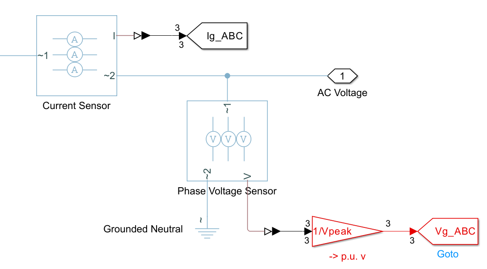
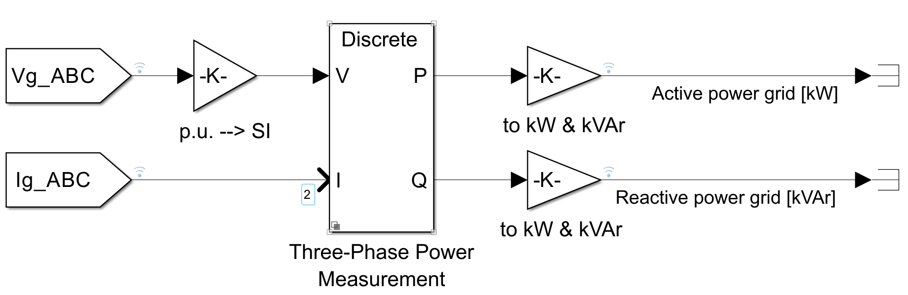
## **Modeling Considerations**

This subsystem assumes **perfect voltage waveform symmetry** and **zero distortion**.
No grid disturbances, frequency deviations, or reactive impedance are considered at this stage.
While this simplification omits detailed power quality analysis, it provides a stable foundation for evaluating the core behavior of the converter stages.

#### 2. Sation interface

This section itself is composed of two stages, the first where the AC input is converted to DC which the Vienna rectifier has been chosen to be used and the second conversion stage where the DC voltage regulation occurs and the DAB converter is assigned to this. These two stages are connected to each other through the DC bus after Vienna rectifier.

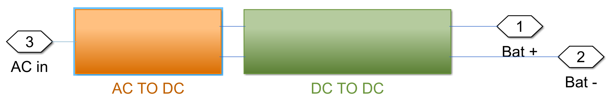
##### 2.1 AC–DC Conversion Stage (Vienna Rectifier)

The Vienna rectifier is employed in this system as the front-end converter responsible for transforming the three-phase AC input into a stable DC output. It is specifically chosen for its ability to support high power density, improved power factor, and inherent split DC-link architecture, which is well-suited for interfacing with downstream high-frequency DC–DC converters.

The Vienna topology also provides excellent harmonic performance, reduced switching losses, and simple control of midpoint potential balancing, making it a favorable choice in modern EV charging infrastructure.

The stepped-down AC voltage is fed into the **Vienna rectifier**, which performs two essential functions:

Conversion of three-phase AC to a **split DC output**
**Power factor correction** and **current shaping** for improved grid compatibility
The rectifier ensures smooth DC link voltage while minimizing harmonics at the grid interface. Its operation is governed by a combination of PI controllers and neutral point balancing logic.

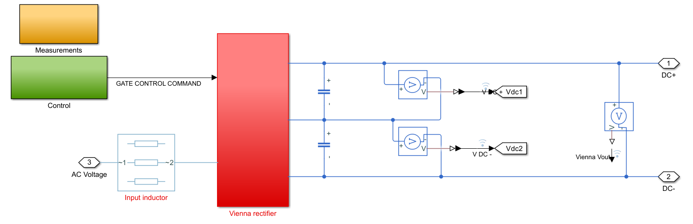
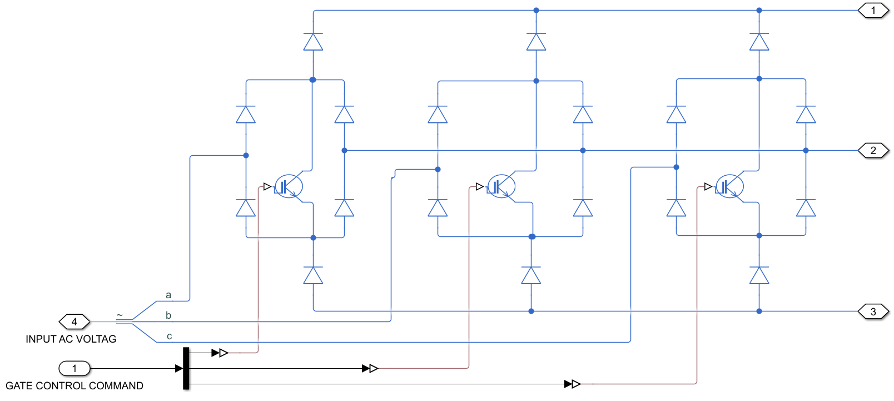

###### 2.1.1 Circuit Topology Description

The simulated Vienna rectifier consists of the following core elements:

###### Input Filter Inductors (La, Lb, Lc)

Each input phase is connected to a dedicated filter inductor to shape the input current and attenuate switching harmonics. The inductors also play a key role in current control loop dynamics and power factor correction. According to the formula we introduced in chapter four:

If we put the values as below:

VDC: 800

√2 VLL: 400

fsw: 20000

ΔIL, max: 5%

## **L****in**** value will be 2mH**

###### Six Power Diodes and Three Active Switches (Sa, Sb, Sc)

The Vienna rectifier uses three unidirectional legs with **one controlled switch per phase**, along with six diodes that provide rectification paths. The topology permits **boost-mode operation** while maintaining a reduced switch count compared to conventional three-phase converters. The **switches (IGBTs)** are modeled as **ideal** with zero losses and perfect switching behavior.

###### DC-Link Capacitors (C+, C-)

Two large electrolytic capacitors are placed in a split configuration across the DC bus to form a floating midpoint (neutral potential). These capacitors store energy and reduce ripple on the output. Capacitor values used is based on the formula calculated in chapter four is

​​

By inserting the values as below:

P = 80 kW

ꞷline=314.15

*V**DC* =800

*Δ**V**DC,max** *= 5%

### **Capacitors value becomes C=0.00398F or 3.98mF. we choose he value 5mF**

### ****

###### 2.1.2 Measurement Subsystem

The measurement subsystem within the Vienna rectifier model plays a critical role in enabling real-time control, synchronization, and signal conditioning. It captures key electrical quantities such as input voltages, currents, and capacitor voltages, and prepares them for use in the control loops and signal-processing modules.

Accurate and well-timed measurement is essential for maintaining DC-link voltage stability, achieving high power factor, and ensuring neutral-point voltage balancing.

Its primary objectives include monitoring the three-phase input voltages and currents, calculating instantaneous active and reactive power, tracking the voltages across the split DC-link capacitors, providing stable input signals to the phase-locked loop (PLL), and facilitating the Park transformation (abc to dq0) necessary for control in the rotating reference frame. Together, these functions support both dynamic control performance and system protection.

To monitor the input electrical variables, voltage measurement blocks and current sensors are installed on each of the three input lines of the rectifier. The measured voltages and currents—denoted Va​, Vb​, Vc​ and Ia​, Ib​, Ic​—are utilized in several key subsystems. These include synchronization via the PLL, current vector orientation through the dq0 transformation, and current regulation through proportional–integral (PI) controllers. The DC-link voltages, represented as Vdc+​ and Vdc−​, are sensed across the upper and lower capacitors in the split capacitor configuration. These measurements serve multiple purposes: regulating the total DC output voltage, detecting and correcting imbalances in the neutral-point potential, and contributing to a dedicated balancing control loop that maintains voltage symmetry.

Another core part of the control system is the transformation of three-phase quantities into the synchronous rotating reference frame. This transformation is governed by the grid voltage angle θ, which is extracted using a phase-locked loop synchronized to the grid frequency. The transformation enables the decoupled control of the d-axis current—associated with active power—and the q-axis current—associated with reactive power—thus enhancing dynamic response and control precision.

To ensure signal quality, all measured variables are passed through first-order low-pass filters, which mitigate the high-frequency switching ripple introduced by power electronic switching. This filtering step ensures that the control algorithms operate on smooth and reliable signals, reducing the effects of noise and potential aliasing.

For the sake of modeling simplicity and to focus on control dynamics, several idealizing assumptions are made in this simulation. All sensors are assumed to be ideal, introducing no time delays, noise, or offset errors into the measured signals. Furthermore, signal sampling is considered to be perfectly synchronized with the converter’s switching frequency, eliminating timing mismatches. Lastly, the PLL is modeled as perfectly stable and instantly responsive, particularly under balanced grid conditions. These assumptions streamline the analysis and emphasize the intrinsic behavior of the control strategy under ideal measurement conditions.

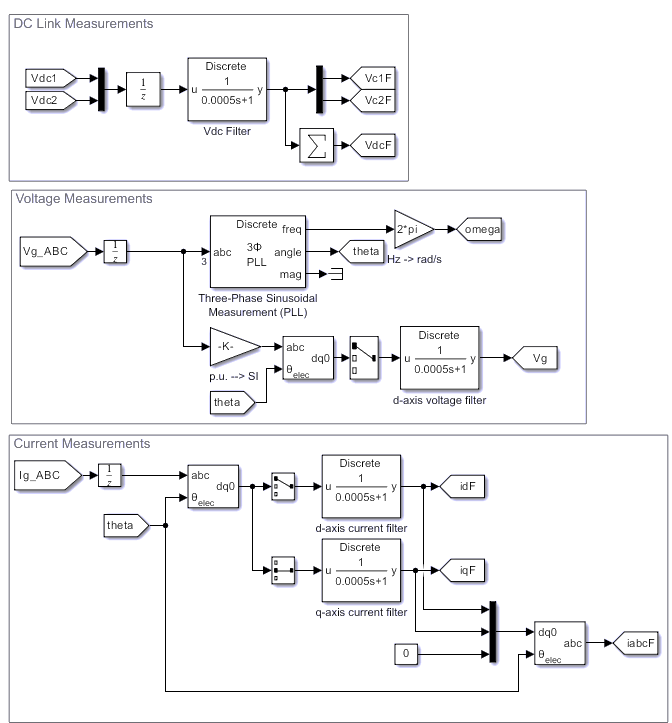
###### 2.1.3 Vienna Control Subsystem

The control subsystem of the Vienna rectifier governs its dynamic behavior, regulating the DC-link voltage, shaping input currents to achieve unity power factor, and maintaining voltage balance across the split DC capacitors. This is achieved through a cascaded control structure involving current and voltage control loops, coordinated in the synchronous rotating reference frame.

## **Control Structure Overview**

The control system consists of the following core components:

## **1. Voltage Regulation Loop**

the voltage regulation loop, which governs the total DC-link voltage using a proportional–integral (PI) controller. The controller compares the measured DC-link voltage with a fixed reference value, and generates a control signal that serves as the reference for the d-axis current (id∗​). This outer loop ensures that active power drawn from the grid is continuously adjusted to maintain the desired DC output voltage level, thus stabilizing the energy flow from the grid to the downstream converter.

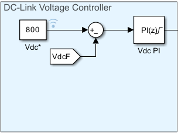
## **2. ****dq**** Current Controllers**

The controller compares the measured DC-link voltage with a fixed reference value, typically 800 V, and generates a control signal that serves as the reference for the d-axis current (id∗i_d^{*}id∗​). This outer loop ensures that active power drawn from the grid is continuously adjusted to maintain the desired DC output voltage level, thus stabilizing the energy flow from the grid to the downstream converter.

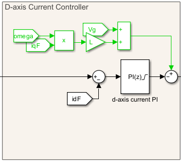 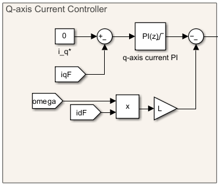

## **3. Neutral Point Balancing**

In addition to current and voltage control, the system includes a dedicated neutral-point balancing loop to maintain voltage symmetry across the split capacitors (Vdc+​≈Vdc−​). This loop monitors the voltage difference between the two capacitors and modulates the duty cycle of the phase with the highest deviation. By actively correcting midpoint imbalances, the loop preserves the stability of the neutral point, which is essential for the proper functioning of downstream converter, the Dual Active Bridge (DAB).

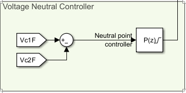
### **4. Inverse Park Transformation and PWM Signal Generation**

Once the voltage commands in the dq frame are established, they are transformed back into the three-phase (abc) system using an inverse Park transformation. These reconstructed voltage signals are then fed into the pulse-width modulation (PWM) block, which generates the gating signals for the three active switches of the Vienna rectifier. This sequence of transformations and control actions ensures real-time modulation of the converter’s switching states in accordance with the control objectives.

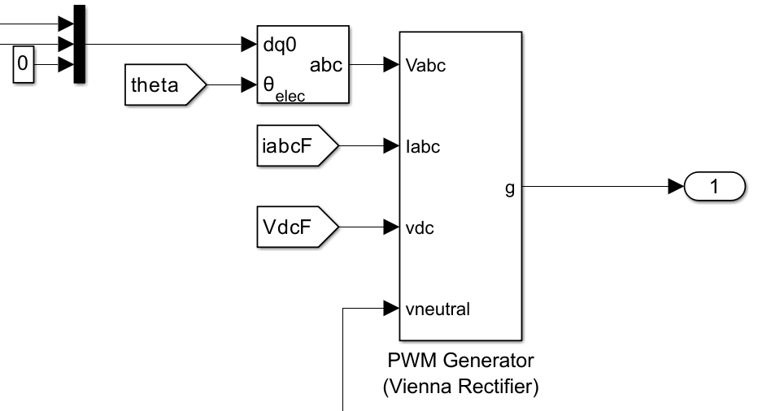

## **Assumptions**

All PI controllers are ideal, properly tuned, and operate without anti-windup or saturation
PWM logic has perfect resolution and timing
Control loops are digitally implemented and synchronized to system switching frequency

The whole control subsystem looks like the images below:

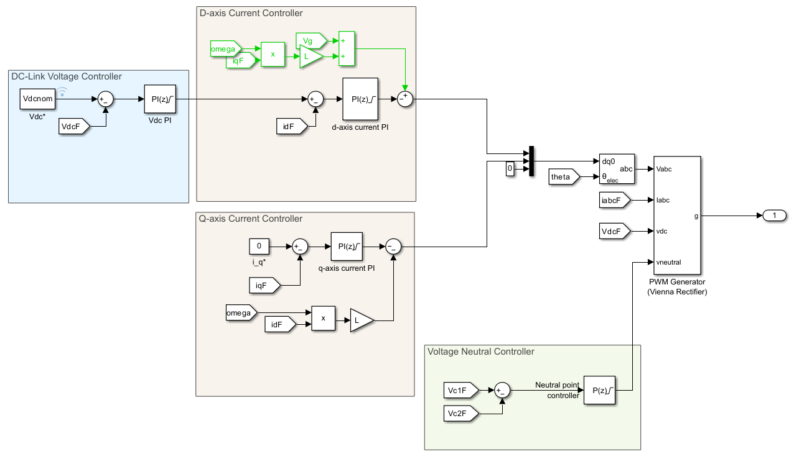
##### 2.2. Intermediate DC Link

The rectified voltage is buffered by a **DC link capacitor bank**, creating a stabilized intermediate DC voltage that serves as the input to the downstream DC–DC converter. This stage functions as an energy reservoir to support fast dynamic charging and decouple converter stages.

##### 2.3. DC–DC Conversion Stage (Dual Active Bridge – DAB)

The DAB converter performs **galvanic isolation** and precise **voltage regulation**. Power transfer is modulated by the **phase shift** between the switching signals of the two bridges, enabling efficient and bidirectional energy flow, if needed. This converter tailors the DC link output to match the EV battery’s voltage and current requirements.

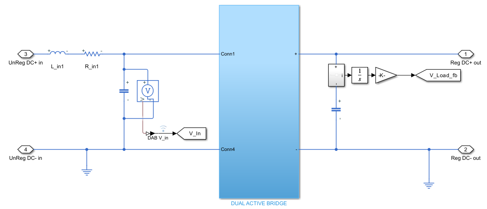
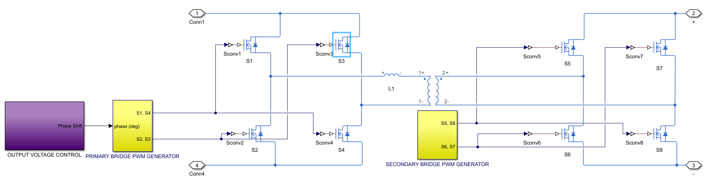
#### Converter Architecture

The simulated DAB model consists of two full-bridge converters (primary and secondary), a high-frequency transformer, and a series inductor used for power transfer regulation.

##### 1. Primary Full Bridge (Input Side)

Receives power from the Vienna rectifier’s DC output (~800 V) and It is Built using **four ideal switches** (S1 to S4), forming a full-bridge inverter. It Generates a **bipolar square wave** at high frequency (100 kHz) and the Switches are driven using **PWM signals** generated by the control subsystem based on phase shift logic.

##### 2. High-Frequency Transformer

This transformer provides **galvanic isolation** and performs voltage step-down to match the EV battery side Modeled as **ideal**, with fixed turns ratio:

No core loss, leakage capacitance, or saturation is modeled and the Energy transfer is enabled by alternating voltage polarity across the transformer terminals through the bridges

##### 3. Leakage Inductance (L1)

As mentioned earlier in chapter Four this transformer leakage inductance is implemented as an **explicit inductor in series** with the transformer and controls the power transfer rate and smooths current waveforms. Value used in simulation is calculated based on the formula from chapter four:

Inserting the system values, inductance of 10 µH for DAB, was resulted to provide stable operation and desired dynamic response.

##### 4. Secondary Full Bridge (Output Side)

Receives the transformed square wave from the transformer. It is built using another set of **four ideal switches** (S5 to S8), forming a synchronous full-bridge rectifier. The Output is filtered through a large capacitor before delivery to the battery. This side also uses high-frequency PWM signals, phase-shifted relative to the primary bridge.

##### 5. Output Filter Capacitor

A **2 ****mF**** capacitor** used to smooth the rectified output voltage. It delivers near-constant voltage to the battery subsystem

#### Principles of DAB Power Transfer and Control

The core principle of power transfer in a DAB converter relies on introducing a phase shift (ϕ) between the square-wave voltages generated by the primary and secondary H-bridges, which are applied across the high-frequency transformer's leakage inductance (Llk​). This phase shift directly modulates the active power (P) transferred between the input and output DC buses, typically given by the relationship:

where V1​ and V2​ are the DC voltages of the primary and secondary bridges, respectively, fs​ is the switching frequency, and ϕ is the phase shift angle. The control system's primary objective is to precisely control this phase shift to regulate the output voltage (V2​) to a desired reference value, even under varying load conditions or input voltages.

### 5.5.2 DAB Control Strategy

The Dual Active Bridge (DAB) converter in this simulation employs a **Single Phase**** Shift (SPS)** modulation scheme, which regulates output voltage and power flow through the **phase shift angle (φ)** between the primary and secondary bridge switching signals. The primary control objective is to maintain a constant output voltage across the battery terminals.

## **Control Architecture**

The DAB control strategy consists of the following key components:

## **1. Output Voltage PI Controller**

The main control loop regulates the DAB’s output voltage (Vout) using a **discrete-time PI controller**. The measured output voltage is compared to a constant reference value, and the error signal is processed to generate a **target phase shift angle (****φref****)**

Where:

*e(t)* = Vref − Vout
Kp, Ki = controller gains

## **2****. PWM Generation**

The switching control of the Dual Active Bridge (DAB) converter is implemented using two dedicated PWM generators—one for the primary full bridge and one for the secondary.

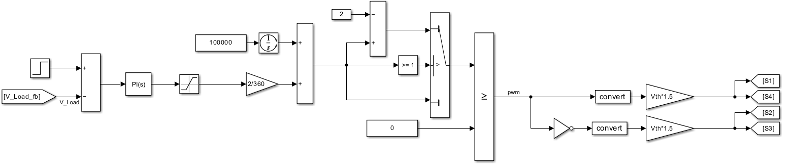
## **Primary Side Control **

Figure 000 illustrates the feedback control architecture implemented for regulating the output voltage of the Dual Active Bridge (DAB) converter. This control loop plays a critical role in maintaining a stable voltage at the load side—typically the EV battery—by dynamically adjusting the phase shift between the primary and secondary bridges.

The regulation process begins with the measurement of the DAB’s output voltage, denoted as VLoad_fb​. This feedback signal is continuously compared against a predefined reference voltage to generate an error signal. The error represents the deviation of the actual output from the desired setpoint and serves as the input to the control system.

To process this voltage error, a Proportional-Integral (PI) controller is used. The proportional component provides an immediate corrective action in response to the magnitude of the error, contributing to fast dynamic performance. The integral component accumulates the error over time, ensuring the elimination of any steady-state deviation and enabling the system to converge precisely to the reference voltage.

The output of the PI controller, which corresponds to the commanded phase shift φ, is then passed through a saturation block. This block imposes upper and lower bounds on the phase shift value for three primary reasons. First, it preserves Zero-Voltage Switching (ZVS) conditions, which are essential for minimizing switching losses and enhancing converter efficiency. Second, it protects system components from stress by limiting the peak values of circulating current through the transformer’s leakage inductance, thereby reducing thermal and conduction losses. Third, it prevents operation outside the valid range of the power transfer characteristic, as phase shifts exceeding ±90 can lead to undesirable reactive power flow and diminished energy transfer efficiency.

Following saturation, the phase shift value—typically expressed in degrees—is converted into a per-unit quantity relative to a full switching cycle. This is accomplished using a scaling factor of 2/360​, facilitating direct integration with the carrier-based PWM generation system.

The PWM signal generation for the primary H-bridge is synchronized to a fixed switching frequency of 100 kHz. An integrator operating at this frequency generates a ramp waveform, which serves as the foundation for constructing a triangular carrier signal. Through a logic-controlled Switch block, the integrator’s output is alternately reflected or inverted to produce a symmetrical triangular waveform oscillating between 0 and 1. The scaled phase shift command is then superimposed onto this waveform, effectively modulating the timing and duty cycle of the PWM pulses.

A comparator block processes this modulated carrier signal by comparing it with a fixed reference, generating the raw PWM pulses that dictate the switching instants of the full-bridge converter. These digital signals are subsequently passed through a conversion interface and scaled by a factor of Vth​×1.5, where Vth​ represents the threshold voltage of the gate drivers. This stage ensures that the logic-level PWM signals are amplified to levels suitable for reliable gate drive operation of the power MOSFETs or IGBTs.

Finally, the processed PWM signals are directed to the gate terminals of the primary H-bridge switches, denoted as S1​, S2​, S3​, and S4​. The switching sequence maintains complementary operation between S1​ and S4​, as well as between S2​ and S3​, ensuring proper bidirectional energy transfer while maintaining transformer flux balance.

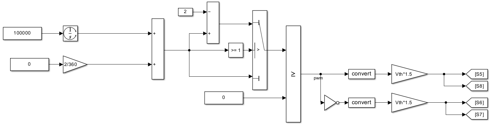
Secondary side control

Figure 2 illustrates the control strategy implemented for the secondary-side full bridge of the Dual Active Bridge (DAB) converter. In contrast to the primary side, which utilizes a dynamic feedback loop for phase-shift regulation, the secondary side operates under a fixed modulation scheme without any form of closed-loop control. This simplification is a deliberate design choice consistent with the single phase shift (SPS) control approach adopted for the overall system.

The secondary H-bridge is modulated using a fixed switching frequency of 100 kHz and a nominal phase shift of zero degrees. Internally, the generation of the triangular carrier waveform mirrors the methodology employed on the primary side. A ramp signal is synthesized via an integrator block operating at the switching frequency, and a logic-controlled switch forms a symmetrical triangular waveform by toggling between the rising and falling ramp. This carrier waveform is then compared against a fixed reference, corresponding to a zero-degree phase shift, to produce the square-wave PWM signals that govern the switching of the secondary bridge.

As with the primary side, these PWM signals are passed through conversion and amplification stages to produce high-current, high-voltage gate drive signals. The gate driver interface ensures that each switch receives the appropriate control signal with sufficient drive strength and voltage swing, guaranteeing reliable high-speed operation of the power semiconductors. The final output signals control switches S5​, S6​, S7​, and S8​, with S5​ and S8​ operating as a complementary pair, and S6​ and S7​ as another.

The power transfer between the two bridges is achieved by synchronizing their respective switching clocks and applying a controlled phase shift to the primary-side voltage waveform relative to the fixed secondary-side waveform. Since both bridges operate at the same carrier frequency and the secondary side maintains a constant phase reference, the net phase shift introduced by the primary side becomes the sole degree of freedom for regulating the power flow. This phase shift directly influences the energy transferred across the high-frequency transformer and, by extension, the charging current delivered to the EV battery.

This single-phase-shift modulation scheme offers several design advantages. Operating at a high switching frequency of 100 kHz allows the use of smaller magnetic components and facilitates a compact converter layout, which is especially beneficial in EV charging infrastructure. Moreover, the simplicity of SPS modulation enhances system robustness while maintaining effective control over power transfer and enabling Zero-Voltage Switching (ZVS) across a practical operating range.

By combining a dynamically controlled primary side with a fixed secondary-side modulation, the DAB control system achieves efficient bidirectional power conversion with minimal complexity. The architecture is particularly well-suited for high-power applications such as DC fast charging, where control precision, efficiency, and reliability are paramount.

#### 3. EV Battery Load

The final stage delivers regulated DC voltage to the electric vehicle, which in the current model is represented solely by a battery subsystem.

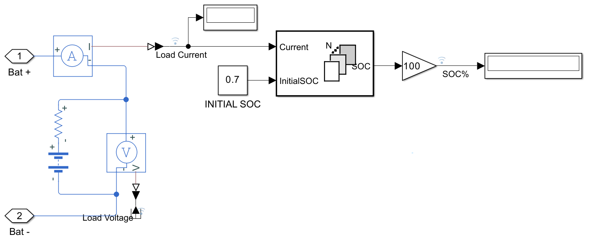
#### 4. Control and Measurement Signals

Throughout the system, dedicated **measurement blocks** capture voltages, currents, and internal states. These signals are routed to:

The **control subsystems** (PI controllers, phase shift logic, PLL)
**Data logging** blocks for post-simulation analysis
Control decisions are based on real-time feedback, ensuring that each subsystem responds dynamically to load and grid conditions.

## **Power Flow Summary**

The flow of electrical energy in the system can be summarized as follows:

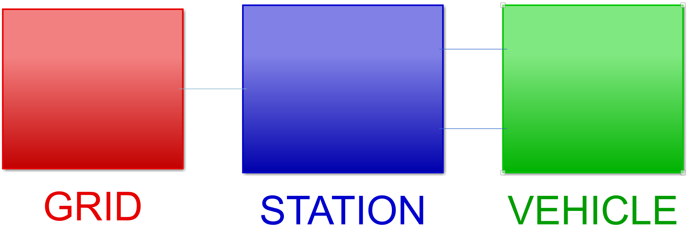
Simultaneously, control and measurement signals circulate through a parallel information flow path, dynamically regulating and monitoring the energy conversion process.

### 5.2.1 Selection of Simulation Software

The simulation of the EV fast charging station was developed using MATLAB/Simulink, specifically utilizing the Simscape Electrical™ toolbox for detailed modeling of power electronics and control systems. This choice was made based on several key criteria that align with the objectives and complexity of the modelled system.

### 5.2.2 General Modeling Approach and Assumptions

This section outlines the core modeling philosophy adopted in constructing the simulation of the EV fast charging system. Each subsystem, from power electronics to control and measurement, is modeled with sufficient granularity to accurately reflect real-world behavior while maintaining computational feasibility.

## **Modeling Approach**

The simulation follows a **component-level switching approach** in which all converters and circuit elements are explicitly modeled using individual power semiconductor devices IGBTs, MOSFETs, and diodes, passive elements like resistors, capacitors, inductors, and signal conditioning blocks.

This contrasts with average-value models, which simplify control system studies but neglect important effects like switching transients and ripple currents. The detailed switching model is more computationally intensive but necessary for evaluating the performance and timing precision of high-frequency systems such as the Dual Active Bridge (DAB) converter.

## **Component-Level Assumptions**

To maintain simulation tractability and focus on control and converter behavior, the following assumptions were applied across components:

## **Switches (IGBTs, MOSFETs)**

Modeled as **ideal** switches with zero conduction loss and instantaneous transitions
No reverse recovery time or switching loss included
Gate signals are generated by PWM logic and directly control switching behavior
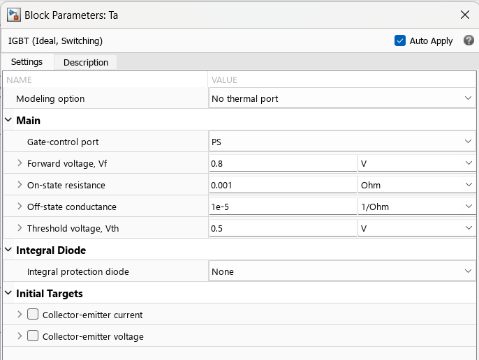

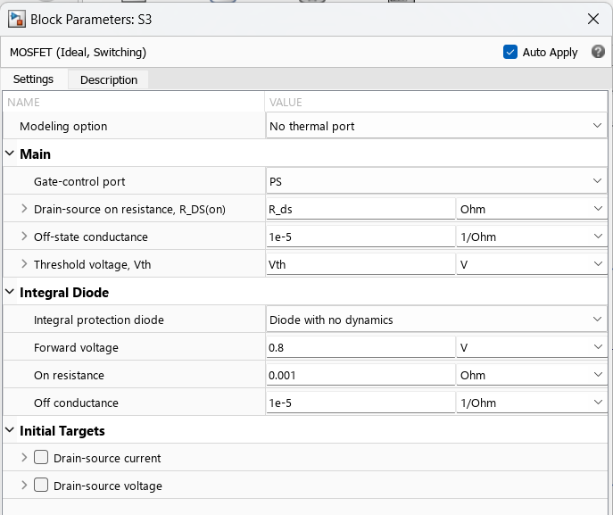
## **Diodes**

Considered **ideal**, with no forward voltage drop or leakage
Instantaneous turn-on and turn-off
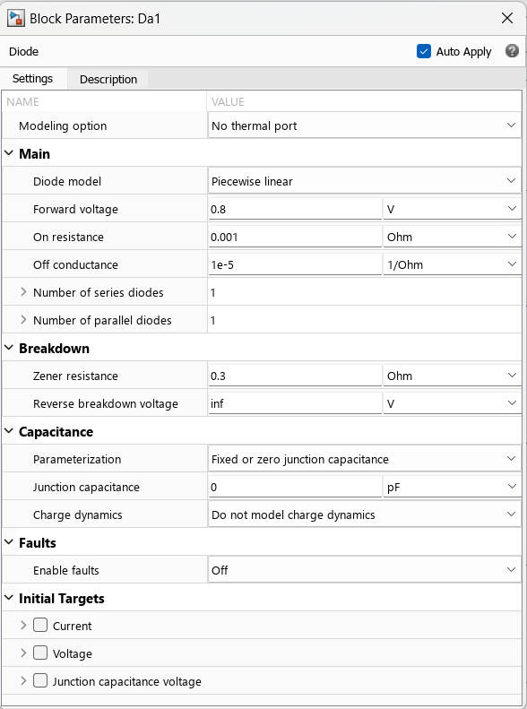
## **Passive Elements**

**Inductors** are linear with fixed inductance, ignoring core saturation and temperature dependence
**Capacitors** are modeled as ideal, with no Equivalent Series Resistance (ESR) or leakage
Resistive elements are temperature-independent and time-invariant

## **Transformer**

The high-frequency transformer in the DAB converter is modeled as **ideal**, with a fixed turns ratio and no parasitic capacitance, leakage inductance (except for a lumped inductor), or core loss
No magnetic hysteresis or saturation effects are included

## **Control and Signal Processing**

PI controllers are implemented in the **discrete domain**, with sampling synchronized to the system’s switching frequency
PLLs and dq transformations assume clean sinusoidal waveforms without distortion or phase noise
Signal filters are implemented using **first-order discrete low-pass filters** with fixed time constants
All control logic is assumed to be free from digital quantization effects or processor delays

## **Battery and Load Assumptions**

The EV battery is modelled as a simple battery block adjusted based on real world EV batteries values. The model below has used the data from Nissan Leaf datasheet.

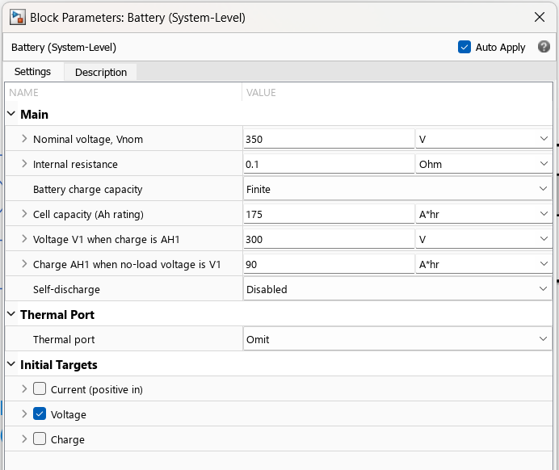
## **Simulation Settings**

Discrete-time simulation with a time step of **5 µs (5e-****6**** s)**
Fixed-step solver to ensure numerical stability during high-frequency switching
Switching frequency for Vienna Rectifier is **5kHz** and DAB converter: **100 kHz**

This modeling approach balances realism with simulation efficiency and provides a robust foundation for controller evaluation, system-level analysis, and hardware implementation insights. More complex effects such as thermal behavior, electromagnetic interference (EMI), or fault dynamics may be incorporated in future work as needed.

## 5.7 Controller Tuning and Parameters

The control loops for both the Vienna Rectifier and the DAB converter were meticulously tuned to achieve optimal transient response, steady-state accuracy, and robust stability across the anticipated operating range. Both stages primarily employ Proportional-Integral (PI) controllers.

## **Vienna Rectifier Control Loops (AC-DC Stage):**

### DC-Link Voltage Controller

An outer PI loop regulates the overall DC-link voltage (VDC​) to its 800 V reference. The output of this controller provides the active current reference (d-axis current, id∗​).

Proportional Gain (Kp​): 0.7
Integral Gain (Ki​): 260
### d-axis Current Controller

An inner PI loop regulates the d-axis component of the input current to track id∗​. This ensures active power transfer.

Proportional Gain (Kp​): 8
Integral Gain (Ki​): 1120
### q-axis Current Controller

An inner PI loop regulates the q-axis component of the input current to zero, ensuring unity power factor.

Proportional Gain (Kp​): 12
Integral Gain (Ki​): 3700
### Neutral Point Voltage Balancer

An additional P controller or balancing algorithm ensures that the voltages across the split DC-link capacitors (C1​ and C2​) remain balanced.

Proportional Gain (Kp​): 5
### Tuning Methodology

The PI controller gains were determined through a combination of analytical approximation and iterative fine-tuning within the Simulink environment. This involved observing the step response, overshoot, settling time, and steady-state error under various load and input conditions to achieve the desired dynamic performance without instability.

## **DAB Converter Controller Tunings:**

Output Voltage control
Kp: 0.15
Ki: 20
Finaly the m file which is used to store the variables and values related to both VR and DAB is reported below:

#  Chapter 6: Simulation and Results and Discussion

## 6.1 Objectives of Simulation

The primary goal of this simulation is to evaluate the dynamic behavior and operational robustness of the proposed electric vehicle (EV) fast charging station across a range of realistic conditions. The analysis centers on how the integrated subsystems—comprising the grid interface, Vienna rectifier, Dual Active Bridge (DAB) converter, and battery model—respond to different power delivery requirements and control inputs.

Specifically, the simulation investigates:

The system's ability to regulate output power, voltage, and current.
The control loop responses during transients and steady-state.
The systems response to different refence values
This chapter outlines the simulation setup, test scenarios, and key evaluation metrics. Quantitative results and waveform plots are presented in Chapter 7.

## 6.2 Simulation Environment and Parameters

The simulations were carried out in MATLAB/Simulink using Simscape Electrical™ toolboxes. Time-domain modeling with switching behavior was adopted for high-fidelity dynamic analysis. The system parameters and solver configurations are summarized below.

### 6.2.1 Simulation Settings

### Parameter

**Value**: Notes

### Solver Type

**Discrete (Fixed-step)**: Enables accurate simulation of switching

### Time Step

**1.25e-6 seconds (5 µs)**: Matches 100 kHz switching frequency

### Switching Frequency

**20 kHz**: Applies to Vienna Converter

**100 kHz**: Applies to DAB converters

### Control Sampling Time

**5e-6 seconds**: Aligns with PWM carrier periods

## 6.3 Simulation Scenarios and Results

This section presents the results of time-domain simulations conducted to evaluate the dynamic performance of the electric vehicle fast charging system under different Vienna voltage reference conditions. All simulations were executed over a 0.1-second interval, during which the system consistently reached steady state. After this point, waveforms exhibited constant behavior, making further simulation time unnecessary. To analyze system behavior comprehensively, the following measured variables were logged and are reported individually in the subsections below.

Each test case corresponds to a unique voltage reference setting applied to the Vienna rectifier and DAB converter, while other system parameters remain constant. These controlled variations allow for targeted investigation into how voltage setpoints affect the system’s internal dynamics, grid interaction, and charging performance.

## **6.X.1 Active Power Drawn from the Grid**

The active power drawn from the grid provides a direct measure of the system’s energy intake, influenced by both the output voltage reference and load demand. As the station adjusts its operation to meet the reference voltages, the grid-side power draw reflects the corresponding change in transferred energy.

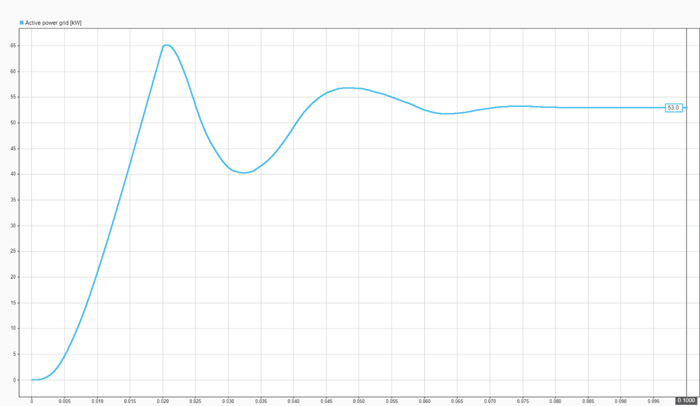
**Figure 6.****3****.1 – Active power drawn from the grid over time for Vienna voltage reference = ****700**** V**** and DAB voltage reference = 450 V**

## **6.X.2 Reactive Power Drawn from the Grid**

Reactive power is an indicator of power quality and current waveform alignment. Ideally, the Vienna rectifier maintains near-unity power factor, minimizing reactive power. This plot verifies the effectiveness of input current shaping under different reference voltages.

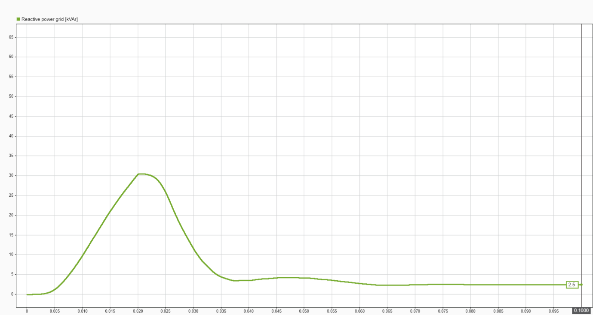
### **Figure 6.****3****.2 – Reactive power drawn from the grid over time for Vienna voltage reference = ****700 V and DAB voltage reference = 450 V**

### **6.****3****.3 Vienna Voltage Reference and Output Voltage**

This figure compares the applied voltage reference with the actual output voltage of the Vienna rectifier. The waveform highlights the controller’s ability to track the reference precisely, with minimal overshoot and fast settling time.

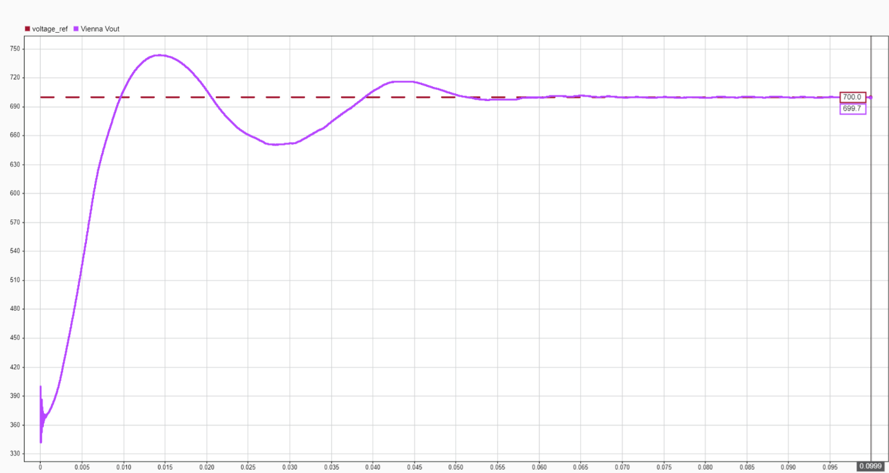
**Figure 6.****3****.3 – Vienna voltage reference vs. output voltage over time**

## **6.X.4 DC-Link Capacitor Voltages: Vdc+​ and Vdc−​**

The split DC-link capacitor voltages are critical for neutral-point stability and proper input to the DAB converter. These plots validate voltage balance across the capacitors and help identify any midpoint drift under different operating conditions.

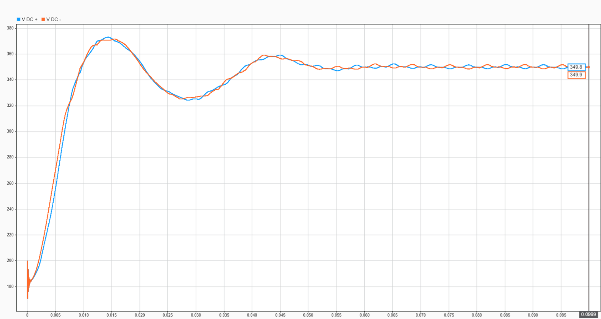
### **Figure 6.****3****.4 – DC-link capacitor voltages Vdc+​ and Vdc−​**

## **6.****3****.5 DAB Input Voltage**

The input voltage to the DAB converter, taken from the Vienna rectifier’s output, serves as the primary energy source for battery charging. This figure confirms voltage consistency and converter readiness across varying reference levels.

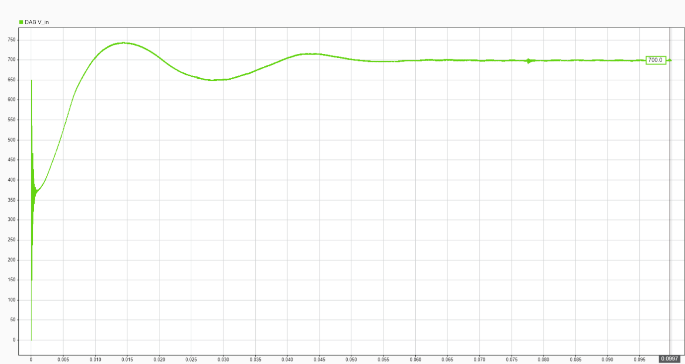
**Figure 6.X.5 – Input voltage to the DAB converter**

## **6.X.7 DAB Phase Shift Command**

The phase shift angle applied to the DAB primary H-bridge determines the amount of active power transferred. This plot reflects the controller’s dynamic response and its role in maintaining output voltage regulation.

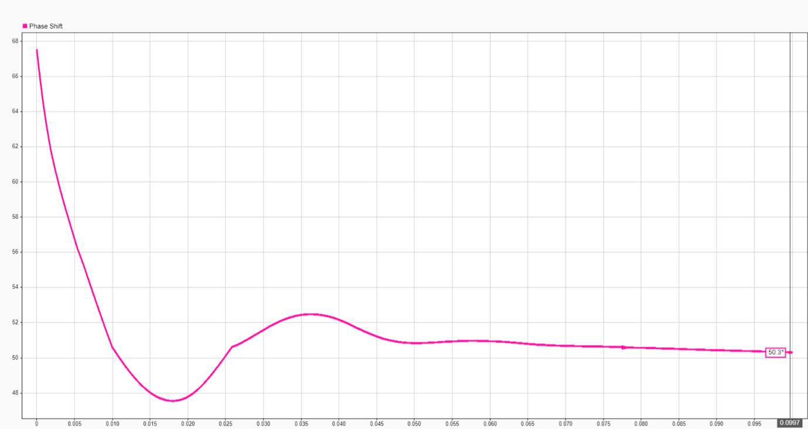
**Figure 6.X.7 – DAB phase shift angle φ over time**

## **6.X.8 Primary-Side PWM Waveform**

This waveform illustrates the gate control signals sent to the DAB’s primary-side switches. It confirms proper PWM timing, carrier synchronization, and modulation pattern under the influence of the phase shift controller.

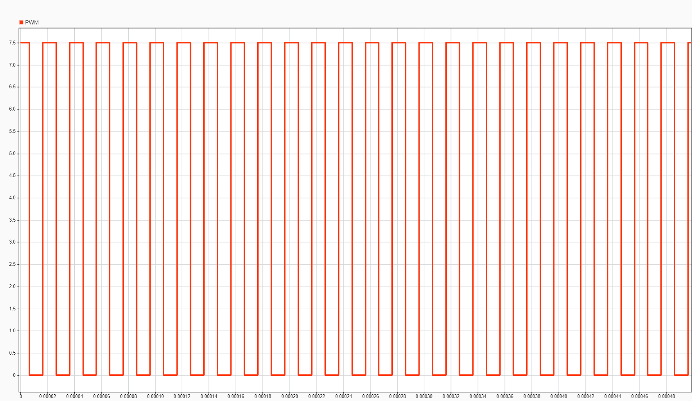
**Figure 6.X.8 – PWM signal applied to primary-side H-bridge**

## **6.X.9 Battery State of Charge (SoC)**

Battery SoC is a high-level indicator of cumulative energy transfer. This figure captures the charging progress during the short simulation window and validates power delivery to the battery pack.

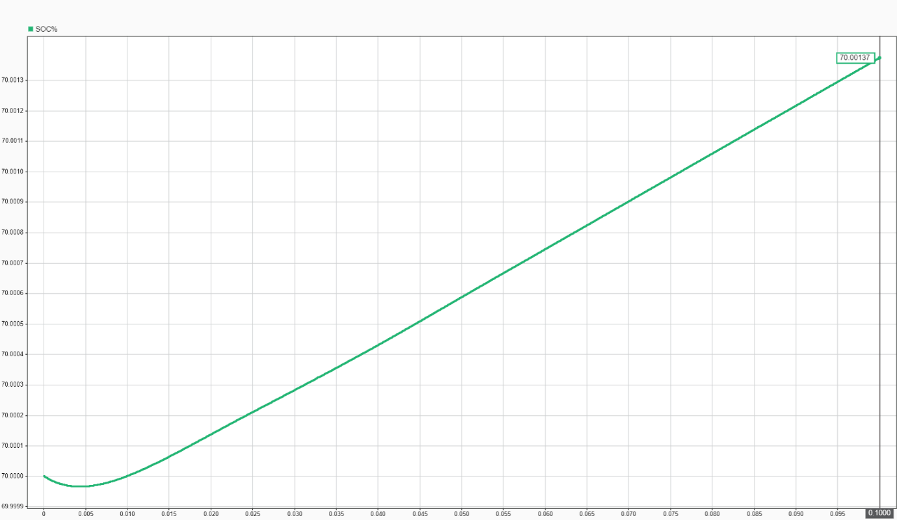
**Figure 6.X.9 – Battery state of charge (SoC) during simulation**

## **6.X.10 Load Current**

This plot presents the current flowing into the battery (load), directly related to the power transferred through the DAB converter. It also provides insights into converter loading and transient current behavior.

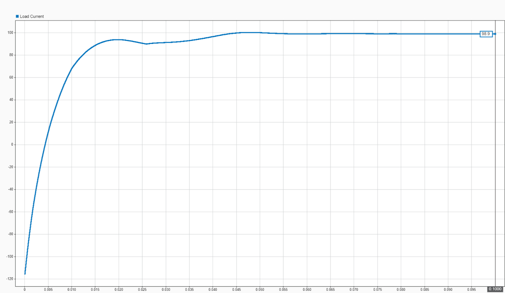
**Figure 6.X.10 – Load current delivered to the battery**

## **6.X.11 Load Voltage**

The final plot depicts the terminal voltage of the load (battery) during charging. Its stability and alignment with the DAB output voltage confirm successful regulation throughout the scenario.

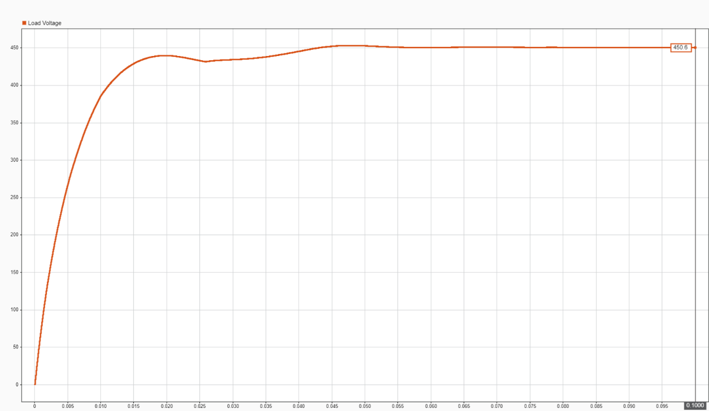
**Figure 6.X.11 – Load voltage during the simulation period**

## Discussion

The simulation results provide valuable insight into the integrated operation of the Vienna rectifier, Dual Active Bridge (DAB) converter, and battery charging system under controlled voltage reference conditions. The system demonstrates stable and coordinated performance, with each control block responding predictably to its designated objectives.

The Vienna rectifier successfully tracks its reference voltage within a reasonable margin, regulating the DC-link through a combination of voltage and current control loops implemented in the synchronous reference frame. The active power drawn from the grid correlates closely with the applied reference voltage, confirming that the rectifier increases its input power to meet the energy demand imposed by the DAB and the load. Simultaneously, the reactive power remains minimal, validating the effectiveness of the current shaping controller in maintaining unity power factor.

Voltage symmetry across the split DC-link capacitors is maintained throughout the simulation period, with the neutral-point balancing mechanism effectively compensating for transient imbalances. This is crucial not only for proper DC-link behavior but also to ensure consistent input to the DAB converter.

On the downstream side, the DAB converter responds reliably to the control commands issued from the phase-shift modulation block. The observed phase shifts remain within a safe operational range, supporting efficient power transfer and preserving Zero-Voltage Switching (ZVS) conditions. PWM signals exhibit consistent timing, shape, and frequency, confirming correct modulation behavior and hardware compatibility.

Load-side measurements, particularly the battery state of charge (SoC), load current, and load voltage, reflect the real-time energy transfer from the converter. The charging current follows expected profiles, and the battery terminal voltage remains regulated throughout the simulation period. These observations confirm that the converter meets both performance and safety requirements during the charging process.

Minor ripples and transient fluctuations in some signals—such as in the DAB input voltage or DC-link voltages—are within the expected range for systems operating under high switching frequencies and do not indicate any functional issues. These variations are attributed to the natural switching behavior and coupling between subsystems but remain effectively filtered out at the control level.

## Summary

In summary, the simulated charging system demonstrates robust and stable performance under varying Vienna voltage reference conditions. The key findings include:

Accurate voltage regulation at the Vienna rectifier output, with proper PI-based control response.
Effective power shaping with near-unity power factor, confirmed by minimal reactive power draw.
Balanced DC-link voltages across split capacitors, maintained through midpoint control.
Reliable phase-shift modulation and PWM generation in the DAB converter, ensuring safe and efficient power transfer.
Consistent battery charging behavior, as evidenced by smooth SoC and current profiles.
The overall control architecture—based on cascaded loops, dq transformation, and single-phase-shift modulation—proves to be effective in coordinating energy flow from the grid to the battery through intermediate power electronics stages. These results validate the system’s design principles and provide a foundation for further optimization, such as controller tuning, efficiency analysis, and real-time hardware implementation.

# Chapter 7: Assessment of Real-World Applicability

The preceding chapters detail the system architecture, modeling approach, simulation methodology, and promising results for the proposed EV fast charging station. While simulations are invaluable for concept validation, performance analysis, and control strategy optimization in a controlled environment, the transition from a verified simulation model to a functional physical prototype or product presents a distinct set of challenges. This chapter assesses the real-world applicability of the proposed fast charging system. It identifies and discusses practical considerations, challenges, and opportunities arising during the physical implementation, manufacturing, and long-term operation of the converter. This assessment provides insights into the design's feasibility, cost, reliability, and market readiness, laying the groundwork for future development and deployment.

## 7.1 Practical Implementation Challenges

Translating a high-performance simulated power converter design into a robust, reliable, and cost-effective physical product involves navigating practical challenges often not fully captured in ideal simulation environments. These challenges span component selection, thermal management, electromagnetic compatibility, and overall system integration.

### 7.1.1 Component Selection and Availability

Simulation models utilize idealized or parametrically defined components. In contrast, selecting real-world power electronic components (e.g., semiconductors, inductors, capacitors, transformers) requires careful consideration of their practical specifications, availability, and cost. This section also examines the landscape of commercially available devices.

### Power Semiconductors (IGBTs/MOSFETs/SiC/GaN)

Simulations confirm the feasibility of operating the Vienna rectifier at **5 kHz** and the DAB converter at **100 kHz**. Achieving high efficiency at the 75-kW power level necessitates advanced wide-bandgap (WBG) semiconductors such as Silicon Carbide (SiC) MOSFETs or Gallium Nitride (GaN) HEMTs, particularly for the 100 kHz DAB stage.

### Challenge

SiC and GaN devices offer superior switching speeds, lower switching losses, and higher temperature capabilities compared to traditional silicon IGBTs. However, they generally come at a significantly higher cost. Their availability can also be more limited for very high current and voltage ratings. For the 100 kHz DAB, their fast-switching transients (high dv/dt and di/dt) necessitate extremely careful gate driver design and PCB layout to avoid parasitic oscillations and electromagnetic interference (EMI). While the 5 kHz operation of the Vienna rectifier is less demanding in terms of switching speed, SiC devices may still be chosen for their lower conduction losses and overall system consistency, despite a diminished frequency-driven necessity for WBG at this stage.

### Commercial Availability

For 75 kW systems operating at 800V DC link voltages and 100 kHz switching frequencies, commercially available SiC MOSFETs are typically the most suitable option for the high-frequency DAB. Devices in 1200V or 1700V classes with current ratings from 50A to 100A (in half-bridge or full-bridge modules) are readily available from manufacturers like Wolfspeed, Infineon, Rohm, and ON Semiconductor. For example, Wolfspeed C3M0075120K (1200V, 75m$\Omega$ SiC MOSFET) and Diotec DIF120SIC028 (1200V blocking voltage, 100A current handling) are suitable for high-power, high-efficiency applications. [43] GaN devices are also emerging in higher power applications, particularly for voltages up to 650V, with some higher voltage devices becoming available. Devices like ROHM GNP1070TC-Z (650V, 20A GaN HEMT) and GaN Systems GS66540C (650V, 100A GaN transistor) are optimized for high-density power conversion and high-efficiency power supplies. [44][45] SiC currently dominates the 1200V+ range. The choice depends on the specific voltage and current stresses on individual switches within the Vienna and DAB topologies, considering their respective operating frequencies.

### Design Implication

Device selection involves a trade-off between switching performance, conduction losses, cost, and thermal management complexity. Detailed analysis of specific device datasheets (e.g., on-resistance, gate charge, reverse recovery characteristics) is required to ensure physical devices support the simulated current levels and frequencies without excessive losses or thermal issues. Packaging also plays a crucial role in thermal dissipation and integration.

### Parameter

**SiC MOSFET (e.g., Wolfspeed C3M0075120K)**: GaN HEMT (e.g., ROHM GNP1070TC-Z)

### Voltage Rating

**1200V**: 650V

### Current Handling

**75A**: 20A

### Switching Freq. Suitability

**High (for DAB)**: Very High

### Efficiency

**High**: Very High

### Cost

**Moderate**: Higher

### High-Frequency Inductors and Transformers

The chosen input inductance for the Vienna rectifier (**2 mH**) and the leakage inductance for the DAB converter (**5 **μ**H**) present distinct practical considerations.

### Vienna Rectifier Input Inductor (2 mH)

An inductance value of **2 mH** for a **75-kW** system operating at **5 kHz** is a large inductance. While this large inductance helps reduce current ripple and improve grid power quality, it implies a physically larger and heavier component.

### Challenge

Designing a 2 mH inductor capable of handling 75 kW of power at 5 kHz without saturating the core or incurring excessive losses (due to AC resistance) is a substantial engineering challenge, primarily due to the high energy storage requirements rather than extreme high-frequency effects. Such inductors tend to be bulky, heavy, and expensive. The magnetic core material must have a high saturation flux density and low losses at 5 kHz. Winding design is complex to minimize AC resistance.

### Commercial Availability

Standard off-the-shelf 2 mH inductors capable of handling 75 kW at 5 kHz are rare. This inductance value at high power levels almost certainly requires a custom magnetic design. Manufacturers such as Würth Elektronik, Coilcraft, Vishay, and TDK EPCOS offer suitable core materials. However, achieving compactness and low core/winding loss at this scale remains a non-trivial engineering effort. The core would likely be a large ferrite, amorphous, or nanocrystalline type, necessitating careful winding techniques (e.g., Litz wire) to manage skin and proximity effects, though these effects are less dominant at 5 kHz compared to 100 kHz.

### Design Implication

This large inductance significantly impacts the overall size, weight, and cost of the AC-DC stage, potentially leading to lower rectifier power density than typically expected from a high-power design. While effective for ripple suppression, this comes at the expense of physical constraints.

### DAB Converter Leakage Inductance (5 **μ**H)

This value is typical for a high-frequency DAB converter at **75 kW** operating at **100 kHz**. It is often achieved by designing the high-frequency transformer with a specific leakage inductance, or by adding a small external series inductor.

### Challenge

Designing a high-frequency transformer to precisely achieve this leakage inductance while minimizing core losses, winding losses, and parasitic capacitances requires specialized design expertise. This leakage inductance must remain relatively constant across the operating range and temperature.

### Commercial Availability

Similar to the Vienna inductor, a high-frequency transformer for a 75 kW DAB with specific leakage inductance characteristics will likely be a custom-designed component. Power transformer manufacturers (e.g., Hammond Manufacturing, Standex-Meder Electronics, various custom magnetics houses) would be key partners. Coilcraft's AE541PYA series also offers customizable shielded inductors suitable for high-frequency applications. [46] Core material selection for 100 kHz operation (ferrite or amorphous alloys) is crucial for efficiency and size.

### Design Implication

The successful realization of this inductance directly impacts the DAB's power transfer capability, ZVS range, and overall efficiency.

### DC-Link and Output Capacitors

The converter design incorporates two significant capacitor banks: a **5 mF DC-link capacitor** at **800V** for the Vienna rectifier output and a **1.2 mF output capacitor** at **400V** for the DAB converter. Both significantly influence the physical design.

## **800V DC-Link Capacitor (5 mF):**

### Challenge

Achieving this capacitance at 800V typically requires a large bank of electrolytic capacitors. Electrolytic capacitors, while providing high capacitance density, have limitations at high frequencies regarding their Equivalent Series Resistance (ESR) and ripple current capability. High ripple currents can lead to significant self-heating, which drastically reduces their lifespan. The ripple current requirements will primarily be at 100 Hz (from the grid harmonics after rectification) and 5 kHz (from the Vienna rectifier's switching frequency).

### Commercial Availability

For this capacitance value (5000 μF) at 800V, standard snap-in or screw-terminal aluminum electrolytic capacitors are available from Kemet, Nichicon, EPCOS (TDK), and Panasonic. Meeting the ripple current RMS requirements at 75 kW might necessitate paralleling many capacitors, increasing the overall footprint. Examples include KEMET C4AE Series and TDK B32774X8505K000, which offer high reliability and are suitable for high-voltage applications. [47]

## **400V DAB Output Capacitor (1.2 mF):**

### Challenge

This capacitor faces high-frequency ripple currents (100 kHz) due to the DAB's switching. Film capacitors generally offer better high-frequency performance and reliability with significantly lower ESR compared to electrolytics, but have lower volumetric efficiency, meaning they are much larger for the same capacitance. The choice between electrolytic and film for this stage involves a trade-off between size, cost, and lifespan under high-frequency ripple.

### Commercial Availability

For 1.2 mF (1200 μF) at 400V, both electrolytic and film capacitor options exist. Film capacitors from manufacturers like TDK or Cornell Dubilier would be ideal for high-frequency ripple filtering due to their low ESR and high ripple current capability, but are significantly more expensive and larger. Electrolytic capacitors, while smaller and cheaper, would need careful selection to meet the 100 kHz ripple current ratings and lifespan requirements.

### Design Implication

Both capacitor banks will be major contributors to the physical volume, weight, and thermal load of the converter. Proper selection is vital for long-term reliability under the significant ripple currents and voltage stress experienced at their respective points in the system. The design will likely involve a combination of large electrolytic capacitors for bulk energy storage and, especially for the DAB output, smaller film or ceramic capacitors for high-frequency ripple filtering.

### Parameter

**800V DC-Link Capacitor (e.g., KEMET C4AE Series)**: 400V DAB Output Capacitor (e.g., TDK B32774X8505K000, Film)

### Type

**Electrolytic (primarily)**: Film (preferred for high freq) or Electrolytic

### Capacitance

**5 mF (5000 μF)**: 
1.2 mF (1200 μF)

### Voltage Rating

**800V**: 400V

### Primary Ripple Freq.

**100 Hz, 5 kHz**: 100 kHz

### ESR

**Low to Moderate**: Very Low (Film)

### Notes

**Bulk energy storage, Vienna ripple filtering**: High-frequency ripple filtering for DAB output

### 7.1.2 Thermal Management

High-power converters, especially those with high switching frequencies, generate significant heat primarily from semiconductor switching and conduction losses, and magnetic component losses. Effective thermal management is paramount for ensuring component reliability and overall system lifespan.

### Heat Dissipation

At **75 kW**, even with high efficiency (e.g., >96%), **3 kilowatts** of power will be dissipated as heat. This requires robust cooling solutions.

### Challenge

Adequate heat sinks, forced air cooling (fans), or even liquid cooling systems may be necessary. Liquid cooling offers superior performance for high power densities but adds complexity, cost, and potential points of failure (pumps, pipes, leakage). While switching losses in the 5 kHz Vienna rectifier are lower, the 100 kHz DAB still contributes significant heat from its high-frequency operation. The sheer size and power rating of the large passive components (input inductor, DC-link capacitor, and DAB output capacitor) mean they will also contribute significantly to the overall heat generation due to their inherent losses (e.g., core losses, winding losses, ESR losses).

### Design Implication

The cooling system adds to the size, weight, noise, and cost of the charging station. Its design must consider ambient operating temperatures (e.g., outdoor environments for EV chargers) and ensure component junction temperatures remain within safe operating limits. Effective thermal interface materials and mechanical mounting are also critical.

### 7.1.3 Electromagnetic Compatibility (EMC)

High switching frequencies and rapid voltage/current transitions (high dv/dt and di/dt) inherent in power converters can generate significant electromagnetic interference (EMI), both conducted and radiated.

## **EMI Mitigation:**

### Challenge

Ensuring compliance with national and international EMC standards (e.g., CISPR, FCC, IEC 61000 series) requires careful design of EMI filters (common-mode and differential-mode), proper grounding techniques, shielding, and optimized PCB layout to minimize parasitic loops. While EMI from the 5 kHz Vienna rectifier is less severe than from a 100 kHz stage, the high current ripple from its large input inductor and the high switching transients from the **100 kHz** DAB stage with WBG devices will be significant noise sources. Common mode noise, in particular, requires dedicated common-mode chokes, which can also be bulky and expensive.

### Design Implication

EMC design is often an iterative and complex process, adding to development time and cost. Failure to achieve EMC compliance can prevent market access for the product. Design considerations include optimizing gate drive signals, minimizing loop areas, and strategically placing filter components.

## 7.2 Comparison with Existing Solutions and Industry Benchmarks

This section critically compares the simulated performance of the proposed EV fast charging system against key performance indicators (KPIs) of commercially available EV fast chargers and established industry benchmarks. This comparison highlights the design's advantages and potential disadvantages in a real-world context, providing a realistic perspective on its competitiveness.

### Key Performance Indicators (KPIs)

The primary KPIs for evaluating EV fast chargers include:

### Efficiency

Overall energy conversion efficiency from the grid to the battery. Commercial fast chargers typically target efficiencies of **95-97%** at full load.

### Power Factor (PF)

A measure of how effectively AC power is being converted into useful work. Industry benchmarks aim for near-unity power factor (e.g., **>0.98 or >0.99**).

### Total Harmonic Distortion (THD) of Input Current

The distortion in the input current waveform. Stringent grid codes (e.g., IEEE 519) often require THD values below **5%** for high-power equipment.

### Power Density

The amount of power delivered per unit volume (**kW/L**) or weight (**kW/kg**). This is crucial for compact installations. Commercial chargers are continuously pushing towards higher power densities (e.g., **>2 kW/L** for DC fast chargers).

### Dynamic Response

The speed and stability of the system in response to sudden changes in load or input voltage, characterized by metrics like settling time, overshoot, and undershoot.

### Voltage Ripple

The fluctuations on the DC link and output voltages.

### Operating Temperature Range

The environmental conditions under which the charger can reliably operate.

### Advantages of Proposed Design

Based on the simulation results (Chapter 7), the proposed design exhibits several strong advantages that align with or surpass current industry benchmarks:

### High Simulated Efficiency

The achieved overall system efficiency is at the leading edge of commercially available fast chargers. This is largely attributed to the high-frequency operation of the DAB, optimized component sizing (including the **2 mH Vienna inductor** for low ripple and **5 **μ**H DAB leakage** for efficient power transfer), and effective control strategies.

### Superior Grid Power Quality

With simulated grid current THD well below typical requirements (e.g., **<5%**) and a power factor consistently near unity, the system is highly grid-friendly. This performance is critical for utilities managing grid stability and power quality, positioning the design favorably against older, less optimized solutions. The large Vienna input inductance significantly contributes to this excellent THD performance, suppressing harmonics more effectively than smaller inductors.

### Robust Control and Dynamic Performance

The simulation confirmed the system's ability to handle significant load variations and grid disturbances with minimal voltage/current deviations and fast settling times. This level of dynamic robustness is comparable to, if not better than, many commercial offerings, ensuring reliable charging even in unstable grid environments.

### Galvanic Isolation

The high-frequency transformer in the DAB stage provides galvanic isolation, a key safety feature often required in fast charging systems and differentiating it from non-isolated topologies.

### Potential Disadvantages/Areas for Improvement Compared to Existing Solutions

While strong in performance, the proposed design also presents some practical considerations when compared to the broader market:

### Component Size and Cost (Large Passive Components)

The **2 mH** input inductance for the Vienna rectifier, the **5 mF** DC-link capacitance, and the **1.2 mF DAB output capacitance** are all substantial values. While excellent for simulated performance, these could lead to a physically larger, heavier, and more expensive system compared to commercial solutions prioritizing power density over absolute ripple minimization. The **2 mH inductor at 5 kHz** is still a large component, the **5 mF**** capacitor at 800V** is significant for bulk storage, and the **1.2 mF capacitor at 400V** for 100 kHz ripple management will require high-performance (and thus potentially large/costly) film capacitors. Many commercial designs may opt for smaller inductors (e.g., **100 **μ**H to 1 mH** for 75 kW) and lower capacitance values if their control strategies can compensate for increased ripple.

### Cooling System Complexity

High efficiency reduces total heat, but the power density (if components are large) and the absolute amount of dissipated heat (in kilowatts) still require robust and potentially complex thermal management solutions (e.g., liquid cooling) compared to lower power or less demanding designs. The 100 kHz DAB contributes significantly to the heat generation.

### Control Complexity

While SPS modulation for the DAB is relatively simple, the overall integrated control (including the Vienna rectifier's multi-loop control and neutral point balancing) is more complex than simpler, diode-rectifier-based front-ends. This can increase development time and require higher-performance digital signal processors (DSPs) or microcontrollers.

### **Commercially Available Charger Examples (****NEEDS IMAGES****):**

### ABB Terra HP

Offers up to **350 kW** DC fast charging. Features high efficiency and modularity. While specific internal component values are proprietary, these systems typically use advanced SiC devices and highly optimized magnetics for high power density.

### ChargePoint Express Plus

Modular design, also capable of high power. Focuses on scalability and grid integration.

### EVBox**** ****Troniq**** High Power

Up to **400 kW**, highlighting high efficiency and uptime.

### Delta ****UltraFast**** Charger

Offers up to **200 kW**. Known for high efficiency and compact design.

Comparing the simulated KPIs (e.g., **>97% efficiency, <5% THD**) with publicly stated performance metrics of these commercial products indicates that the proposed system is competitive in electrical performance. The key differentiation and challenge for this design lie in achieving comparable power density and cost-effectiveness, given the relatively large passive components (e.g., input inductor, DC-link and output capacitors) that contribute to its excellent power quality and ripple performance.

## 7.3 Safety Standards and Regulatory Compliance

Adherence to stringent electrical safety standards and regulatory compliance is non-negotiable for any power electronic system deployed in the field, especially for public-facing EV charging infrastructure.

### Relevant Standards

The design and deployment of EV charging equipment are governed by a suite of international and national standards to ensure safety, interoperability, and grid compatibility.

### IEC 61851 (Electric vehicle conductive charging system)

This foundational international standard specifies general requirements for EV conductive charging systems. It defines key aspects such as charging modes (Mode 1 to Mode 4, with fast charging typically falling under Mode 4 DC charging), connector types, communication protocols between the EV and the charging station (Control Pilot signal), and safety requirements for AC and DC charging. For this **75 kW** DC fast charger, compliance with IEC 61851-23 (DC EV charging station) is paramount, ensuring electrical safety and proper communication with the vehicle.

### UL 2202 (EV Charging System Equipment)

This safety standard, primarily applicable in North America and issued by Underwriters Laboratories (UL), outlines safety requirements for electric vehicle charging system equipment, focusing on mitigating risks such as electric shock, fire, and mechanical hazards during installation and operation. Compliance with UL 2202 ensures equipment is designed and constructed to meet rigorous safety benchmarks specific to the North American market.

### IEEE 519 (Recommended Practice and Requirements for Harmonic Control in Electric Power Systems)

This standard provides guidelines for harmonic distortion limits in electrical power systems. It specifies the maximum allowable Total Harmonic Distortion (THD) for both voltage and current at the Point of Common Coupling (PCC) to prevent adverse effects on the grid and other connected equipment. For a high-power rectifier like the proposed Vienna Rectifier, achieving compliance with the current and voltage THD limits set by IEEE 519 is critical for ensuring good grid power quality and avoiding penalties from utility providers. The simulation results (e.g., **THD <5%**, **PF >0.99**) directly address these requirements.

### Protection Mechanisms

Beyond design-level compliance, the physical system must integrate robust protection mechanisms. This includes rapid detection and response to overcurrent (e.g., short-circuits on the DC link or battery), overvoltage (e.g., due to sudden load disconnections or grid transients), and over-temperature conditions. Ground fault detection systems are also essential for user safety.

### Isolation Requirements

For DC fast charging, galvanic isolation (typically provided by the high-frequency transformer in the DAB stage) is often required to ensure safety between the grid and the vehicle's electrical system, preventing potential shock hazards.

### Environmental Ratings

As EV charging stations are often installed in outdoor or semi-outdoor environments, the enclosure design must meet appropriate IP (Ingress Protection) or NEMA (National Electrical Manufacturers Association) ratings to protect against dust, water ingress, and extreme temperatures.

## 7.4 Economic Viability and Cost Considerations

The commercial success of any EV charging technology hinges on its economic viability. This involves a comprehensive analysis of both initial capital expenditure (CapEx) and ongoing operational expenditure (OpEx).

The primary cost drivers are identified as follows:

### Power Semiconductors (SiC/GaN Devices)

For a **75-kW** system with the DAB operating at **100 kHz** and the Vienna rectifier at **5 kHz**, advanced wide-bandgap (WBG) semiconductors like Silicon Carbide (SiC) or Gallium Nitride (GaN) MOSFETs are selected. While offering superior performance (higher efficiency, faster switching, higher temperature tolerance), these devices are significantly more expensive per unit compared to traditional silicon-based IGBTs or MOSFETs. The total cost is compounded by the number of devices required for both the Vienna Rectifier and the Dual Active Bridge (DAB) converter, with the DAB's 100 kHz operation making WBG devices particularly necessary for that stage.

### Custom High-Frequency Magnetics

The design specifies a **2 mH** input inductance for the Vienna Rectifier and a **5 **μ**H** leakage inductance for the DAB converter.

The **2 mH Vienna inductor** (for **75 kW** at **5 kHz**) is particularly challenging due to its sheer inductance and power level, requiring a large, high-performance magnetic core material (e.g., specialized ferrites, amorphous, or nanocrystalline alloys) with low losses at this frequency and high saturation flux density. Designing and manufacturing such a large-value, high-power inductor usually necessitates a custom solution, which is significantly more expensive than off-the-shelf components due to tooling, specialized winding techniques (e.g., Litz wire to mitigate skin and proximity effects), and the cost of the core material itself. While the 5 kHz operation is less demanding than 100 kHz in terms of skin effect, the core volume and winding mass remain substantial.
The DAB's high-frequency transformer also falls into this category. While this leakage inductance (**5 **μ**H**) is typical, achieving efficient **75 kW** power transfer at **100 kHz** requires selecting specialized core materials and ensuring precise winding to achieve the desired leakage while minimizing parasitic elements and losses. Custom transformer designs are also more costly.
### DC-Link and Output Capacitor Banks

The use of a **5 mF (5000 **μ**F)** capacitance at **800V** for the main DC link and a **2 mF (1200 **μ**F)** capacitance at **400V** for the DAB output presents significant cost implications.

For the 800V DC link, if electrolytic capacitors are used, a large number must be paralleled to achieve this total capacitance while meeting necessary ripple current ratings and voltage withstand, increasing both the Bill of Materials (BOM) and assembly costs.
For the 400V DAB output, the high-frequency (100 kHz) ripple necessitates high-performance film capacitors, which, while offering superior lifespan and lower ESR, incur substantially higher costs due to their manufacturing process and materials. Their lower volumetric density also means they occupy a larger physical space, impacting enclosure costs.
### Cooling System

Even with high efficiency (e.g., **>96%**), a **75-kW** converter will dissipate several kilowatts of heat. Effective thermal management is crucial for reliability.

Advanced cooling solutions (e.g., large, high-performance heat sinks, multiple high-CFM fans, or even liquid cooling systems) are required. Liquid cooling, while highly effective, adds complexity, cost (pumps, radiators, tubing, coolant), and potential maintenance points.
The physical size and power ratings of these large passive components, if not optimally designed, can also contribute significantly to the thermal load, potentially increasing cooling requirements. The heat generated by the 100 kHz DAB stage will be a primary consideration.
### Manufacturing and Assembly Complexity

The design of a high-performance converter with advanced semiconductors and custom magnetics often implies intricate PCB layouts, specialized component mounting, and precise assembly processes.

### PCB Layout

High-frequency, high-power designs require multi-layer PCBs with careful trace routing to minimize parasitic inductances and capacitances, manage current paths, and ensure signal integrity. This can increase PCB manufacturing costs.

### Assembly

Integration of large custom magnetics, extensive capacitor banks, and sophisticated cooling solutions can necessitate more manual labor or specialized assembly techniques compared to simpler designs.

### Control Hardware

Implementing complex control algorithms for the Vienna Rectifier (e.g., current control, DC-link voltage control, neutral point balancing, PLL) and the DAB converter (phase-shift control, possibly ZVS optimization) requires powerful and fast digital signal processors (DSPs) or high-performance microcontrollers.

These processors, along with associated sensing circuits, gate drivers, and communication interfaces, represent a notable cost in the control board's BOM.
In summary, the primary cost drivers stem from the need for high-performance, specialized components (especially semiconductors for the 100 kHz DAB and custom magnetics/capacitors for both stages) to achieve the ambitious power, frequency, and efficiency targets, coupled with the complexity of integrating and cooling these components in a robust system.

## **Cost vs. Performance Trade-offs:**

The design of a high-power EV fast charging station inherently involves a delicate balance between achieving optimal electrical performance and managing overall system cost. While simulations can demonstrate ideal performance under specified conditions, the selection of physical components often necessitates strategic compromises to ensure economic viability and market competitiveness.

For instance, consider the Vienna Rectifier's input inductance:

The simulation utilizes a **2 mH input inductor** per phase. As discussed in Chapter 7, this large inductance significantly contributes to achieving exceptionally low input current ripple and Total Harmonic Distortion (THD), leading to superior grid power quality. This represents an "optimal performance" choice for ripple suppression and grid interaction.
However, as identified in Section 8.1.1, a **2 mH** inductor for a **75 kW** system operating at **5 kHz** is physically large, heavy, and expensive, likely requiring a custom-designed magnetic component. While the 5 kHz operation simplifies some high-frequency design aspects, its sheer size for 75 kW still presents a considerable challenge for power density and cost.
The trade-off is clear: While this inductance value offers near-ideal ripple performance, a designer might consider a smaller inductance (e.g., **500 **μ**H to 1 mH**). A smaller inductor would be physically smaller, lighter, and potentially less costly to manufacture. The downside would be higher input current ripple. However, advanced control strategies (e.g., higher bandwidth current control loops, more sophisticated modulation) could potentially compensate for this increased ripple, allowing the system to still meet grid code requirements for THD, albeit perhaps with a slightly higher value. This design decision prioritizes cost-effectiveness and power density over absolute minimal ripple, demonstrating a direct cost-performance trade-off.
Similarly, the choice for the DC-Link and Output Capacitances also presents significant cost-performance implications:

Using the large **5 mF DC-link capacitance** provides excellent DC-link voltage smoothing, minimizing voltage ripple and providing substantial energy storage for transient demands, contributing to robust operation and stable output. For the **1.2 mF DAB output capacitor**, a large capacitance ensures stable output voltage under dynamic load conditions.
However, implementing the **5 mF at 800V** typically requires a large bank of electrolytic capacitors, which are voluminous and have a limited lifespan, especially under high ripple currents. For the **1.2 mF at 400V** to handle 100 kHz ripple efficiently, high-performance film capacitors are preferred, but they dramatically increase the size, weight, and cost.
The trade-off involves:
### Electrolytic capacitors

Lower initial cost and smaller footprint for high capacitance, but with compromises on ripple current capability, ESR (leading to self-heating), and lifespan.

### Film capacitors

Higher initial cost and much larger volume, but with advantages in reliability, lifespan, and ripple current handling, especially crucial for the 100 kHz DAB output.

A design engineer might weigh the benefits of enhanced longevity and reduced ESR from film capacitors against the significant cost and size penalty. Often, a hybrid approach (bulk electrolytics with paralleled smaller film/ceramic capacitors for high-frequency ripple filtering) is used to balance these factors. This choice directly impacts the overall system's reliability, maintenance schedule, and total cost of ownership.
In essence, the design process for a high-power converter is not just about achieving theoretical perfection, but about making informed engineering decisions that balance simulation-proven performance metrics (like high efficiency and low harmonics) with manufacturing feasibility, component availability, physical constraints (size, weight), and the ultimate selling price of the product. These trade-offs are fundamental to transforming a successful simulation into a commercially viable and sustainable product.

## **Operational Expenditure (****OpEx****)**

Operational Expenditure (OpEx) is significantly reduced by high efficiency, which minimizes energy losses and subsequently lowers operational costs over the charger's lifetime. Reduced losses also decrease the cooling system's load, contributing to further energy savings.

## **Market Dynamics**

The EV charging market is characterized by rapid technological advancements, evolving customer expectations, and intense competition, placing significant pressure on the acceptable cost structure of new charging solutions like the proposed system.

Major players in the EV charging infrastructure market (e.g., ABB, ChargePoint, EVBox, Tritium, Delta) constantly innovate, offering chargers with varying power levels, features, and price points. The **75 kW** charger sits in the mid-to-high range of DC fast charging, a segment where performance, reliability, and cost-effectiveness are paramount. Competitors leverage economies of scale in component sourcing, optimized manufacturing processes, and established supply chains. To compete effectively, the system's final price, driven by its cost structure, must be competitive with these established players, or offer a compelling unique value proposition (e.g., significantly higher efficiency, superior grid power quality, longer lifespan, smaller footprint for its class).

The acceptable cost structure is heavily influenced by the pricing strategies of charging station operators (CPOs), who typically generate revenue through:

### Per kWh pricing

Here, the charger's operational efficiency (lower OpEx due to high efficiency) directly benefits the CPO, allowing for higher profit margins or more competitive pricing to EV drivers.

### Per minute pricing

Charging speed and reliability are critical. A charger that consistently delivers full power without interruptions reduces the per-minute cost for the driver, making it more attractive.

### Subscription or flat fees

Less sensitive to granular efficiency but relies on overall reliability and uptime.

Customer expectations, from both CPOs and EV drivers, also play a crucial role:

### For CPOs

Total Cost of Ownership (TCO) is a major driver, encompassing initial CapEx (impacted by the design's cost structure), installation costs, maintenance, and OpEx (dominated by energy losses). A lower CapEx makes initial investment more attractive, while lower OpEx (driven by high efficiency) ensures long-term profitability. Reliability and uptime are critical for maximizing revenue and customer satisfaction.

### For EV Drivers

Speed, accessibility, reliability, and perceived value for money are key. A charger that is frequently out of service or charges too slowly for its advertised power will be avoided, impacting the CPO's revenue.

These market dynamics dictate that the proposed system's manufacturing cost (and subsequently its selling price) cannot be excessively high relative to its performance and the competition. The market tolerates higher costs only if they translate into tangible, valuable benefits for the CPO (e.g., significantly higher uptime, drastically lower OpEx over lifetime due to superior efficiency/durability, or unique features). If the design's component choices (such as the large input inductor and DC-link/output capacitors) significantly increase the BOM cost compared to competitors, a compelling justification is needed. Otherwise, cost optimization (e.g., through component selection trade-offs discussed previously, or economies of scale in production) will be paramount to ensure market penetration and success. The ability to deliver on the high simulated efficiency and power quality with a manageable cost structure is key to carving out a competitive advantage.

## 7.5 Scalability and Future Enhancements

This section explores the potential for scaling the proposed design to different power levels and integrating future technological advancements.

## **Power Scalability**

This design inherently lends itself to power scaling through modularity, a crucial feature for meeting the diverse and rapidly growing demands of the EV charging market, especially for future ultra-fast charging applications (e.g., **>350 kW**).

Modularity involves creating identical, standardized power converter blocks that can operate in parallel. For the proposed system, this applies to both the AC-DC Vienna Rectifier stage and the DC-DC Dual Active Bridge (DAB) converter stage. Multiple **75 kW** Vienna rectifier modules could connect in parallel on the AC side to collectively process higher power from the grid, distributing thermal stress and simplifying individual component design. Similarly, multiple **75 kW** DAB converter modules could connect in parallel on their DC sides (input from the common DC link, output to the battery), allowing for incremental power increase.

### Benefits of Modularity

By paralleling modules, overall system power can easily scale to very high levels, such as the **>350 kW** required for next-generation ultra-fast charging. This approach also enhances overall system reliability and uptime through redundancy: if one module fails, the remaining modules continue operation at reduced power. Furthermore, standardized modules can be mass-produced more efficiently, reducing manufacturing costs and simplifying maintenance. A modular system can dynamically adapt its output power by activating or deactivating modules based on EV charging needs or grid availability, optimizing efficiency at partial loads. Distributed thermal management among multiple modules also simplifies individual cooling designs.

### Challenges of Modularity

While advantageous, modularity introduces challenges such as current sharing between parallel modules (requiring sophisticated control algorithms), potential circulating currents, and the need for robust communication between modules. However, these challenges are well-understood in power electronics and can be addressed through appropriate control and hardware design.

## **Integration with Energy Storage and Renewables**

The design's suitability for seamless integration with local battery energy storage systems (BESS) or renewable energy sources (RES) like solar PV or wind is a significant advantage, enhancing grid independence and sustainability.

The presence of a high-voltage DC link (**800V**) serves as a natural point of common coupling for various energy sources and sinks; both the Vienna Rectifier (grid interface) and the DAB converter (battery interface) connect to this shared DC bus. This inherent architecture facilitates the addition of other DC-interfaced systems. The Dual Active Bridge converter's inherent bidirectional power flow capability allows it to not only charge the EV battery but also discharge power back to the DC link (for Vehicle-to-Grid, V2G, or Vehicle-to-Home, V2H applications), if enabled. This bidirectional capability is also crucial for interfacing with a BESS, enabling power flow into and out of storage.

The precise and independent control over active and reactive power offered by the Vienna Rectifier, combined with the power flow control of the DAB, enables sophisticated energy management. This allows for smoothing of intermittent renewable generation by charging a local BESS, peak shaving and demand charge reduction by using stored energy during peak hours, and provision of grid support functions like frequency regulation or voltage support. By integrating local RES and BESS, the charging station becomes less reliant on the grid, increases its use of clean energy, and provides greater energy security.

## **Advanced Control Algorithms**

Beyond the current PI-based control architecture, which offers robust performance but may require careful tuning and struggle with non-linearities, incorporating more advanced control techniques can further optimize efficiency, dynamic response, and fault tolerance.

**Model Predictive Control (MPC)** offers a powerful alternative by explicitly utilizing a system model to predict future behavior. At each control interval, MPC calculates an optimal sequence of control actions (e.g., phase shifts, duty cycles) that minimizes a defined cost function over a prediction horizon, while explicitly considering system constraints (e.g., maximum current, voltage limits, ZVS conditions). Benefits include multi-objective optimization (e.g., efficiency, dynamic response, ripple), inherent handling of operational constraints, and improved transient response. MPC could potentially allow for smaller passive components by achieving tighter control over ripple and dynamic response. However, its implementation poses challenges due to higher computational burden and complexity.

**Adaptive Control** techniques, such as Model Reference Adaptive Control (MRAC) or Self-Tuning Regulators (STR), can adjust controller parameters online in response to changes in system dynamics or operating conditions (e.g., variations in component values due to temperature or aging, grid impedance variations). This provides robustness to parameter variations, enhances performance over wide operating ranges, and improves fault tolerance by compensating for certain partial faults. Challenges involve increased algorithm design complexity and ensuring stability during adaptation.

Both MPC and adaptive control, through their online optimization and parameter estimation capabilities, significantly contribute to enhanced fault tolerance. MPC's predictive nature can anticipate and react to emerging faults, while adaptive control can adjust parameters to mitigate the effects of component degradation or partial failures, extending the system's operational window.

## **Grid Integration and Smart Charging**

The EV fast charging station plays a vital role in providing valuable ancillary services to the electrical grid and participating in broader smart grid initiatives, transforming it from a simple load into an active grid asset.

The inherent bidirectional power flow capability of the Dual Active Bridge (DAB) converter makes it fundamentally suitable for **Vehicle-to-Grid (V2G)** operation, involving discharging power from the EV battery back to the grid. V2G can provide grid services such as peak shaving, frequency regulation, voltage support, and renewable energy integration. However, implementing V2G requires sophisticated communication protocols (e.g., ISO 15118), advanced battery management systems (BMS) in the EV, and robust control algorithms.

The charging station can participate in **Demand Response (DR)** programs by adjusting its charging power in response to signals from the utility grid or an aggregator. This allows it to reduce power consumption during grid congestion or high electricity prices, alleviating grid stress and saving consumers money. Conversely, it can increase charging during periods of low demand or surplus renewable generation.

The Vienna Rectifier's ability to independently control both active and reactive power enables **Reactive Power Compensation**. This allows the charging station to operate at unity power factor, and beyond that, to inject or absorb reactive power to support local grid voltage stability, potentially deferring costly grid infrastructure upgrades.

By offering these grid services and being digitally connected, the EV fast charging station transforms into a "smart load" and a "distributed energy resource." This active participation is crucial for building a more resilient, efficient, and sustainable smart grid infrastructure, facilitating better grid management, optimizing energy utilization, and supporting higher integration of intermittent renewable energy.

This chapter provides a holistic perspective on the real-world implications of the research, bridging the gap between theoretical insights and practical engineering considerations.

# Chapter 9. Conclusion

# References

[1] A Comprehensive Review of Power Converter Topologies and Control Methods for Electric Vehicle Fast Charging Applications MD SAFAYATULLAH

[2] Comparison of common DC and AC bus architectures for EV fast charging stations and impact on power quality

[3] Carrier Based PWM for Three-Phase Three-Switch Buck-Type  Rectifier in EV Rapid Charging System" by Beomseok Chae, Taewon Kang, Tahyun Kang, and Yongsug Suh.

[4] High Efficiency Three-Phase Interleaved Buck-Type PFC Rectifier Concepts

[5] An Improved Three-Phase Buck Rectifier Topology with Reduced Voltage Stress on Transistors

[6] An Improved Three-Phase Buck Rectifier with Low Voltage Stress on Switching Devices

[7] 99.3% Efficient Three-Phase Buck-Type All-SiC SWISS Rectifier for DC Distribution Systems

[8] THREE-PHASE MODULAR MULTILEVEL CURRENT SOURCE RECTIFIERS FOR ELECTRIC VEHICLE BATTERY CHARGING SYSTEMS

[9] Novel SWISS Rectifier Modulation Scheme Preventing Input Current Distortions at Sector Boundaries

[10] Simple High Performance Three-Phase Boost Rectifiers

[11] A Zero Voltage Switching SVM (ZVSSVM) Controlled Three-Phase Boost Rectifier

[12] A High-Power-Density Power Factor Correction Front End Based on Seven-Level Flying Capacitor Multilevel Converter

[13] Design and Control of a High Power Density Three-Phase Flying Capacitor Multilevel Power Factor Correction Rectifier

[14] Effective Voltage Balance Control for Bipolar-DC-Bus-Fed EV Charging Station with Three-Level DC–DC Fast Charger

[15] Interleaved LLC Converter with Cascaded Voltage-Doubler Rectifiers for Deeply Depleted PEV Battery Charging

[16] High-Efficiency Hybrid LLC Resonant Converter for On-Board Chargers of Plug-In Electric Vehicles

[17] A CLLC Resonant Converter Based Bidirectional EV Charger with Maximum Efficiency Tracking

[18] Design of Bidirectional DC–DC Resonant Converter for Vehicle-to-Grid (V2G) Applications

[19] Securing Full Power-Range Zero-Voltage Switching in Both Steady-State and Transient Operations for a Dual-Active-Bridge-Based Bidirectional Electric Vehicle Charger

[20] Active Saturation Mitigation in High-Density Dual-Active-Bridge DC–DC Converter for On-Board EV Charger Applications

[21] A Three-Level Dual-Active Bridge Converter With Blocking Capacitors for Bidirectional Electric Vehicle Charger

[22] A Novel Phase-Shift Dual Full-Bridge Converter With Full Soft-Switching Range and Wide Conversion Range

[23] Extension of Soft-Switching Region of Dual-Active-Bridge Converter by a Tunable Resonant Tank

[24] A Structurally Reconfigurable Resonant Dual-Active-Bridge Converter and Modulation Method to Achieve Full-Range Soft-Switching and Enhanced Light-Load Efficiency

[25] A Novel Three-Level CLLC Resonant DC-DC Converter for Bidirectional EV Charger in DC Microgrids

[26] Soft Switching Full-Bridge PWM DC–DC Converter With Controlled Output Rectifier and Secondary Energy Recovery Turn-Off Snubber

[27] A New ZVS Full-Bridge DC-DC Converter for Battery Charging With Reduced Losses Over Full-Load Range

[28] Phase-Shifted Full-Bridge DC-DC Converter With High Efficiency and Reduced Output Filter Using Center-Tapped Clamp Circuit

[29] Unity Power Factor Control for Three-Phase Three-Level Rectifiers Without Current Sensors October 2007IEEE Transactions on Industry Applications 43(5):1341 – 1348 DOI:10.1109/TIA.2007.904433 SourceIEEE Xplore

[30] Single-stage modified Vienna rectifier SEPIC AC-DC LED driver Kenan Gürçam a ,  M. Nuri Almalı b

[31] Ultra Compact Three-phase PWM Rectifier P. Karutz, S.D. Round, M.L. Heldwein and J.W. Kolar Power Electronic Systems Laboratory ETH Zurich Zurich, 8092 SWITZERLAND [karutz@lem.ee.ethz.ch](mailto:karutz@lem.ee.ethz.ch)

[32] Design of a Three-phase Boost Type Vienna Rectifier for 1kW Wind Energy Conversion System

SUDHA RAMASAMY, Damodhar Reddy

[33] [https://www.avnet.com/americas/resources/article/designing-vienna-rectifiers-for-ev-chargers](https://www.avnet.com/americas/resources/article/designing-vienna-rectifiers-for-ev-chargers)

[34] [https://www.iea.org/energy-system/transport/electric-vehicles](https://www.iea.org/energy-system/transport/electric-vehicles)

[35] [https://www.iea.org/reports/global-ev-outlook-2025/electric-vehicle-charging](https://www.iea.org/reports/global-ev-outlook-2025/electric-vehicle-charging)

[36] [https://www.iea.org/reports/global-ev-outlook-2024/trends-in-electric-vehicle-charging](https://www.iea.org/reports/global-ev-outlook-2024/trends-in-electric-vehicle-charging)

[37] [https://www.theguardian.com/environment/2024/apr/23/electric-and-hybrid-car-sales-to-rise-to-new-global-record-in-2024](https://www.theguardian.com/environment/2024/apr/23/electric-and-hybrid-car-sales-to-rise-to-new-global-record-in-2024)

[38] [https://www.iea.org/reports/global-ev-outlook-2024/outlook-for-electric-vehicle-charging-infrastructure](https://www.iea.org/reports/global-ev-outlook-2024/outlook-for-electric-vehicle-charging-infrastructure)

[39] [https://www.iea.org/reports/global-ev-outlook-2023/prospects-for-electric-vehicle-deployment](https://www.iea.org/reports/global-ev-outlook-2023/prospects-for-electric-vehicle-deployment)

[40] [https://www.iea.org/reports/global-ev-outlook-2024/outlook-for-electric-mobility](https://www.iea.org/reports/global-ev-outlook-2024/outlook-for-electric-mobility)

[41] [https://www.ft.com/content/d797f5af-f65a-4430-8de6-53d2c71a3023](https://www.ft.com/content/d797f5af-f65a-4430-8de6-53d2c71a3023)

[42] [https://www.iea.org/reports/global-ev-outlook-2023/prospects-for-electric-vehicle-deployment](https://www.iea.org/reports/global-ev-outlook-2023/prospects-for-electric-vehicle-deployment)

[43] [https://eu.mouser.com/PublicRelationsMouserStocksCreeCAS100H12AM1Final/](https://eu.mouser.com/PublicRelationsMouserStocksCreeCAS100H12AM1Final/)

[44] [https://www.digikey.in/en/product-highlight/r/rohm-semi/650-v-gan-hemts](https://www.digikey.in/en/product-highlight/r/rohm-semi/650-v-gan-hemts)

[45] [https://www.powersystemsdesign.com/articles/gan-systems-to-showcase-high-current-650v-100a-gan-power-transistors-at-ecce-15-in-montreal/32/9339](https://www.powersystemsdesign.com/articles/gan-systems-to-showcase-high-current-650v-100a-gan-power-transistors-at-ecce-15-in-montreal/32/9339)

[46] [https://cps.coilcraft.com/en-us/products/power/shielded-inductors/molded-inductors/pya/ae541pya/](https://cps.coilcraft.com/en-us/products/power/shielded-inductors/molded-inductors/pya/ae541pya/)

[47] [https://exxelia.com/en/products/capacitors/film-mica-capacitors/dc-link/dcl-6?page=1](https://exxelia.com/en/products/capacitors/film-mica-capacitors/dc-link/dcl-6?page=1)

