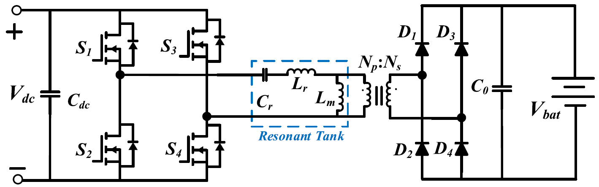
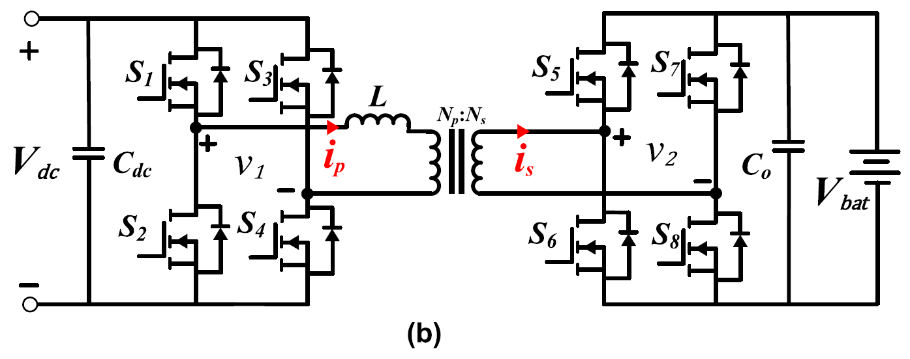
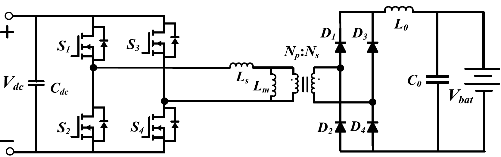
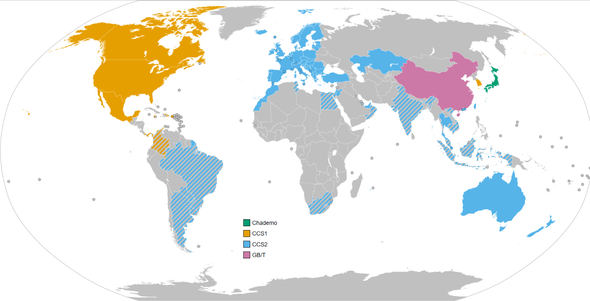
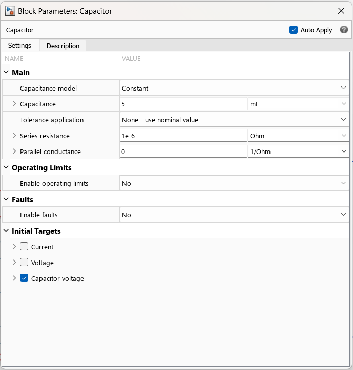
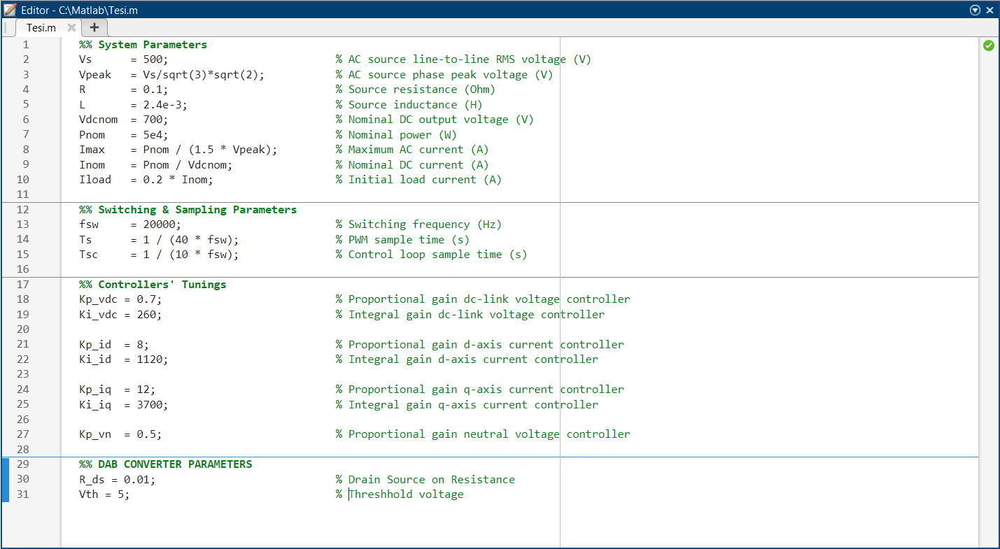

# Conversion Report

## Document Information
- **Source File**: d:\Thesis\Ego4d-LiteSTA\Docs\Tesi.docx
- **File Type**: DOCX
- **Output Directory**: d:\Thesis\Ego4d-LiteSTA\TargetMDDirectory\Tesi
- **Images Directory**: d:\Thesis\Ego4d-LiteSTA\TargetMDDirectory\Tesi\images

## Conversion Results
- **Total Headings**: 344
- **Images Extracted**: 81
- **Issues Handled**: 0
- **Status**: ✅ Completed Successfully

## Extracted Images
1. image_001_spd2m_image88.png
2. image_002_spd2m_image83.png
3. image_003_spd2m_image1.png
4. image_004_spd2m_image2.png
5. image_005_spd2m_image9.png
6. image_006_spd2m_image11.png
7. image_007_spd2m_image12.png
8. image_008_spd2m_image13.png
9. image_009_spd2m_image14.png
10. image_010_spd2m_image15.png
11. image_011_spd2m_image16.png
12. image_012_spd2m_image17.png
13. image_013_spd2m_image18.png
14. image_014_spd2m_image19.png
15. image_015_spd2m_image20.png
16. image_016_spd2m_image21.png
17. image_017_spd2m_image22.png
18. image_018_spd2m_image23.png
19. image_019_spd2m_image24.png
20. image_020_spd2m_image25.png
21. image_021_spd2m_image26.png
22. image_022_spd2m_image27.png
23. image_023_spd2m_image28.png
24. image_024_spd2m_image29.png
25. image_025_spd2m_image30.png
26. image_026_spd2m_image31.png
27. image_027_spd2m_image32.png
28. image_028_spd2m_image33.png
29. image_029_spd2m_image34.png
30. image_030_spd2m_image35.png
31. image_031_spd2m_image36.jpg
32. image_032_spd2m_image37.png
33. image_033_spd2m_image38.jpg
34. image_034_spd2m_image39.png
35. image_035_spd2m_image40.png
36. image_036_spd2m_image41.jpg
37. image_037_spd2m_image42.jpg
38. image_038_spd2m_image43.png
39. image_039_spd2m_image44.jpg
40. image_040_spd2m_image45.png
41. image_041_spd2m_image46.jpg
42. image_042_spd2m_image47.jpeg
43. image_043_spd2m_image48.png
44. image_044_spd2m_image49.jpg
45. image_045_spd2m_image50.png
46. image_046_spd2m_image51.png
47. image_047_spd2m_image52.png
48. image_048_spd2m_image53.png
49. image_049_spd2m_image54.png
50. image_050_spd2m_image55.png
51. image_051_spd2m_image56.png
52. image_052_spd2m_image57.png
53. image_053_spd2m_image58.png
54. image_054_spd2m_image59.png
55. image_055_spd2m_image60.png
56. image_056_spd2m_image61.png
57. image_057_spd2m_image62.png
58. image_058_spd2m_image63.png
59. image_059_spd2m_image64.png
60. image_060_spd2m_image65.png
61. image_061_spd2m_image66.png
62. image_062_spd2m_image67.png
63. image_063_spd2m_image68.png
64. image_064_spd2m_image69.png
65. image_065_spd2m_image71.png
66. image_066_spd2m_image72.png
67. image_067_spd2m_image73.png
68. image_068_spd2m_image74.png
69. image_069_spd2m_image75.png
70. image_070_spd2m_image76.png
71. image_071_spd2m_image77.png
72. image_072_spd2m_image78.png
73. image_073_spd2m_image79.png
74. image_074_spd2m_image80.png
75. image_075_spd2m_image81.png
76. image_076_spd2m_image82.png
77. image_077_spd2m_image70.png
78. image_078_spd2m_image84.png
79. image_079_spd2m_image85.png
80. image_080_spd2m_image86.png
81. image_081_spd2m_image87.png

## Document Structure
- Chapter 1: Introduction
  - 1.1 Background
  - 1.2 Problem Statement
  - 1.3 Objectives of the Study
  - 1.4 Scope and Limitations
  - 1.5 Research Methodology
  - 1.6 Structure of the Thesis
- Chapter 2: Literature Review
  - 2.1 Categorization of EV Charging Stations
    - 2.1.1 DC Bus Configuration
    - 2.1.2 AC Bus Configuration
    - 2.1.3 Comparison of AC and DC Bus Configurations
  - **Comparison of AC and DC Bus Architectures**
  - **Category**
  - **AC Bus Architecture**
  - **DC Bus Architecture**
  - **Integration of Energy Sources**
  - **Number of Conversion Stages**
  - **Efficiency**
  - **Impacts from Utility Side**
  - **Rating of AC-DC Rectifier**
  - **Protection Devices**
  - **Control**
  - **Cost**
  - 2.2 AC-DC Conversion stage
    - 2.2.1 Three-Phase Buck-Type Rectifier
    - 2.2.2 Swiss Rectifier (SR)
    - 2.2.3 Vienna Rectifier (VR)
    - Three-Phase Boost-Type Rectifier (TPSSBR)
    - Multilevel AC-DC Converters
  - **Cascaded H-Bridge (CHB)**
  - **Flying Capacitor (FC)**
  - **Neutral Point Clamped (NPC)**
      - 2.2.5.1 Cascaded H-Bridge Multilevel Converter (CHB)
      - 2.2.5.2 Flying Capacitor Multilevel Converter (FCMLC)
      - Neutral Point Clamped (NPC) Topology
    - 2.2.6 Comparison of AC-DC Converters for EV Charging Applications
  - **Comparison Table**
  - **Parameter**
  - **TPBR**
  - **SR**
  - **VR**
  - **TPSSBR**
  - **CHB**
  - **FCMLC**
  - **NPC**
  - **Topology Complexity**
  - **Efficiency**
  - **Harmonic Distortion**
  - **Power Density**
  - **Scalability**
  - **Cost and Complexity**
  - **Suitability for EVs**
  - 2.3 DC to DC Conversion stage
    - 2.3.1 LLC RESONANT CONVERTER
    - ****
    - 2.3.2 DUAL ACTIVE BRIDGE CONVERTER
    - ****
    - 2.3.3 DUAL ACTIVE BRIDGE RESONANT CONVERTER
      - 2.3.3.1 Series LC Network
      - 2.3.3.2 LCL and CLC Resonant Tanks
    - 2.3.4 PHASE-SHIFTED FULL-BRIDGE (PSFB) CONVERTER
    - ****
    - 2.3.5 Non-Isolated DC-DC Converter
      - 2.3.5.1 interleaved buck converters
      - 2.3.5.2 Parallel Three-Level Converters
- Chapter 3: Current Industry Practices and Technology Landscape
  - 3.1 Introduction
  - 3.2 Charging Standards and Communication Protocols
    - 3.2.1 Global Overview of Charging Standards
    - 3.2.2 Smart Charging and ISO 15118
    - 3.2.3 Regional Adoption of Charging Standards
  - 3.3 Connector Types and Power Levels
    - 3.3.1 Types of Connectors by Region and Standard
    - ****
    - 3.3.2 Connector Capabilities and Practical Use
    - 3.3.3 Power Level Classification
    - 3.3.4 Cable Design and Safety
    - 3.3.5 Future Developments
  - 3.5 Commercial Implementations and Key Players
    - 3.5.1 Tesla Supercharger Network
    - 3.5.2 Electrify America
    - 3.5.3 Ionity (Europe)
    - 3.5.4 ABB and Siemens: Hardware Leaders
    - 3.5.5 Asian Leaders: BYD, StarCharge, and TGOOD
    - 3.5.6 Comparative Insights
  - **Company/Network**
  - **Max Power**
  - **Standards Supported**
  - **Network Model**
  - **Notable Features**
  - 3.6 Integration with Renewable Energy and Storage
    - 3.6.1 Integration with Renewable Energy
    - 3.6.2 Energy Storage Systems (ESS)
  - 3.7 Deployment Trends and Policy Drivers
    - 3.7.1 Global Deployment Trends
  - **Regional Highlights:**
  - **Global Projections:**
    - 3.7.2 Policy and Regulatory Frameworks
    - 3.7.3 Data-Driven Planning and Optimization
  - 3.8 Conclusion
- Chapter 4 – Theoretical Background
  - 4.1 Introduction
  - 4.2 AC-DC Stage: Vienna Rectifier
    - 4.2.1 Introduction and Topology
    - Three Boost Inductors (L1​, L2​, L3​)
    - Three Active Switches (Sa​, Sb​, Sc​)
    - Six Diodes
    - Two DC-Link Capacitors (Cp​, Cn​)
    - 4.2.2 Operating Principle
  - **Three-Level Switching Concept and its Benefits**
    - **Role as a Three-Phase Boost Converter and Power Factor Correction Mechanism**
    - Pulse-Width Modulation (PWM)
    - Inductor Magnetization Control
    - Phase Synchronization
  - **Inductor Current Shaping and Energy Transfer**
    - Energy Storage (Active Switch ON)
    - Energy Release (Active Switch OFF)
    - **Role of Diodes in Unidirectional Current Flow and Freewheeling**
    - First-Line Rectification
    - Freewheeling Paths
    - Ensuring Unidirectional Power Flow
    - 4.2.3 Component Sizing
    - Boost Inductors (*****L*****)
    - DC-Link Capacitors (*****Cp​, Cn*****​****)
    - 4.2.4 Control Strategy
    - Outer Voltage Loop
    - Inner Current Loop
    - 4.2.5 Modulation Technique
    - Better DC-Link Voltage Utilization
    - Reduced Harmonic Distortion
    - Flexibility in Control
  - 4.3 DC-DC Stage: Dual Active Bridge (DAB) Converter
    - 4.3.1 Introduction and Topology
  - **Key Features:**
    - Bidirectional Power Flow
    - Galvanic Isolation
    - High Efficiency
    - Compact Design
  - **Circuit Description:**
    - Two Full-Bridge Converters (Primary and Secondary)
    - High-Frequency Transformer
    - Leakage Inductance (L)
    - 4.3.2 Operating Principle
    - Power Transfer Equation
    - 4.3.3 Component Sizing
    - Leakage Inductance (L)
    - Transformer Turns Ratio (n)
    - DC-Link Capacitors
    - 4.3.4 Control Strategy
    - Outer Voltage Regulation Loop
  - **Bidirectional Operation:**
    - Positive phase shifts (ϕ>0)
    - Negative phase shifts (ϕ<0)
    - Current Limiting
    - 4.3.5 Modulation Techniques
    - Single Phase Shift (SPS) Modulation
    - Dual Phase Shift (DPS) Modulation
    - Extended Phase Shift (EPS) / Triple Phase Shift (TPS) Modulation
  - 4.4 Battery Model and Characteristics
    - 4.4.1 Introduction
    - 4.4.2 Battery Chemistry Selection
    - 4.4.3 Battery Pack Configuration
    - 4.4.4 Battery Sizing Considerations
    - Energy Capacity (*****E******bp*****​)
    - Power Capacity (*****P******bp*****​)
    - Voltage Level (*****V******bp******​*****)
    - Current Rating
    - 4.4.5 Battery Management System (BMS)
    - State of Charge (SoC) Estimation
    - State of Health (****SoH****) Assessment
    - Cell Balancing
    - Protection Mechanisms
    - Data Logging and Communication
- Chapter 5 – System Architecture and Modelling Approach
    - 5.1.1 Functional Block Diagram and Power Flow
      - 1. Grid Interface
  - **Structure of the Grid Interface**
  - **Step-Down Transformer**
  - **Measurement and Signal Extraction**
  - **Modeling Considerations**
      - 2. Sation interface
        - 2.1 AC–DC Conversion Stage (Vienna Rectifier)
          - 2.1.1 Circuit Topology Description
          - Input Filter Inductors (La, Lb, Lc)
  - **L****in**** value will be 2mH**
          - Six Power Diodes and Three Active Switches (Sa, Sb, Sc)
          - DC-Link Capacitors (C+, C-)
    - **Capacitors value becomes C=0.00398F or 3.98mF. we choose he value 5mF**
    - ****
          - 2.1.2 Measurement Subsystem
          - 2.1.3 Vienna Control Subsystem
  - **Control Structure Overview**
  - **1. Voltage Regulation Loop**
  - **2. ****dq**** Current Controllers**
  - **3. Neutral Point Balancing**
    - **4. Inverse Park Transformation and PWM Signal Generation**
  - **Assumptions**
        - 2.2. Intermediate DC Link
        - 2.3. DC–DC Conversion Stage (Dual Active Bridge – DAB)
      - Converter Architecture
        - 1. Primary Full Bridge (Input Side)
        - 2. High-Frequency Transformer
        - 3. Leakage Inductance (L1)
        - 4. Secondary Full Bridge (Output Side)
        - 5. Output Filter Capacitor
      - Principles of DAB Power Transfer and Control
    - 5.5.2 DAB Control Strategy
  - **Control Architecture**
  - **1. Output Voltage PI Controller**
  - **2****. PWM Generation**
  - **Primary Side Control **
      - 3. EV Battery Load
      - 4. Control and Measurement Signals
  - **Power Flow Summary**
    - 5.2.1 Selection of Simulation Software
    - 5.2.2 General Modeling Approach and Assumptions
  - **Modeling Approach**
  - **Component-Level Assumptions**
  - **Switches (IGBTs, MOSFETs)**
  - **Diodes**
  - **Passive Elements**
  - **Transformer**
  - **Control and Signal Processing**
  - **Battery and Load Assumptions**
  - **Simulation Settings**
  - 5.7 Controller Tuning and Parameters
  - **Vienna Rectifier Control Loops (AC-DC Stage):**
    - DC-Link Voltage Controller
    - d-axis Current Controller
    - q-axis Current Controller
    - Neutral Point Voltage Balancer
    - Tuning Methodology
  - **DAB Converter Controller Tunings:**
-  Chapter 6: Simulation and Results and Discussion
  - 6.1 Objectives of Simulation
  - 6.2 Simulation Environment and Parameters
    - 6.2.1 Simulation Settings
  - 6.3 Simulation Scenarios and Results
  - **6.X.1 Active Power Drawn from the Grid**
  - **6.X.2 Reactive Power Drawn from the Grid**
    - **Figure 6.****3****.2 – Reactive power drawn from the grid over time for Vienna voltage reference = ****700 V and DAB voltage reference = 450 V**
    - **6.****3****.3 Vienna Voltage Reference and Output Voltage**
  - **6.X.4 DC-Link Capacitor Voltages: Vdc+​ and Vdc−​**
    - **Figure 6.****3****.4 – DC-link capacitor voltages Vdc+​ and Vdc−​**
  - **6.****3****.5 DAB Input Voltage**
  - **6.X.7 DAB Phase Shift Command**
  - **6.X.8 Primary-Side PWM Waveform**
  - **6.X.9 Battery State of Charge (SoC)**
  - **6.X.10 Load Current**
  - **6.X.11 Load Voltage**
  - Discussion
  - Summary
- Chapter 7: Assessment of Real-World Applicability
  - 7.1 Practical Implementation Challenges
    - 7.1.1 Component Selection and Availability
    - Power Semiconductors (IGBTs/MOSFETs/SiC/GaN)
    - Challenge
    - Commercial Availability
    - Design Implication
    - High-Frequency Inductors and Transformers
    - Vienna Rectifier Input Inductor (2 mH)
    - Challenge
    - Commercial Availability
    - Design Implication
    - DAB Converter Leakage Inductance (5 **μ**H)
    - Challenge
    - Commercial Availability
    - Design Implication
    - DC-Link and Output Capacitors
  - **800V DC-Link Capacitor (5 mF):**
    - Challenge
    - Commercial Availability
  - **400V DAB Output Capacitor (1.2 mF):**
    - Challenge
    - Commercial Availability
    - Design Implication
    - 7.1.2 Thermal Management
    - Heat Dissipation
    - Challenge
    - Design Implication
    - 7.1.3 Electromagnetic Compatibility (EMC)
  - **EMI Mitigation:**
    - Challenge
    - Design Implication
  - 7.2 Comparison with Existing Solutions and Industry Benchmarks
    - Key Performance Indicators (KPIs)
    - Efficiency
    - Power Factor (PF)
    - Total Harmonic Distortion (THD) of Input Current
    - Power Density
    - Dynamic Response
    - Voltage Ripple
    - Operating Temperature Range
    - Advantages of Proposed Design
    - High Simulated Efficiency
    - Superior Grid Power Quality
    - Robust Control and Dynamic Performance
    - Galvanic Isolation
    - Potential Disadvantages/Areas for Improvement Compared to Existing Solutions
    - Component Size and Cost (Large Passive Components)
    - Cooling System Complexity
    - Control Complexity
    - **Commercially Available Charger Examples (****NEEDS IMAGES****):**
    - ABB Terra HP
    - ChargePoint Express Plus
    - EVBox**** ****Troniq**** High Power
    - Delta ****UltraFast**** Charger
  - 7.3 Safety Standards and Regulatory Compliance
    - Relevant Standards
    - IEC 61851 (Electric vehicle conductive charging system)
    - UL 2202 (EV Charging System Equipment)
    - IEEE 519 (Recommended Practice and Requirements for Harmonic Control in Electric Power Systems)
    - Protection Mechanisms
    - Isolation Requirements
    - Environmental Ratings
  - 7.4 Economic Viability and Cost Considerations
    - Power Semiconductors (SiC/GaN Devices)
    - Custom High-Frequency Magnetics
    - DC-Link and Output Capacitor Banks
    - Cooling System
    - Manufacturing and Assembly Complexity
    - PCB Layout
    - Assembly
    - Control Hardware
  - **Cost vs. Performance Trade-offs:**
    - Electrolytic capacitors
    - Film capacitors
  - **Operational Expenditure (****OpEx****)**
  - **Market Dynamics**
    - Per kWh pricing
    - Per minute pricing
    - Subscription or flat fees
    - For CPOs
    - For EV Drivers
  - 7.5 Scalability and Future Enhancements
  - **Power Scalability**
    - Benefits of Modularity
    - Challenges of Modularity
  - **Integration with Energy Storage and Renewables**
  - **Advanced Control Algorithms**
  - **Grid Integration and Smart Charging**
- Chapter 9. Conclusion
- References
