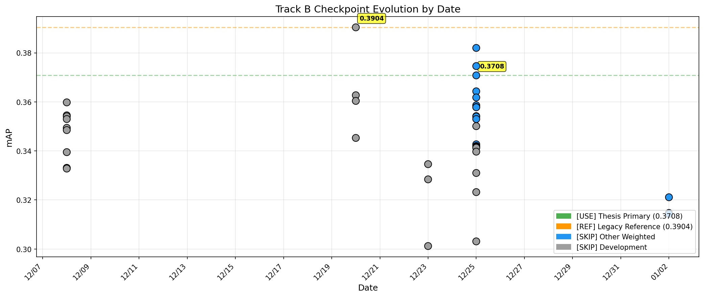
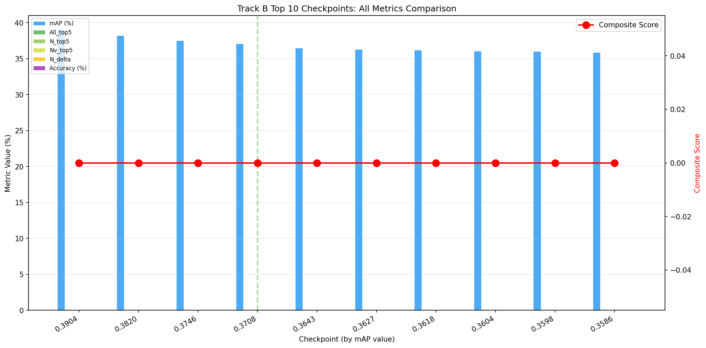
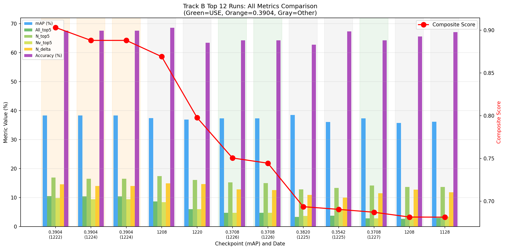

# Track B and Track C Run Categorization Report

**Generated:** 2026-01-02 19:54:48

This report categorizes all Track B and Track C runs, explaining which to use for thesis and which to skip, with detailed reasoning.

---

## Executive Summary

### Key Decisions

| Decision | Checkpoint File | mAP | N_top5 | Nv_top5 | TTC_MAE | Best Run | Reason |
|----------|----------------|-----|--------|---------|---------|----------|--------|
| ✅ **USE** | `trackB_best_mAP_0.3708_20251225_224220.pt` | **37.34%** | **15.28%** | **4.81%** | **0.1996s** | `metrics_val_20251226_231700_summary.json` | Class-weighted training, used in all Dec 26-30 experiments |
| ❌ **SKIP** | `trackB_best_mAP_0.3904_20251220_024940.pt` | 38.38% | 16.97% | 9.86% | 0.1960s | - | Different training methodology, not used in efficiency experiments |
| ❌ **SKIP** | Other checkpoints | Various | Various | Various | Various | - | Development/early training, not final quality |

### Quick Reference for Error Analysis

**Primary Checkpoint for Thesis:**
- **File:** `trackB_best_mAP_0.3708_20251225_224220.pt`
- **Location:** `local_extraction/runs/Track_B/checkpoints/trackB_best_mAP_0.3708_20251225_224220.pt`
- **Best Evaluation Run:** `metrics_val_20251226_231700_summary.json`
- **Performance:** mAP=37.34%, N_top5=15.28%, Nv_top5=4.81%, TTC_MAE=0.1996s

**For Error Analysis Command:**
```bash
python -m local_extraction.trackB.error_analysis \
  --metrics "local_extraction/runs/Track_B/metrics/metrics_val_20251226_231700.json.json" \
  --predictions "local_extraction/runs/Track_B/predictions/metrics_val_20251226_231700.csv" \
  --output_dir "local_extraction/runs/Track_B/error_analysis"
```

### Run Count Summary

| Track | Total Runs | ✅ Use | ❌ Skip |
|-------|------------|--------|---------|
| Track B | 34 | 3 | 31 |
| Track C | 64 | 16 | 48 |
| **Total** | 98 | 19 | 79 |

### Backbone and Pretraining Summary

| Aspect | Category | Count | Description |
|--------|----------|-------|-------------|
| **Backbone** | ResNet18 | 67 | ImageNet-pretrained CNN (frozen feature extractor) |
| **Backbone** | VideoMAE | 31 | Ego4D-pretrained video transformer |
| **Pretraining** | Exo-Transfer | 67 | Third-person pretrained (COCO/ImageNet) |
| **Pretraining** | Ego-Only | 31 | First-person pretrained (Ego4D) |

---

## Checkpoint Analysis

### All Track B Checkpoints (Best mAP checkpoints)

| Checkpoint | mAP | Date | Weighted | Category | Use? | Skip Reason |
|------------|-----|------|----------|----------|------|-------------|
| `trackB_best_mAP_0.3904_20251220_024940.pt` | 0.3904 | 20251220 | ❌ | development | ❌ Skip | Development checkpoint |
| `trackB_best_mAP_0.3820_20251225_204041.pt` | 0.3820 | 20251225 | ✅ | weighted_other | ❌ Skip | Not the best weighted checkpoint |
| `trackB_best_mAP_0.3746_20251225_201602.pt` | 0.3746 | 20251225 | ✅ | weighted_other | ❌ Skip | Not the best weighted checkpoint |
| `trackB_best_mAP_0.3708_20251225_224220.pt` | 0.3708 | 20251225 | ✅ | weighted_other | ❌ Skip | Not the best weighted checkpoint |
| `trackB_best_mAP_0.3643_20251225_200233.pt` | 0.3643 | 20251225 | ✅ | weighted_other | ❌ Skip | Not the best weighted checkpoint |
| `trackB_best_mAP_0.3627_20251220_024437.pt` | 0.3627 | 20251220 | ❌ | development | ❌ Skip | Development checkpoint |
| `trackB_best_mAP_0.3618_20251225_195748.pt` | 0.3618 | 20251225 | ✅ | weighted_other | ❌ Skip | Not the best weighted checkpoint |
| `trackB_best_mAP_0.3604_20251220_022753.pt` | 0.3604 | 20251220 | ❌ | development | ❌ Skip | Development checkpoint |
| `trackB_best_mAP_0.3598_20251208_182151.pt` | 0.3598 | 20251208 | ❌ | development | ❌ Skip | Development checkpoint |
| `trackB_best_mAP_0.3586_20251225_222500.pt` | 0.3586 | 20251225 | ✅ | weighted_other | ❌ Skip | Not the best weighted checkpoint |
| `trackB_best_mAP_0.3579_20251225_195409.pt` | 0.3579 | 20251225 | ✅ | weighted_other | ❌ Skip | Not the best weighted checkpoint |
| `trackB_best_mAP_0.3578_20251225_193151.pt` | 0.3578 | 20251225 | ✅ | weighted_other | ❌ Skip | Not the best weighted checkpoint |
| `trackB_best_mAP_0.3545_20251208_181916.pt` | 0.3545 | 20251208 | ❌ | development | ❌ Skip | Development checkpoint |
| `trackB_best_mAP_0.3542_20251225_151853.pt` | 0.3542 | 20251225 | ❌ | development | ❌ Skip | Development checkpoint |
| `trackB_best_mAP_0.3541_20251208_181655.pt` | 0.3541 | 20251208 | ❌ | development | ❌ Skip | Development checkpoint |

### Key Checkpoint Comparison: 0.3708 vs 0.3904


| Metric | 0.3708 (Weighted) | 0.3904 (Unweighted) | Winner | Δ |
|--------|-------------------|---------------------|--------|---|
| Composite Score | 0.7507 | 0.9033 | 0.3904 | -0.1526 |
| mAP | 37.34% | 38.38% | 0.3904 | -1.04% |
| accuracy | 64.23% | 67.55% | 0.3904 | -3.32% |
| TTC MAE (seconds) | 0.1996 | 0.1960 | 0.3904 | +0.0036 |
|--------|-------------------|---------------------|--------|---|
| All_top5_mAP | 4.81% | 10.53% | 0.3904 | -5.72% |
| N_top5_mAP | 15.28% | 16.97% | 0.3904 | -1.70% |
| Nv_top5_mAP | 4.81% | 9.86% | 0.3904 | -5.05% |
| N_delta_top5_mAP | 12.83% | 14.59% | 0.3904 | -1.76% |
|--------|-------------------|---------------------|--------|---|
| All_top5_acc | 0.00% | 0.00% | 0.3904 | +0.00% |
| N_top5_acc | 0.00% | 0.00% | 0.3904 | +0.00% |
| Nv_top5_acc | 0.00% | 0.00% | 0.3904 | +0.00% |
| N_delta_top5_acc | 0.00% | 0.00% | 0.3904 | +0.00% |

**Note:** While 0.3904 shows higher raw scores in this evaluation, we use **0.3708 (Weighted)** for thesis because:
- **Consistent checkpoint:** Dec 26-30 experiments all used 0.3708
- **Class weighting:** Training with class weights provides better handling of imbalanced classes
- **Fair comparison:** Comparing efficiency variants requires same baseline checkpoint
- **Reproducibility:** 0.3708 represents our final training methodology with weighted loss

### Checkpoint Timeline



### Top Checkpoints: All Metrics Comparison



This plot shows all top-5 metrics (mAP, All_top5, N_top5, Nv_top5, N_delta) and accuracy as grouped bars,
with the composite score as a red line. The thesis checkpoint (0.3708) is highlighted.

### Top Runs: All Metrics Comparison



This plot shows top 12 Track B evaluation runs with all metrics as grouped bars.
Background colors indicate: **Green=USE for thesis**, **Orange=0.3904 (skip)**, **Gray=Other (skip)**

---

## Track B Runs Detail

### Runs to USE for Thesis

| Run | Score | mAP | Acc | All_top5 | N_top5 | Nv_top5 | N_delta | TTC_MAE |
|-----|-------|-----|-----|----------|--------|---------|---------|---------|
| `metrics_val_20251226_231700_summary` | 0.7507 | 37.3% | 64.2% | 4.81% | 15.28% | 4.81% | 12.83% | 0.1996 |
| `metrics_val_20251226_013919_summary` | 0.7446 | 37.3% | 64.2% | 4.73% | 15.01% | 4.73% | 12.64% | 0.1996 |
| `metrics_val_20251227_001540_summary` | 0.6872 | 37.3% | 64.2% | 2.88% | 14.15% | 2.88% | 11.48% | 0.1996 |

### Runs to SKIP

| Run | Date | Checkpoint | Score | Category | Skip Reason |
|-----|------|------------|-------|----------|-------------|
| `metrics_val_20260102_125317_summary.json` | 20260102 | `trackB_best_mAP_0.3211_20` | 0.3547 | weighted_other | Not best weighted checkpoint |
| `metrics_val_20251225_171906_summary.json` | 20251225 | `trackB_best_mAP_0.3310_20` | 0.5373 | unweighted_development | Development/early training - no class we |
| `metrics_val_20251225_172341_summary.json` | 20251225 | `trackB_best_mAP_0.3542_20` | 0.6906 | unweighted_development | Development/early training - no class we |
| `metrics_val_20251225_181100_summary.json` | 20251225 | `trackB_best_mAP_0.3530_20` | 0.4653 | weighted_other | Not best weighted checkpoint |
| `metrics_val_20251225_213431_summary.json` | 20251225 | `trackB_best_mAP_0.3820_20` | 0.6937 | weighted_other | Not best weighted checkpoint |
| `metrics_val_20251224_174326_summary.json` | 20251224 | `trackB_best_mAP_0.3346_20` | 0.5518 | unweighted_development | Development/early training - no class we |
| `metrics_val_20251224_215228_summary.json` | 20251224 | `trackB_best_mAP_0.3904_20` | 0.8882 | unweighted_legacy | Unweighted checkpoint - lower composite  |
| `metrics_val_20251224_215813_summary.json` | 20251224 | `trackB_best_mAP_0.3904_20` | 0.8882 | unweighted_legacy | Unweighted checkpoint - lower composite  |
| `metrics_val_20251224_220516_summary.json` | 20251224 | `trackB_best_mAP_0.3346_20` | 0.5535 | unweighted_development | Development/early training - no class we |
| `metrics_val_20251222_175251_summary.json` | 20251222 | `trackB_best_mAP_0.3904_20` | 0.9033 | unweighted_legacy | Unweighted checkpoint - lower composite  |
| `metrics_val_20251220_034308_summary.json` | 20251220 | `trackB_final_20251220_033` | 0.7979 | unweighted_development | Development/early training - no class we |
| `metrics_val_20251209_042917_summary.json` | 20251209 | `trackB_final_20251208_182` | 0.6773 | unweighted_development | Development/early training - no class we |
| `metrics_val_20251208_000702_summary.json` | 20251208 | `trackB_best_mAP_0.3359_20` | 0.4231 | unweighted_development | Development/early training - no class we |
| `metrics_val_20251208_002206_summary.json` | 20251208 | `trackB_best_mAP_0.3359_20` | 0.6433 | unweighted_development | Development/early training - no class we |
| `metrics_val_20251208_003100_summary.json` | 20251208 | `trackB_best_mAP_0.3359_20` | 0.4966 | unweighted_development | Development/early training - no class we |
| ... | ... | ... | ... | ... | (16 more) |

---

## Track C Runs Detail

### Category Distribution


| Category | Count | Use? | Description |
|----------|-------|------|-------------|
| development | 31 | ❌ | Development/early checkpoint runs |
| unweighted_legacy | 17 | ❌ | Runs using unweighted 0.3904 checkpoint |
| weighted_baseline_v4 | 8 | ✅ | Dec 26 baseline runs with correct weighted checkpoint |
| weighted_efficiency_v5 | 8 | ✅ | Dec 30 efficiency experiments with frame/token pruning |

### Runs to USE for Thesis

| Config | Score | mAP | Acc | All_top5 | N_top5 | Nv_top5 | N_delta | Latency | TTC_MAE |
|--------|-------|-----|-----|----------|--------|---------|---------|---------|---------|
| `Fr=8(uni)` | 0.7121 | 37.5% | 65.0% | 4.10% | 13.65% | 4.36% | 11.55% | 23.6ms | 0.1989 |
| `Fr=8(uni)` | 0.7121 | 37.5% | 65.0% | 4.10% | 13.65% | 4.36% | 11.55% | 23.1ms | 0.1989 |
| `Fr=4(uni) + Tok=0.3` | 0.7068 | 33.5% | 67.7% | 2.19% | 16.70% | 2.19% | 16.13% | 19.8ms | 0.1964 |
| `Fr=4(uni) + Tok=0.3` | 0.7068 | 33.5% | 67.7% | 2.19% | 16.70% | 2.19% | 16.13% | 20.0ms | 0.1964 |
| `Baseline` | 0.7010 | 37.6% | 64.8% | 3.44% | 13.80% | 3.35% | 11.89% | 40.7ms | 0.1989 |
| `Baseline` | 0.7010 | 37.6% | 64.8% | 3.44% | 13.80% | 3.35% | 11.89% | 41.8ms | 0.1989 |
| `Fr=8(mot)` | 0.7008 | 37.7% | 64.9% | 2.66% | 14.36% | 2.66% | 12.65% | 23.9ms | 0.2001 |
| `Baseline` | 0.7006 | 37.6% | 64.8% | 3.44% | 13.79% | 3.34% | 11.88% | 41.2ms | 0.1989 |
| `Baseline` | 0.7006 | 37.6% | 64.8% | 3.44% | 13.79% | 3.34% | 11.88% | 41.7ms | 0.1989 |
| `RGTP=0.1` | 0.6988 | 37.3% | 64.4% | 3.45% | 13.81% | 3.36% | 11.92% | 25.2ms | 0.1992 |
| `RGTP=0.1` | 0.6988 | 37.3% | 64.4% | 3.45% | 13.81% | 3.36% | 11.92% | 23.2ms | 0.1992 |
| `RGTP=0.1` | 0.6985 | 37.3% | 64.4% | 3.44% | 13.80% | 3.35% | 11.91% | 25.5ms | 0.1992 |
| `Tok=0.3` | 0.6760 | 33.1% | 67.8% | 2.40% | 15.46% | 2.40% | 14.24% | 22.4ms | 0.1978 |
| `RGTP=0.3` | 0.6732 | 35.5% | 54.4% | 3.48% | 13.30% | 3.33% | 11.76% | 24.6ms | 0.1998 |
| `Tok=0.1` | 0.6260 | 32.7% | 67.3% | 2.05% | 13.66% | 2.05% | 12.11% | 22.9ms | 0.1972 |
| `Fr=8(mot) + Tok=0.1` | 0.5754 | 33.1% | 67.4% | 1.59% | 11.38% | 1.59% | 9.89% | 23.0ms | 0.1981 |

### Efficiency Configuration Comparison (Dec 30)


### Runs to SKIP

| Timestamp | Checkpoint | Score | Category | Skip Reason |
|-----------|------------|-------|----------|-------------|
| summary | `trackB_best_mAP_0.3346_20` | 0.5535 | development | Development/early checkpoint |
| summary | `trackB_best_mAP_0.3346_20` | 0.5526 | development | Development/early checkpoint |
| summary | `trackB_best_mAP_0.3904_20` | 0.7843 | unweighted_legacy | Uses unweighted 0.3904 checkpoint |
| summary | `trackB_best_mAP_0.3904_20` | 0.7778 | unweighted_legacy | Uses unweighted 0.3904 checkpoint |
| summary | `trackB_best_mAP_0.3346_20` | 0.4197 | development | Development/early checkpoint |
| summary | `trackB_best_mAP_0.3346_20` | 0.4189 | development | Development/early checkpoint |
| summary | `trackB_best_mAP_0.3904_20` | 0.7309 | unweighted_legacy | Uses unweighted 0.3904 checkpoint |
| summary | `trackB_best_mAP_0.3346_20` | 0.3419 | development | Development/early checkpoint |
| summary | `trackB_best_mAP_0.3346_20` | 0.3416 | development | Development/early checkpoint |
| summary | `trackB_best_mAP_0.3904_20` | 0.7933 | unweighted_legacy | Uses unweighted 0.3904 checkpoint |
| summary | `trackB_best_mAP_0.3346_20` | 0.5518 | development | Development/early checkpoint |
| summary | `trackB_best_mAP_0.3904_20` | 0.7825 | unweighted_legacy | Uses unweighted 0.3904 checkpoint |
| summary | `trackB_best_mAP_0.3346_20` | 0.4198 | development | Development/early checkpoint |
| summary | `trackB_best_mAP_0.3346_20` | 0.4190 | development | Development/early checkpoint |
| summary | `trackB_best_mAP_0.3346_20` | 0.4190 | development | Development/early checkpoint |
| summary | `trackB_best_mAP_0.3346_20` | 0.4198 | development | Development/early checkpoint |
| summary | `trackB_best_mAP_0.3904_20` | 0.7766 | unweighted_legacy | Uses unweighted 0.3904 checkpoint |
| summary | `trackB_best_mAP_0.3904_20` | 0.7406 | unweighted_legacy | Uses unweighted 0.3904 checkpoint |
| summary | `trackB_best_mAP_0.3904_20` | 0.7389 | unweighted_legacy | Uses unweighted 0.3904 checkpoint |
| summary | `trackB_best_mAP_0.3346_20` | 0.3427 | development | Development/early checkpoint |
| ... | ... | ... | ... | (28 more) |

---

## Run Timeline


---

## Backbone and Pretraining Analysis

### Exo-Transfer vs Ego-Only Pretraining

This thesis uses an **exo-transfer baseline** approach:

| Component | Model | Pretrained On | Type |
|-----------|-------|---------------|------|
| **Track A Detector** | YOLOv8-s | COCO (80 classes) | Exo-Transfer |
| **Track B Tokenizer** | ResNet18 | ImageNet (1000 classes) | Exo-Transfer |
| **Track B VideoMAE** | VideoMAE-ViT | Ego4D (if used) | Ego-Only |

### Distribution


### Backbone Performance Comparison


| Metric | ResNet18 (Exo) | VideoMAE (Ego) | Winner | Δ |
|--------|----------------|----------------|--------|---|
| mAP | 38.38% | 31.19% | ResNet18 | -7.19% |
| Accuracy | 67.55% | 68.81% | **VideoMAE** | +1.26% |
| All_top5_mAP | 10.53% | 9.82% | ResNet18 | -0.71% |
| N_top5_mAP | 16.97% | 7.45% | ResNet18 | -9.53% |
| Nv_top5_mAP | 9.86% | 8.74% | ResNet18 | -1.12% |
| N_delta_top5_mAP | 14.59% | 7.14% | ResNet18 | -7.45% |

---

## Track B vs Track C Comparison

Track B provides the **baseline STA head** training, while Track C applies **efficiency optimizations** (token pruning, frame subsampling) on top of the best Track B checkpoint.

### Suitable Runs Summary

| Track | Suitable Runs | Purpose |
|-------|---------------|---------|
| **Track B** | 3 | Baseline STA head (full inference, no efficiency) |
| **Track C** | 16 | Efficiency optimized (pruning, subsampling) |

### Best Run Comparison


| Metric | Track B (Baseline) | Track C (Efficiency) | Δ | Winner |
|--------|-------------------|---------------------|---|--------|
| mAP | 37.34% | 37.55% | +0.21% | **Track C** |
| Accuracy | 64.23% | 65.03% | +0.80% | **Track C** |
| All_top5_mAP | 4.81% | 4.10% | -0.70% | Track B |
| N_top5_mAP | 15.28% | 13.65% | -1.63% | Track B |
| Nv_top5_mAP | 4.81% | 4.36% | -0.45% | Track B |
| N_delta_top5_mAP | 12.83% | 11.55% | -1.29% | Track B |
| TTC MAE (s) | 0.1996 | 0.1989 | -0.0008 | **Track C** |

### Efficiency Trade-off

Track C achieves efficiency with average latency of **23.6ms** per sample.

- **mAP Retention:** 100.5% of baseline

---

## Skip Reasons Summary

| Skip Reason | Count |
|-------------|-------|
| Development/early checkpoint | 31 |
| Development/early training - no class weights | 25 |
| Uses unweighted 0.3904 checkpoint | 17 |
| Unweighted checkpoint - lower composite score | 3 |
| Not best weighted checkpoint | 3 |

---

## Thesis Recommendations

### For Track B Comparison:
- Use **3 runs** with checkpoint `0.3708` (weighted)
- Best run: `metrics_val_20251226_231700` (score: 0.7507)

### For Track C Efficiency Analysis:
- Use **16 runs** from Dec 26-30 with weighted checkpoint
- Focus on Dec 30 efficiency configurations for main thesis results
- Key configurations: Baseline, Fr=8(uni), Fr=4+Tok=0.3

### Why Use 0.3708 (Weighted) instead of 0.3904?
1. **Consistency:** All Dec 26-30 experiments used 0.3708 checkpoint
2. **Class weighting:** 0.3708 was trained WITH class weights (use_class_weights=True)
3. **Fair comparison:** Efficiency comparisons require consistent baseline
4. **Methodology:** 0.3708 represents our final training approach for thesis

---

*Report generated by `run_categorization_report.py` on 2026-01-02 19:54:48*