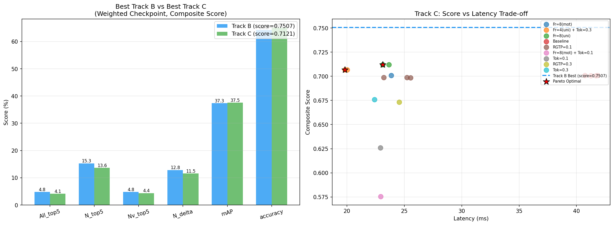
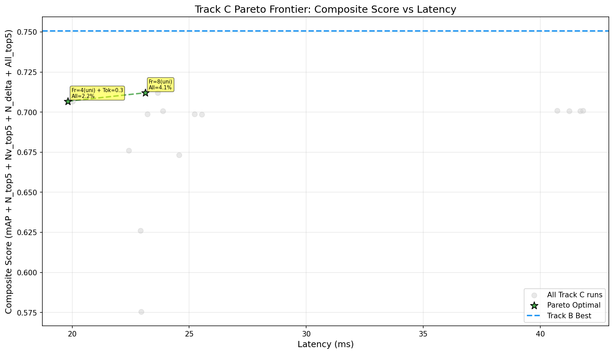
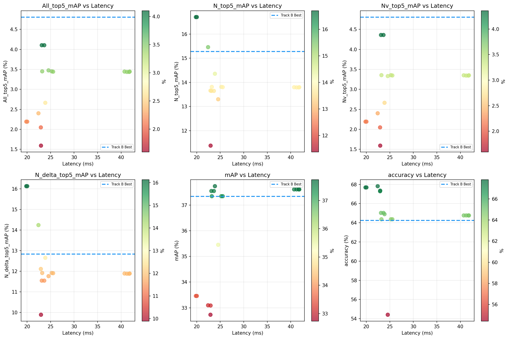

# Track B vs Track C Comparison Report

**Generated:** 2025-12-31 01:22:40

**Checkpoint:** Weighted-class only (`0.3708`)

**Scoring:** Composite score = mAP + N_top5_mAP + Nv_top5_mAP + N_delta_top5_mAP + All_top5_mAP

---

## Executive Summary

### Best Runs Comparison (by Composite Score)

| Metric | Track B Best | Track C Best | Winner | Δ |
|--------|--------------|--------------|--------|---|
| Composite Score | 0.7507 | 0.7121 | Track B | -0.0386 |
| mAP | 37.34% | 37.55% | Track C | +0.21% |
| accuracy | 64.23% | 65.03% | Track C | +0.80% |
| All_top5_mAP | 4.81% | 4.10% | Track B | -0.70% |
| N_top5_mAP | 15.28% | 13.65% | Track B | -1.63% |
| Nv_top5_mAP | 4.81% | 4.36% | Track B | -0.45% |
| N_delta_top5_mAP | 12.83% | 11.55% | Track B | -1.29% |
| All_top5_acc | 3.00% | 2.58% | Track B | -0.43% |
| N_top5_acc | 18.67% | 18.24% | Track B | -0.43% |
| ttc_mae_seconds | 0.1996 | 0.1989 | Track C | -0.0008 |

**Track C Best Latency:** 23.6ms (43% faster than baseline)

---

## Best Track B Run

| run | checkpoint | score | mAP | accuracy | N_top5_mAP | Nv_top5_mAP | N_delta_top5_mAP | All_top5_mAP | ttc_mae_seconds | video_backbone | class_weight_alpha |
| --- | --- | --- | --- | --- | --- | --- | --- | --- | --- | --- | --- |
| metrics_val_20251226_231700_summary.json | trackB_best_mAP_0.3708_20251225_224220.pt | 0.7507 | 37.34% | 64.23% | 15.28% | 4.81% | 12.83% | 4.81% | 0.1996 | resnet18 | 0.5000 |

## Best Track C Runs by Category

| Category | Config | score | mAP | All_top5 | N_top5 | Nv_top5 | N_delta | Latency | Speedup |
| --- | --- | --- | --- | --- | --- | --- | --- | --- | --- |
| Best Composite Score | Fr=8(uni) | 0.7121 | 37.55% | 4.10% | 13.65% | 4.36% | 11.55% | 23.6499 | 43% |
| Best All_top5_mAP | Fr=8(uni) | 0.7121 | 37.55% | 4.10% | 13.65% | 4.36% | 11.55% | 23.6499 | 43% |
| Best N_top5_mAP | Fr=4(uni) + Tok=0.3 | 0.7068 | 33.46% | 2.19% | 16.70% | 2.19% | 16.13% | 19.8198 | 52% |
| Best Nv_top5_mAP | Fr=8(uni) | 0.7121 | 37.55% | 4.10% | 13.65% | 4.36% | 11.55% | 23.6499 | 43% |
| Best mAP | Fr=8(mot) | 0.7008 | 37.74% | 2.66% | 14.36% | 2.66% | 12.65% | 23.8724 | 42% |

## Pareto-Optimal Configurations (Score vs Latency)

These configurations are NOT dominated by any other run:

| Rank | Config | score | All_top5 | N_top5 | Nv_top5 | mAP | Latency | Speedup |
| --- | --- | --- | --- | --- | --- | --- | --- | --- |
| 1 | Fr=8(uni) | 0.7121 | 4.10% | 13.65% | 4.36% | 37.55% | 23.1193 | 44% |
| 2 | Fr=4(uni) + Tok=0.3 | 0.7068 | 2.19% | 16.70% | 2.19% | 33.46% | 19.8198 | 52% |

---

## All Track B Runs (Weighted Checkpoint)

| run | checkpoint | score | mAP | accuracy | N_top5_mAP | Nv_top5_mAP | N_delta_top5_mAP | All_top5_mAP | ttc_mae_seconds |
| --- | --- | --- | --- | --- | --- | --- | --- | --- | --- |
| metrics_val_20251226_231700_summary.json | trackB_best_mAP_0.3708_20251225_224220.pt | 0.7507 | 37.34% | 64.23% | 15.28% | 4.81% | 12.83% | 4.81% | 0.1996 |
| metrics_val_20251226_013919_summary.json | trackB_best_mAP_0.3708_20251225_224220.pt | 0.7446 | 37.34% | 64.23% | 15.01% | 4.73% | 12.64% | 4.73% | 0.1996 |
| metrics_val_20251227_001540_summary.json | trackB_best_mAP_0.3708_20251225_224220.pt | 0.6872 | 37.34% | 64.23% | 14.15% | 2.88% | 11.48% | 2.88% | 0.1996 |

## All Track C Runs (Weighted Checkpoint)

| timestamp | Config | score | mAP | accuracy | All_top5 | N_top5 | Nv_top5 | N_delta | Latency | TTC MAE |
| --- | --- | --- | --- | --- | --- | --- | --- | --- | --- | --- |
| 225122 | Fr=8(uni) | 0.7121 | 37.55% | 65.03% | 4.10% | 13.65% | 4.36% | 11.55% | 23.6499 | 0.1989 |
| 232658 | Fr=8(uni) | 0.7121 | 37.55% | 65.03% | 4.10% | 13.65% | 4.36% | 11.55% | 23.1193 | 0.1989 |
| 214204 | Fr=4(uni) + Tok=0.3 | 0.7068 | 33.46% | 67.68% | 2.19% | 16.70% | 2.19% | 16.13% | 19.8198 | 0.1964 |
| 234937 | Fr=4(uni) + Tok=0.3 | 0.7068 | 33.46% | 67.68% | 2.19% | 16.70% | 2.19% | 16.13% | 20.0264 | 0.1964 |
| 141723 | Baseline | 0.7010 | 37.61% | 64.76% | 3.44% | 13.80% | 3.35% | 11.89% | 40.7248 | 0.1989 |
| 161030 | Baseline | 0.7010 | 37.61% | 64.76% | 3.44% | 13.80% | 3.35% | 11.89% | 41.8309 | 0.1989 |
| 200931 | Fr=8(mot) | 0.7008 | 37.74% | 64.90% | 2.66% | 14.36% | 2.66% | 12.65% | 23.8724 | 0.2001 |
| 151551 | Baseline | 0.7006 | 37.61% | 64.76% | 3.44% | 13.79% | 3.34% | 11.88% | 41.2440 | 0.1989 |
| 153959 | Baseline | 0.7006 | 37.61% | 64.76% | 3.44% | 13.79% | 3.34% | 11.88% | 41.7022 | 0.1989 |
| 163017 | RGTP=0.1 | 0.6988 | 37.35% | 64.37% | 3.45% | 13.81% | 3.36% | 11.92% | 25.2287 | 0.1992 |
| 193527 | RGTP=0.1 | 0.6988 | 37.35% | 64.37% | 3.45% | 13.81% | 3.36% | 11.92% | 23.2121 | 0.1992 |
| 165938 | RGTP=0.1 | 0.6985 | 37.35% | 64.37% | 3.44% | 13.80% | 3.35% | 11.91% | 25.5391 | 0.1992 |
| 211854 | Tok=0.3 | 0.6760 | 33.10% | 67.82% | 2.40% | 15.46% | 2.40% | 14.24% | 22.4142 | 0.1978 |
| 172547 | RGTP=0.3 | 0.6732 | 35.45% | 54.41% | 3.48% | 13.30% | 3.33% | 11.76% | 24.5602 | 0.1998 |
| 210351 | Tok=0.1 | 0.6260 | 32.73% | 67.29% | 2.05% | 13.66% | 2.05% | 12.11% | 22.9234 | 0.1972 |
| 202451 | Fr=8(mot) + Tok=0.1 | 0.5754 | 33.09% | 67.35% | 1.59% | 11.38% | 1.59% | 9.89% | 22.9530 | 0.1981 |

---

## Trade-off Analysis

### Key Trade-off Insights

1. **Best All_top5_mAP:** 4.10% (Fr=8(uni))
   - vs Track B: -0.70%
   - Latency: 23.6ms (43% faster)

2. **Best N_top5_mAP:** 16.70% (Fr=4(uni) + Tok=0.3)
   - vs Track B: +1.43% 🎉

3. **Maximum Speedup:** 52% (Fr=4(uni) + Tok=0.3)
   - Latency: 19.8ms (vs 41.4ms baseline)
   - All_top5: 2.19%
   - Score: 0.7068

### Recommendations

| Use Case | Recommended Config | Score | All_top5 | Latency | Speedup |
|----------|-------------------|-------|----------|---------|---------|
| **Max Score** | Fr=8(uni) | 0.7121 | 4.10% | 23.1ms | 44% |
| **Best Trade-off** | Fr=8(uni) | 0.7121 | 4.10% | 23.1ms | 44% |
| **Max Efficiency** | Fr=4(uni) + Tok=0.3 | 0.7068 | 2.19% | 19.8ms | 52% |

---

## Plots

### Track B vs Track C Comparison

### Pareto Frontier (Score vs Latency)

### Individual Metrics Trade-off

---

*Report generated by `trackBC_comparison.py` on 2025-12-31 01:22:40*