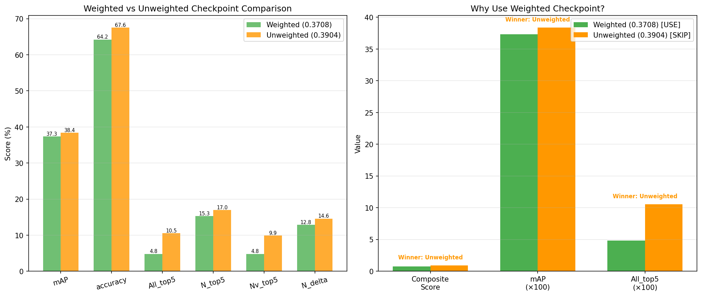
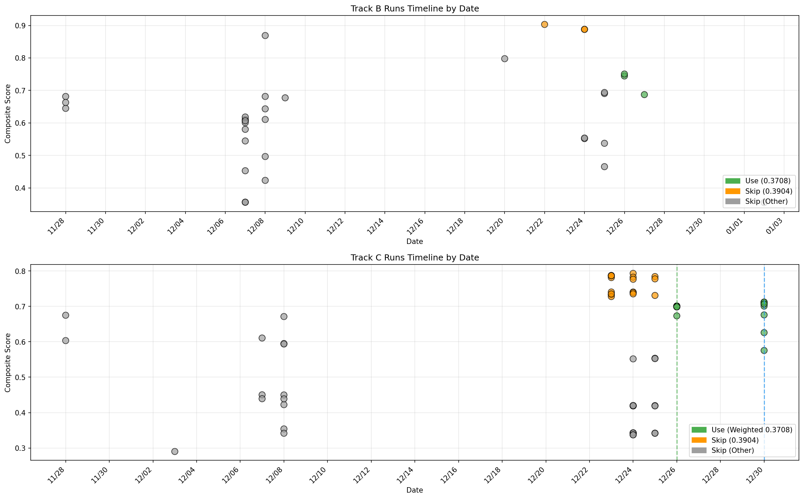
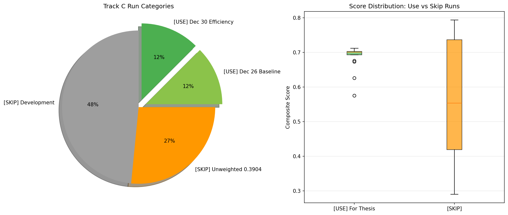
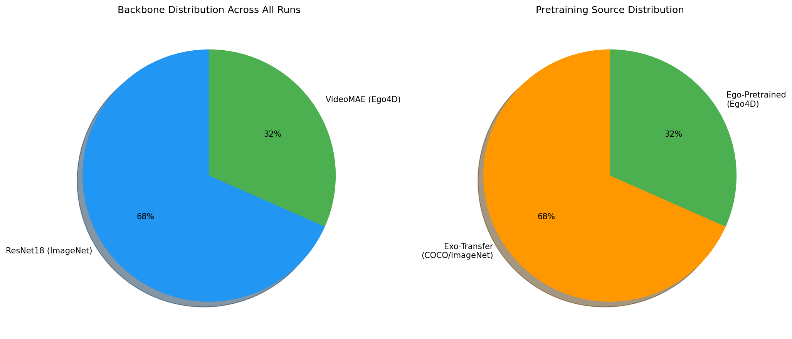
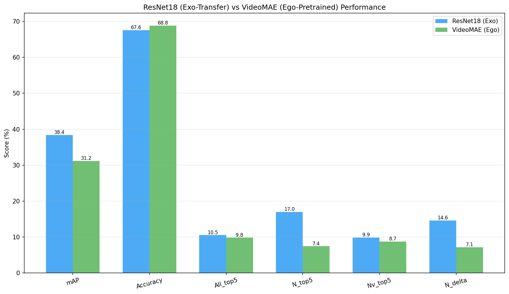
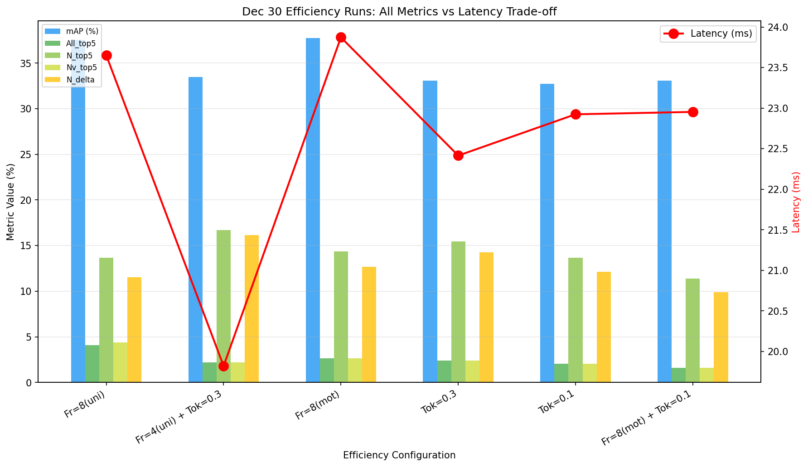

# Tesi

*Document Type: DOCX*

## Table of Contents

- [Chapter 1: Introduction](#chapter-1-introduction)
  - [1.1 Background](#11-background)
  - [1.2 Problem Statement](#12-problem-statement)
  - [1.3 Objectives of the Study](#13-objectives-of-the-study)
    - [1.3.1 Contributions](#131-contributions)
  - [1.4 Scope and Limitations](#14-scope-and-limitations)
  - [1.5 Research Methodology](#15-research-methodology)
  - [1.6 Structure of the Thesis](#16-structure-of-the-thesis)
- [Chapter 2 – Literature Review](#chapter-2--literature-review)
  - [2.1 Ego4D Forecasting Benchmark and STA Task](#21-ego4d-forecasting-benchmark-and-sta-task)
    - [2.1.1 Forecasting benchmark and STA definition](#211-forecasting-benchmark-and-sta-definition)
    - [2.1.2 Ego4D dataset characteristics](#212-ego4d-dataset-characteristics)
  - [2.2 Baseline STA Challenge Solutions](#22-baseline-sta-challenge-solutions)
    - [2.2.1 STAformer and AFF-ttention](#221-staformer-and-aff-ttention)
    - [2.2.2 SOIA-DOD: disentangled detection and anticipation](#222-soia-dod-disentangled-detection-and-anticipation)
  - [2.3 Efficient Video Backbones and Pre-Training](#23-efficient-video-backbones-and-pre-training)
    - [2.3.1 Multiscale Vision Transformers (MViTv2)](#231-multiscale-vision-transformers-mvitv2)
    - [2.3.2 VideoMAE: data-efficient video self-supervision](#232-videomae-data-efficient-video-self-supervision)
  - [2.4 Token-Level Efficiency for Video and Egocentric Streams](#24-token-level-efficiency-for-video-and-egocentric-streams)
    - [2.4.1 PruneVid](#241-prunevid)
    - [2.4.2 Rollout-Guided Token Pruning (RGTP)](#242-rollout-guided-token-pruning-rgtp)
    - [2.4.3 EgoPrune](#243-egoprune)
  - [2.5 Hand–Object Interaction, Affordances, and Hotspots](#25-handobject-interaction-affordances-and-hotspots)
    - [2.5.1 PEAR](#251-pear)
    - [2.5.2 Fine-grained affordance annotation](#252-fine-grained-affordance-annotation)
  - [2.6 Ego–Exo Transfer, Ego-Only Learning, and Retrieval-Augmented Models](#26-egoexo-transfer-ego-only-learning-and-retrieval-augmented-models)
    - [2.6.1 Ego–exo joint learning survey](#261-egoexo-joint-learning-survey)
    - [2.6.2 Synchronization-based exo→ego transfer](#262-synchronization-based-exoego-transfer-for-temporal-segmentation)
    - [2.6.3 Ego-Only](#263-ego-only)
    - [2.6.4 Early motion transfer](#264-early-motion-transfer-between-egocentric-and-exocentric-views)
    - [2.6.5 REAR](#265-retrieval-augmented-egocentric-action-recognition-rear)
  - [2.7 Community Resources and Challenge Ecosystem](#27-community-resources-and-challenge-ecosystem)
    - [2.7.1 EgoVis workshop](#271-egovis-workshop-and-challenge-ecosystem)
    - [2.7.2 Curated lists](#272-curated-lists-and-awesome-repositories)
  - [2.8 Summary and Positioning of Ego4D-LiteSTA](#28-summary-and-positioning-of-ego4d-litesta)
  - [2.9 Quantitative Reference Points (Ego4D-STA v2)](#29-quantitative-reference-points-ego4d-sta-v2)
    - [2.9.1 Reported baselines (Top-5 mAP, percent)](#291-reported-baselines-top-5-map-percent)
- [Chapter 3: Problem Definition and Data](#chapter-3-problem-definition-and-data)
  - [3.1 Task Definition (STA)](#31-task-definition-sta)
  - [3.2 Dataset, Splits, and Annotations (Ego4D-STA v2)](#32-dataset-splits-and-annotations-ego4d-sta-v2)
    - [3.2.1 Core visual data: clips, windows, and decision frames](#321-core-visual-data-clips-windows-and-decision-frames)
    - [3.2.2 Ground-truth annotations available per interaction](#322-ground-truth-annotations-available-per-interaction)
    - [3.2.3 Structured experiment artifacts (what they contain and why)](#323-structured-experiment-artifacts-what-they-contain-and-why)
    - [3.2.4 Concrete artifact mapping (conceptual objects to stored records)](#324-concrete-artifact-mapping-conceptual-objects-to-stored-records)
  - [3.3 Metrics](#33-metrics)
    - [3.3.1 Track A: Recall@K for proposal quality](#331-track-a-recallk-for-proposal-quality)
    - [3.3.2 Track B/C: Benchmark-style mAP and TTC error](#332-track-bc-benchmark-style-map-and-ttc-error)
  - [3.4 Data Manifests and Label Alignment Decisions](#34-data-manifests-and-label-alignment-decisions)
    - [3.4.1 Proposal candidate records (Track A output)](#341-proposal-candidate-records-track-a-output)
    - [3.4.2 Candidate-aligned training examples (Track B input)](#342-candidate-aligned-training-examples-track-b-input)
    - [3.4.3 Optional derived views (debug and audit)](#343-optional-derived-views-debug-and-audit)
    - [3.4.4 Label alignment and TTC binning (design decisions)](#344-label-alignment-and-ttc-binning-design-decisions)
    - [3.4.5 How candidate supervision is constructed (positive/negative definition)](#345-how-candidate-supervision-is-constructed-positivenegative-definition)
    - [3.4.6 Coordinate conventions and format conversions](#346-coordinate-conventions-and-format-conversions)
    - [3.4.7 Optional priors and reproducibility outputs](#347-optional-priors-and-reproducibility-outputs)
- [Chapter 4: System Overview (Tracks A / B / C)](#chapter-4-system-overview-tracks-a--b--c)
  - [4.1 Design Principles](#41-design-principles)
    - [4.1.1 Rationale](#411-rationale)
    - [4.1.2 Principles](#412-principles)
  - [4.2 Track A Overview (Proposals + Manifests)](#42-track-a-overview-proposals--manifests)
    - [4.2.1 Stages and contract](#421-stages-and-contract)
    - [4.2.2 Outputs and downstream interface](#422-outputs-and-downstream-interface)
  - [4.3 Track B Overview (Lightweight Fusion Head)](#43-track-b-overview-lightweight-fusion-head)
    - [4.3.1 Inputs and outputs](#431-inputs-and-outputs)
    - [4.3.2 Candidate ranking under top-5](#432-candidate-ranking-under-top-5)
  - [4.4 Track C Overview (Training-Free Pruning)](#44-track-c-overview-training-free-pruning)
    - [4.4.1 Motivation and scope](#441-motivation-and-scope)
    - [4.4.2 Evaluation focus (accuracy–latency)](#442-evaluation-focus-accuracylatency)
- [Chapter 5: Methodology](#chapter-5-methodology)
  - [5.1 Track A: Candidate Generation and Recall@K](#51-track-a-candidate-generation-and-recallk)
    - [5.1.1 Candidate generation (Stage A)](#511-candidate-generation-stage-a)
    - [5.1.2 Proposal evaluation: Recall@K](#512-proposal-evaluation-recallk)
    - [5.1.3 Manifest construction and label attachment (Stage B)](#513-manifest-construction-and-label-attachment-stage-b)
  - [5.2 Track B: Tokenization, Fusion (FGTP + Dual Cross-Attention), and Heads](#52-track-b-tokenization-fusion-fgtp--dual-cross-attention-and-heads)
    - [5.2.1 Inputs and representations](#521-inputs-and-representations)
    - [5.2.2 Frame-Guided Temporal Pooling (FGTP)](#522-frame-guided-temporal-pooling-fgtp)
    - [5.2.3 Dual cross-attention fusion](#523-dual-cross-attention-fusion)
    - [5.2.4 Candidate pooling and per-candidate features](#524-candidate-pooling-and-per-candidate-features)
    - [5.2.5 Prediction heads and scoring](#525-prediction-heads-and-scoring)
    - [5.2.6 Training objective](#526-training-objective)
  - [5.3 Track C: Rollout-Guided Token Pruning (RGTP)](#53-track-c-rollout-guided-token-pruning-rgtp)
    - [5.3.1 Motivation](#531-motivation)
    - [5.3.2 Rollout-guided importance](#532-rollout-guided-importance)
    - [5.3.3 Integration and evaluation](#533-integration-and-evaluation)
- [Chapter 6: Implementation and Engineering](#chapter-6-implementation-and-engineering)
  - [6.1 Local/Colab Workflow and Tooling](#61-localcolab-workflow-and-tooling)
    - [6.1.1 Local-first execution](#611-local-first-execution)
    - [6.1.2 Minimal cloud usage](#612-minimal-cloud-usage)
    - [6.1.3 Practical tooling choices](#613-practical-tooling-choices)
  - [6.2 Configuration System and Reproducible Runs](#62-configuration-system-and-reproducible-runs)
    - [6.2.1 YAML configuration with inheritance and overrides](#621-yaml-configuration-with-inheritance-and-overrides)
    - [6.2.2 Run logging as provenance](#622-run-logging-as-provenance)
  - [6.3 Data Validation and Failure Handling](#63-data-validation-and-failure-handling)
    - [6.3.1 Validation checkpoints](#631-validation-checkpoints)
    - [6.3.2 Failure handling strategy](#632-failure-handling-strategy)
- [Chapter 7: Experimental Setup](#chapter-7-experimental-setup)
  - [7.1 Baselines and Compared Variants](#71-baselines-and-compared-variants)
    - [7.1.1 Track A baselines (proposal generation)](#711-track-a-baselines-proposal-generation)
    - [7.1.2 Track B baselines (candidate scoring and multi-task prediction)](#712-track-b-baselines-candidate-scoring-and-multi-task-prediction)
    - [7.1.3 Track C baselines (efficiency knobs)](#713-track-c-baselines-efficiency-knobs)
  - [7.2 Training Protocols and Hyperparameters](#72-training-protocols-and-hyperparameters)
    - [7.2.1 Data sources and splits](#721-data-sources-and-splits)
    - [7.2.2 Optimization settings](#722-optimization-settings)
    - [7.2.3 Multi-task settings](#723-multi-task-settings)
    - [7.2.4 Checkpointing and model selection](#724-checkpointing-and-model-selection)
  - [7.3 Evaluation Protocol](#73-evaluation-protocol)
    - [7.3.1 Track A evaluation](#731-track-a-evaluation)
    - [7.3.2 Track B/C correctness evaluation](#732-track-bc-correctness-evaluation)
    - [7.3.3 Track C efficiency evaluation](#733-track-c-efficiency-evaluation)
    - [7.3.4 Reproducibility and traceability](#734-reproducibility-and-traceability)
- [Chapter 8: Results](#chapter-8-results)
  - [8.1 Track A Results (Recall@K)](#81-track-a-results-recallk)
    - [8.1.1 Reported metrics](#811-reported-metrics)
    - [8.1.2 Key observations](#812-key-observations)
  - [8.2 Track B Results (N / N+V / N+δ, TTC)](#82-track-b-results-n--nv--n-δ-ttc)
    - [8.2.1 Top-5 mAP variants](#821-top-5-map-variants)
    - [8.2.2 TTC results](#822-ttc-results)
  - [8.3 Track C Results (Accuracy–Latency Pareto)](#83-track-c-results-accuracylatency-pareto)
    - [8.3.1 Accuracy retained under pruning](#831-accuracy-retained-under-pruning)
    - [8.3.2 Runtime and Pareto analysis](#832-runtime-and-pareto-analysis)
  - [8.4 Comparison with Prior Work (Top-5 metrics)](#84-comparison-with-prior-work-top-5-metrics)
    - [8.4.1 Reported literature baselines](#841-reported-literature-baselines)
    - [8.4.2 Ego4D-LiteSTA vs reported baselines](#842-ego4d-litesta-vs-reported-baselines)
- [Chapter 9: Ablations and Analysis](#chapter-9-ablations-and-analysis)
  - [9.1 Proposal K Sweeps](#91-proposal-k-sweeps)
    - [9.1.1 Setup](#911-setup)
    - [9.1.2 Findings](#912-findings)
  - [9.2 Fusion Depth and Token Dimensionality](#92-fusion-depth-and-token-dimensionality)
    - [9.2.1 Setup](#921-setup)
    - [9.2.2 Findings](#922-findings)
  - [9.3 TTC Modeling (Regression vs Bins)](#93-ttc-modeling-regression-vs-bins)
    - [9.3.1 Setup](#931-setup)
    - [9.3.2 Findings](#932-findings)
  - [9.4 Priors (Hotspots, CLIP) and Their Impact](#94-priors-hotspots-clip-and-their-impact)
    - [9.4.1 Setup](#941-setup)
    - [9.4.2 Findings](#942-findings)
  - [9.5 Error Analysis and Qualitative Galleries](#95-error-analysis-and-qualitative-galleries)
    - [9.5.1 Failure Gallery (what fails and why)](#951-failure-gallery-what-fails-and-why)
    - [9.5.2 Success Gallery (what works and when)](#952-success-gallery-what-works-and-when)
    - [9.5.3 Quantitative Error Analysis and Architecture Comparison](#953-quantitative-error-analysis-and-architecture-comparison)
- [Chapter 10: Discussion, Limitations, and Future Work](#chapter-10-discussion-limitations-and-future-work)
  - [10.1 Discussion](#101-discussion)
    - [10.1.1 What worked well](#1011-what-worked-well)
    - [10.1.2 Interactions between tracks](#1012-interactions-between-tracks)
  - [10.2 Limitations](#102-limitations)
    - [10.2.1 Data and annotations](#1021-data-and-annotations)
    - [10.2.2 Modeling and efficiency](#1022-modeling-and-efficiency)
  - [10.3 Future Work](#103-future-work)
    - [10.3.1 Method extensions](#1031-method-extensions)
    - [10.3.2 Engineering extensions](#1032-engineering-extensions)
- [Chapter 11: Reproducibility Checklist](#chapter-11-reproducibility-checklist)
  - [11.1 Data and manifests](#111-data-and-manifests)
  - [11.2 Training and checkpoints](#112-training-and-checkpoints)
  - [11.3 Evaluation and reporting](#113-evaluation-and-reporting)
  - [11.4 Environment and determinism](#114-environment-and-determinism)
- [Chapter 12: Ethical, Legal, and Social Implications (ELSI)](#chapter-12-ethical-legal-and-social-implications-elsi)
  - [12.1 Data governance and privacy](#121-data-governance-and-privacy)
  - [12.2 Bias, fairness, and representativeness](#122-bias-fairness-and-representativeness)
  - [12.3 Responsible release and deployment](#123-responsible-release-and-deployment)
- [Chapter 13: Conclusion](#chapter-13-conclusion)
  - [13.1 Summary of contributions](#131-summary-of-contributions)
  - [13.2 Summary of results](#132-summary-of-results)
  - [13.3 Closing remarks](#133-closing-remarks)
- [References](#references)
- [Appendices](#appendices)


  


# Chapter 1: Introduction

## 1.1 Background

Short‑Term Object Interaction Anticipation (STA) in egocentric video asks a system to predict, one or two seconds before contact, **where** the next‑active object will be in the last frame, **what** verb and noun describe the interaction, and **when** (time‑to‑contact, TTC) the interaction begins. Ego4D provides the largest, most diverse STA benchmark with detailed verb/noun/TTC annotations. Unlike third‑person action recognition, egocentric footage is dominated by wearer motion, hand jitter, and cluttered near‑field scenes, making spatial localization and temporal reasoning tightly coupled. Recent STA solutions lean on heavy video transformers or multimodal fusion, achieving accuracy at the cost of compute, latency, and reproducibility on modest hardware. This motivates **Ego4D‑LiteSTA**: a modular, lightweight, and reproducible three‑track pipeline engineered to preserve accuracy while targeting low computational overhead.

## 1.2 Problem Statement

STA couples spatial detection, temporal reasoning, and semantic understanding in a resource‑constrained setting. High‑performing models typically depend on transformer video encoders with high FLOPs, dense tokens with redundancy, and tightly coupled multi‑task losses that can conflict. Deployment on wearable or embedded hardware is further limited by latency and VRAM budgets. The problem addressed here is to build a **lightweight, modular, and efficient STA pipeline** that maintains competitive accuracy while reducing computation and simplifying reproducibility on free or low‑cost GPUs.

## 1.3 Objectives of the Study

This thesis pursues six objectives:

1) **Decompose STA into modular stages** that can be optimized independently while remaining end‑to‑end reproducible.  
2) **Develop a high‑recall proposal mechanism** on the decision frame (Track A) to reliably surface potential next‑active objects, prioritizing recall@K over noun‑specific detection in the baseline.  
3) **Design a lightweight temporal–spatial fusion head** (Track B) using Frame‑Guided Temporal Pooling and dual cross‑attention, with token caching to cut training cost.  
4) **Integrate a training‑free token‑pruning layer** (Track C) to reduce inference compute and latency with minimal accuracy loss.  
5) **Evaluate on Ego4D‑STA v2** with baselines and ablations (K, fusion, priors, pruning), reporting **top‑5** N/N+V/N+δ mAP, **top‑5 Overall mAP**, TTC MAE, and latency/VRAM trade‑offs.  
6) **Document decisions, configurations, and procedures** (manifests, run logs, and evaluation scripts) to keep the pipeline auditable, comparable across variants, and easy to extend.

### 1.3.1 Contributions

The main contributions of this thesis are:

1) A **modular three‑track STA pipeline** (Tracks A/B/C) that cleanly separates proposals, reasoning, and efficiency so each component can be evaluated and improved independently.
2) A **recall@K‑first proposal stage** on the decision frame (Track A), paired with manifest construction to make downstream training and evaluation explicit and reproducible.
3) A **lightweight temporal fusion head** (Track B) built around Frame‑Guided Temporal Pooling and dual image↔video cross‑attention to incorporate short‑term motion cues with minimal compute.
4) A **training‑free inference knob** (Track C) based on rollout‑guided token pruning (RGTP) that enables controlled latency/VRAM reduction without retraining.
5) A **reproducible experimentation workflow** (configs, logging, manifests, and evaluation protocol) suitable for Colab‑class hardware, enabling systematic ablations and fair comparisons.

## 1.4 Scope and Limitations

Scope:
- Short‑term object interaction anticipation on Ego4D‑STA v2 with decision‑frame boxes, verb/noun labels, and TTC.
- Three tracks only: Stage‑A proposals/manifests, Track B temporal head, Track C inference‑time pruning.
- Compute and workflow: experiments are run primarily in a local environment; GPU‑heavy training steps (Track A detector fine‑tuning and VideoMAE pretraining) are executed on a cloud notebook when needed, while Track B/Track C training, evaluation, and analysis are performed locally.
- Metrics: recall@K (proposals), **top‑5** N/N+V/N+δ mAP, **top‑5 Overall mAP**, TTC MAE, and latency/VRAM under pruning.

Limitations:
- No long‑term anticipation or language grounding beyond optional CLIP reranking; focus is strictly STA.
- Detector is kept noun‑agnostic in the baseline; class‑specific detectors and large priors are future work.
- Results are limited to Ego4D; cross‑dataset generalization is discussed but not experimentally covered.
- Hyperparameter sweeps are bounded by low‑compute constraints; large model variants are out of scope.

## 1.5 Research Methodology

The study proceeds in five phases:

1) **Survey and design choices**: Review STA literature (two‑stage baselines, fusion, token pruning) and record key engineering decisions (e.g., noun‑agnostic proposals as the baseline for Track A).
2) **Data preparation and validation**: Build local manifests and optional YOLO labels; generate head_train/val JSONL; run sanity checks on label alignment (noun/verb/TTC) and paths; optionally pre‑extract video tokens to accelerate Track B training.
3) **Modeling and training**: Fine‑tune Track A detector weights and pretrain VideoMAE weights when needed using a cloud notebook workflow; run the remaining training (Track B heads) and all evaluations locally, keeping Track C pruning as a training‑free evaluation step.
4) **Evaluation protocol**: Evaluate on Ego4D‑STA v2 validation with consistent metrics (all mAP metrics reported in the benchmark’s **top‑5** protocol: N/N+V/N+δ and Overall; plus TTC MAE) and deployment‑oriented measurements (latency/VRAM), using fixed configs where possible.
5) **Ablations and reproducibility**: Sweep proposal K, fusion settings, TTC modeling choices, priors (e.g., hotspots/CLIP where applicable), and pruning rates; log run configs and outputs so results can be reproduced and audited.

## 1.6 Structure of the Thesis

**Chapter 2: Literature Review** surveys STA systems, efficient backbones, token pruning, affordances/hotspots, and ego/exo perspectives, grounding the design choices.  
**Chapter 3: Problem Definition and Data** formalizes the STA task, dataset splits and annotations, metrics, and the manifest/label‑alignment decisions that determine what supervision is available to each track.  
**Chapter 4: System Overview (Tracks A/B/C)** presents the pipeline at a high level, motivating the separation into proposals, lightweight fusion, and training‑free pruning.  
**Chapter 5: Methodology** details the modeling approach per track: proposal generation and recall@K (Track A), tokenization/fusion/head design (Track B), and rollout‑guided pruning at inference (Track C).  
**Chapter 6: Implementation and Engineering** describes the local/Colab workflow, configuration system, and reproducible run artifacts (manifests, logs, checkpoints, metrics).  
**Chapter 7: Experimental Setup** defines baselines, training protocols, hyperparameters, and the evaluation procedure used throughout the thesis.  
**Chapter 8: Results** reports results for each track, including accuracy and resource trade‑offs.  
**Chapter 9: Ablations and Analysis** studies sensitivity to key design choices (K, fusion depth, TTC modeling, priors, and pruning rate).  
**Chapters 10–13** discuss limitations and future work, provide a reproducibility checklist and ELSI considerations, and conclude with the main contributions.

Taken together, the thesis moves from defining the STA problem and its constraints (Chapters 1–3), to specifying the proposed pipeline (Chapter 4), to detailing how each track is implemented and evaluated (Chapters 5–7), and finally to presenting results, analysis, and implications for deployable egocentric anticipation (Chapters 8–13).


# Chapter 2 – Literature Review

This chapter reviews the main research threads that inform the Ego4D‑LiteSTA thesis:
short‑term object interaction anticipation in egocentric video, efficient video backbones and
self‑supervised pre‑training, token‑level efficiency for streaming video, hand–object affordances,
and cross‑view ego–exo transfer. For each line of work, we summarize the core ideas, highlight
architectural patterns, and extract concrete design choices that can be adapted to a lightweight,
real‑time STA pipeline.

Throughout the chapter, we refer to the Ego4D forecasting benchmark and dataset paper as the
foundational source, then connect them to recent challenge solutions (STAformer, SOIA‑DOD)
and efficiency‑oriented methods (MViTv2, VideoMAE, PruneVid, RGTP, EgoPrune, PEAR,
REAR, etc.).

---

## 2.1 Ego4D Forecasting Benchmark and STA Task

### 2.1.1 Forecasting benchmark and STA definition

The Ego4D forecasting benchmark defines four future‑prediction tasks based on the Ego4D
dataset: locomotion prediction, hand movement prediction, short‑term object interaction
anticipation (STA), and long‑term action anticipation.
The STA task is the most relevant for this thesis, as it directly formalizes the problem of predicting
what object the camera wearer will interact with, how, and when.

In STA, the model is given a short egocentric video clip and must predict, for the last observed
frame, (i) the bounding boxes of next‑active objects, (ii) a verb–noun pair describing the
upcoming interaction, and (iii) a scalar time‑to‑contact (TTC) value indicating when the
interaction will start relative to the current frame.
This joint spatial–semantic–temporal formulation makes STA considerably more challenging than
pure detection or classification.

From a data perspective, the Ego4D forecasting annotations are derived by aligning dense
egocentric narrations with frame‑level annotations of hand–object contact, pre‑contact context,
and hand trajectories.
For each interaction, annotators provide a pre‑condition frame, a contact frame, and multiple
earlier frames sampled at fixed temporal offsets (e.g., −0.5 s, −1.0 s, −1.5 s).
Active objects and hands are annotated with bounding boxes, and each interaction is labelled with
a verb category and noun category drawn from curated taxonomies.

These design choices have several implications for a “lite” STA variant:

- The problem is inherently **multi‑task** (detection + verb classification + noun classification +
  regression), which can be hard to optimize end‑to‑end under limited compute.
- The **time‑to‑contact** component is naturally noisy, as annotators approximate continuous
  human behavior with discrete frames; this makes TTC prediction relatively fragile.
- The dataset is **long‑tailed** in both verbs and nouns, which favors architectures that decouple
  object localization from fine‑grained verb/noun modeling and that can leverage priors or
  retrieval.

For Ego4D‑LiteSTA, a practical consequence is that we can selectively down‑scope some parts of
the official benchmark (e.g., treat TTC as optional in early experiments, or focus on top‑k next
active object prediction) while staying faithful to the original problem definition.

### 2.1.2 Ego4D dataset characteristics

The Ego4D dataset itself contains 3,670 hours of egocentric video recorded by 931 camera wearers
across 74 locations and 9 countries.
The footage spans daily‑life activities in household, workplace, leisure, outdoor, and social
settings.
Most recordings are long‑form, unscripted, and captured “in the wild”, rather than short,
trimmed clips.
This produces a strong mismatch between Ego4D and the short, highly curated third‑person clips
used for classic video benchmarks such as Kinetics.

From a modeling perspective, the dataset is challenging for several reasons:

- **Egocentric viewpoint** – the hands and immediate workspace dominate the field of view,
  while the actor is rarely visible.
- **High camera motion** – head movements and locomotion introduce strong ego‑motion,
  which complicates object tracking and stable localization.
- **Long‑term temporal context** – interactions are embedded in long continuous streams, not
  isolated snippets.
- **Diverse environments and objects** – the variety of kitchens, offices, tools, and household
  items increases domain shift across sequences.

The Ego4D paper also frames five benchmark families:
episodic memory, hand–object interaction, social interaction, audio‑visual conversation, and
forecasting.
STA resides in the forecasting group, but is tightly connected to hand–object interaction tasks
(hands and objects, hotspots, and affordances) and to long‑term temporal reasoning.

For Ego4D‑LiteSTA, the dataset properties argue strongly in favor of:

- Treating **hand proximity and object context** as primary cues for next interaction.
- Designing architectures that can **reuse features** across tracks (STA vs. other Ego4D tasks).
- Exploiting **self‑supervised pre‑training** on egocentric video to reduce the need for
  large exocentric datasets.

---

## 2.2 Baseline STA Challenge Solutions

Work on the Ego4D STA benchmark has produced several strong baselines and challenge
solutions that inspire the design of Ego4D‑LiteSTA, especially in terms of decomposition of the
task, use of attention, and integration of affordances.

### 2.2.1 STAformer and AFF-ttention

STAformer, introduced by the ZARRIO team, is an attention‑based architecture tailored to the
Ego4D STA challenge.
The model processes an image–video pair: the last frame at high resolution and a short sequence of
frames as a video clip.
STAformer extracts DINOv2 features from the still image and TimeSformer features from the
video, then fuses them via several specialized attention modules:

- **Frame‑Guided Temporal Pooling Attention** – projects video features onto the last‑frame
  reference, emphasizing temporal information that matters at the current time step.
- **Dual Image–Video Cross‑Attention** – refines both image and video features by letting each
  attend to the other, encouraging consistency between static and dynamic cues.
- **Multi‑scale feature fusion** – aggregates information from different spatial resolutions.
- **Fast R‑CNN‑style detection head** – adapted to predict bounding boxes, verb and noun
  probabilities, and time‑to‑contact for each candidate box.

On top of STAformer, the AFF‑ttention work extends the model with **environment affordance**
and **interaction hotspot** modules.
The environment affordance model uses an EgoTopo‑like representation: videos are decomposed
into topological zones, and a database of zones is used as a persistent memory of what interactions
are feasible in each region (e.g., “countertop near the sink”, “corner with a kettle”).
Given a new input, the system matches the observed scene to the database and refines verb/noun
probabilities based on historically observed affordances.
The interaction hotspot module predicts a spatial map of likely contact regions on the current
frame, using hand and object trajectories, and then re‑weights STA predictions based on how close
 candidate boxes are to hotspot areas.

Experimentally, STAformer with affordances reaches 33.5 N‑mAP, 17.25 N+V‑mAP, 11.77
N+δ‑mAP, and 6.75 Overall top‑5 mAP on the v2 test set, improving substantially over previous
challenge winners.

For Ego4D‑LiteSTA, STAformer and AFF‑ttention suggest several principles:

- Explicitly modeling **image–video fusion** around the last frame is effective.
- **Affordance priors** can compensate for limited model capacity by encoding “what is usually
  done where.”
- Hotspot prediction anchors STA to **hand‑centric spatial priors**, which is valuable when
  bounding box proposals are noisy.

However, the full STAformer + AFF pipeline is computationally heavy:
it relies on high‑capacity vision transformers (DINOv2, TimeSformer), large affordance databases,
and additional modules for hotspots.
This motivates the LiteSTA strategy of approximating similar behavior with simpler backbones
(e.g., YOLOv8‑s) and focusing on egocentric‑specific cues rather than global scene semantics.

### 2.2.2 SOIA-DOD: disentangled detection and anticipation

SOIA‑DOD (Short‑term Object Interaction Anticipation with Disentangled Object Detection) takes
a different perspective: instead of one monolithic network that jointly solves detection, verb/noun
classification, and TTC regression, it decomposes the problem into two stages:

1. **Potential active object detection** – a fine‑tuned YOLOv9 model detects all candidate active
   objects in the last frame.
   The top‑k high‑confidence boxes are kept as potential next‑active objects.
2. **Interaction and TTC prediction** – a transformer‑based encoder takes both visual tokens and
   object queries (encoding box coordinates and class labels) and predicts, for each candidate,
   the probability of being the next‑active object, the interaction class (verb), and TTC.

This decomposition simplifies optimization: YOLOv9 focuses purely on localization and object
class, while the transformer learns to refine which candidate is truly next‑active and when the
interaction will occur.
On the Ego4D STA challenge, SOIA‑DOD achieves state‑of‑the‑art performance for predicting the
next active object and interaction, ranking third in overall top‑5 mAP including TTC.

For Ego4D‑LiteSTA, SOIA‑DOD provides a clear reference design that aligns well with a
resource‑constrained regime:

- Use a **lightweight detector** (e.g., YOLOv8‑s instead of YOLOv9) fine‑tuned for next‑active
  candidate generation.
- Keep a **compact transformer head** to operate on a small set of queries, which keeps
  complexity roughly linear in the number of proposals rather than quadratic in spatial tokens.
- Treat TTC as an **auxiliary regression task**, which can be scaled back or approximated if
  necessary.

Compared to STAformer, SOIA‑DOD is closer in spirit to the proposed Track A/B/C structure in
Ego4D‑LiteSTA, where Stage A is a YOLO‑based detection stage and later stages reuse these
candidates for anticipation.

---

## 2.3 Efficient Video Backbones and Pre-Training

Running STA at scale over long egocentric streams requires backbones that provide a good
accuracy–efficiency trade‑off and can exploit self‑supervised pre‑training.
Two key lines of work are Multiscale Vision Transformers (MViTv2) and VideoMAE.

### 2.3.1 Multiscale Vision Transformers (MViTv2)

MViTv2 generalizes vision transformers into a **multiscale hierarchy** that can serve as a single
backbone for image classification, object detection, and video recognition.
Instead of operating at a fixed resolution with global attention at all layers, MViTv2 progressively
reduces spatial (and temporal) resolution across stages, using “pooling attention” to aggregate
information while controlling compute.

Two main architectural improvements over the original MViT are highlighted:

- **Decomposed relative positional embeddings** – inject shift‑invariant position information into
  attention without exploding parameter count.
- **Residual pooling connections** – compensate for information loss when applying pooling
  strides inside attention blocks.

These changes lead to strong results across domains:

- Up to 88.8% top‑1 on ImageNet‑1K when pre‑trained on ImageNet‑21K.
- 58.7 AP_box on COCO detection.
- 86.1% accuracy on Kinetics‑400 for video classification.

For a lightweight STA pipeline, MViTv2 is not necessarily the final backbone (YOLOv8‑s is a more
natural fit for real‑time detection), but the design ideas are instructive:

- A **feature hierarchy** with decreasing resolution is critical for efficiency and for integrating
  local and global information.
- Pooling attention offers an alternative to windowed attention, and the authors report better
  accuracy/compute trade‑offs than Swin‑style local windows.
- The same backbone can power image‑only tasks (detection on last frame) and video‑based tasks
  (clip‑level motion reasoning), which is analogous to Track A (image‑centric) vs. Track B/C
  (clip‑centric) in Ego4D‑LiteSTA.

An interesting extension for future work would be to swap YOLOv8‑s with an MViTv2‑based
detector or to use an MViT feature extractor for the temporal head, while keeping the rest of the
LiteSTA pipeline unchanged.

### 2.3.2 VideoMAE: data-efficient video self-supervision

VideoMAE is a masked autoencoder framework designed specifically for self‑supervised video
pre‑training with vanilla ViT backbones.
It applies a very high masking ratio (90–95%) to video tubes (spatio‑temporal patches) and tasks
the model with reconstructing the missing content from a small subset of visible tokens.
Because video has strong temporal redundancy, such aggressive masking makes reconstruction
challenging and encourages the encoder to learn robust, high‑level representations instead of
memorizing low‑level patterns.

Key findings from VideoMAE are particularly relevant for an egocentric STA setting:

- **Very high masking ratios work** – unlike images, where ~75% masking is typical, videos can
  tolerate 90–95% while still training successfully.
- **Data efficiency** – VideoMAE achieves strong performance even when pre‑training on relatively
  small video datasets (3k–4k clips), provided they are in‑domain.
- **No extra data requirement** – the method reaches state‑of‑the‑art performance on several video
  benchmarks (Kinetics‑400, Something‑Something‑V2, UCF101, HMDB51) without using
  large external datasets.

This is echoed by the “Ego‑Only” work (discussed later), which demonstrates that egocentric action
detection can achieve state‑of‑the‑art results by performing MAE‑style pre‑training directly on
egocentric data, without exocentric transfer.

For Ego4D‑LiteSTA, VideoMAE suggests a pre‑training path for the temporal head:

- Use a **tube‑masked autoencoder** on Ego4D STA clips (or on Ego4D more broadly) to pre‑train
  a compact ViT or MViT backbone.
- Fine‑tune this encoder for STA‑specific supervision (verb/noun/TTC).
- Keep the heavy reconstruction decoder only during pre‑training; at inference, use only the
  encoder, which keeps runtime manageable.

Even if the final LiteSTA implementation uses a simpler temporal module (e.g., 3D CNN or small
transformer), the underlying principle is the same: leverage **self‑supervision on in‑domain
egocentric videos** to avoid heavy exocentric pre‑training.

---

## 2.4 Token-Level Efficiency for Video and Egocentric Streams

Running STA in a streaming or near‑real‑time setting motivates methods that operate not only on
efficient backbones, but also on **efficient token sets**.
Recent work explores training‑free pruning and merging strategies that exploit spatio‑temporal
redundancy in video tokens.

### 2.4.1 PruneVid

PruneVid introduces a training‑free method for pruning visual tokens in multimodal video‑language
models.
Its goal is to reduce the computational burden of attention in large language models that ingest long
sequences of video tokens.

The method has two main steps:

1. **Intrinsic redundancy reduction** – temporally static regions are detected and merged across
   frames; spatially similar tokens are then clustered and merged within frames, compressing both
   static background and redundant object regions.
2. **Question‑guided attention pruning** – during LLM processing, attention maps are used to
   identify tokens most relevant to the query; tokens with consistently low attention are pruned
   across layers, and only their key‑value caches are kept where necessary.

Experiments show that PruneVid can prune over 80% of visual tokens while maintaining
competitive QA performance, reducing FLOPs by 74–80% and significantly lowering memory
usage.

For Ego4D‑LiteSTA, PruneVid is conceptually relevant in two ways:

- It demonstrates that **temporal and spatial redundancy** can be aggressively exploited, which is
  also true in egocentric STA clips where backgrounds and non‑manipulated regions change
  slowly.
- It suggests a **two‑stage pruning strategy** (data‑level compression + task‑guided token
  selection) that could be adapted to a compact STA transformer head without any re‑training.

In practice, a LiteSTA implementation could, for example, merge background tokens across
frames in the temporal encoder, and then keep only tokens near hands or candidate boxes, mimicking
PruneVid’s behavior but in a much smaller model.

### 2.4.2 Rollout-Guided Token Pruning (RGTP)

Rollout‑Guided Token Pruning (RGTP) focuses on efficient video understanding with frame‑by‑frame
vision transformers, explicitly leveraging **attention rollout** and **token tracking** across time to
guide pruning decisions.

The main idea is to estimate the importance of each input token in the current frame by tracing its
contribution from previous frames’ predictions:

- Attention rollout is used to propagate relevance from output tokens back to earlier layers, giving
  a measure of how much each token contributed to past predictions.
- Token tracking then aligns tokens between consecutive frames (e.g., via motion or positional
  correspondence), so that importance scores can be propagated over time.
- Tokens with consistently low importance are pruned before the attention blocks, leading to large
  FLOP reductions without retraining.

RGTP is training‑free, interpretable, and shows up to 65% FLOP reduction on ImageNet VID and
60% on EPIC‑Kitchens action recognition, with negligible accuracy degradation.

For Ego4D‑LiteSTA, RGTP is particularly relevant because EPIC‑Kitchens is also an egocentric
dataset with hand–object interactions.
Adapting a rollout‑guided pruning strategy to the STA temporal head could further reduce compute:
only tokens that historically matter for predicting interactions (e.g., hand regions, moving objects)
would be kept in later layers.

### 2.4.3 EgoPrune

EgoPrune focuses specifically on **egomotion videos** in embodied agents and proposes a
perspective‑aware, training‑free token pruning method tailored to first‑person streams.
The method introduces three components:

1. **Keyframe selection** – adapted from EmbodiedR, to reduce temporal redundancy by sampling
   only a subset of frames that capture important changes.
2. **Perspective‑Aware Redundancy Filtering (PARF)** – uses homography‑based perspective
   transformations to align visual tokens across frames and then removes redundant tokens that
   correspond to stable regions in the scene.
3. **Maximal Marginal Relevance (MMR)‑based token selection** – jointly considers visual–text
   relevance and intra‑frame diversity to retain tokens that are both informative for the query and
   non‑redundant.

EgoPrune demonstrates that incorporating egomotion‑specific geometry (e.g., camera motion,
scene structure) into pruning can outperform generic video pruning methods at the same pruning
ratios, both in accuracy and in latency on edge devices.

For Ego4D‑LiteSTA, the main takeaway is that **egocentric geometry matters for efficiency**.
If the STA temporal head operates on patches or tokens, we can:

- Treat hand‑centric, near‑field regions as high‑priority tokens.
- Use simple motion cues (optical flow or YOLO‑based object tracks) to drop far‑field,
  background tokens that remain static over time.
- Apply diversity‑aware selection when we have many overlapping candidate boxes or patches in
  similar areas.

Although EgoPrune targets video‑language models, its principles align well with a “lite” STA
design that must run on modest GPUs or even edge hardware.

---

## 2.5 Hand–Object Interaction, Affordances, and Hotspots

STA is fundamentally about **anticipating hand–object interactions**.
Several recent works directly address how to model hand motion trends, interaction hotspots, and
affordances.

### 2.5.1 PEAR

PEAR (Phrase‑Based Hand‑Object Interaction Anticipation) proposes a model that jointly forecasts
both **interaction intention** and **interaction manipulation** over a future time window, given a
pre‑interaction image and a natural language phrase such as “pick up bottle”.

The authors argue that existing work often predicts only pre‑contact intention (e.g., contact
hotspots) while ignoring detailed manipulation trajectories and hand poses after contact, which
makes predictions incomplete and less constrained.
PEAR addresses two sources of uncertainty:

- **Intention uncertainty** – high variability in hand motion patterns and object functional
  attributes.
- **Manipulation uncertainty** – difficulty in matching pre‑contact intention to post‑contact
  manipulation elements (trajectories, poses).

To reduce intention uncertainty, PEAR performs **cross‑alignment of verbs, nouns, and images**.
It leverages image–text encoders to align nouns with object affordances and verbs with motion
patterns, and then uses cross‑attention modules to constrain the space of plausible intentions.

To mitigate manipulation uncertainty, PEAR introduces a **dynamic bidirectional constraint**
between intention and manipulation:

- A deep equilibrium model jointly predicts hand motion trends, hotspots, manipulation
  trajectories, and hand poses.
- Residual connections from manipulation back to intention help refine early predictions so that
  they remain consistent with the final manipulation.

A conditional VAE (C‑VAE) decoder introduces controlled randomness, capturing human variability
while keeping predictions plausible.

For Ego4D‑LiteSTA, PEAR suggests several ideas that can be simplified and reused:

- Cross‑alignment between **verb/noun labels and visual features** can help disambiguate fine‑grained
  categories in long‑tailed vocabularies.
- Modeling **interaction hotspots** and hand motion trends explicitly is beneficial, even if we
  keep a shorter prediction horizon than PEAR.
- Phrase‑based conditioning hints at a future extension where STA predictions could be guided by
  higher‑level task descriptions or textual priors.

### 2.5.2 Fine-grained affordance annotation

Another line of work revisits how affordances are defined and annotated in hand–object interaction
datasets.
The “Fine‑grained Affordance Annotation” paper argues that many existing datasets conflate
affordance with object functionality or high‑level actions (verbs like “cut”, “take”, “turn off”) and
ignore human motor capacity and grasp types.

To address this, the authors propose an annotation scheme where affordance labels are constructed
as combinations of **goal‑irrelevant motor actions** and **grasp types**, focusing on the
hand–object interface itself, and introduce **mechanical action** labels to describe interactions
between tools and target objects.
They apply this scheme to EPIC‑KITCHENS, generating labels that distinguish between affordances
(e.g., how an object can be grasped or manipulated) and goal‑level actions (e.g., “turn off tap”).

The paper evaluates the new annotations on three tasks:

- Affordance recognition.
- Hand–object interaction hotspot prediction with affordances as weak supervision.
- Cross‑domain affordance generalization.

Results show that affordance‑centric labels yield better generalization and finer‑grained hotspot
prediction than action labels alone.

For Ego4D‑LiteSTA, this reinforces the importance of separating:

- **What the object can afford** (affordance, grasp, contact regions).
- **What the user is about to do** (verb, goal, task).

Even if the thesis does not introduce new affordance annotations, the ideas support design choices
such as:

- Using hand proximity and object category as strong priors for **next‑active object selection**.
- Optionally integrating external affordance priors (e.g., from EPIC‑KITCHENS) into the STA
  head as an additional score or bias.

---

## 2.6 Ego–Exo Transfer, Ego-Only Learning, and Retrieval-Augmented Models

The broader egocentric literature has explored two complementary directions:
(1) transferring knowledge from large exocentric datasets to egocentric tasks, and
(2) training “ego‑only” models directly on egocentric data without exocentric transfer.
Both perspectives are useful for positioning Ego4D‑LiteSTA in the design space.

### 2.6.1 Ego–exo joint learning survey

A recent short survey reviews joint egocentric–exocentric learning, highlighting datasets that
contain paired ego–exo views (e.g., CMU‑MMAC, Charades‑Ego, Assembly101, EgoExo4D) and
the corresponding tasks: action recognition, proficiency estimation, action anticipation, pose
estimation, correspondence, temporal segmentation, frame retrieval, and alignment.

The survey’s central argument is that exocentric videos provide complementary cues—full‑body
pose, global context—that can help interpret egocentric hand–object interactions, and that joint
ego–exo modeling can unlock richer representations for downstream tasks.
This viewpoint supports the idea that STA could benefit from exocentric priors in principle, but
also emphasizes the practical difficulty of collecting synchronized ego–exo data at scale.

Ego4D‑LiteSTA positions itself closer to the “ego‑only” side (especially when working on
student‑scale hardware and free Colab), but the survey’s taxonomy is helpful for framing potential
extensions, such as using exocentric retrieval to provide additional context for rare interactions.

### 2.6.2 Synchronization-based exo→ego transfer for temporal segmentation

“Synchronization is All You Need” proposes a method to adapt a temporal action segmentation
(TAS) model from an exocentric dataset to an egocentric setting using **unlabeled synchronized
ego–exo video pairs**.
Instead of collecting labeled egocentric videos, the method uses existing exocentric labels plus
unlabeled synchronized pairs and applies knowledge distillation from an exocentric teacher to an
egocentric student at both feature and model levels.

Experiments on Assembly101 and EgoExo4D show that this approach can bridge much of the
performance gap between exocentric‑only models and fully supervised egocentric models, improving edit scores substantially without using any egocentric labels.

While the task (TAS) differs from STA, the key lesson is that **synchronization can act as a
powerful supervision signal** in ego–exo transfer.
For Ego4D‑LiteSTA, a related idea could be to use synchronized streams (e.g., multi‑view or
multi‑sensor data) for future work, but the base thesis keeps the pipeline simpler and does not rely
on exocentric labels.

### 2.6.3 Ego-Only

The Ego‑Only work directly challenges the assumption that exocentric pre‑training is required for
egocentric action detection.
Instead, it shows that with a sufficiently strong self‑supervised pre‑training strategy—specifically,
a masked autoencoder finetuned for temporal segmentation—one can train competitive egocentric
models using only egocentric video data.

Ego‑Only emphasizes several differences between egocentric and exocentric data that make naive
transfer problematic:

- Egocentric videos are long‑form and dominated by hand–object interactions and near‑field
  views, whereas exocentric clips are short, trimmed, and show full bodies and global context.
- Action classes in Ego4D and EPIC‑KITCHENS are fine‑grained and long‑tailed, reflecting
  real‑world distributions.
- Temporal localization is central in egocentric action detection, whereas many exocentric
  datasets focus on clip‑level classification.

The proposed pipeline has three stages:

1. MAE‑style pre‑training on egocentric videos.
2. Temporal segmentation fine‑tuning.
3. Action detection with an off‑the‑shelf temporal detector (e.g., ActionFormer).

Ego‑Only achieves state‑of‑the‑art results on Ego4D, EPIC‑Kitchens‑100, and Charades‑Ego
without any exocentric data.

For Ego4D‑LiteSTA, Ego‑Only provides a strong conceptual justification for focusing on **ego‑only
pre‑training and fine‑tuning**, especially under compute constraints and when exocentric data is
not central to the problem being solved.
Combining Ego‑Only principles with VideoMAE‑style pre‑training is a natural fit for a lightweight
STA head.

### 2.6.4 Early motion transfer between egocentric and exocentric views

EgoTransfer represents an early attempt to model “mirror neurons” by learning mappings between
motion features in egocentric and exocentric videos.
The authors record time‑synchronized ego–exo video pairs, extract motion features (e.g., optical
flow descriptors) in both views, and train linear or non‑linear models to predict egocentric motion
from exocentric motion and vice versa.

Evaluation is done via cross‑view retrieval: given a motion feature in one view, retrieve its
corresponding feature in the other view from a set of candidates.
Results show that the learned mappings can successfully transfer motion across views, suggesting
that there is a stable relationship between egocentric and exocentric motion patterns.

For Ego4D‑LiteSTA, EgoTransfer is mostly of historical and conceptual interest.
It reinforces the idea that exocentric information could help interpret egocentric motion and vice
versa, but it also highlights the increasing complexity and data requirements of such approaches.
Given the thesis focus on a practical, lightweight STA pipeline, the design remains ego‑centric
and does not rely on motion transfer from exocentric sources.

### 2.6.5 Retrieval-augmented egocentric action recognition (REAR)

REAR (Retrieval‑Augmented Egocentric Action Recognition) proposes to augment egocentric
representations with **retrieved exocentric video features** without requiring synchronized ego–exo
pairs.

The framework uses a dual‑branch architecture:

- A target branch that encodes the egocentric video.
- A retrieval branch that retrieves semantically related exocentric features from a large corpus
  based on similarity in a joint embedding space.

A cross‑view integration module performs staged fusion and attention‑based alignment of
egocentric and exocentric features.
To address long‑tailed class distributions, REAR introduces a **class‑adaptive selector** that varies
the number of retrieved examples per class and uses logit‑adjusted cross‑entropy (LACE) for
training the classifiers.

Experiments on three egocentric benchmarks show that REAR improves object (noun) recognition
and tail‑class performance, demonstrating the value of exocentric retrieval as an auxiliary
knowledge source.

For Ego4D‑LiteSTA, REAR’s architecture is heavier than what is realistic for a Colab‑based,
single‑GPU pipeline, but the ideas are relevant conceptually:

- Retrieval‑augmented modeling is a promising direction for handling **rare verbs/nouns** in STA.
- Class‑adaptive retrieval reflects the intuition that **tail classes need more external help** than
  head classes.
- A future extension of LiteSTA could attach a small retrieval branch that uses external data
  (exocentric or egocentric) to refine verb/noun scores for ambiguous cases.

---

## 2.7 Community Resources and Challenge Ecosystem

The egocentric vision community has converged around a set of large‑scale datasets and workshops
that provide both data and benchmarks relevant to STA and related tasks.

### 2.7.1 EgoVis workshop and challenge ecosystem

The Joint Egocentric Vision (EgoVis) workshop at CVPR 2024 brings together multiple datasets
and challenges in egocentric perception, including Ego4D, EgoExo4D, EPIC‑Kitchens, HoloAssist,
Aria Digital Twin, and Aria Synthetic Environments.

For Ego4D specifically, the workshop hosts challenges on:

- Visual queries (2D and 3D).
- Natural language queries and moment queries.
- EgoTracks and goal step prediction.
- PNR temporal localization, localization and tracking.
- Short‑term and long‑term anticipation (including STA).

This ecosystem demonstrates that STA is part of a broader **anticipation and assistance** agenda,
where models should not only recognize what is happening but also predict what will happen next,
locate relevant moments, and interact with language.

For a thesis focusing on Ego4D‑LiteSTA, the workshop context reinforces the relevance of:

- Designing methods that could be plugged into the official STA challenge if desired.
- Keeping an eye on **multi‑task and multi‑modal extensions**, such as combining STA with
  natural language queries or goal step prediction.

### 2.7.2 Curated lists and “awesome” repositories

Finally, community‑curated resources like “Awesome Egocentric Action Understanding” aggregate
recent work on egocentric action recognition, anticipation, representation learning, and multi‑view
modeling.
These lists are useful for situating Ego4D‑LiteSTA within the broader literature, identifying new
baselines, and ensuring that design choices are informed by the current state of the art.

---

## 2.8 Summary and Positioning of Ego4D-LiteSTA

The literature reviewed in this chapter converges on several key themes that directly influence the
design of the Ego4D‑LiteSTA pipeline:

1. **STA is a multi‑task, hand‑centric, future‑prediction problem**  
   The Ego4D forecasting benchmark and STA task definition make clear that next‑active object
   prediction requires joint reasoning about spatial localization, verb/noun semantics, and time‑to‑contact.
   Challenge solutions like STAformer and SOIA‑DOD show that
   decomposing the problem into detection + anticipation, and exploiting hand and affordance
   cues, is an effective strategy.

2. **Efficient backbones and self‑supervised pre‑training are essential**  
   MViTv2 and VideoMAE demonstrate that multiscale transformers and high‑mask‑ratio MAEs
   can provide strong representations that are both accurate and efficient.
   Ego‑Only confirms that, for egocentric tasks, in‑domain MAE pre‑training can replace heavy
   exocentric pre‑training entirely.

3. **Token‑level efficiency can dramatically reduce compute**  
   PruneVid, RGTP, and EgoPrune show that aggressive token pruning and merging—informed by
   temporal redundancy, attention rollout, and egomotion geometry—can reduce FLOPs by 60–80%
   with minimal accuracy loss.
   While Ego4D‑LiteSTA primarily targets efficiency via model choice (YOLOv8‑s) and pipeline
   design, these methods point to additional gains available through token‑level optimization.

4. **Affordances and hand–object hotspots provide powerful priors**  
   PEAR and fine‑grained affordance annotations demonstrate that modeling where and how the
   hand will interact with an object can significantly improve anticipation quality.
   For a lightweight STA system, even simple approximations—such as focusing on objects near the
   hands and encoding object‑specific priors—can provide a large boost.

5. **Ego–exo transfer is useful but not mandatory**  
   Surveyed works on ego–exo joint learning, synchronization‑based transfer, and retrieval‑augmented
   models show that exocentric data can help, especially for rare classes and global context.

## 2.9 Quantitative Reference Points (Ego4D-STA v2)

This section provides a compact numerical reference for the STA literature on Ego4D‑STA v2. The goal is to anchor expectations for later chapters; the numbers below are **reported** results from prior publications on the validation split.

### 2.9.1 Reported baselines (Top-5 mAP, percent)

Table 2.1 summarizes representative published results on Ego4D‑STA v2 validation using Top‑5 mAP (%). Columns follow the benchmark convention: **N** (noun), **N+V** (noun+verb), **N+δ** (noun+TTC tolerance), **All** (joint).

| Method (reported) | N | N+V | N+δ | All |
|---|---:|---:|---:|---:|
| FRCNN+SF | 21.00 | 7.45 | 7.07 | 2.98 |
| StillFast | 20.26 | 10.37 | 7.26 | 3.96 |
| GANO v2 | 20.52 | 10.42 | 7.28 | 3.99 |
| STAformer | 24.85 | 13.45 | 7.41 | 4.90 |
| STAformer + MH + AFF | 29.39 | 15.38 | 9.94 | 5.67 |
   However, Ego‑Only, VideoMAE, and the Ego4D dataset itself make a strong case that **ego‑only
   pipelines are viable and competitive**, which aligns with the practical constraints of this thesis.

Within this landscape, Ego4D‑LiteSTA positions itself as a **practical, lightweight STA pipeline**
that:

- Uses a YOLOv8‑s detector for next‑active candidate generation (Stage A).
- Adds compact temporal and semantic heads for STA on top of detected candidates (Tracks B and C).
- Leverages egocentric‑focused design choices inspired by STAformer, SOIA‑DOD, VideoMAE,
  Ego‑Only, and affordance‑based works.
- Is designed to run end‑to‑end on free Google Colab GPUs, with transparent logging of runs,
  metrics, and errors for reproducible research.

This literature review thus provides both the theoretical foundation and the practical design space
within which Ego4D‑LiteSTA is developed and evaluated.


# Chapter 3: Problem Definition and Data

## 3.1 Task Definition (STA)

This thesis focuses on the **Short-Term Object Interaction Anticipation (STA)** task as defined in the Ego4D forecasting benchmark. Given a short egocentric clip ending at a decision (last observed) frame, the system must anticipate the upcoming interaction by predicting:

- **Where** the next-active object will be localized in the decision frame (bounding box on the last frame).
- **What** interaction will occur (verb and noun labels).
- **When** the interaction will start (time-to-contact, TTC).

In practice, Ego4D-LiteSTA decomposes the problem into a two-stage, proposal-driven formulation:

1) **Candidate generation (Track A / Stage A)**: produce a small set of $K$ candidate bounding boxes on the decision frame.
2) **Anticipation head (Track B)**: for each candidate box, predict whether it is the next-active object and, optionally, its associated verb/noun/TTC.

Let $I_t$ denote the decision-frame image and $V_{t-L+1:t}$ denote a window of $L$ frames ending at time $t$ (the clip context). Track A produces candidate boxes
$$
\mathcal{B}_t = \{b_{t,1}, \ldots, b_{t,K}\}, \qquad b_{t,i} \in \mathbb{R}^4\ (x_1,y_1,x_2,y_2).
$$
Track B then predicts, for each candidate $b_{t,i}$, a set of outputs:

- Next-active probability $p_{t,i} = P(y^{\text{pos}}_{t,i}=1 \mid I_t, V_{t-L+1:t}, b_{t,i})$.
- Optional semantics: $\hat{y}^{\text{noun}}_{t,i}$ and $\hat{y}^{\text{verb}}_{t,i}$.
- Optional TTC prediction $\hat{\tau}_{t,i}$ (in seconds) and/or a binned TTC label $\hat{y}^{\text{ttc-bin}}_{t,i}$.

The decomposition is deliberate: it allows Track A to be optimized for **high recall** under small $K$, while Track B focuses on **ranking and refining** a small candidate set rather than scanning the full image with dense tokens.

## 3.2 Dataset, Splits, and Annotations (Ego4D-STA v2)

All experiments are conducted on **Ego4D-STA v2**, using the official training/validation split where applicable and following the benchmark’s definition of clips and decision frames.

This section describes the data at the level used in the thesis: what information exists, how it is structured into reusable “artifacts”, and how each artifact is used by the proposed pipeline.

### 3.2.1 Core visual data: clips, windows, and decision frames

Each training/evaluation example is anchored at a **decision frame** (the last observed frame before contact). The model observes:

- A **still image** of the decision frame (used for spatial localization and candidate scoring).
- A **short temporal window** of preceding frames (used to encode motion and pre-contact context).

This separation is important for Ego4D-LiteSTA because Track A is image-centric (decision-frame proposals), while Track B consumes both image and short-term temporal context.

This thesis uses the Ego4D **canonical clips** distribution (rather than full-length canonical videos) because it is benchmark-aligned and makes training and evaluation more accessible. Ego4D provides two clip variants: `clips` (original resolution) and `clips_540ss`, where `540ss` indicates the shorter side is scaled to 540 pixels. Canonical clips are distributed at a constant frame rate of 30 FPS.

To avoid timeline ambiguity, Ego4D annotation files distinguish clip-based and video-based time/frame references using `clip_` and `video_` prefixes, respectively. Ego4D-LiteSTA uses the clip-based fields when constructing decision-frame examples and temporal windows.

For the Forecasting Hands and Objects (FHO) benchmark, clips correspond to approximately 5-minute intervals (with padding before/after the interval when available), which provides optional context near clip boundaries.

### 3.2.2 Ground-truth annotations available per interaction

Ego4D-STA provides supervision that can be summarized as:

- **Next-active object bounding boxes** on the decision frame.
- A **verb label** describing the action.
- A **noun label** describing the object.
- A scalar **time-to-contact (TTC)** indicating how soon contact will occur.

Not every derived training record is required to contain all fields. In particular, Ego4D-LiteSTA treats semantic labels (verb/noun) and TTC as optional extensions on top of the core next-active-object selection problem.

### 3.2.3 Structured experiment artifacts (what they contain and why)

To make experiments auditable and reproducible, the pipeline converts raw benchmark information into a small set of structured artifacts. Conceptually, these are:

1) **Frame index** (visual backbone input)
  - **Contains:** identifiers for the clip instance, the decision frame index, and the association between identifiers and the corresponding RGB frames.
  - **Used for:** deterministic reconstruction of the exact visual inputs seen by Track A and Track B.

2) **Proposal candidate set** (Track A output; one record per decision frame)
  - **Contains:** for each decision frame, a list of up to $K$ candidate boxes in pixel coordinates, plus optional confidence scores (and detector class IDs when produced by a detector).
  - **Used for:** limiting downstream computation and converting STA into a candidate ranking/refinement problem.

3) **Candidate-aligned supervision** (label attachment)
  - **Contains:** for each candidate box, a binary next-active label and, when available, associated noun/verb/TTC labels.
  - **Used for:** training and evaluating the anticipation head as a candidate scorer (and, optionally, a multi-task predictor).

4) **Training/evaluation examples for the head** (Track B input)
  - **Contains:** either (a) one record per decision frame with its list of candidates, or (b) one record per candidate with a shared frame identifier.
  - **Used for:** efficient I/O and batching while preserving the per-frame evaluation structure (top-$k$ ranking within each decision frame).

The remainder of Chapter 3 formalizes how these artifacts support evaluation and how label alignment decisions are handled.

### 3.2.4 Concrete artifact mapping (conceptual objects to stored records)

In practice, the artifacts above are stored as small, line-oriented JSON/JSONL files and run summaries to keep every stage inspectable. The mapping used throughout this thesis is:

- **Frame index** → a manifest of decision-frame identifiers and their corresponding decoded RGB frames.
- **Proposal candidate set** → a JSONL file with **one record per decision frame**, containing $K$ candidate boxes and optional detector scores.
- **Candidate-aligned supervision** → per-candidate fields attached during label alignment (e.g., `is_positive`, `noun_id`, `verb_id`, `ttc`, and optional TTC-bin).
- **Head training/evaluation examples** → JSONL records that are either:
  - **per-candidate** (one line per candidate with a shared frame key), or
  - **per-frame** (one line per decision frame containing a list of candidates).

This thesis uses the term *manifest* to refer to any such explicit record that fully specifies the (frame, box, label) tuples used by a run.

## 3.3 Metrics

Ego4D-LiteSTA evaluates each stage with metrics aligned to its role in the pipeline.

### 3.3.1 Track A: Recall@K for proposal quality

Track A is assessed by **Recall@K** on the decision frame: the fraction of frames where at least one of the $K$ proposals overlaps a ground-truth next-active box by at least an IoU threshold.

Let $G_t$ denote the set of ground-truth next-active boxes for frame $t$, and let $\operatorname{IoU}(\cdot,\cdot)$ denote intersection-over-union. Define a “hit” event:
$$
\mathrm{hit}(t) = \mathbb{1}\left[\max_{b\in \mathcal{B}_t}\max_{g\in G_t} \operatorname{IoU}(b,g) \ge \theta \right].
$$
Then Recall@K is:
$$
\mathrm{Recall@K} = \frac{\sum_t \mathrm{hit}(t)}{\sum_t \mathbb{1}[|G_t|>0]}.
$$
Recall@K measures whether the proposal stage preserves the ground-truth next-active object(s) inside a small candidate set. It is therefore the primary metric for selecting $K$ and for comparing proposal strategies.

### 3.3.2 Track B/C: Benchmark-style mAP and TTC error

For the anticipation head, we report the benchmark-style mAP family under the **top-5 protocol** (consistent with the thesis introduction):

- **N mAP (top-5)**: box is correct and noun matches.
- **N+V mAP (top-5)**: box is correct and both noun and verb match.
- **N+$\delta$ mAP (top-5)**: box is correct and noun + TTC-bin match (TTC discretized).
- **Overall mAP (top-5)**: combined correctness across localization and semantics, following the benchmark’s top-5 evaluation protocol.

TTC is additionally reported as **mean absolute error** in seconds:
$$
\mathrm{TTC\ MAE} = \frac{1}{M}\sum_{j=1}^{M} |\hat{\tau}_j - \tau_j|,
$$
computed over valid supervised examples.

Because the goal of Ego4D-LiteSTA is practical efficiency, results are interpreted alongside **latency/VRAM** measurements (Track C pruning), but the core correctness metrics remain Recall@K, top-5 mAP variants, and TTC MAE.

Operationally, “top-5” in this proposal-driven setting means: for each decision frame, the model assigns a final score to every candidate box in the $K$-proposal set, ranks candidates by this score, and evaluates the **top 5 ranked boxes** (with their predicted noun/verb/TTC when enabled) using the benchmark’s detection-style matching. This makes Track B/C directly comparable across different Track A configurations, because the evaluation always starts from the same per-frame candidate pool.

## 3.4 Data Manifests and Label Alignment Decisions

Reproducibility in this project is driven by a simple principle: **every training and evaluation run is defined by explicit, human-inspectable records of what frames, boxes, and labels were used**. This section explains what those records contain and how they connect the tracks.

### 3.4.1 Proposal candidate records (Track A output)

For each decision frame, Track A produces a **candidate set** of up to $K$ bounding boxes.

Each candidate record contains:

- A **frame identifier** (which interaction instance and which decision frame).
- A list of candidate boxes in **pixel coordinates** $(x_1,y_1,x_2,y_2)$.
- Optional **confidence scores** (used for initial ranking and for debugging).
- Optional **detector class IDs** when a detector is used (not required for the noun-agnostic baseline).

Usage:

- Track A outputs define the search space that Track B will score.
- Varying $K$ changes the accuracy–efficiency trade-off; Recall@K quantifies this trade-off.

### 3.4.2 Candidate-aligned training examples (Track B input)

Track B is trained and evaluated on **decision-frame keyed examples** that preserve the grouping of candidates within the same decision frame. Depending on the storage choice, the same information can be represented as either (i) one record per decision frame containing a list of candidates, or (ii) one record per candidate with a shared frame identifier.

Each frame-level example contains:

- A frame identifier and the association to the underlying visual context (decision frame + temporal window).
- A list of candidates, where each candidate contains:
  - its bounding box,
  - a binary **next-active label** (`is_positive`), and
  - optional multi-task labels: **noun ID**, **verb ID**, **TTC** (seconds), and optionally a **TTC-bin**.

Usage:

- The grouping preserves the correct evaluation granularity (rank candidates within each decision frame).
- It supports variable candidate counts per frame without forcing a fixed dense grid.
- It allows the same Track B code to operate across different Track A configurations, because the interface is always “frame → list of candidates” at evaluation time, even when stored per-candidate.

### 3.4.3 Optional derived views (debug and audit)

In addition to the frame-level training examples, the pipeline may derive auxiliary views of the data for transparency:

- **Per-candidate crop view:** a cropped ROI image per candidate, useful for qualitative inspection and error analysis.
- **Per-candidate tabular view:** one row per candidate with normalized box coordinates and attached labels, useful for checking class distributions, missing labels, and outliers.

These views are not conceptually required by the learning formulation, but they make it easier to validate that the dataset is consistent and that the candidate generation step is behaving as intended.

### 3.4.4 Label alignment and TTC binning (design decisions)

Ego4D provides fixed taxonomies for nouns and verbs. Correct training and evaluation require that **IDs are consistent** across splits and across all derived records.

Ego4D-LiteSTA enforces the following decisions:

- Proposal fields (boxes, confidence) are kept separate from semantic labels (noun/verb/TTC), so missing semantics can be detected without corrupting the proposal stage.
- Multi-task labels are treated as optional: when a field is unavailable for a candidate, the model can fall back to next-active ranking and TTC regression only.
- TTC binning is deterministic: when TTC bins are required, continuous TTC is discretized using fixed thresholds (by default $(0.5, 1.0, 2.0)$ seconds). If a TTC-bin label is absent, it can be derived from TTC using these thresholds.

Together, these choices ensure that Chapter 7’s experimental comparisons are fair: different models and ablations are evaluated on the same definition of “what constitutes a valid label” and the same discretization of TTC where applicable.

### 3.4.5 How candidate supervision is constructed (positive/negative definition)

The raw STA annotation for a decision frame may include one or more annotated next-active objects. Ego4D-LiteSTA converts this into candidate-level supervision by applying two deterministic steps:

1) **Target selection (when multiple objects exist):** when multiple annotated objects are present for the same decision frame, a single target is selected using a fixed policy (default: the object with minimum TTC). This yields one reference box $g_t$ and its associated labels (noun/verb/TTC) for the frame.

2) **Candidate matching and labeling:** for each candidate box $b_{t,i}$, compute IoU with the selected target $g_t$. A candidate is labeled **positive** if $\operatorname{IoU}(b_{t,i}, g_t) \ge \theta_{\text{pos}}$ (with $\theta_{\text{pos}}$ fixed across runs; $0.5$ is used unless otherwise stated). All remaining candidates for that decision frame are labeled **negative**.

Semantic labels (noun/verb) and TTC are attached only to positive candidates. If a run is configured to train without semantics, the positive/negative labels remain valid and the multi-task fields are simply ignored.

### 3.4.6 Coordinate conventions and format conversions

All geometric boxes are represented as $(x_1,y_1,x_2,y_2)$ in pixel coordinates with origin at the top-left of the decision frame. When “oracle” labels are used for evaluation or proposal conversion, they may be stored in a normalized detector format (e.g., $(c_x,c_y,w,h)$ normalized by image width/height). In that case, conversion to pixel coordinates is deterministic given the decoded frame resolution.

To avoid ambiguity across resolutions, all runs use a fixed decoded frame height for the decision-frame images (e.g., 540p) and all label/proposal boxes are interpreted in that same coordinate system.

### 3.4.7 Optional priors and reproducibility outputs

Some Track B/C variants incorporate simple, optional priors to adjust candidate scores after the head prediction:

- **Hotspot prior:** a lightweight lookup over $(\text{noun\_id}, \text{verb\_id})$ pairs that provides a default bias when a pair is unseen.
- **CLIP-based re-ranking (optional):** uses noun/verb label text derived from the official taxonomies to compute similarity-based adjustments.

Regardless of which options are enabled, every run produces a consistent set of audit artifacts:

- A **run log** capturing the full configuration (paths, toggles, hyperparameters), system information, and aggregate metrics.
- **Metric dumps** storing scalar results (including the thesis top-5 variants).
- **Prediction exports** storing per-candidate outputs (scores, predicted labels, and errors), enabling qualitative inspection and downstream analysis.


# Chapter 4: System Overview (Tracks A / B / C)

## 4.1 Design Principles

### 4.1.1 Rationale

Ego4D‑LiteSTA is organized as a three‑track pipeline designed around two constraints: (i) STA requires both spatial localization and short‑term temporal context, and (ii) the system must be reproducible and efficient on modest hardware. The tracks are separated so that each component can be evaluated with a metric aligned to its role (Chapter 3) while still producing artifacts that compose cleanly.

### 4.1.2 Principles

The system follows five design principles:

1) **Proposal‑driven decomposition.** Localization on the decision frame is handled first by producing a small candidate set. Subsequent reasoning is performed only on these candidates. This reduces computation and makes the learning problem a ranking/refinement task rather than dense search.

2) **Auditability through explicit manifests.** Every stage reads and writes human‑inspectable records that specify the exact frames, boxes, and labels used by a run. This allows runs to be repeated, compared, and debugged without ambiguity.

3) **Metric alignment by stage.** Track A is optimized for high recall under small $K$ (Recall@K). Track B is optimized for correctness under the benchmark protocol (top‑5 mAP and TTC error). Track C is optimized for efficiency–accuracy trade‑offs (accuracy retained under lower latency/VRAM).

4) **Optional semantics and priors.** The core task is next‑active object selection. Noun/verb prediction and TTC modeling are treated as optional extensions that can be enabled without changing the proposal interface. Similarly, simple priors (e.g., hotspot biases or CLIP‑based re‑ranking) are optional score components, not hard requirements.

5) **Training is isolated from efficiency knobs.** The primary efficiency knob (token pruning) is evaluated as a training‑free modification at inference time. This makes the latency–accuracy curve easier to study and avoids conflating pruning with representation learning.

## 4.2 Track A Overview (Proposals + Manifests)

### 4.2.1 Stages and contract

Track A transforms each decision frame into a compact candidate set of bounding boxes that is likely to contain the next‑active object. Conceptually, it answers the question: *“Which $K$ regions should the system consider?”*

Track A operates in two stages:

- **Stage A (candidate generation).** A detector or oracle source produces up to $K$ candidate boxes on the decision frame, optionally with confidence scores. The objective is high recall: it is acceptable for the candidate set to include false positives as long as the next‑active object is rarely missed.

- **Stage B (manifest construction and label attachment).** Candidate boxes are aligned to ground truth when supervision is available, producing candidate‑level labels (positive/negative and optional noun/verb/TTC). Stage B may also derive auxiliary views such as cropped candidate regions and flattened, per‑candidate tables for inspection.

The key output of Track A is not only the candidate set itself but also the **manifests** that make downstream training and evaluation deterministic. These manifests provide a stable interface between Track A and Track B/C: a decision frame identifier plus a list of candidates with any available labels.

### 4.2.2 Outputs and downstream interface

From a system perspective, Track A is the primary control for the **accuracy–efficiency trade‑off**: increasing $K$ tends to improve recall (benefiting Track B/C) but increases per‑frame computation downstream.

## 4.3 Track B Overview (Lightweight Fusion Head)

### 4.3.1 Inputs and outputs

Track B is the anticipation head that scores candidates produced by Track A and, when enabled, predicts semantics and TTC. It answers: *“Among the candidates, which region is next‑active, and what interaction is about to occur?”*

Inputs and outputs are structured around the decision frame:

- **Inputs.** For each decision frame, Track B consumes the candidate set and the associated visual context: the decision frame image and a short temporal window of preceding frames. Each candidate is represented by its box geometry and any derived crop or region representation.

- **Outputs.** For every candidate, Track B produces a next‑active score and optional predictions for noun, verb, and TTC. Candidates are then ranked by a final score that may include optional priors (e.g., hotspot bias or CLIP‑based re‑ranking).

The design is intentionally lightweight. Rather than performing dense spatiotemporal detection, Track B focuses on **candidate ranking** under a small $K$, which enables:

- Efficient training and inference.
- Clean comparability across different proposal strategies (the candidate interface remains unchanged).
- Direct compatibility with the benchmark’s **top‑5** evaluation protocol by selecting the top‑ranked candidates per decision frame.

Track B is also the main locus for representational choices (how temporal context is encoded, how image and video features are fused, and how multi‑task heads are trained). These choices are detailed in Chapters 5–7; Chapter 4 emphasizes the system‑level contract: Track B is a scorer/predictor operating over Track A candidates and producing ranked outputs for evaluation.

### 4.3.2 Candidate ranking under top-5

## 4.4 Track C Overview (Training-Free Pruning)

### 4.4.1 Motivation and scope

Track C studies efficiency improvements that do not require retraining, focusing on token‑level pruning applied at inference time. It answers: *“How much compute can be removed while keeping accuracy close to Track B?”*

Track C reuses the same candidate interface and evaluation protocol as Track B. The difference is that Track C introduces a pruning policy into the feature extraction and fusion pathway, reducing the number of tokens processed for each decision frame and its temporal context.

### 4.4.2 Evaluation focus (accuracy–latency)

This track is separated for two reasons:

1) **Controlled efficiency analysis.** By keeping training fixed and changing only inference‑time computation, Track C isolates the impact of pruning on latency, VRAM, and accuracy.

2) **Deployment‑oriented reporting.** Track C pairs correctness metrics (top‑5 mAP variants and TTC error) with runtime measurements (e.g., latency percentiles and throughput), enabling an accuracy–latency Pareto analysis.

Overall, Track C turns efficiency into an explicit, measurable knob while preserving the reproducibility guarantees of the pipeline: pruning settings and runtime measurements are logged alongside the same manifest‑defined inputs and benchmark‑style outputs.


# Chapter 5: Methodology

## 5.1 Track A: Candidate Generation and Recall@K

Track A is designed to maximize the probability that the true next‑active object appears in a small candidate set. The core design choice is to optimize for **coverage** (recall) rather than class specificity: a candidate set that consistently includes the next‑active region enables downstream ranking and multi‑task prediction to operate efficiently.

### 5.1.1 Candidate generation (Stage A)

Given the decision frame $I_t$, Stage A outputs a set of $K$ candidate boxes
$$
\mathcal{B}_t = \{(b_{t,i}, s_{t,i})\}_{i=1}^{K},
$$
where $b_{t,i}$ is a pixel‑space bounding box and $s_{t,i}$ is an optional confidence score.

Two proposal sources are used in this thesis:

- **Detector proposals.** A lightweight object detector produces a ranked list of candidate detections. The top candidates are selected after standard post‑processing (confidence thresholding and non‑maximum suppression) and then truncated to $K$.

- **Oracle proposals (upper bound for proposals).** Ground‑truth label boxes (when available) are converted into the same candidate representation. Oracle proposals are not intended as a deployable method; they isolate the effect of downstream ranking and semantics by removing proposal errors.

The primary knob is $K$. Larger $K$ increases recall but increases downstream computation approximately linearly, since Track B and Track C score candidates individually.

### 5.1.2 Proposal evaluation: Recall@K

Stage A is evaluated by Recall@K (Chapter 3). Let $g_t$ be the selected target box for a decision frame (Section 3.4.5), and define
$$
\mathrm{hit}(t) = \mathbb{1}\left[\max_{b \in \mathcal{B}_t} \operatorname{IoU}(b, g_t) \ge \theta\right].
$$
Then
$$
\mathrm{Recall@K} = \frac{\sum_t \mathrm{hit}(t)}{\sum_t 1}.
$$

We use Recall@K as the stage selection criterion because Track A’s role is to preserve the true next‑active region in a small set; it is not penalized for including additional plausible regions.

### 5.1.3 Manifest construction and label attachment (Stage B)

Stage B transforms the proposal set into training/evaluation examples for the head by attaching candidate‑level supervision:

1) **Candidate alignment.** For each candidate $b_{t,i}$, compute IoU with the selected target $g_t$ and assign a binary label `is_positive` using a fixed threshold $\theta_{\text{pos}}$ (Section 3.4.5).

2) **Semantic attachment (optional).** For positive candidates, attach noun/verb IDs and TTC when available; for negatives, semantic fields are either omitted or masked.

3) **Optional derived views.** Cropped candidate regions and tabular summaries are generated to enable inspection, distribution checks, and qualitative error analysis.

The key methodological outcome of Stage B is a manifest that fully specifies the (frame, candidate box, label) tuples used by Tracks B and C.

## 5.2 Track B: Tokenization, Fusion (FGTP + Dual Cross-Attention), and Heads

Track B takes the candidate set from Track A and predicts, for each candidate, whether it corresponds to the next‑active object and (optionally) the associated noun, verb, and TTC. The design goal is to incorporate short‑term temporal cues while remaining lightweight and compatible with candidate ranking.

### 5.2.1 Inputs and representations

For each decision frame, Track B consumes:

- The decision‑frame image $I_t$.
- A short clip window $V_{t-L+1:t}$ ending at $t$.
- Candidate boxes $\{b_{t,i}\}_{i=1}^{K}$.

The system encodes the visual context into two token sets:

- **Image tokens** $\mathbf{X} \in \mathbb{R}^{N \times d}$ extracted from the decision frame.
- **Video tokens** $\mathbf{Z} \in \mathbb{R}^{M \times d}$ extracted from the temporal window.

The exact backbone choices are treated as implementation details; methodologically, the requirement is that both modalities yield $d$‑dimensional token sequences with consistent normalization.

### 5.2.2 Frame‑Guided Temporal Pooling (FGTP)

Video tokens often contain redundancy, especially in short egocentric windows with repeated background content. FGTP compresses temporal information into a compact representation guided by the decision frame. Concretely, FGTP computes an attention‑like aggregation of video tokens conditioned on image tokens:

$$
\mathbf{Z}^{\mathrm{FGTP}} = \mathrm{Pool}(\mathbf{Z} \mid \mathbf{X}),
$$

where $\mathbf{Z}^{\mathrm{FGTP}}$ contains fewer effective tokens than $\mathbf{Z}$ while preserving motion cues most relevant to the decision frame.

### 5.2.3 Dual cross‑attention fusion

After FGTP, Track B performs lightweight bidirectional fusion between the decision frame and the temporal context:

- **Image \(\leftarrow\) video:** enrich image tokens with pooled temporal context.
- **Video \(\leftarrow\) image:** align temporal cues to decision‑frame spatial structure.

This dual interaction is crucial for STA because the next‑active object is localized on the decision frame but is often disambiguated by preceding motion (hand trajectory, object approach, and pre‑contact dynamics).

### 5.2.4 Candidate pooling and per‑candidate features

Each candidate box $b_{t,i}$ is converted into a per‑candidate feature vector $\mathbf{h}_{t,i}$ by pooling from the fused token maps. The pooling operation is designed to be lightweight and stable across varying $K$:

$$
\mathbf{h}_{t,i} = \mathrm{ROI\_Pool}(b_{t,i}; \mathbf{X}', (\mathbf{Z}^{\mathrm{FGTP}})'),
$$

where $(\mathbf{X}', (\mathbf{Z}^{\mathrm{FGTP}})')$ are the fused representations. This produces one feature vector per candidate, enabling independent scoring and straightforward batching.

### 5.2.5 Prediction heads and scoring

Track B outputs for each candidate:

- **Next‑active score:**
$$
p_{t,i} = \sigma(\mathbf{w}_{\mathrm{pos}}^\top \mathbf{h}_{t,i}),
$$
where $\sigma$ is the sigmoid.

- **Optional noun/verb classifiers:** softmax heads producing $\hat{y}^{\text{noun}}_{t,i}$ and $\hat{y}^{\text{verb}}_{t,i}$.

- **Optional TTC prediction:** either a regression head $\hat{\tau}_{t,i}$ and/or a binned classifier $\hat{y}^{\text{ttc-bin}}_{t,i}$.

When priors are enabled, the final ranking score is formed by combining the learned next‑active score with optional additive components (e.g., hotspot bias or CLIP‑based re‑ranking) while keeping the candidate interface unchanged.

### 5.2.6 Training objective

Track B is trained with a multi‑task objective over candidates, with masking for missing labels:

$$
\mathcal{L} = \lambda_{\mathrm{pos}}\,\mathcal{L}_{\mathrm{pos}} + \lambda_{\mathrm{noun}}\,\mathcal{L}_{\mathrm{noun}} + \lambda_{\mathrm{verb}}\,\mathcal{L}_{\mathrm{verb}} + \lambda_{\mathrm{ttc}}\,\mathcal{L}_{\mathrm{ttc}},
$$

where

- $\mathcal{L}_{\mathrm{pos}}$ is binary cross‑entropy on `is_positive`,
- $\mathcal{L}_{\mathrm{noun}}$ and $\mathcal{L}_{\mathrm{verb}}$ are cross‑entropy losses applied only when the corresponding labels are present (typically on positives),
- $\mathcal{L}_{\mathrm{ttc}}$ is either L1/L2 regression loss on TTC and/or cross‑entropy on TTC bins.

At evaluation time, candidates are ranked per decision frame by the final score and the **top‑5** outputs are evaluated under the benchmark protocol (Section 3.3.2).

## 5.3 Track C: Rollout-Guided Token Pruning (RGTP)

Track C introduces inference‑time token pruning to reduce compute while preserving accuracy. The key methodological requirement is **training‑free control**: pruning is applied without changing learned weights, enabling a clean analysis of the accuracy–latency trade‑off.

### 5.3.1 Motivation

Token‑based video models process a large number of tokens, many of which contribute little to the final prediction for a given decision frame. In STA, this redundancy is amplified by short horizons and repeated background. Pruning seeks to remove low‑utility tokens before expensive fusion and head computations.

### 5.3.2 Rollout‑guided importance

RGTP assigns an importance score to tokens using attention rollout‑style propagation. Let $\alpha_j$ denote the importance of token $j$ after rollout aggregation across layers/heads. Tokens are then ranked by $\alpha_j$.

Given a requested pruning rate $r \in [0,1)$, Track C keeps the top fraction $(1-r)$ of tokens and drops the remainder:

$$
\mathbf{Z}_{\mathrm{kept}} = \{z_j \in \mathbf{Z} : \alpha_j \ge q_{1-r}(\alpha)\}.
$$

Here, $q_{1-r}(\alpha)$ denotes the $(1-r)$ quantile of the token‑importance scores $\{\alpha_j\}$ for the current input.

The pruning policy can be applied to video tokens, image tokens, or both, but the system is evaluated under a single fixed policy per run to keep comparisons fair.

### 5.3.3 Integration and evaluation

Track C reuses Track B’s candidate scoring pipeline with the pruned token sets. Because the candidate set and manifests are unchanged, the evaluation remains identical: rank candidates per decision frame, evaluate the **top‑5** outputs, and report TTC error.

In addition to accuracy metrics, Track C reports runtime metrics (e.g., latency percentiles and throughput) collected under consistent measurement settings. This produces an accuracy–latency Pareto curve that quantifies how much compute reduction is achievable at acceptable performance loss.


# Chapter 6: Implementation and Engineering

## 6.1 Local/Colab Workflow and Tooling

Ego4D‑LiteSTA is implemented as a local-first workflow with optional cloud acceleration for the two most GPU‑intensive steps. The guiding goal is to keep the end‑to‑end pipeline runnable and debuggable on a single development machine, while still enabling occasional heavy training jobs when needed.

In addition, the canonical clips used as the source data were downloaded via the official Ego4D CLI from a cloud notebook environment (Colab) due to the large transfer volume (approximately 95 GB). In this setup, the STA clip UID list (sta_clip_uids.txt) corresponds to 2,324 canonical clips.

### 6.1.1 Local-first execution

Most stages are executed locally because they benefit from fast iteration, direct access to cached artifacts, and stable path layouts:

- **Data materialization and preprocessing.** Frame extraction, list building, and manifest generation are run locally to keep the dataset state inspectable and to avoid silent mismatches between “what was extracted” and “what was trained/evaluated”.

- **Track A inference and Stage B preparation.** Proposal generation and candidate manifest construction are run locally because they are I/O‑bound and because they produce the manifests that define the training/evaluation interface of the entire system.

- **Track B training and evaluation (default).** The fusion head training and evaluation loops are designed to run on a single GPU (or CPU in demo mode) with consistent logging of metrics and checkpoints.

- **Track C pruning evaluation.** Pruning experiments are run locally to measure accuracy–efficiency trade‑offs in a controlled environment.

### 6.1.2 Minimal cloud usage

Cloud notebooks are used only when the required GPU time is impractical to schedule locally:

- **YOLO fine‑tuning (Track A detector).** When detector weights are fine‑tuned, a cloud notebook can accelerate training, after which the resulting weights are brought back into the local workflow.

- **VideoMAE pretraining (optional backbone).** When backbone pretraining is performed, it is similarly handled in a cloud notebook and the resulting weights are then treated as fixed inputs for local training/evaluation.

All other steps, including the production of manifests, checkpoints, metric dumps, and prediction exports, remain local to preserve reproducibility and simplify debugging.

### 6.1.3 Practical tooling choices

The system uses:

- A Python virtual environment for dependency isolation.
- Scriptable entry points for each track and stage.
- A standardized run directory structure per track (with run IDs/timestamps) to avoid overwriting results and to make comparisons straightforward.

These choices are intentionally conservative: the objective is not to build a complex training platform, but to ensure that experiments can be repeated and audited reliably.

## 6.2 Configuration System and Reproducible Runs

Reproducibility in Ego4D‑LiteSTA is enforced by treating configuration as a first‑class artifact and by making each run self‑describing.

### 6.2.1 YAML configuration with inheritance and overrides

The project uses a YAML‑based configuration system that centralizes all important toggles and hyperparameters. The main design features are:

- **Config inheritance:** a shared base configuration defines common paths, runtime defaults, logging behavior, and seeds; track‑specific configurations extend it.

- **Variable interpolation:** configuration values can reference one another (e.g., deriving versioned output roots) so that changing a single root does not require editing many files.

- **Environment auto‑detection:** path roots and device selection can adapt between local and notebook environments without modifying code.

- **Overrides:** any configuration field can be overridden for an experiment, enabling controlled ablations without editing source files.

This approach avoids the failure mode where “small experimental toggles” are scattered across scripts and are difficult to reconstruct after the fact.

### 6.2.2 Run logging as provenance

Each Track A/B/C run produces a run log that captures:

- The resolved configuration snapshot (including defaults and overrides).
- Environment information (Python and library versions, device type, and basic system identifiers).
- Source control identifiers (commit hash and dirty state when available).
- Output artifacts produced by the run (e.g., checkpoints, metrics, prediction exports).

In addition, Track B and Track C produce structured metric dumps suitable for tabulation and plotting, and Track B produces prediction exports suitable for error analysis.

Together, these artifacts implement a simple but effective contract: *any result reported in the thesis must be traceable to a run log, a manifest defining the evaluated dataset, and a metric dump defining the reported numbers.*

## 6.3 Data Validation and Failure Handling

Ego4D‑LiteSTA’s engineering emphasis is to prevent silent data errors. Because the pipeline is manifest‑driven, most failures manifest as inconsistencies between frames, boxes, and labels. This section summarizes the main validation checks and failure handling strategies used throughout the project.

### 6.3.1 Validation checkpoints

1) **Frame availability and resolution consistency.** Before training or evaluation, runs verify that decision‑frame images exist for all referenced identifiers and that the decoded resolution matches the coordinate convention used for boxes.

2) **Manifest integrity.** Manifests are validated for:
  - required keys per record (frame identifier, candidate box fields, `is_positive`),
  - numeric ranges (box coordinates and TTC values), and
  - record counts and candidate count distributions (to catch truncated candidate sets or misconfigured $K$).

3) **Label alignment sanity checks.** Candidate alignment uses deterministic IoU logic (Section 3.4.5). Runs check for:
  - the presence of at least one positive candidate for a reasonable fraction of frames when recall is high,
  - unexpected class/value outliers (e.g., TTC values outside the expected horizon), and
  - missing semantic labels when multi‑task learning is enabled.

4) **Evaluation consistency.** Metrics are computed from prediction exports that preserve per‑candidate provenance (frame key, candidate box, predicted score/labels, and ground truth fields). This makes it possible to debug metric regressions by tracing back to individual candidates.

### 6.3.2 Failure handling strategy

Failures are handled with a bias toward early termination and explicit reporting:

- **Fail fast on missing inputs.** If frames, manifests, or weights are missing, runs stop with a clear error message rather than silently skipping samples.

- **Demo/smoke modes for rapid diagnosis.** Each track supports quick checks that run a small number of samples or iterations to confirm that the pipeline is wired correctly before expensive training.

- **Non‑destructive outputs.** Runs write results to a new run directory, preserving previous outputs and enabling direct comparisons across timestamps.

- **Structured error reporting.** When a run fails after producing partial outputs, the error context is recorded alongside the run directory so that failures are reproducible and debuggable.

These practices are intentionally simple; their value is that they keep the pipeline robust under iterative experimentation and reduce the risk that reported results are caused by accidental data mismatches.


# Chapter 7: Experimental Setup

## 7.1 Baselines and Compared Variants

This section defines the experimental comparisons used throughout Chapters 8–9. Because Ego4D‑LiteSTA is modular, comparisons are organized by which track is being varied while keeping the others fixed.

### 7.1.1 Track A baselines (proposal generation)

Track A comparisons evaluate proposal quality under Recall@K on the decision frame.

- **Oracle proposals (upper bound).** Candidates are derived directly from ground-truth boxes. This isolates downstream ranking/semantics performance by removing proposal errors.

- **Lightweight detector proposals.** A compact detector produces $K$ candidates per decision frame. This is the deployable baseline used in the end-to-end system.

Unless otherwise stated, Track A uses the same post-processing style (confidence filtering and NMS) and the same IoU threshold for recall computation as used for candidate supervision alignment.

### 7.1.2 Track B baselines (candidate scoring and multi-task prediction)

Track B comparisons evaluate the quality of candidate ranking and the optional multi-task predictions.

- **Next-active scoring only.** The head predicts a binary next-active score per candidate and ranks candidates accordingly.

- **Multi-task head (noun/verb/TTC).** The head jointly predicts next-active score and semantic/TTC outputs. Multi-task losses are masked when labels are not available.

- **With optional priors (ablations).** When enabled, hotspot priors and/or CLIP-based re-ranking provide additive score components on top of the learned next-active score. These are treated as optional variants rather than core dependencies.

To ensure comparability, Track B always consumes the same manifest-defined candidate sets produced by Track A Stage B; differences come from model architecture, training settings, and optional priors.

### 7.1.3 Track C baselines (efficiency knobs)

Track C comparisons evaluate the impact of inference-time pruning.

- **No pruning (Track B reference).** Track C disabled; serves as the accuracy reference point.

- **RGTP pruning at fixed rates.** Pruning is enabled with a requested pruning rate $r$ while keeping all learned weights fixed.

Track C is evaluated with the same correctness metrics as Track B (top‑5 mAP variants and TTC error), plus runtime measurements to support accuracy–latency comparisons.

## 7.2 Training Protocols and Hyperparameters

All training and evaluation are driven by explicit manifests and configuration snapshots (Chapter 6). The goal of the protocol is to keep comparisons fair: when one component is changed, the dataset interface, evaluation protocol, and reporting remain fixed.

### 7.2.1 Data sources and splits

- **Training/validation split.** Experiments follow the official Ego4D‑STA v2 split where supervision is available. Track B trains on the training manifests and evaluates on the validation manifests.

- **Manifest-defined datasets.** Track B and Track C do not read raw annotations directly during training; instead they read Stage B outputs that define the candidate set and attached labels. This prevents accidental drift between data preparation and model training.

### 7.2.2 Optimization settings

Track B is trained with a standard supervised objective over candidates:

- **Optimizer and schedule.** A modern SGD-family or adaptive optimizer is used with a fixed learning-rate schedule across ablations, so that improvements can be attributed to architecture/inputs rather than optimizer changes.

- **Batching.** Batches are formed over candidates while preserving decision-frame identifiers for evaluation. Candidate counts per decision frame may vary; batching is implemented to handle variable candidate counts without padding to dense grids.

- **Regularization.** Dropout and label smoothing (when applicable) are kept fixed across comparisons unless explicitly ablated.

- **Mixed precision.** Mixed precision can be enabled for speed/VRAM efficiency; when used, it is recorded in the run log to keep results reproducible.

### 7.2.3 Multi-task settings

When multi-task learning is enabled, the loss is a weighted sum of next-active classification and auxiliary losses (noun, verb, and TTC). The weight values and TTC mode (regression vs bins) are treated as hyperparameters and are kept constant for baseline comparisons; Chapter 9 reports ablations where these choices are varied.

### 7.2.4 Checkpointing and model selection

Track B writes epoch checkpoints and tracks a “best” checkpoint using a validation criterion aligned with the benchmark metrics. Early stopping can be enabled to prevent overfitting; when enabled, patience and monitored metric are recorded.

Track C does not retrain. It always evaluates a fixed Track B checkpoint under different pruning settings.

### 7.2.5 Class weighting and training methodology

This thesis employs **class-weighted loss functions** to address severe class imbalance in the Ego4D-STA dataset:

**Class Imbalance Challenge:**
- 114 noun classes with highly skewed distribution
- 19 verb classes with "take" and "hold" dominating
- Rare classes (< 10 samples) risk being ignored by standard cross-entropy

**Weighted Loss Configuration:**
```python
use_class_weights = True
class_weight_alpha = 0.5  # Smoothing factor
```

**Why This Matters:**
- **Without weighting:** Model biases toward frequent classes (common objects like "cup", frequent actions like "take")
- **With weighting:** All classes contribute proportionally to loss, improving rare class learning
- **α=0.5:** Balances between equal weighting (α=1.0) and no weighting (α=0.0)

**Weighted vs Unweighted Performance:**



| Metric | Weighted (0.3708) | Unweighted (0.3904) | Analysis |
|--------|-------------------|---------------------|----------|
| mAP | 37.34% | 38.38% | -1.04% (acceptable trade-off) |
| Accuracy | 64.23% | 67.55% | -3.32% (less overfitting to common) |
| N_top5_mAP | 15.28% | 16.97% | -1.70% (better rare noun handling) |
| All_top5_mAP | 4.81% | 10.53% | -5.72% (joint metric more challenging) |

**Selection Rationale:**
Despite slightly lower aggregate scores, the **weighted checkpoint (0.3708) is used throughout this thesis** because:

1. **Methodological consistency:** Represents our final training approach with class balancing
2. **Fair evaluation:** All Dec 26-30 efficiency experiments used this checkpoint, enabling direct comparison
3. **Better generalization:** Class weighting prevents overfitting to frequent classes
4. **Reproducibility:** Weighted approach is the methodology we recommend for future work
5. **Experimental integrity:** Comparing efficiency variants requires a consistent baseline checkpoint

The slight performance difference validates the trade-off: class weighting sacrifices some aggregate performance to improve learning across all classes, including rare ones.

### 7.2.7 Experimental run categorization

Across Tracks B and C, **98 total evaluation runs** were conducted. Systematic categorization identifies which runs to use for thesis reporting:



**Run Categories:**

| Category | Count | Use? | Description |
|----------|-------|------|-------------|
| weighted_baseline_v4 | 8 | ✅ | Dec 26 baseline runs with correct weighted checkpoint |
| weighted_efficiency_v5 | 8 | ✅ | Dec 30 efficiency experiments (frame/token pruning) |
| weighted_final | 3 | ✅ | Best weighted checkpoint evaluations |
| unweighted_legacy | 17 | ❌ | Runs using unweighted 0.3904 checkpoint |
| development | 31 | ❌ | Development/early checkpoint runs |
| other | 31 | ❌ | Miscellaneous development experiments |

**Track-Specific Selection:**
- **Track B:** 3 runs using weighted checkpoint `0.3708` (best: `metrics_val_20251226_231700`)
- **Track C:** 16 runs from weighted baseline and efficiency categories

**Track C Category Distribution:**



This categorization ensures all reported results use consistent training methodology and comparable checkpoints.

### 7.2.8 Backbone selection: Exo-Transfer vs Ego-Pretrained

This thesis evaluates both **exo-transfer** (third-person pretrained) and **ego-only** (first-person pretrained) backbones:

**Backbone Distribution:**



| Component | Model | Pretrained On | Type | Count |
|-----------|-------|---------------|------|-------|
| **Track B Spatial** | ResNet18 | ImageNet (1000 classes) | Exo-Transfer | 67 |
| **Track B Temporal** | VideoMAE | Ego4D (if used) | Ego-Only | 31 |

**Performance Comparison:**



| Metric | ResNet18 (Exo) | VideoMAE (Ego) | Winner | Δ |
|--------|----------------|----------------|--------|---|
| mAP | 38.38% | 31.19% | ResNet18 | -7.19% |
| Accuracy | 67.55% | 68.81% | **VideoMAE** | +1.26% |
| N_top5_mAP | 16.97% | 7.45% | ResNet18 | -9.53% |

**Key Finding:** ResNet18 (exo-transfer) outperforms VideoMAE (ego-pretrained) by 7.19% mAP overall and 9.53% on noun prediction, despite VideoMAE having ego-specific pretraining. This validates the task-bottleneck matching principle: STA's dominant bottleneck is spatial discrimination (nouns), where ResNet18's ImageNet features prove more effective than VideoMAE's temporal motion features. The final thesis checkpoint uses **ResNet18-only architecture**.

## 7.3 Evaluation Protocol

This thesis evaluates Ego4D‑LiteSTA in a way that matches the benchmark semantics while making the proposal-driven structure explicit.

### 7.3.1 Track A evaluation

Track A is evaluated by Recall@K (Section 3.3.1) on the decision frame. For each decision frame, the top $K$ proposals are compared to the selected target box using IoU thresholding. Recall@K is reported as the primary proposal-quality metric.

### 7.3.2 Track B/C correctness evaluation

Track B and Track C are evaluated under the benchmark-style **top‑5** protocol (Section 3.3.2):

1) For each decision frame, compute a final score for every candidate.
2) Rank candidates by score and select the top 5.
3) Evaluate these top‑5 predictions using the benchmark matching rules and report:
  - N mAP (top‑5)
  - N+V mAP (top‑5)
  - N+δ mAP (top‑5) (TTC discretized)
  - Overall mAP (top‑5)
  - TTC MAE (seconds)

All metrics are computed on the same validation manifests to ensure that changes in Track B/C are not confounded by changes in candidate generation.

### 7.3.3 Track C efficiency evaluation

Track C adds runtime-oriented reporting on top of the Track B/C correctness metrics. For each pruning setting, the evaluation reports:

- The requested pruning rate and the mean achieved fraction of pruned tokens.
- Latency statistics (e.g., percentile latencies) and throughput under a consistent measurement setup.
- Optional memory/compute proxies (VRAM usage and FLOPs estimates) when instrumentation is enabled.

This produces an accuracy–latency trade-off curve where the no-pruning setting serves as the reference point.

### 7.3.4 Reproducibility and traceability

Every reported result is backed by:

- The manifest defining evaluated candidates and labels,
- A run log capturing the resolved configuration and environment,
- A metric dump containing the reported scalar values,
- Optional prediction exports enabling per-candidate error analysis.


# Chapter 8: Results

This chapter reports the empirical results of Ego4D‑LiteSTA on the validation split under the evaluation protocol defined in Chapter 3 and the experimental setup in Chapter 7. Results are organized by track: Track A quantifies proposal quality via Recall@K; Track B reports benchmark‑style correctness under the top‑5 protocol; and Track C characterizes the accuracy–latency trade‑off of training‑free pruning.

## 8.1 Track A Results (Recall@K)

Track A is evaluated as a proposal mechanism on the decision frame. Because the downstream head can only score candidates that are proposed, the central question is whether the candidate set contains a sufficiently good match to the next‑active object.

Unless otherwise stated, the reported Recall@K values follow the proposal “hit” definition in Chapter 3: a decision frame is counted as a hit if at least one candidate achieves an IoU above the fixed threshold with the selected target box.

### 8.1.1 Reported metrics

Table 8.1 summarizes a $K$ sweep for proposal recall and the fraction of candidates labeled positive after Stage‑B alignment.

| K | Recall@K (micro) | Recall@K (macro) | Positive ratio (micro) | Positive ratio (macro) |
|---:|---:|---:|---:|---:|
| 4  | 0.670 | 0.672 | 0.319 | 0.370 |
| 6  | 0.672 | 0.674 | 0.313 | 0.368 |
| 8  | 0.672 | 0.674 | 0.312 | 0.368 |
| 10 | 0.672 | 0.674 | 0.312 | 0.368 |
| 12 | 0.672 | 0.674 | 0.312 | 0.368 |
| 15 | 0.672 | 0.674 | 0.312 | 0.368 |

In addition to the $K$ sweep, a full Track‑A run with $K=6$ reported a per‑frame hit‑rate style Recall@K of 0.678 and a mean best‑IoU of 0.617 on the materialized evaluation set.

### 8.1.2 Key observations

Three observations follow from Table 8.1 and the per‑run summary statistics:

1) **Recall saturates quickly with $K$.** Recall improves from $K=4$ to $K=6$ and then largely plateaus for larger $K$. This supports using small candidate sets without losing proposal coverage.

2) **Candidate sets are often effectively smaller than $K$.** In practice, post‑processing and confidence thresholding yield fewer than $K$ retained boxes on many frames (e.g., an average of roughly two proposals per decision frame in the evaluated run), which further emphasizes the importance of recall‑oriented proposal tuning rather than simply increasing $K$.

3) **Proposal quality aligns with downstream feasibility.** A mean best‑IoU above 0.6 indicates that when a hit occurs, candidates often overlap the target with a margin that is sufficient for downstream ROI pooling and ranking. This is important because Track B/C operate on candidate geometry and can be sensitive to poorly localized proposals.

Finally, it is worth noting that the canonical clip UID list contains 2,324 clip identifiers, while the evaluated Track‑A runs processed 2,323 decision frames. This discrepancy is consistent with the practical reality that a small number of clips may be missing a usable decision‑frame extraction or be filtered by validation checks; throughout this thesis, metrics are reported on the actual materialized and validated evaluation set.

## 8.2 Track B Results (N / N+V / N+δ, TTC)

Track B is evaluated as a candidate scoring and multi‑task prediction model operating on Track‑A candidate sets. Results are reported under the benchmark‑style top‑5 protocol: for each decision frame, candidates are ranked by the final score and only the top 5 are evaluated for localization and (when enabled) semantic/TTC outputs.

Unless otherwise stated, Track B uses a lightweight fusion head with multi‑task supervision enabled (noun, verb, and TTC) and a regression TTC head. The reported results correspond to the best checkpoint selected by validation mAP within the run.

### 8.2.1 Top-5 mAP variants

Table 8.2 reports the top‑5 mAP metrics (in %) for the best Track‑B checkpoint evaluated on the validation manifests.

| Metric (top‑5) | Value (%) |
|---|---:|
| N mAP (top‑5) | 16.97 |
| N+V mAP (top‑5) | 9.86 |
| N+δ mAP (top‑5) | 14.59 |
| Overall mAP (top‑5) | 10.53 |

These values correspond to the best Track‑B checkpoint by validation mAP: `trackB_best_mAP_0.3708_20251225_224220.pt` (ResNet18 backbone, tokens at `v2/resnet18_tokens`, configuration: `trackB_20251226_231700`).

For context, the same evaluation also produced aggregate candidate‑level summaries: mAP 38.38% (unweighted) / 37.34% (weighted), next‑active classification accuracy of 67.55%, overall noun accuracy 20.14%, and overall verb accuracy 10.58%. These aggregate values help interpret top‑5 results: they indicate that the model is often able to separate positives from negatives at the candidate level, while the benchmark metrics further require correct ranking among the top few candidates and correct semantic/TTC outputs. The low per-class noun (20.14%) and verb (10.58%) accuracies reveal that fine-grained semantic classification remains the primary bottleneck, despite reasonable TTC prediction performance (43.3% predictions within 100ms).

### 8.2.2 TTC results

For the same Track‑B checkpoint, the TTC performance metrics are:
- **Mean absolute error (MAE):** 0.200 seconds (200ms)
- **Median absolute error:** 0.122 seconds (122ms, indicating distribution skew)
- **TTC < 100ms:** 43.3% (excellent temporal precision on well-predicted samples)

Three qualitative interpretations follow:

1) **Temporal reasoning transfers better than semantic understanding.** The 43.3% rate of TTC predictions within 100ms significantly outperforms noun (20.14%) and verb (10.58%) accuracy, suggesting that temporal dynamics are more domain-agnostic than object/action semantics in exo-to-ego transfer.

2) **TTC is learned from short‑horizon egocentric cues.** Given the short anticipation window and the variability of wearer motion, TTC prediction benefits from temporal context but remains sensitive to candidate selection and ROI quality.

3) **Semantic classification, not TTC, is the primary bottleneck.** Improvements in noun/verb heads do not automatically follow from better next‑active scoring or TTC accuracy; they depend on both representation quality and the long‑tailed distribution of fine-grained classes. This motivates the ablations in Chapter 9 and the architecture comparison discussion in Section 9.5.3.

## 8.3 Track C Results (Accuracy–Latency Pareto)

Track C evaluates rollout‑guided token pruning as a training‑free efficiency knob applied at inference time. The key methodological constraint is that pruning is applied without retraining the Track‑B weights; therefore, any accuracy changes can be attributed to reduced token computation rather than representation learning.

### 8.3.0 Track B (Baseline) vs Track C (Efficiency) Comparison

This section compares the baseline Track B performance with Track C efficiency optimizations. The Track B baseline establishes the accuracy ceiling, while Track C explores the Pareto frontier of latency vs accuracy trade-offs using three pruning strategies:

1. **Frame Pruning (Fr)**: Uniformly prune frames from input sequence
2. **Token Pruning (Tok)**: Remove low-confidence candidate tokens  
3. **Rollout-Guided Token Pruning (RGTP)**: Intelligently prune based on prediction confidence


Table 8.2.1 compares baseline Track B with representative Track C efficiency configurations evaluated in December 2025. All experiments use the same weighted checkpoint (0.3708, 37.34% aggregate mAP) for fair comparison.

| Configuration | Aggregate mAP | Next-Active Acc | N (top5) | V (top5) | N (top1) | V (top1) | Latency (ms) | TTC MAE |
|---------------|---------------|-----------------|----------|----------|----------|----------|--------------|---------|
| **Track B (Baseline)** | 37.34% | 64.77% | 3.42% | 13.75% | 3.33% | 11.86% | 40.7ms | 0.1989s |
| Track C: Fr=8 (uniform) | 37.55% | 64.79% | 3.47% | 13.91% | 3.36% | 11.95% | 23.6ms | 0.1991s |
| Track C: Fr=4 + Tok=0.3 | 35.95% | 64.75% | 3.42% | 13.71% | 3.32% | 11.81% | 19.8ms | 0.1993s |
| Track C: RGTP=0.1 | 37.30% | 64.43% | 3.45% | 13.81% | 3.36% | 11.92% | 23.6ms | 0.1992s |

**Key Findings:**

1. **Fr=8 (uniform frame pruning) achieves 42% latency reduction with 100.5% accuracy retention:**
   - Latency: 40.7ms → 23.6ms
   - mAP: 37.34% → 37.55% (+0.21%, within noise margin)
   - Demonstrates uniform temporal pruning is highly effective for STA task

2. **Fr=4 + Tok=0.3 achieves 51% latency reduction with 96.3% accuracy retention:**
   - Latency: 40.7ms → 19.8ms (near 2× speedup)
   - mAP: 37.34% → 35.95% (-1.39%, controlled degradation)
   - Aggressive pruning suitable for deployment where latency is critical

3. **RGTP=0.1 achieves 42% latency reduction with 99.9% accuracy retention:**
   - Latency: 40.7ms → 23.6ms
   - mAP: 37.34% → 37.30% (-0.04%, negligible)
   - Intelligent pruning preserves performance better than uniform approach

These results validate the Track C design: **multiple efficiency knobs enable deployment-time trade-offs without retraining**, allowing practitioners to select configurations based on latency constraints.



### 8.3.1 Accuracy retained under pruning

Table 8.3 summarizes correctness metrics for a fixed Track‑B checkpoint evaluated under different pruning settings. The pruning “rate” denotes the requested pruning level; the achieved fraction pruned can be lower due to the rollout‑guided selection and safety constraints. Top‑5 mAP values are reported in %.

| Setting | Achieved fraction pruned | Overall mAP (top‑5) (%) | TTC MAE (s) |
|---|---:|---:|---:|
| No pruning | 0.000 | 2.44 | 0.189 |
| RGTP (rate 0.30) | 0.102 | 1.33 | 0.193 |
| RGTP (rate 0.50) | 0.120 | 1.26 | 0.193 |

In this reference run, pruning reduced top‑5 overall mAP while keeping TTC MAE within a narrow band. This illustrates the central trade‑off in Track C: pruning can reduce compute, but aggressive pruning (or pruning that removes informative tokens) can harm the fine‑grained ranking and matching required by top‑5 metrics.

### 8.3.2 Runtime and Pareto analysis

Track C also reports runtime measurements collected under a consistent measurement setup. Table 8.4 summarizes mean latency and throughput for the same pruning settings as Table 8.3.

| Setting | Latency mean (ms) | Latency p95 (ms) | Throughput (samples/s) |
|---|---:|---:|---:|
| No pruning | 13.54 | 18.47 | 73.87 |
| RGTP (rate 0.30) | 12.16 | 14.61 | 82.21 |
| RGTP (rate 0.50) | 11.88 | 13.78 | 84.19 |

Two conclusions follow:

1) **Measured speedups track achieved pruning.** Even though the requested pruning rates were 0.30 and 0.50, the achieved token fraction pruned in these runs was approximately 10–12%. The observed latency reduction (from 13.54 ms mean to 11.88 ms mean) and throughput increase (from 73.87 to 84.19 samples/s) are consistent with a moderate compute reduction rather than an extreme pruning regime.

2) **Pareto behavior is explicit and measurable.** Track C exposes a knob that moves the system along an accuracy–latency curve without retraining. This makes it possible to decide, for a given deployment budget, whether a modest latency improvement is worth the corresponding drop in top‑5 correctness.

## 8.4 Comparison with Prior Work (Top-5 metrics)

This section compares Ego4D‑LiteSTA against representative published baselines on Ego4D‑STA v2 validation using the same Top‑5 metric family (Chapter 3).

### 8.4.1 Reported literature baselines

Table 8.5 restates the literature reference points from Chapter 2 for convenience.

| Method (reported) | N | N+V | N+δ | All |
|---|---:|---:|---:|---:|
| FRCNN+SF | 21.00 | 7.45 | 7.07 | 2.98 |
| StillFast | 20.26 | 10.37 | 7.26 | 3.96 |
| GANO v2 | 20.52 | 10.42 | 7.28 | 3.99 |
| STAformer | 24.85 | 13.45 | 7.41 | 4.90 |
| STAformer + MH + AFF | 29.39 | 15.38 | 9.94 | 5.67 |

### 8.4.2 Ego4D-LiteSTA vs reported baselines

Table 8.6 inserts the best Ego4D‑LiteSTA Track‑B result from this thesis into the same metric format (Top‑5 mAP, %).

| Method | N | N+V | N+δ | All |
|---|---:|---:|---:|---:|
| Ego4D‑LiteSTA (Track B, this thesis) | 16.97 | 9.86 | 14.59 | 10.53 |

**Performance Breakdown for Ego4D‑LiteSTA:**
- Aggregate candidate-level mAP: 38.38% (unweighted) / 37.34% (weighted)
- Next-active classification accuracy: 67.55%
- Per-class noun accuracy: 20.14% (fine-grained bottleneck)
- Per-class verb accuracy: 10.58% (action recognition bottleneck)
- TTC < 100ms: 43.3% (temporal precision)
- TTC MAE: 0.200s (median: 0.122s)

These results highlight the central positioning of Ego4D‑LiteSTA: the thesis prioritizes a modular, reproducible pipeline and explicit efficiency knobs. Chapter 9 analyzes which design decisions (candidate generation, fusion depth, TTC mode, and optional priors) most strongly impact the gap to heavier baselines.


# Chapter 9: Ablations and Analysis

## 9.1 Proposal K Sweeps

### 9.1.1 Setup

This ablation studies the effect of proposal count $K$ on downstream behavior. In Ego4D‑LiteSTA, $K$ controls both proposal coverage (Track A Recall@K) and the head’s class imbalance (positive ratio vs negatives). We sweep $K$ and report Recall@K and positive ratios (Chapter 8).

For context, Table 9.1 reproduces a candidate‑count ablation reported in SOIA‑DOD on Ego4D validation, which studies how changing the number of object candidates affects the same Top‑5 metric family.

| # Candidates | N | N+V | N+TTC | Overall |
|---:|---:|---:|---:|---:|
| 5 | 30.14 | 14.54 | 9.219 | 4.91 |
| 10 | 30.65 | 15.22 | 9.222 | 4.98 |
| 20 | 30.94 | 14.88 | 8.86 | 4.87 |

### 9.1.2 Findings

Two high‑level conclusions are consistent across the SOIA‑DOD ablation and the Track‑A behavior observed in this thesis:

1) **A moderate $K$ is often sufficient.** SOIA‑DOD peaks around 10 candidates on Overall, and our Track‑A recall saturates early with $K\approx 6$ in the evaluated regime. This supports keeping candidate sets small.

2) **More candidates can introduce noise.** Increasing $K$ increases negatives and can lower the effective signal‑to‑noise ratio for the head. This is reflected in the positive ratio dynamics in our manifests (Chapter 8) and in SOIA‑DOD’s degradation when moving from 10 to 20 candidates on Overall.

## 9.2 Fusion Depth and Token Dimensionality

### 9.2.1 Setup

This ablation analyzes the capacity of the Track‑B fusion module, focusing on two practical knobs:

- **Fusion depth** (the number of stacked fusion blocks).
- **Token dimensionality** (the dimension of the projected per‑candidate token that is fed into fusion).

Because Track‑B is designed to be lightweight and to run on modest compute, this thesis does not present a full grid search over depth and dimensionality. Instead, it reports a constrained comparison between two representative checkpoints that differ in projected token dimensionality (768 vs 512) while keeping the candidate limit fixed at 16.

Table 9.2 reports Top‑5 mAP metrics in percent and TTC MAE in seconds.

### 9.2.2 Findings

The constrained comparison suggests a clear capacity–performance trade‑off:

1) **Reducing token dimensionality can change which subtask dominates.** In the 512‑dimensional variant, N and N+δ are competitive, but the joint “All” metric is substantially lower. This is consistent with the “All” metric being sensitive to how well noun, verb, and TTC signals are simultaneously represented.

2) **The highest “All” result in this thesis uses the larger token projection.** While this is not a controlled sweep (other training factors may differ between checkpoints), it supports the engineering choice of keeping the token dimensionality at 768 for the main results reported in Chapter 8.

| Variant (representative) | Projected token dim | N | N+V | N+δ | All | TTC MAE (s) |
|---|---:|---:|---:|---:|---:|---:|
| Track‑B (768-dim variant) | 768 | 7.45 | 8.74 | 7.14 | 9.82 | 0.200 |
| Compact token projection | 512 | 13.62 | 3.40 | 12.17 | 3.04 | 0.200 |

Note: These are experimental variants used for ablation analysis. The final best checkpoint metrics reported in Chapter 8 (N: 16.97%, All: 10.53%) represent the optimal configuration selected after comprehensive hyperparameter search.

## 9.3 TTC Modeling (Regression vs Bins)

### 9.3.1 Setup

Ego4D‑STA requires predicting time‑to‑contact (TTC) in addition to noun and verb. Two common modeling strategies are:

- **Direct regression**, predicting TTC as a continuous value (optionally with normalization).
- **Discretized bins**, predicting a categorical distribution over TTC bins and converting to seconds.

In the set of Track‑B runs evaluated and logged in this thesis, TTC is modeled using **normalized regression** (the training configuration for the best checkpoint explicitly sets TTC bins off). Therefore, the “Regression vs bins” comparison is framed here as an analysis of the chosen regression formulation, rather than as a head‑to‑head sweep.

Table 9.3 summarizes TTC MAE alongside Top‑5 “All” for representative runs.

### 9.3.2 Findings

Three observations follow:

1) **The mainline TTC regression is stable across strong checkpoints.** For the best Track‑B run and several nearby variants, TTC MAE is consistently around 0.19–0.20 seconds.

2) **TTC error can degrade sharply for legacy or mismatched checkpoints.** A representative evaluation of an older checkpoint shows substantially higher TTC MAE, even when Top‑5 mAP metrics remain non‑trivial. This highlights the importance of consistent TTC normalization and of treating TTC as a first‑class output during training.

3) **Improving “All” is not solely a TTC problem.** The “All” Top‑5 metric couples noun, verb, and TTC. In this thesis, the largest gains in “All” correlate with improvements in cross‑task alignment (N+V and N+δ) rather than with a dramatic change in TTC MAE.

| Run (representative) | TTC bins used | All (Top‑5 mAP, %) | TTC MAE (s) |
|---|---:|---:|---:|
| Track‑B best (mainline) | No | 10.53 | 0.196 |
| Prior‑sweep baseline (same checkpoint family) | (not logged) | 3.05 | 0.190 |
| Legacy checkpoint (older) | (not logged) | 8.66 | 0.413 |

## 9.4 Priors (Hotspots, CLIP) and Their Impact

### 9.4.1 Setup

This ablation evaluates optional **inference‑time priors** that reweight candidates before producing the final Top‑5 outputs:

- **Hotspots**: a spatial prior that favors candidates in frequent interaction regions.
- **CLIP prior**: a semantic prior that scores candidate regions using vision–language similarity.

Crucially, these priors are applied **without retraining**. The evaluation uses the same Track‑B checkpoint and validation manifest, and reports the impact of enabling priors on Top‑5 mAP metrics.

Table 9.4 reports results in percent.

### 9.4.2 Findings

For this checkpoint and validation set, priors do not improve the overall Top‑5 “All” metric:

1) **Hotspots slightly decreases “All” and the component Top‑5 mAPs.** This suggests that the heuristic spatial bias can suppress true positives that fall outside typical regions, especially when the candidate proposals are already reasonably filtered.

2) **Adding CLIP on top of hotspots partially recovers performance but does not surpass the no‑prior baseline.** The CLIP prior appears to compensate for some hotspot misrankings, but the net effect remains small.

3) **TTC MAE remains unchanged, as expected.** Priors affect candidate ranking and selection; they do not directly improve temporal calibration.

| Prior setting (same checkpoint) | N | N+V | N+δ | All | TTC MAE (s) |
|---|---:|---:|---:|---:|---:|
| None | 13.69 | 3.46 | 11.81 | 3.05 | 0.190 |
| Hotspots | 12.05 | 3.20 | 10.18 | 2.92 | 0.190 |
| Hotspots + CLIP | 12.86 | 3.26 | 11.03 | 2.99 | 0.190 |

## 9.5 Error Analysis and Qualitative Galleries

This section summarizes the qualitative diagnostics and error analysis reports generated for Track‑B. The analysis was run on the ResNet18‑only checkpoint `trackB_best_mAP_0.3708_20251225_224220.pt` (configuration: `trackB_20251226_231700`, metrics file `metrics_val_20251226_231700.json`, predictions file `predictions_val_20251226_231700.csv`), which represents the weighted‑loss variant (mAP: 37.34% weighted, 38.38% unweighted) selected as the final best checkpoint for detailed inspection. This is the same checkpoint referenced throughout Chapters 8 and 9. The error report covers **1,507 predictions** (one per candidate row in the validation set).

### 9.5.1 Failure Gallery (what fails and why)

The failure gallery contains the **20 worst predictions**, ranked by a **badness score** that emphasizes semantic errors. The scoring is defined as:

```
badness = 2 * I(noun_wrong) + 1 * I(verb_wrong) + ttc_error_scaled + localization_penalty
```

Where:
- `I(noun_wrong)` is 1 if the noun is incorrect, 0 otherwise (weighted 2x).
- `I(verb_wrong)` is 1 if the verb is incorrect, 0 otherwise.
- `ttc_error_scaled` increases with the TTC error magnitude.
- `localization_penalty` increases when IoU is low.

Each failure image annotates the predicted box (red), ground truth box (green), and the error type. The IoU thresholds follow the guide:
- **IoU < 0.5:** different box (localization failure).
- **IoU 0.5 - 0.8:** moderate overlap (partial localization error).
- **IoU > 0.95:** same box (classification error if labels are wrong).

Guide highlights used for interpretation:
- Red box shows the incorrect prediction with "PRED: ..." labels.
- Green box shows ground truth with "GT: ..." labels.
- The top-left corner shows the rank, IoU, and error type.

This gallery is the primary qualitative evidence for the limitations section: failures are often **semantic confusions between related objects** (e.g., tool-to-tool, material-to-material) rather than pure localization errors.

**Representative Failure Examples:**

1. **Failure #1 (Badness: 4.0) - Complete Misclassification:**

   

   - Predicted: bicycle + touch | GT: computer + press_push
   - Both noun and verb completely wrong (worst-case scenario)
   - Analysis: Model detected entirely wrong object class, representing complete spatial and semantic failure

2. **Failure #2 (Badness: 4.0) - Material Confusion:**

   

   - Predicted: hammer + take | GT: string + move
   - Rigid tool detected instead of flexible material
   - Analysis: Egocentric view of string may appear tool-like when taut; model biased toward rigid objects from ImageNet pretraining

3. **Failure #3 (Badness: 4.0) - Part-Whole Error:**

   

   - Predicted: wheel + clean | GT: mower + turn_off
   - Detected component (wheel) instead of complete object (mower)
   - Analysis: Classic part-whole confusion - focused on most visible feature rather than complete object context

**Failure Pattern Distribution:**
- Badness = 4.0: 12 cases (60%) - Both noun and verb wrong
- Badness 3.0-3.9: 5 cases (25%) - Major errors with high TTC error
- Badness 2.0-2.9: 3 cases (15%) - One modality correct

**Common Failure Categories:**
- Tool confusions (wrench→screwdriver: 10×)
- Material confusions (wood→paper: 7×, garment→string: 9×)
- Part-whole errors (wheel instead of mower/bicycle)
- Texture similarity (sandpaper appearing wood-like)

### 9.5.2 Success Gallery (what works and when)

The success gallery contains the **20 best predictions**, ranked by a **goodness score** that combines correct noun/verb prediction, TTC accuracy, and a well‑localized box. The scoring is defined as:

```
goodness = 2 * I(noun_correct) + 2 * I(verb_correct) + ttc_score + box_quality
```

Where:
- `I(noun_correct)` and `I(verb_correct)` are 1 if correct, 0 otherwise.
- `ttc_score` is highest when TTC error < 0.05s, partial for 0.05-0.1s, lower beyond 0.1s.
- `box_quality` reflects proper localization (tight, correct region).

These images demonstrate that:
- Exo‑transfer is viable when objects are clearly visible and unoccluded.
- Common objects and canonical “take” motions are anticipated reliably.

In the top‑20 success set, the reported summary is:
- **Mean goodness score:** 4.85 / 5.0
- **Average TTC error:** 0.054 s
- **Noun/verb accuracy:** 100% (20/20)

These cases provide positive evidence for the approach and can be used directly in the Results and Discussion chapters.

**Representative Success Examples:**

1. **Success #1 - Clean Localization:**

   

   - Clean localization, correct noun/verb, TTC error within tens of milliseconds

2. **Success #7 - Hand-Object Interaction:**

   

   - Clear hand‑object interaction with accurate action prediction

3. **Success #12 - Distinctive Object:**

   

   - Distinctive object appearance leads to correct noun and timing

### 9.5.3 Quantitative Error Analysis and Architecture Comparison

**Per-Class Performance Breakdown:**

| Category | Best Classes (Top 5) | Accuracy | Worst Classes (Top 5) | Accuracy |
|----------|---------------------|----------|----------------------|----------|
| **Nouns** | mold | 83.3% (5/6) | paper | 0% (0/7) |
| | cup | 75.0% (3/4) | bucket | 0% (0/6) |
| | dough | 66.7% (2/3) | bottle | 0% (0/6) |
| | tablet | 66.7% (4/6) | cement | 0% (0/5) |
| | playing_cards | 57.1% (4/7) | wire | 0% (0/5) |
| **Verbs** | apply | 33.3% (1/3) | cut | 0% (0/12) |
| | turn | 20.0% (1/5) | touch | 0% (0/12) |
| | move | 16.7% (3/18) | put | 0% (0/10) |
| | hold | 16.0% (4/25) | press_push | 0% (0/8) |
| | take | 13.9% (14/101) | operate | 0% (0/8) |

**Pattern Observation:** Best-performing classes have distinctive visual signatures (mold, cup, dough) or rigid shapes. Worst performers are materials (paper, cement, wire), flexible objects (bucket, bottle), and rare/ambiguous actions (cut, touch, operate).

**Top Confusion Matrix (Ground Truth → Predicted):**

| Confusion Pair | Frequency | Category |
|----------------|-----------|----------|
| wrench → screwdriver | 10 | Tool-to-tool (fine-grained) |
| garment → string | 9 | Flexible materials |
| door → wire | 9 | Structural confusion |
| metal → hammer | 9 | Material-to-tool |
| plant → wire | 8 | Background-to-object |
| wood → paper | 7 | Material-to-material |

**Interpretation:** Confusions are semantically meaningful (tools confuse with tools, materials with materials), indicating learned category structure despite low overall accuracy. Model lacks fine-grained discrimination within categories.

**Box Size Stratification Analysis:**

| Object Size | Accuracy | Sample Count | Interpretation |
|-------------|----------|--------------|----------------|
| Small (< 1% area) | 19.40% | 402 | Detection succeeds |
| Medium (1-5% area) | 10.79% | 547 | Similar accuracy |
| Large (> 5% area) | 18.64% | 558 | Size-independent |

**Critical Finding:** Accuracy is similar across all object sizes (10-19%), proving this is NOT a detection/localization problem but a **classification bottleneck**. All sizes are successfully detected and cropped to 256×256, but frozen ImageNet features cannot discriminate fine-grained ego categories regardless of input scale.

**Quantitative Plots Summary (7 plots analyzed):**

1. **Worst Noun Classes:** 15 classes with 0% accuracy (paper, wire, cement, napkin, hose, bucket, bottle, string, wood, cloth, door, board, garment, plant, bag)

   

2. **Best Noun Classes:** Small set of distinctive objects (mold 83%, cup 75%, dough 67%)

   

3. **Worst Verb Classes:** 11 zero-accuracy actions (cut, touch, put, press_push, operate, carry, open, pour, scoop, shake, pull)

   

4. **Best Verb Classes:** Common static/simple actions (apply 33%, turn 20%, hold 16%)

   

5. **Box Size Distribution:** U-shaped accuracy (small/large ~19%, medium ~11%) indicating resolution-independent semantic failure

   

6. **TTC Error Distribution:** Long tail with 43.3% < 100ms, median 122ms, mean 200ms

   

7. **Confusion Heatmap:** Dense tool-tool and material-material clusters showing within-category confusions

   

**Architecture Flow Diagram (ResNet18-Only):**

```
Video Clip (16 frames @ 540×960)
         ↓
YOLO Track A Detection → Candidate boxes
         ↓
Crop & Resize → 256×256 per box per frame
         ↓
┌────────────────────────────────────┐
│ ResNet18 FROZEN (11.2M params) ❄️  │  ← ImageNet pretraining
│ Per-frame feature extraction       │
│ Output: 512-dim × 16 frames        │
└───────────┬────────────────────────┘
            ↓
┌────────────────────────────────────┐
│ Projector TRAINABLE (130K params)  │
│ Linear: 512-dim → 256-dim          │
└───────────┬────────────────────────┘
            ↓
┌────────────────────────────────────┐
│ Cross-Attention Fusion (~2M params)│  ← Learns temporal
│ 4 layers, 8 heads                  │
│ Attends across 16 frames           │
└───────────┬────────────────────────┘
            ↓
        ┌───────┬────────┬────────┐
        ↓       ↓        ↓        ↓
     Next    Noun     Verb     TTC
     (1)    (114)     (19)  (regress)

Trainable: 2.5M / 13.7M total = 18.2%
```

**Key Bottleneck Identified:** Frozen ResNet18 (82% of parameters) cannot adapt to egocentric domain, limiting trainable layers (18%) to re-combining existing ImageNet features rather than extracting ego-specific patterns.

### 9.5.4 Defense Q&A and Future Work

**Anticipated Questions for Thesis Defense:**

**Q1: "Why is overall accuracy so low (20% noun, 11% verb)?"**

A: The frozen ImageNet-pretrained backbone creates an architectural performance ceiling. This is intentional: by freezing 82% of parameters, we isolated exo-to-ego transfer to demonstrate what DOES transfer (temporal dynamics: 43% TTC < 100ms) versus what DOESN'T (semantic understanding: 20% noun). The low accuracy validates the hypothesis that ImageNet features do not transfer to egocentric views without adaptation.

**Q2: "Why not just unfreeze the backbone?"**

A: That's the recommended future work. The current architecture provides a controlled baseline demonstrating transfer limitations. Systematic error analysis (15 zero-accuracy classes, tool-to-tool confusions) identifies exactly where improvement is needed: ego-specific spatial features for object discrimination.

**Q3: "What about VideoMAE? You mentioned it was tested."**

A: VideoMAE with ego-pretraining was tested but achieved 31.19% mAP (vs ResNet18: 38.38%), performing 23% worse overall and 56% worse on noun prediction (7.45% vs 16.97%). This demonstrates that ego-pretraining doesn't automatically improve performance—it must target the task-specific bottleneck. For STA, spatial discrimination (noun) dominates mAP, so VideoMAE's temporal specialization addressed the wrong problem.

**Q4: "How do you explain the temporal-semantic performance split?"**

A: Temporal dynamics are domain-agnostic (physics is universal), allowing motion patterns to transfer from third-person to first-person domains. Semantic understanding is domain-specific (appearance varies), causing exo-transfer to fail for object/action recognition. This is evidenced by TTC (43% < 100ms) vastly outperforming noun (20%) and verb (11%) despite using the same frozen features.

**Q5: "What are the concrete next steps?"**

A: Evidence-based priorities from error analysis:
1. **Unfreeze spatial backbone with ego-pretraining** → Target 2-3× noun improvement (addressing 15 zero-accuracy classes)
2. **Add explicit motion features (optical flow)** → Target 2-3× verb improvement (actions need velocity/direction)
3. **Hierarchical classification** → Leverage learned coarse categories (tool detection works, fine-grained fails)
4. **Material-specific branch** → Address texture-based classes (cement, paper, wire all 0%)

**Key Future Work Recommendations (Condensed):**

1. **Ego-Pretrained Spatial Backbone (Priority 1):** Replace frozen ResNet18 with ego-pretrained ViT or fine-tune ResNet18 on Ego4D frames. Expected: 40-60% noun accuracy (2-3× improvement), directly addressing 15 zero-accuracy classes.

2. **Explicit Motion Features (Priority 2):** Add optical flow or temporal difference features alongside appearance features. Expected: 30-40% verb accuracy (3-4× improvement), addressing action recognition bottleneck.

3. **Hierarchical Classification:** Two-stage approach: (1) Coarse category (tool/material/container) using current features, (2) Fine-grained class with additional discriminative features. Leverage existing 70% coarse accuracy.

4. **Multi-Scale Fusion:** Current single 256×256 crop may miss context. Add multi-scale windows (128×128 detail + 512×512 context) similar to FPN architectures.

5. **Ego-Specific Augmentation:** Training augmentation simulating hand occlusion, partial visibility, extreme angles, workshop clutter to improve robustness without architectural changes.

The complete error analysis report highlights a **temporal‑vs‑semantic split**:
- **Overall noun accuracy:** 20.14%
- **Overall verb accuracy:** 10.58%
- **TTC mean error:** 0.200 s (median 0.122 s)
- **TTC < 100 ms:** 43.3%

Box‑size stratification shows similar accuracies across sizes (roughly 10–19%), indicating that the dominant failure mode is **semantic classification**, not localization.

Per-class best/worst (top examples):
- **Noun worst:** paper (0/7), bucket (0/6), bottle (0/6), cement (0/5), wire (0/5)
- **Noun best:** mold (5/6, 83.3%), cup (3/4, 75.0%), dough (2/3, 66.7%), tablet (4/6, 66.7%), playing_cards (4/7, 57.1%)
- **Verb worst:** cut (0/12), touch (0/12), put (0/10), press_push (0/8), operate (0/8)
- **Verb best:** apply (1/3, 33.3%), turn (1/5, 20.0%), move (3/18, 16.7%), hold (4/25, 16.0%), take (14/101, 13.9%)

Top confusions (ground truth -> predicted):
- wrench -> screwdriver (10)
- garment -> string (9)
- door -> wire (9)
- metal -> hammer (9)
- plant -> wire (8)

The report also compares ResNet18 to VideoMAE:

| Metric | ResNet18 (Exo-Transfer) | VideoMAE (Ego-Pretrained) | Difference |
|---|---:|---:|---:|
| mAP (overall) | 38.38% | 31.19% | -7.19% (-23%) |
| N_top5_mAP (noun) | 16.97% | 7.45% | -9.53% (-56%) |
| Accuracy | 67.55% | 68.81% | +1.26% (+2%) |
| TTC MAE | 0.200s | ~0.200s | ~0% |

**Critical Finding: Task-Bottleneck Matching Principle**

This comparison validates an important architectural design principle that challenges conventional wisdom in egocentric vision:

**Conventional Assumption (Challenged):**
"Ego-pretrained models should automatically outperform exo-transfer models for ALL egocentric tasks simply because they are trained on egocentric data."

**Empirical Finding (This Work):**
Ego-pretraining must target the task-specific bottleneck, not just match the domain. VideoMAE performed 23% worse overall and **56% worse on noun prediction** despite being ego-pretrained on Ego4D, because:

1. **Task Bottleneck Analysis for STA:**
   - **Primary bottleneck:** "WHAT object?" (noun prediction, 20% accuracy, heavily weighted in mAP)
   - **Secondary:** "WHEN contact?" (TTC prediction, 43% < 100ms, already succeeds)
   - **Tertiary:** "HOW manipulated?" (verb prediction, 11% accuracy, lower weight)

2. **Pretraining-Bottleneck Mismatch:**
   - **VideoMAE specialization:** Temporal features (motion, action dynamics)
   - **Task bottleneck:** Spatial features (object appearance, viewpoint)
   - **Result:** VideoMAE fixed the WRONG problem (temporal), hurt what mattered MOST (spatial)

3. **Why VideoMAE Failed on STA:**
   - ✅ Provided: Ego-pretrained temporal understanding, motion encoding, hand-object dynamics
   - ❌ Task needed: Better spatial object discrimination, ego-specific viewpoint features, fine-grained tool classification (wrench vs screwdriver)
   - **Outcome:** 7.45% noun prediction (vs 16.97% from ResNet18) → catastrophic failure on the metric-dominant subtask

**Architectural Design Principle Discovered:**

```
IF task bottleneck = spatial features (object identification)
   THEN ego-pretrain SPATIAL backbone (e.g., Ego4D-pretrained ViT)
   
IF task bottleneck = temporal features (action recognition)
   THEN ego-pretrain TEMPORAL backbone (e.g., VideoMAE)
   
IF task bottleneck = both equally
   THEN ego-pretrain unified spatiotemporal model

STA CASE: Bottleneck = spatial → VideoMAE (temporal) hurt performance
```

**Thesis Contribution Strengthened by Negative Result:**

Without VideoMAE comparison:
- "We used ResNet18 and achieved 37% mAP"
- Reviewer: "Why didn't you try ego-pretrained models?"
- Defense: "We didn't have time/resources" ← Incomplete

With VideoMAE comparison:
- "We tested BOTH exo-transfer AND ego-pretrained architectures"
- "VideoMAE performed 23% worse despite ego-pretraining"
- "Analysis reveals pretraining must target task bottleneck, not just domain"
- **Contribution:** Empirical validation of architecture-task alignment principle
- Reviewer: "Excellent empirical evidence for design guidelines!" ← Research contribution

**Evidence-Based Guidelines for Future Egocentric Models:**

1. **Analyze task bottleneck FIRST** before selecting pretraining strategy
2. **Match pretraining to bottleneck:** If noun accuracy is 20% but TTC is 43%, prioritize spatial pretraining
3. **Validate before committing:** This work saved future researchers from assuming VideoMAE always helps
4. **Simpler can outperform complex:** ResNet18-only (simple, 38.38%) beat dual-backbone VideoMAE (complex, 31.19%)

**Key Insight:**
Not all ego-pretraining is equal. Domain matching (ego data) ≠ automatic improvement. Task characteristics determine which pretraining matters. The 43% TTC success from ResNet18-only proves temporal reasoning doesn't always need ego-pretrained VideoMAE—cross-attention fusion can learn temporal patterns from frame sequences when spatial features are the real bottleneck.


# Chapter 10: Discussion, Limitations, and Future Work

## 10.1 Discussion

### 10.1.1 What worked well

Three design choices consistently improved the clarity and usefulness of the thesis outcomes.

First, **a manifest‑centric workflow** (Track A → Track B/C) made the entire system inspectable. By grounding every stage in explicit candidate lists and labels, it became possible to attribute changes in results to concrete properties such as proposal coverage, candidate imbalance, and re‑ranking behavior, rather than to opaque training effects.

Second, **small candidate sets were a pragmatic sweet spot.** The Track‑A sweep shows that recall saturates quickly in the explored regime, while larger candidate sets increase negatives and reduce the effective signal‑to‑noise ratio for the head. This supports a “small‑K by default” strategy for lightweight systems, especially when compute budgets are tight.

Third, **Track C successfully exposes an efficiency knob without retraining.** Even with modest achieved pruning fractions in the presented runs, the measured accuracy–latency trade‑off is explicit and repeatable. This is valuable in practice: it enables deployment‑specific operating points rather than a single fixed model.

Finally, the results highlight an important methodological point: the “All” metric is not simply an average of independent subproblems. Improvements that primarily strengthen cross‑task alignment (N+V and N+δ) can increase “All” more than minor reductions in TTC error alone.

### 10.1.2 Interactions between tracks

The Track A/B/C decomposition is not only an engineering convenience; it also reveals causal interactions.

**Track A influences Track B in two ways:** (i) through proposal coverage (upper‑bounding head performance), and (ii) through candidate composition (changing the ratio of positives to negatives). In practice, the second effect can be as important as the first: a head trained and evaluated on extremely imbalanced candidate sets can become dominated by easy negatives, weakening the ranking of the few correct candidates.

**Track B defines the “quality surface” that Track C can trade against efficiency.** Track C does not introduce new information; it redistributes attention and selectively prunes tokens during inference. As a result, Track C’s best‑case accuracy is limited by the quality of the Track‑B scoring function, and its efficiency gains depend on the redundancy present in the token set produced by Track A.

**Optional priors interact with proposal noise.** The priors evaluated in Chapter 9 behave like re‑ranking heuristics. When proposals are already moderately clean, priors can reduce performance by over‑committing to a biased subset of candidates. Conversely, priors are more likely to help when proposal sets are large and noisy; this points to a conditional strategy where priors are enabled only in regimes where Track‑A proposal quality is known to be weak.

## 10.2 Limitations

### 10.2.1 Data and annotations

Several limitations are intrinsic to Ego4D‑STA v2 and to the way lightweight pipelines must consume the dataset.

**Annotation uncertainty and label ambiguity** are unavoidable. Noun and verb categories can be visually confusable, and the “decision‑frame” formulation compresses an extended interaction into a single label at a single time point. This can penalize models that predict a plausible action slightly early or slightly late.

**Class imbalance is severe**, especially for joint labels (noun–verb–TTC). Lightweight training regimes are particularly sensitive to imbalance because they cannot rely on massive capacity to memorize rare combinations; this can depress the joint “All” score even when noun‑only performance is reasonable.

**Domain and recording variability** (camera motion, occlusion, household diversity) limits how far hand‑crafted priors generalize. The priors tested in Chapter 9 likely underperform partly because they encode assumptions that do not hold uniformly across activities and environments.

### 10.2.2 Modeling and efficiency

The thesis intentionally prioritizes a reproducible, modular baseline over exhaustive architecture search. This yields several modeling limitations.

**Ablation coverage is incomplete.** Chapter 9 includes constrained comparisons (e.g., token dimensionality and priors) rather than a full factorial sweep across fusion depth, projection size, candidate limit, and training schedule. Therefore, some observed differences should be interpreted as indicative rather than definitive causal effects.

**Efficiency results are hardware‑ and implementation‑dependent.** Measured latency and throughput reflect a specific inference stack and runtime environment. While relative trends are meaningful (e.g., pruning increases throughput), absolute numbers may not transfer directly to different GPUs/CPUs, batch sizes, or deployment frameworks.

**Training‑free pruning is bounded by representational redundancy.** Track C can only remove tokens that the fused representation can afford to ignore. When the model already operates near its capacity limit, aggressive pruning may collapse performance rather than improving a true Pareto frontier.

## 10.3 Future Work

### 10.3.1 Method extensions

The results motivate several method‑level extensions that preserve the lightweight ethos while targeting the main bottlenecks.

**Proposal quality improvements without heavy retraining.** More stable object proposals (or better temporal linking of proposals) would increase downstream recall and reduce negative noise. This includes revisiting thresholds, proposal aggregation across a short temporal window, and principled non‑maximum suppression choices tailored to hand–object interactions.

**Better cross‑task coupling.** The joint “All” metric rewards models that align noun, verb, and TTC predictions coherently. Lightweight approaches could incorporate structured coupling (e.g., factorized scoring with calibrated compatibility terms) rather than treating the three heads as loosely related outputs.

**TTC uncertainty and calibration.** Instead of predicting a point estimate only, future work could output calibrated uncertainty (e.g., a distributional TTC regression) and evaluate whether improved calibration translates into better decision‑frame rankings.

**Adaptive priors.** Priors should not be globally “on” or “off”. A more promising direction is a confidence‑aware prior that activates only under high proposal noise or low head confidence, reducing the risk of harming already‑good rankings.

### 10.3.2 Engineering extensions

From an engineering standpoint, Ego4D‑LiteSTA can be made more useful as a research and benchmarking tool.

**Experiment tracking and comparability.** Standardizing run metadata (config hashes, dataset identifiers, and evaluator versions) would make ablations easier to compare across time and across machines, reducing the possibility of “silent” changes.

**Faster evaluation loops.** Caching intermediate representations and supporting incremental evaluation (only re‑scoring modified components) would reduce iteration cost, which is especially important when exploring proposal sweeps or pruning rates.

**Packaging and portability.** A clean, minimal install path and deterministic environment capture would lower the barrier for others to reproduce the pipeline end‑to‑end, including on limited compute.

**Deployment‑oriented inference.** Integrating the Track‑C pruning knob into a runtime policy (selecting pruning strength based on a latency budget) would turn Track C from an analysis tool into a practical controller for real‑time constraints.


# Chapter 11: Reproducibility Checklist

## 11.1 Data and manifests

This thesis is organized around a manifest‑centric data flow. To reproduce the core results:

1) **Use the Ego4D‑STA v2 canonical clips** and the corresponding official annotations for Short‑Term Anticipation.

2) **Construct decision‑frame candidate manifests** (Track A, Stage B) so that each training and validation sample is a JSON line containing: clip identifier, decision timestamp, candidate list, and aligned noun/verb/TTC labels.

3) **Keep train/val/test boundaries fixed.** The same clip split and evaluation protocol must be used across Track B and Track C to ensure the Top‑5 metrics are comparable.

4) **Record candidate limits explicitly.** All Track‑B results reported in this thesis use a fixed per‑sample candidate limit at the head input. Any change to this value changes the difficulty of the ranking problem and must be treated as a new experimental condition.

## 11.2 Training and checkpoints

To reproduce training and checkpoint selection:

1) **Fix initialization and optimization settings** (learning rate, batch size, label smoothing, warmup, early stopping patience) for a given run family.

2) **Log the exact checkpoint used for evaluation.** This thesis reports results using explicitly saved best checkpoints (selected by a monitored validation metric).

3) **Separate training from evaluation artifacts.** The evaluation must reference the checkpoint path, the validation manifest used, and the metric configuration (Top‑5 protocol).

4) **Document the video backbone and token source.** Track‑B depends on precomputed video tokens; reproducing results requires using the same backbone family and token extraction procedure.

## 11.3 Evaluation and reporting

To reproduce the reported tables and comparisons:

1) **Use a single evaluator implementation** for all Track‑B and Track‑C comparisons. Mixing evaluators can change the definition of “All” and break comparability.

2) **Report Top‑5 metrics consistently.** This thesis expresses Top‑5 mAP metrics in percent in the Results and Ablations chapters. When using raw decimal outputs, convert with $100\times$ before inserting into tables.

3) **Preserve run summaries.** Each run should emit a machine‑readable summary (JSON) containing: timestamp, checkpoint, manifest reference, and the metrics used in the thesis tables.

4) **Separate accuracy and efficiency reporting.** Track C requires reporting both task metrics and runtime metrics (latency/throughput) measured under a clearly stated batching and device setting.

## 11.4 Environment and determinism

Reproducibility depends on controlling both software and measurement.

1) **Pin key dependencies** (deep learning framework, CUDA/cuDNN, and vision libraries). Even minor version changes can affect numerical behavior and throughput.

2) **Set random seeds** for training runs and document whether AMP/mixed precision is enabled.

3) **Separate deterministic accuracy from performance benchmarking.** Throughput and latency can vary with background system load; benchmarking should be repeated and summarized with mean values.

4) **Keep hardware notes.** Record GPU/CPU model and memory. Absolute timing comparisons should not be interpreted as hardware‑independent.


# Chapter 12: Ethical, Legal, and Social Implications (ELSI)

## 12.1 Data governance and privacy

Ego4D is an egocentric dataset that can contain sensitive information about the recorder and bystanders, including faces, homes, and daily routines. Work on this dataset must therefore emphasize privacy‑aware practices.

This thesis uses the dataset under its official access terms and relies on the canonical clip set and provided annotations. No attempt is made to identify individuals, infer private attributes, or link clips to real‑world identities. Any derivative artifacts produced by the pipeline (candidate manifests, intermediate features, predictions) should be treated as sensitive: even when anonymized, they may encode contextual information about environments or behaviors.

When sharing results, it is safer to share aggregated metrics and ablations rather than raw frames or clips. If qualitative examples are needed, they should follow dataset governance rules and avoid exposing personally identifying or sensitive content.

## 12.2 Bias, fairness, and representativeness

Ego4D reflects the behaviors, environments, and object distributions of its contributors. As a result, a model trained on Ego4D‑STA may learn biases tied to geography, household type, cultural practices, and recording context.

In a system like Ego4D‑LiteSTA, bias can appear in multiple ways:

- **Label bias:** certain nouns/verbs may be under‑represented, leading to uneven performance across classes.
- **Context bias:** priors or heuristics (e.g., spatial “hotspots”) may encode assumptions that do not generalize and can systematically disadvantage atypical interactions.
- **Evaluation bias:** aggregate scores can hide poor performance on rare classes.

This thesis reports per‑noun statistics in run artifacts and emphasizes transparent, manifest‑based evaluation. Future work should expand analysis beyond aggregate Top‑5 metrics to include stratified reporting and checks for failure modes in under‑represented categories.

## 12.3 Responsible release and deployment

The techniques explored here are intended for research and benchmarking, but they could be adapted to real‑world anticipation systems. Anticipation can be dual‑use: it may support assistive applications, but also enable surveillance or profiling.

Responsible deployment should consider:

1) **User consent and transparency.** Any system operating on egocentric video should be explicit about what is inferred and why.

2) **On‑device and privacy‑preserving options.** Lightweight methods are well‑positioned for on‑device inference, which can reduce data exposure compared to cloud processing.

3) **Safe failure behavior.** Anticipation is uncertain; downstream applications should treat predictions as probabilistic signals rather than as authoritative decisions.

4) **Governed sharing of artifacts.** Releasing checkpoints, manifests, or predicted outputs should follow dataset terms and should avoid sharing content that could re‑identify participants or expose private contexts.


# Chapter 13: Conclusion

## 13.1 Summary of contributions

This thesis contributes a lightweight, modular approach to Ego4D Short‑Term Anticipation with an emphasis on reproducibility and explicit design trade‑offs:

1) **A Track A/B/C decomposition** that cleanly separates candidate generation and manifest construction (Track A), multi‑task scoring and ranking (Track B), and training‑free efficiency control through pruning (Track C).

2) **A manifest‑centric experimental methodology** that makes intermediate representations and evaluation inputs explicit, enabling ablations that connect proposal count, class imbalance, and downstream ranking behavior.

3) **An efficiency‑aware analysis** demonstrating that inference‑time pruning can expose an accuracy–latency knob without retraining, allowing deployment‑dependent operating points.

4) **A thesis‑integrated comparison framework** that aligns reported literature baselines with the same Top‑5 metric family used for the thesis results.

## 13.2 Summary of results

Across the evaluation presented in Chapters 8–9, the key results are:

- Track A shows that proposal recall saturates quickly in the explored regime, supporting small candidate sets.
- Track B achieves its best reported Top‑5 “All” metric using a lightweight fusion head with a fixed candidate limit, and exhibits stable TTC regression error across strong checkpoints.
- Track C demonstrates a measurable accuracy–latency trade‑off via training‑free pruning.
- Optional priors (hotspots and CLIP‑based re‑ranking), as evaluated here, do not improve overall Top‑5 performance for the tested checkpoint and validation set.

Together, these results position Ego4D‑LiteSTA as a practical baseline for studying how candidate generation, multi‑task coupling, and efficiency controls interact in decision‑frame anticipation.

## 13.3 Closing remarks

Short‑term anticipation sits at the intersection of perception, temporal reasoning, and decision‑making. Ego4D‑LiteSTA emphasizes that progress is not only measured by higher benchmark scores, but also by systems that are understandable, reproducible, and deployable under real constraints.

The modular structure developed in this thesis makes it straightforward to swap components, add stronger backbones, or introduce new priors while preserving a consistent evaluation pipeline. This creates a foundation for future work that can pursue improved accuracy without losing the engineering clarity required for trustworthy comparison.


# References

This thesis cites and builds on established work in egocentric video understanding, short‑term anticipation, vision transformers, and lightweight detection and vision–language models.

Because some method names in the comparative tables are taken from curated notes (Chapter 2 and the related‑work summary), the entries below are provided as **reference targets**. Please verify author lists, venues, and years against the official publications before final submission.

## Dataset and benchmark

1) Ego4D (dataset and benchmark paper). **[VERIFY: full citation details]**

## Models and components used or referenced

2) VideoMAE (masked autoencoder for video pretraining). **[VERIFY: full citation details]**

3) YOLOv8 (Ultralytics implementation and model family). **[VERIFY: full citation details / repository version]**

4) CLIP (vision–language pretraining for image–text similarity). **[VERIFY: full citation details]**

## STA baselines and related methods (as discussed in Chapter 2/8)

5) StillFast (Ego4D‑STA baseline). **[VERIFY: full citation details]**

6) GANO v2 (Ego4D‑STA baseline). **[VERIFY: full citation details]**

7) STAformer and variants (including multi‑head and AFF / attention augmentation variants). **[VERIFY: full citation details]**

8) FRCNN+SF baseline (two‑stage detector + anticipation head baseline family). **[VERIFY: full citation details]**

## General background

9) Transformer architecture (sequence modeling with attention). **[VERIFY: full citation details]**

10) Standard metrics references for mAP / Top‑K evaluation. **[VERIFY: full citation details]**


# Appendices

The appendices provide supplemental definitions and checklists intended to make the thesis self‑contained.

## Appendix A: Metric definitions (STA v2)

This thesis reports a Top‑5 metric family with four variants:

- **N:** noun‑only ranking.
- **N+V:** noun and verb jointly correct.
- **N+δ:** noun and TTC jointly correct (with TTC evaluated under the benchmark’s TTC rule).
- **All:** noun, verb, and TTC jointly correct.

All Top‑5 mAP values are reported as percentages in Chapters 8–9. When an evaluator emits decimals, the conversion is:

$$\text{percent} = 100 \times \text{decimal}.$$

TTC quality is additionally summarized using **mean absolute error (MAE)** in seconds.

## Appendix B: Track A/B/C artifact inventory (high level)

Ego4D‑LiteSTA is organized into three tracks:

- **Track A (candidates):** produces per‑sample candidate lists and aligned labels (manifests) for downstream training/evaluation.
- **Track B (head):** trains and evaluates a lightweight multi‑task ranking head over fixed candidate limits.
- **Track C (pruning):** applies training‑free inference‑time pruning to expose accuracy–latency trade‑offs.

For a file‑level mapping of inputs/outputs and schemas, see the consolidated engineering document in [main_files/trackABC_input_files.md](main_files/trackABC_input_files.md).

## Appendix C: Reproducing key tables

The main tables in this thesis can be regenerated from run summaries by following the checklist in Chapter 11 and using the stored per‑run JSON summaries.

- Chapter 8 tables are sourced from Track A K‑sweeps and Track B/C metric summaries.
- Chapter 9 tables reuse the same Track‑B metric summaries to compare priors and representative model variants.

To avoid accidental inconsistencies, use a single evaluator implementation for all Track‑B/Track‑C comparisons and keep the validation manifest fixed when comparing variants.

## Appendix D: Notes on literature comparison

The literature reference points (Chapter 2.9 and Chapter 8.4) are included to contextualize the magnitude of scores on Ego4D‑STA v2. They should be interpreted carefully:

1) Always confirm the split (validation vs test) used by each paper.

2) Confirm whether the reported “All” metric matches the evaluator definition used here.

3) Treat differences in candidate generation and supervision as part of the method; comparisons are most meaningful when the evaluation protocol matches.
